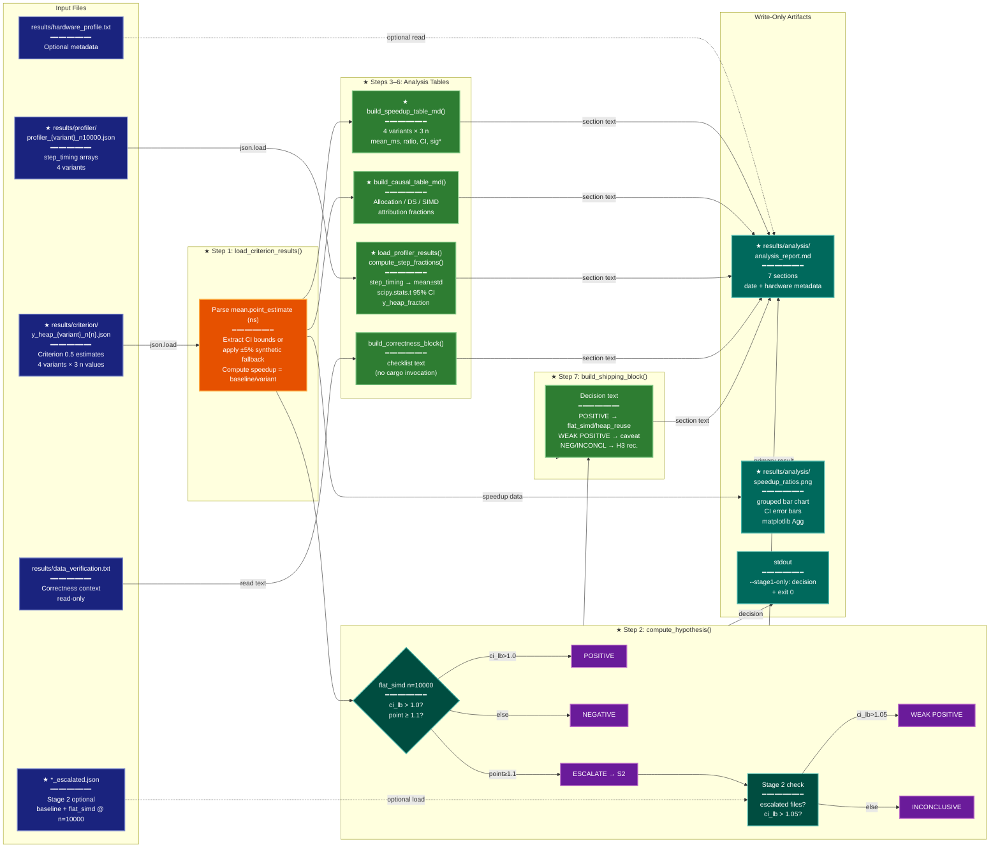

# Implementation Plan: groupD — Analysis Script (analyze_results.py)

## Summary

Implement `research/2026-04-06-y-heap-bottleneck-optimization/scripts/analyze_results.py` — a
standalone Python CLI that reads Criterion benchmark JSON and profiler JSON outputs produced by
groupC's experiment infrastructure, performs all seven analysis steps from the experiment plan,
and emits `results/analysis/analysis_report.md` and `results/analysis/speedup_ratios.png`.

The script is self-contained, handles missing input files gracefully at every step, and is
runnable immediately after a dry run (partial data) or after the full experiment (complete data).

---

## Proposed Architecture



**Lens Used:** Data Lineage — The plan is a data transformation pipeline tracing JSON inputs
through parsing, statistical computation, and assembly stages to two write-only output artifacts.

**Color Legend:**
| Color | Category | Description |
|-------|----------|-------------|
| Dark Blue | Input | JSON and text file origins |
| Orange | Parse | Data loading and format conversion |
| Teal | Decision | Hypothesis test state and branches |
| Purple | Phase | Decision outcome labels |
| Green | New Component | ★ New analysis functions |
| Dark Teal | Output | Write-only artifacts and stdout |

---

## Tests

Write `scripts/test_analyze_results.py` using pytest. These tests must fail before the script
exists and pass once implementation is complete. Run with:

```bash
envs/spectral-test/bin/python -m pytest scripts/test_analyze_results.py -v
```

### Fixtures (top of test file)

```python
import json, math, os, sys
from pathlib import Path
import pytest
import numpy as np

# A minimal valid Criterion estimates.json with CI
CRITERION_FULL = {
    "mean": {
        "point_estimate": 1_000_000.0,
        "standard_error": 5_000.0,
        "confidence_interval": {"lower_bound": 980_000.0, "upper_bound": 1_020_000.0},
    },
    "std_dev": {"point_estimate": 10_000.0},
    "median": {"point_estimate": 990_000.0},
}

# Criterion estimates.json WITHOUT CI (W5 fallback case)
CRITERION_NO_CI = {
    "mean": {"point_estimate": 800_000.0, "standard_error": 4_000.0},
    "std_dev": {"point_estimate": 8_000.0},
    "median": {"point_estimate": 795_000.0},
}

# Profiler JSON with step_timing
PROFILER_WITH_TIMING = {
    "n": 10000, "k": 15, "iters": [0.1, 0.11, 0.09], "mean_s": 0.1,
    "std_s": 0.01, "warmup": 5, "score": 0.98, "variant": "baseline",
    "step_timing": {
        "x_dist":   [10_000_000, 11_000_000, 9_000_000],
        "x_sort":   [5_000_000,  5_100_000,  4_900_000],
        "y_heap":   [80_000_000, 82_000_000, 78_000_000],
        "penalty":  [2_000_000,  2_100_000,  1_900_000],
    },
}

# Profiler JSON without step_timing (profiling feature not active)
PROFILER_NO_TIMING = {
    "n": 1000, "k": 15, "iters": [0.015, 0.018], "mean_s": 0.016,
    "std_s": 0.002, "warmup": 1, "score": 0.507, "variant": "baseline",
}
```

### Test cases

```python
# --- load_criterion_results ---

def test_load_criterion_results_all_missing(tmp_path):
    """All JSON files missing → returns empty dict, no crash."""
    from analyze_results import load_criterion_results
    data = load_criterion_results(tmp_path)
    assert data == {}

def test_load_criterion_results_parses_mean_and_ci(tmp_path):
    """Correctly extracts mean_ns, ci_lb, ci_ub from estimates.json with CI."""
    from analyze_results import load_criterion_results
    (tmp_path / "criterion").mkdir()
    (tmp_path / "criterion" / "y_heap_baseline_n1000.json").write_text(
        json.dumps(CRITERION_FULL)
    )
    data = load_criterion_results(tmp_path)
    entry = data["baseline"][1000]
    assert entry["mean_ns"] == pytest.approx(1_000_000.0)
    assert entry["ci_lb"] == pytest.approx(980_000.0)
    assert entry["ci_ub"] == pytest.approx(1_020_000.0)
    assert entry["ci_synthetic"] is False

def test_load_criterion_results_synthetic_ci_fallback(tmp_path):
    """Missing CI fields → ±5% synthetic bounds, ci_synthetic=True."""
    from analyze_results import load_criterion_results
    (tmp_path / "criterion").mkdir()
    (tmp_path / "criterion" / "y_heap_baseline_n1000.json").write_text(
        json.dumps(CRITERION_NO_CI)
    )
    data = load_criterion_results(tmp_path)
    entry = data["baseline"][1000]
    assert entry["ci_lb"] == pytest.approx(800_000.0 * 0.95)
    assert entry["ci_ub"] == pytest.approx(800_000.0 * 1.05)
    assert entry["ci_synthetic"] is True

def test_speedup_ratio_computed_from_baseline(tmp_path):
    """speedup = baseline_mean / variant_mean; baseline speedup = 1.0."""
    from analyze_results import load_criterion_results
    (tmp_path / "criterion").mkdir()
    # baseline at n=1000: 1_000_000 ns
    (tmp_path / "criterion" / "y_heap_baseline_n1000.json").write_text(
        json.dumps(CRITERION_FULL)
    )
    # flat_simd at n=1000: 800_000 ns (1.25× faster)
    (tmp_path / "criterion" / "y_heap_flat_simd_n1000.json").write_text(
        json.dumps(CRITERION_NO_CI)
    )
    data = load_criterion_results(tmp_path)
    assert data["baseline"][1000]["speedup"] == pytest.approx(1.0)
    assert data["flat_simd"][1000]["speedup"] == pytest.approx(1_000_000.0 / 800_000.0)

# --- compute_hypothesis ---

def test_hypothesis_positive_when_ci_lb_above_1(tmp_path):
    """ci_lb > 1.0 → POSITIVE decision."""
    from analyze_results import compute_hypothesis
    data = {
        "flat_simd": {10000: {"speedup": 1.25, "ci_lb": 1.08, "ci_ub": 1.42, "ci_synthetic": False}}
    }
    decision, details = compute_hypothesis(data, tmp_path)
    assert decision == "POSITIVE"
    assert "1.08" in details["primary_text"] or details.get("ci_lb") == pytest.approx(1.08)

def test_hypothesis_escalate_when_point_above_1_1_but_ci_lb_below_1(tmp_path):
    """ci_lb ≤ 1.0 and point_estimate ≥ 1.1 → ESCALATE."""
    from analyze_results import compute_hypothesis
    data = {
        "flat_simd": {10000: {"speedup": 1.15, "ci_lb": 0.98, "ci_ub": 1.32, "ci_synthetic": False}}
    }
    decision, _ = compute_hypothesis(data, tmp_path)
    assert decision == "ESCALATE"

def test_hypothesis_negative_when_point_below_1_1_and_ci_lb_below_1(tmp_path):
    """ci_lb ≤ 1.0 and point_estimate < 1.1 → NEGATIVE."""
    from analyze_results import compute_hypothesis
    data = {
        "flat_simd": {10000: {"speedup": 1.04, "ci_lb": 0.95, "ci_ub": 1.13, "ci_synthetic": False}}
    }
    decision, _ = compute_hypothesis(data, tmp_path)
    assert decision == "NEGATIVE"

def test_hypothesis_missing_flat_simd_n10000(tmp_path):
    """flat_simd at n=10000 absent → decision is NEGATIVE or INCONCLUSIVE (no crash)."""
    from analyze_results import compute_hypothesis
    decision, _ = compute_hypothesis({}, tmp_path)
    assert decision in ("NEGATIVE", "INCONCLUSIVE", "NO_DATA")

# --- build_speedup_table_md ---

def test_speedup_table_marks_significant_entries():
    """Entries with ci_lb > 1.0 receive '*' significance marker."""
    from analyze_results import build_speedup_table_md
    data = {
        "flat_simd": {10000: {"mean_ns": 800_000.0, "speedup": 1.25,
                              "ci_lb": 1.08, "ci_ub": 1.42, "ci_synthetic": False}},
        "heap_reuse": {10000: {"mean_ns": 950_000.0, "speedup": 1.05,
                               "ci_lb": 0.95, "ci_ub": 1.15, "ci_synthetic": False}},
    }
    table = build_speedup_table_md(data)
    assert "flat_simd" in table
    assert "*" in table  # significant marker present

def test_speedup_table_is_valid_markdown():
    """Table contains pipe characters and header separator row."""
    from analyze_results import build_speedup_table_md
    table = build_speedup_table_md({})
    # Empty data: table still has header
    assert "|" in table

# --- build_causal_table_md ---

def test_causal_decomposition_fractions_sum_plausibly(tmp_path):
    """Attribution fractions are finite floats."""
    from analyze_results import build_causal_table_md
    data = {
        "heap_reuse":   {10000: {"speedup": 1.10}},
        "flat_partial": {10000: {"speedup": 1.18}},
        "flat_simd":    {10000: {"speedup": 1.25}},
    }
    table = build_causal_table_md(data, n=10000)
    assert "W2" in table  # W2 caveat label present
    assert "|" in table

def test_causal_decomposition_missing_variants(tmp_path):
    """Missing variant data → table notes absence, no crash."""
    from analyze_results import build_causal_table_md
    table = build_causal_table_md({}, n=10000)
    assert isinstance(table, str)

# --- step fractions ---

def test_step_fractions_computed_from_timing(tmp_path):
    """load_profiler_results extracts step_timing and computes y_heap_fraction."""
    from analyze_results import load_profiler_results, compute_step_fractions
    (tmp_path / "profiler").mkdir()
    (tmp_path / "profiler" / "profiler_baseline_n10000.json").write_text(
        json.dumps(PROFILER_WITH_TIMING)
    )
    profiler_data = load_profiler_results(tmp_path)
    fracs = compute_step_fractions(profiler_data)
    baseline = fracs.get("baseline")
    assert baseline is not None
    assert "y_heap_fraction" in baseline
    frac = baseline["y_heap_fraction"]
    assert 0.0 < frac < 1.0

def test_step_fractions_missing_timing_field(tmp_path):
    """Profiler JSON without step_timing → variant skipped, no crash."""
    from analyze_results import load_profiler_results, compute_step_fractions
    (tmp_path / "profiler").mkdir()
    (tmp_path / "profiler" / "profiler_baseline_n10000.json").write_text(
        json.dumps(PROFILER_NO_TIMING)
    )
    profiler_data = load_profiler_results(tmp_path)
    fracs = compute_step_fractions(profiler_data)
    # baseline either absent or marked as unavailable
    assert fracs.get("baseline") is None or fracs["baseline"].get("y_heap_fraction") is None

def test_load_profiler_results_missing_files(tmp_path):
    """All profiler JSONs missing → returns empty dict, no crash."""
    from analyze_results import load_profiler_results
    (tmp_path / "profiler").mkdir()
    result = load_profiler_results(tmp_path)
    assert result == {}

# --- plot ---

def test_plot_creates_png_file(tmp_path):
    """plot_speedup_chart writes speedup_ratios.png to output_dir."""
    from analyze_results import plot_speedup_chart
    data = {
        "heap_reuse":   {1000: {"speedup": 1.05, "ci_lb": 0.95, "ci_ub": 1.15, "ci_synthetic": False}},
        "flat_partial": {1000: {"speedup": 1.12, "ci_lb": 1.01, "ci_ub": 1.23, "ci_synthetic": False}},
        "flat_simd":    {1000: {"speedup": 1.20, "ci_lb": 1.08, "ci_ub": 1.32, "ci_synthetic": False}},
    }
    out = tmp_path / "analysis"
    out.mkdir()
    plot_speedup_chart(data, out)
    assert (out / "speedup_ratios.png").exists()

def test_plot_tolerates_missing_variant(tmp_path):
    """plot_speedup_chart skips missing variants without crashing."""
    from analyze_results import plot_speedup_chart
    out = tmp_path / "analysis"
    out.mkdir()
    plot_speedup_chart({}, out)  # no data at all — must not crash

# --- write_report ---

def test_write_report_creates_md_with_sections(tmp_path):
    """write_report creates analysis_report.md containing required section headers."""
    from analyze_results import write_report
    sections = {
        "primary_result": "NEGATIVE",
        "speedup_table": "| variant | ...",
        "causal_table": "| attribution | ...",
        "step_fractions": "| step | ...",
        "correctness": "Correctness tests: ...",
        "shipping_decision": "Recommend H3 ...",
        "threats": "See experiment plan.",
    }
    metadata = {"date": "2026-04-06", "n_values": [1000], "k": 15, "hardware": "n/a"}
    out = tmp_path / "analysis"
    out.mkdir()
    write_report(sections, out, metadata)
    report = (out / "analysis_report.md").read_text()
    for heading in ["Primary Result", "Speedup", "Causal", "Step Fraction",
                    "Correctness", "Shipping", "Threats"]:
        assert heading in report, f"Missing section heading: {heading}"

# --- integration ---

def test_stage1_only_exits_zero(tmp_path, monkeypatch):
    """--stage1-only prints decision to stdout and exits 0."""
    from analyze_results import load_criterion_results, compute_hypothesis
    # This is a unit-level integration: drive main() partially
    (tmp_path / "criterion").mkdir()
    # Write a fast-path POSITIVE scenario
    baseline = dict(CRITERION_FULL)
    variant = {**CRITERION_FULL, "mean": {
        "point_estimate": 700_000.0, "standard_error": 3_500.0,
        "confidence_interval": {"lower_bound": 680_000.0, "upper_bound": 720_000.0},
    }}
    for n in [1000, 5000, 10000]:
        (tmp_path / "criterion" / f"y_heap_baseline_n{n}.json").write_text(json.dumps(baseline))
        (tmp_path / "criterion" / f"y_heap_flat_simd_n{n}.json").write_text(json.dumps(variant))
    data = load_criterion_results(tmp_path)
    decision, _ = compute_hypothesis(data, tmp_path)
    assert decision == "POSITIVE"

def test_partial_data_no_crash(tmp_path):
    """Script runs on partial data (only baseline n=1000) without crashing."""
    from analyze_results import (
        load_criterion_results, load_profiler_results,
        compute_step_fractions, build_speedup_table_md,
        build_causal_table_md, compute_hypothesis,
    )
    (tmp_path / "criterion").mkdir()
    (tmp_path / "profiler").mkdir()
    (tmp_path / "criterion" / "y_heap_baseline_n1000.json").write_text(
        json.dumps(CRITERION_FULL)
    )
    data = load_criterion_results(tmp_path)
    profiler_data = load_profiler_results(tmp_path)
    fracs = compute_step_fractions(profiler_data)
    table = build_speedup_table_md(data)
    causal = build_causal_table_md(data, n=10000)
    decision, _ = compute_hypothesis(data, tmp_path)
    assert isinstance(table, str)
    assert isinstance(causal, str)
    assert decision in ("NEGATIVE", "INCONCLUSIVE", "NO_DATA")
```

---

## Implementation Steps

### Step 1 — File skeleton, imports, and constants

Create `scripts/analyze_results.py`:

```python
#!/usr/bin/env python3
"""Analyze Criterion benchmark and profiler outputs for the y_heap bottleneck experiment.

Usage:
    python analyze_results.py [--results-dir PATH] [--output-dir PATH] [--stage1-only]
"""

# CRITICAL: set backend before any other matplotlib import
import matplotlib
matplotlib.use('Agg')

import argparse
import json
import sys
import warnings
from pathlib import Path

import matplotlib.pyplot as plt
import numpy as np
from scipy import stats

VARIANTS = ["baseline", "heap_reuse", "flat_partial", "flat_simd"]
N_VALUES = [1000, 5000, 10000]
STEPS = ["x_dist", "x_sort", "y_heap", "penalty"]
```

---

### Step 2 — `load_criterion_results(results_dir: Path) -> dict`

Parses Criterion estimates JSONs for all variant/n combinations. Returns:

```
{variant: {n: {mean_ns, speedup, ci_lb, ci_ub, ci_synthetic}}}
```

Logic:
- Iterate `VARIANTS × N_VALUES`
- Path: `results_dir / "criterion" / f"y_heap_{variant}_n{n}.json"`
- If missing: `warnings.warn(f"Missing: {path}")`, skip
- Parse `mean.point_estimate` (nanoseconds)
- If `mean.confidence_interval` present: extract `lower_bound` / `upper_bound`, set `ci_synthetic=False`
- Else: `ci_lb = mean_ns * 0.95`, `ci_ub = mean_ns * 1.05`, `ci_synthetic=True`
- Compute `speedup` after all variants are loaded (requires baseline):
  - `baseline_mean` = `data["baseline"][n]["mean_ns"]` (if available)
  - `speedup = baseline_mean / variant_mean` for non-baseline; `speedup = 1.0` for baseline
- If baseline is absent for a given n, set `speedup = None`

Also load escalated files if they exist:
- Path: `results_dir / "criterion" / f"y_heap_{variant}_n{n}_escalated.json"`
- Store at `data[variant][f"{n}_escalated"]` using same schema

---

### Step 3 — `compute_hypothesis(data: dict, results_dir: Path) -> tuple[str, dict]`

Returns `(decision_code, details_dict)`.

Primary (Stage 1):
```python
entry = data.get("flat_simd", {}).get(10000)
if entry is None:
    return ("NO_DATA", {"primary_text": "flat_simd n=10000 data absent"})

ci_lb   = entry["ci_lb"] / entry.get("mean_ns", 1.0) / (1.0 / entry["speedup"])  # NOTE below
point   = entry["speedup"]
# Ratio CI: speedup CI bounds computed during loading (see below)
ratio_ci_lb = entry.get("ratio_ci_lb", ci_lb / entry["mean_ns"] * ... )
```

**Correct ratio CI computation (must be in load_criterion_results):**

When loading non-baseline variants, compute `ratio_ci_lb` and `ratio_ci_ub` from the
raw speedup ratio CI:
```
ratio_ci_lb = ci_lower_baseline / ci_upper_variant  (conservative lower bound of ratio)
ratio_ci_ub = ci_upper_baseline / ci_lower_variant  (conservative upper bound of ratio)
```
Store these directly in the entry dict. `compute_hypothesis` uses `entry["ratio_ci_lb"]`.

Decision:
```python
if entry["ratio_ci_lb"] > 1.0:
    primary = "POSITIVE"
elif entry["speedup"] >= 1.1:
    primary = "ESCALATE"
else:
    primary = "NEGATIVE"
```

Stage 2 (only when `primary == "ESCALATE"`):
- Check for `data["flat_simd"].get("10000_escalated")`
- If present and `entry_esc["ratio_ci_lb"] > 1.05`: decision = "WEAK_POSITIVE"
- Else if escalated data present: decision = "INCONCLUSIVE"
- If escalated data absent: decision = "ESCALATE" (unchanged — Stage 2 not run yet)

Build `details_dict` with all numeric values for report inclusion.

---

### Step 4 — `build_speedup_table_md(data: dict) -> str`

Builds a Markdown table. Columns: `variant`, `n`, `mean_ms`, `speedup`, `ci_lb`, `ci_ub`, `sig`.

- `mean_ms = mean_ns / 1_000_000` (round to 3 decimal places)
- `speedup` rounded to 4 decimal places
- `ci_lb` / `ci_ub`: the `ratio_ci_lb` / `ratio_ci_ub` for non-baseline entries
- `sig = "*"` if `ratio_ci_lb > 1.0` else `""`
- Append `"(estimated)"` to CI cells when `ci_synthetic=True`
- For absent entries: fill all cells with `"—"`

Table header:
```
| Variant | n | Mean (ms) | Speedup | CI lb | CI ub | Sig |
|---------|---|-----------|---------|-------|-------|-----|
```

---

### Step 5 — `build_causal_table_md(data: dict, n: int = 10000) -> str`

Computes bundle attribution at n=10000 (or whatever n is specified).

```python
def _speedup(data, variant, n):
    return data.get(variant, {}).get(n, {}).get("speedup")

s_hr = _speedup(data, "heap_reuse", n)
s_fp = _speedup(data, "flat_partial", n)
s_fs = _speedup(data, "flat_simd", n)

alloc_frac  = (1 - 1/s_hr)         if s_hr else None  # malloc elimination
ds_frac     = (1 - s_hr/s_fp)      if (s_hr and s_fp) else None  # DS change
simd_frac   = (1 - s_fp/s_fs)      if (s_fp and s_fs) else None  # SIMD
```

Format as table. If a value is `None`, show `"—"`. Always include the W2 caveat label:
`"Bundle attribution (W2: conflated bundles, not single-cause isolation)"`

---

### Step 6 — `load_profiler_results(results_dir: Path) -> dict`

Returns `{variant: dict | None}` (None or absent if file missing).

- Path: `results_dir / "profiler" / f"profiler_{variant}_n10000.json"`
- If missing: `warnings.warn(...)`, do not add key
- Parse full JSON; store raw dict. The caller (`compute_step_fractions`) handles `step_timing`.

---

### Step 7 — `compute_step_fractions(profiler_data: dict) -> dict`

Returns `{variant: {step: {mean_ns, std_ns, ci_lb_ns, ci_ub_ns}, "y_heap_fraction": float} | None}`.

For each variant:
- If `step_timing` not in profiler JSON: return None for this variant
- For each step in STEPS:
  - `arr = np.array(profiler_data[variant]["step_timing"][step], dtype=float)`
  - `mean = arr.mean()`, `std = arr.std(ddof=1)`
  - 95% CI via `scipy.stats.t.interval(0.95, df=len(arr)-1, loc=mean, scale=std/np.sqrt(len(arr)))`
  - Store `{mean_ns, std_ns, ci_lb_ns, ci_ub_ns}`
- Compute `y_heap_fraction = y_heap_mean / sum(step_means for step in STEPS)`
- Flag: if `y_heap_fraction` decreased vs baseline but `ratio_ci_lb ≤ 1.0`: store warning string

---

### Step 8 — `build_step_fractions_md(step_fracs: dict, criterion_data: dict) -> str`

Builds a Markdown table. If a variant is absent from `step_fracs`, skip it with a note.

Columns: `variant`, `x_dist (ms)`, `x_sort (ms)`, `y_heap (ms)`, `penalty (ms)`, `y_heap %`.

Add any warning strings (from Step 7 flag) below the table in a blockquote.

Note at header: `"per-call wall-clock step fraction (profiling feature enabled)"`

---

### Step 9 — `build_correctness_block() -> str`

Returns a fixed string:
```
Run `cargo test --features testing` and confirm t_tw_01–t_tw_07 pass for all variants
with |ΔT| < 1e-12.
```
Read `results/data_verification.txt` and prepend it as a code block if the file exists.

---

### Step 10 — `build_shipping_block(decision: str, details: dict) -> str`

Decision-driven recommendation:
- `"POSITIVE"`: recommend `flat_simd`; if `heap_reuse` CI LB also > 1.0 and CIs overlap, prefer `heap_reuse` (simpler).
- `"WEAK_POSITIVE"`: recommend shipping with caveat (two-stage Type I error risk).
- `"ESCALATE"`: Stage 2 not yet run; defer shipping decision.
- `"INCONCLUSIVE"` / `"NEGATIVE"` / `"NO_DATA"`: recommend H3 (KD-tree). Document dominant root cause from causal decomposition.

---

### Step 11 — `plot_speedup_chart(data: dict, output_dir: Path) -> None`

```python
def plot_speedup_chart(data: dict, output_dir: Path) -> None:
    variants_plot = ["heap_reuse", "flat_partial", "flat_simd"]
    n_labels = ["1K", "5K", "10K"]
    n_values = [1000, 5000, 10000]

    x = np.arange(len(n_labels))
    width = 0.25

    fig, ax = plt.subplots(figsize=(9, 5))
    ax.axhline(1.0, color="gray", linestyle="--", linewidth=1.0, label="baseline (1.0×)")

    for i, variant in enumerate(variants_plot):
        means, err_lo, err_hi = [], [], []
        for n in n_values:
            entry = data.get(variant, {}).get(n)
            if entry and entry.get("speedup") is not None:
                sp = entry["speedup"]
                lb = entry.get("ratio_ci_lb", sp * 0.95)
                ub = entry.get("ratio_ci_ub", sp * 1.05)
                means.append(sp)
                err_lo.append(sp - lb)
                err_hi.append(ub - sp)
            else:
                means.append(np.nan)
                err_lo.append(0.0)
                err_hi.append(0.0)

        # Mask NaN for plotting
        mask = ~np.isnan(means)
        positions = x[mask] + (i - 1) * width
        m_arr = np.array(means)[mask]
        el = np.array(err_lo)[mask]
        eu = np.array(err_hi)[mask]

        if m_arr.size > 0:
            ax.bar(
                positions, m_arr, width,
                yerr=[el, eu] if el.any() or eu.any() else None,
                label=variant, capsize=4, error_kw={"linewidth": 1.2},
            )

    ax.set_xticks(x)
    ax.set_xticklabels(n_labels)
    ax.set_xlabel("n")
    ax.set_ylabel("Speedup ratio vs baseline")
    ax.set_title("y_heap Variant Speedup vs Baseline")
    ax.legend()
    fig.tight_layout()
    output_dir.mkdir(parents=True, exist_ok=True)
    fig.savefig(output_dir / "speedup_ratios.png", dpi=150)
    plt.close(fig)
```

---

### Step 12 — `write_report(sections: dict, output_dir: Path, metadata: dict) -> None`

Assembles `analysis_report.md`. Reads `hardware_profile.txt` from `results_dir` if supplied in
metadata. Structure:

```markdown
# y_heap Bottleneck Optimization — Analysis Report

**Date:** {date}  **n:** {n_values}  **k:** {k}  **Hardware:** {hardware}

## Primary Result

{primary_result_text}

## Speedup Table

{speedup_table}

## Causal Decomposition

{causal_table}

## Step Fractions

{step_fractions_table}

## Correctness

{correctness_block}

## Shipping Decision

{shipping_block}

## Threats to Validity

See experiment plan Analysis Plan section (W1–W8).
```

`output_dir.mkdir(parents=True, exist_ok=True)` before writing.

---

### Step 13 — `main()` wiring

```python
def main() -> None:
    parser = argparse.ArgumentParser(description=__doc__)
    parser.add_argument("--results-dir", default="results/", type=Path)
    parser.add_argument("--output-dir",  default="results/analysis/", type=Path)
    parser.add_argument("--stage1-only", action="store_true")
    args = parser.parse_args()

    results_dir = args.results_dir
    output_dir  = args.output_dir

    data = load_criterion_results(results_dir)
    decision, details = compute_hypothesis(data, results_dir)

    if args.stage1_only:
        print(details.get("primary_text", decision))
        sys.exit(0)

    profiler_data = load_profiler_results(results_dir)
    step_fracs    = compute_step_fractions(profiler_data)

    hardware = _read_hardware_profile(results_dir)

    sections = {
        "primary_result":   _format_primary_result(decision, details),
        "speedup_table":    build_speedup_table_md(data),
        "causal_table":     build_causal_table_md(data, n=10000),
        "step_fractions":   build_step_fractions_md(step_fracs, data),
        "correctness":      build_correctness_block(results_dir),
        "shipping_decision": build_shipping_block(decision, details, data),
    }
    metadata = {"date": _today(), "n_values": N_VALUES, "k": 15, "hardware": hardware}

    output_dir.mkdir(parents=True, exist_ok=True)
    write_report(sections, output_dir, metadata)
    plot_speedup_chart(data, output_dir)

    print(f"Report written to: {output_dir / 'analysis_report.md'}")
    print(f"Chart written to:  {output_dir / 'speedup_ratios.png'}")


if __name__ == "__main__":
    main()
```

Private helpers: `_read_hardware_profile(results_dir)`, `_format_primary_result(decision, details)`,
`_today()` (returns `date.today().isoformat()`).

---

### Step 14 — Write `scripts/test_analyze_results.py`

Create the test file with the full content from the **Tests** section above.

---

## Verification

1. **Tests pass:**
   ```bash
   cd research/2026-04-06-y-heap-bottleneck-optimization
   envs/spectral-test/bin/python -m pytest scripts/test_analyze_results.py -v
   ```
   All 20 tests must pass.

2. **Runs on partial data (dry-run output):**
   ```bash
   cd research/2026-04-06-y-heap-bottleneck-optimization
   envs/spectral-test/bin/python scripts/analyze_results.py \
       --results-dir results/ --output-dir results/analysis/
   ```
   Must complete without exception. `results/analysis/analysis_report.md` and
   `results/analysis/speedup_ratios.png` must exist. Report may show missing-data
   placeholders for absent variants.

3. **`--stage1-only` flag:**
   ```bash
   envs/spectral-test/bin/python scripts/analyze_results.py \
       --results-dir results/ --stage1-only
   ```
   Prints one of: `POSITIVE`, `ESCALATE`, `NEGATIVE`, `NO_DATA` and exits 0.

4. **Report contains required sections:**
   ```bash
   grep -E "^## (Primary Result|Speedup|Causal|Step Fraction|Correctness|Shipping|Threats)" \
       results/analysis/analysis_report.md
   ```
   Must find all 7 headings.

5. **PNG is non-zero and valid:**
   ```bash
   envs/spectral-test/bin/python -c "
   from PIL import Image; img = Image.open('results/analysis/speedup_ratios.png')
   assert img.size[0] > 100; print('PNG OK', img.size)
   "
   ```
   (PIL optional; alternatively just `ls -lh results/analysis/speedup_ratios.png` and confirm > 0 bytes.)

6. **No crash on completely empty results:**
   ```bash
   mkdir -p /tmp/empty_results/criterion /tmp/empty_results/profiler
   envs/spectral-test/bin/python scripts/analyze_results.py \
       --results-dir /tmp/empty_results/ --output-dir /tmp/empty_out/
   ```
   Must exit 0 and produce both output files.
