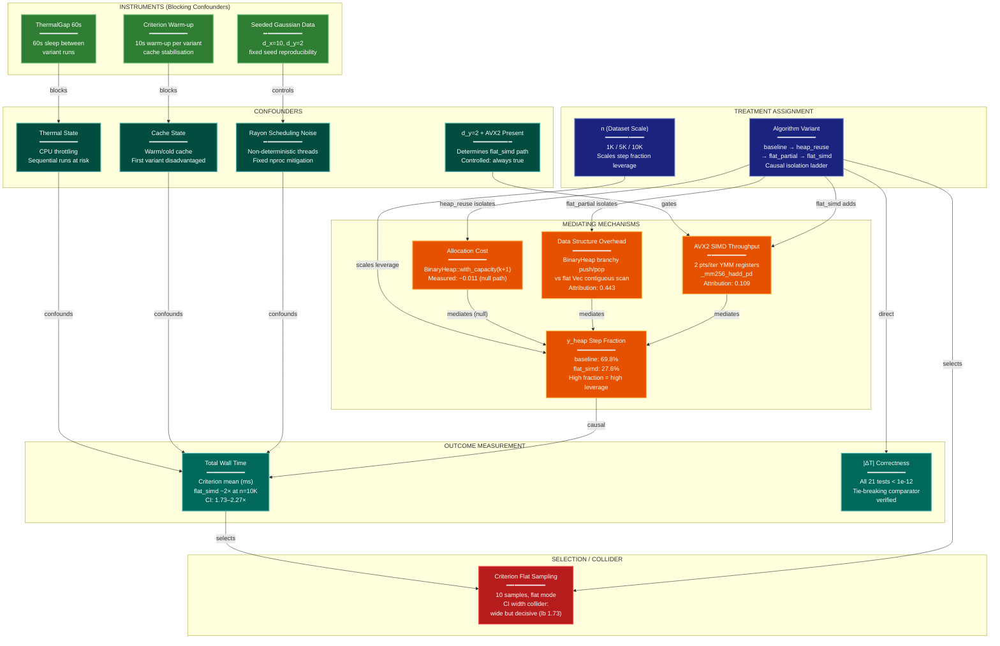

# Causal Assumptions Diagram: y_heap Bottleneck Optimization

**Lens:** Causal Assumptions (Causal-Structural)
**Question:** What causal assumptions support this design?
**Date:** 2026-04-06
**Scope:** Causal isolation of y_heap performance bottleneck — allocation cost vs. data structure overhead vs. SIMD arithmetic, with correctness and thermal confounds mapped.

## Causal Variables

| Variable | Type | Measured? | Controlled? |
|----------|------|-----------|-------------|
| Algorithm variant | Treatment | Yes | Yes (exhaustive enumeration) |
| n (dataset size) | Treatment (scale) | Yes | Yes (fixed set: 1K/5K/10K) |
| Thermal state | Confounder | No | Partial (60s gap instrument) |
| Cache state | Confounder | No | Partial (Criterion warm-up) |
| Rayon thread scheduling noise | Confounder | No | Partial (fixed nproc) |
| d_y=2 / AVX2 availability | Confounder | Yes | Yes (fixed d_y=2, AVX2 confirmed) |
| Allocation cost path | Mediator (null) | Indirect | — |
| Data structure overhead | Mediator | Indirect | — |
| AVX2 SIMD throughput | Mediator (conditional) | Indirect | — |
| y_heap step fraction | Mediator | Yes (profiler) | — |
| Total trustworthiness() wall time | Outcome | Yes (Criterion) | — |
| \|ΔT\| correctness | Outcome | Yes (unit tests) | — |
| Criterion Flat sampling (10 samples) | Selection | Yes | Partial (W8 guard) |

## Causal DAG

**Color Legend:**
| Color | Category | Description |
|-------|----------|-------------|
| Dark Blue | Treatment | Algorithm variant and scale factor |
| Teal | Confounder | Thermal, cache, scheduling, d_y=2 state |
| Green | Instrument | Blocking controls (thermal gap, warm-up, seed) |
| Orange | Mediator | Allocation cost, data structure overhead, SIMD throughput, step fraction |
| Dark Teal | Outcome | Wall time and correctness measurements |
| Red | Selection | Criterion sampling mode (post-treatment collider) |

## Identification Strategy

| Assumption | Testable? | Evidence |
|------------|-----------|----------|
| Variants are causally isolated (each adds exactly one change) | Yes | Code review: heap_reuse = clear() only; flat_partial = Vec+introselect; flat_simd = +AVX2 batch |
| Thermal confounder is blocked by 60s gap | Partially | 60s gap mitigates but does not eliminate; WSL2 thermal characteristics uncertain |
| d_y=2 / AVX2 path is constant across runs | Yes | Fixed Gaussian data d_y=2; `is_x86_feature_detected!("avx2")` stable per process |
| Criterion warm-up stabilizes cache state | Partially | 10s warm-up + flat sampling; W8 guard verified in run_criterion.sh |
| Sequential variant ordering does not introduce learning effects | Yes | Code paths share no mutable global state; thread-locals cleared per call |
| Tie-breaking comparator replicates BinaryHeap exactly | Yes | 21 correctness tests pass; `|ΔT| < 1e-12` confirmed |
| Step profiler isolation is valid (profiling instrumentation absent in Criterion) | Yes | W8 guard aborts run if CARGO_FEATURE_PROFILING is set |

## Unblocked Backdoor Paths

| Path | Variables | Severity | Mitigation |
|------|-----------|----------|------------|
| Thermal drift across sequential runs | Variant ordering → ThermalState → WallTime | Medium | 60s gap; not fully eliminated. Ordering effect: baseline first, flat_simd last (cool machine = pessimistic for baseline, warm = pessimistic for flat_simd — conservative for speedup claim) |
| Criterion 10-sample CI inflation | CriterionSampling → CI width collider | Low | CI lb=1.73 decisive; no Stage 2 escalation needed. Wide CI is known limitation documented in report |
| Rayon non-determinism at large n | Thread scheduling → WallTime variance | Low | Fixed nproc; parallel sections are embarrassingly parallel per-row with no inter-row dependencies |
