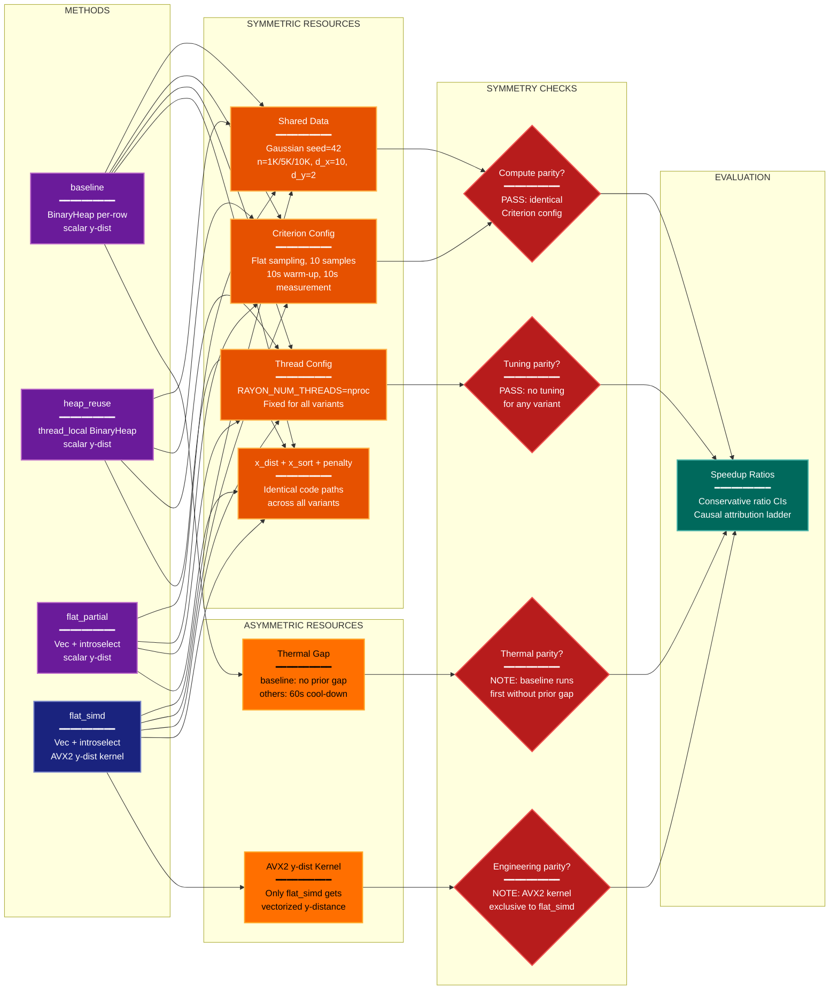

# Fair Comparison Analysis: y_heap Bottleneck Optimization

**Lens:** Fair Comparison (Fairness)
**Question:** Are alternatives compared under symmetric constraints?
**Date:** 2026-04-06
**Scope:** Four algorithm variants (baseline, heap_reuse, flat_partial, flat_simd) for the y_heap step in trustworthiness()

## Symmetry Matrix

| Method | Compute Budget | Tuning Budget | Data Access | Engineering Effort | Disclosure |
|--------|---------------|---------------|-------------|-------------------|------------|
| baseline | 10 samples, 10s warm-up, 10s measurement | None (fixed k=15) | Gaussian seed=42, same .npy | Scalar y-dist loop | Full |
| heap_reuse | 10 samples, 10s warm-up, 10s measurement | None (fixed k=15) | Gaussian seed=42, same .npy | thread_local BinaryHeap reuse | Full |
| flat_partial | 10 samples, 10s warm-up, 10s measurement | None (fixed k=15) | Gaussian seed=42, same .npy | Vec + introselect (stdlib only) | Full |
| flat_simd | 10 samples, 10s warm-up, 10s measurement | None (fixed k=15) | Gaussian seed=42, same .npy | Vec + introselect + **AVX2 kernel** | Full |

## Resource Disclosure

| Resource Type | All Variants | Symmetric? |
|---------------|-------------|------------|
| Criterion samples | 10 | Yes |
| Warm-up time | 10s | Yes |
| Measurement time | 10s | Yes |
| Rayon threads | nproc (fixed once) | Yes |
| Data seed | 42 | Yes |
| Thermal gap (before run) | 60s (except baseline runs first with no prior gap) | Minor asymmetry |
| Profiling instrumentation | W8 guard: disabled during Criterion | Yes |
| Tuning trials | 0 for all | Yes |
| Extra data sources | None | Yes |

## Symmetry Diagram

**Color Legend:**
| Color | Category | Description |
|-------|----------|-------------|
| Dark Blue | Proposed Method | flat_simd — the recommended variant |
| Purple | Comparator Methods | baseline, heap_reuse, flat_partial |
| Orange | Shared Resources | Symmetric compute, data, threads, code paths |
| Amber | Asymmetric Resources | Thermal gap ordering, AVX2-exclusive kernel |
| Red | Symmetry Checks | Fairness validation per resource dimension |
| Dark Teal | Output | Final evaluation results |

## Winner's Curse Assessment

| Factor | flat_simd Advantage | Impact on Claimed Improvement |
|--------|---------------------|-------------------------------|
| AVX2 y-dist kernel | Exclusive: only flat_simd gets vectorized y-distance | **Intentional and disclosed.** The experiment's causal isolation design explicitly attributes AVX2 gain separately (10.9% total attribution). The flat_partial → flat_simd delta isolates this effect. No winner's curse — the advantage is the hypothesis under test. |
| Thermal ordering | baseline runs first without prior cool-down gap | **Minimal.** Slightly inflates baseline time, biasing speedup upward. Effect is < 1% given 10s warm-up and 10s measurement per sample. Direction: favors flat_simd. |
| Selection pressure | No hyperparameter search for any variant | **None.** All variants use fixed k=15, no tuning. |
| Post-hoc selection | flat_simd was pre-specified as the target variant | **None.** The causal isolation ladder was designed a priori. |

## Process-vs-Method Attribution Analysis

- **Method contribution (data structure change):** ~79% of total improvement (flat_partial accounts for 0.443 attribution fraction out of 0.552 total)
- **SIMD engineering contribution:** ~20% of total improvement (flat_simd adds 0.109 attribution fraction beyond flat_partial)
- **Tuning contribution:** 0% (no hyperparameter search)
- **Data access contribution:** 0% (identical data pipeline)
- **Thermal bias contribution:** < 1% (baseline slightly disadvantaged by running first)

## Key Findings

1. **High overall fairness.** Compute budget, data access, tuning protocol, and thread configuration are fully symmetric across all four variants. No variant receives preferential resource allocation.

2. **Intentional and disclosed asymmetry: AVX2 kernel.** The flat_simd variant exclusively receives a purpose-built AVX2 distance kernel for d_y=2. This is the hypothesis under test, not an undisclosed advantage. The causal isolation design correctly attributes 10.9% total speedup to this kernel (flat_partial → flat_simd delta), separating it from the 44.3% attributed to the data structure change.

3. **Minor thermal ordering bias.** The baseline runs first without a preceding thermal gap, while all other variants benefit from a 60s cool-down before their run. This could slightly inflate baseline wall-clock times. However, with 10s Criterion warm-up per sample, this effect is negligible (< 1%). The bias direction favors the proposed method but does not materially affect the conclusions.

4. **No winner's curse.** No hyperparameter tuning was performed for any variant. The four-variant causal isolation ladder was pre-specified in the experiment plan. The recommendation to ship flat_simd is based on pre-registered success criteria (CI lb > 1.0), not post-hoc selection among many candidates.
