# Implementation Plan: groupA — y_heap Workspace Setup and Prior Failure Investigation

## Summary

This plan establishes the complete workspace for the y_heap bottleneck experiment before any
Rust code is written. It delivers three things in sequence: (1) a documented root cause
analysis of the 2× slowdown from the 2026-04-05 rerun-clean thread_local experiment, which
gates groupB implementation; (2) the experiment directory tree with all required subdirectories,
config files, and gitkeeps; (3) the six synthetic `.npy` data files produced by `gen_data.py`
and the verification record that confirms their correctness.

**No Rust code changes in this plan.** All deliverables are directory structure, TOML/YAML
config files, a Python data-generation script, and a written analysis document.

---

## Proposed Architecture

```mermaid
%%{init: {'flowchart': {'nodeSpacing': 40, 'rankSpacing': 55, 'curve': 'basis'}}}%%
flowchart TB
    %% CLASS DEFINITIONS %%
    classDef cli fill:#1a237e,stroke:#7986cb,stroke-width:2px,color:#fff;
    classDef stateNode fill:#004d40,stroke:#4db6ac,stroke-width:2px,color:#fff;
    classDef handler fill:#e65100,stroke:#ffb74d,stroke-width:2px,color:#fff;
    classDef phase fill:#6a1b9a,stroke:#ba68c8,stroke-width:2px,color:#fff;
    classDef newComponent fill:#2e7d32,stroke:#81c784,stroke-width:2px,color:#fff;
    classDef output fill:#00695c,stroke:#4db6ac,stroke-width:2px,color:#fff;
    classDef detector fill:#b71c1c,stroke:#ef5350,stroke-width:2px,color:#fff;
    classDef terminal fill:#1a237e,stroke:#7986cb,stroke-width:2px,color:#fff;

    %% TERMINALS %%
    START([START: groupA begins])
    COMPLETE([COMPLETE: groupA done — groupB gate open])
    ERROR([ERROR: escalate to researcher])

    subgraph Phase0 ["Phase 0 — Prior Failure Investigation (RT-I Gate)"]
        direction TB
        P0A["DELIV-0-1: Locate prior worktree<br/>━━━━━━━━━━<br/>git worktree list<br/>grep rerun-clean/tw-perf branches<br/>reads: research-20260405-tw-perf-rerun-clean/"]
        P0B{"Source accessible?<br/>━━━━━━━━━━<br/>worktree or branch found?"}
        P0C["Read src/metrics.rs (prior)<br/>━━━━━━━━━━<br/>Identify: COMB_DIST_Y presence<br/>sort vs select_nth_unstable_by<br/>y_heap reuse vs fresh alloc"]
        P0D["DELIV-0-2: prior_failure_analysis.md<br/>━━━━━━━━━━<br/>★ results/prior_failure_analysis.md<br/>Root cause + evidence<br/>Implication for variants"]
        P0GATE{"RT-I Gate passed?<br/>━━━━━━━━━━<br/>≥1 candidate + evidence?"}
    end

    subgraph Phase1 ["Phase 1 — Workspace Scaffolding"]
        direction TB
        P1A["DELIV-1-1: Create directory tree<br/>━━━━━━━━━━<br/>★ scripts/ data/ results/<br/>results/criterion/ results/profiler/<br/>results/analysis/  (+ .gitkeep files)"]
        P1B["DELIV-1-2: rust-toolchain.toml<br/>━━━━━━━━━━<br/>★ rust-toolchain.toml<br/>channel = nightly-2026-03-26"]
        P1C["DELIV-1-3: environment.yml<br/>━━━━━━━━━━<br/>★ environment.yml<br/>name: y-heap-bench<br/>python=3.11 numpy=2.2 scipy=1.15 matplotlib=3.10"]
        P1D{"envs/spectral-test available?<br/>━━━━━━━━━━<br/>python -c 'import numpy,scipy,matplotlib'"}
        P1E["DELIV-1-4: Record env verification<br/>━━━━━━━━━━<br/>★ results/data_verification.txt header<br/>env path + import result"]
    end

    subgraph Phase2 ["Phase 2 — Data Generation"]
        direction TB
        P2A["DELIV-2-1: Write gen_data.py<br/>━━━━━━━━━━<br/>★ scripts/gen_data.py<br/>RNG seed=42, --out-dir arg<br/>n∈{1000,5000,10000}, d_x=10 d_y=2<br/>saves X (n×10) + Y (n×2) .npy files<br/>verifies shape/dtype/finite/range"]
        P2B["DELIV-2-2: Run gen_data.py<br/>━━━━━━━━━━<br/>python scripts/gen_data.py --out-dir data/<br/>tee results/data_verification.txt<br/>produces 6 .npy files"]
        P2C{"DELIV-2-3: All 6 files valid?<br/>━━━━━━━━━━<br/>shapes correct? dtype=f64?<br/>no NaN/Inf? max-min > 0.01?"}
        P2D["★ data_verification.txt complete<br/>━━━━━━━━━━<br/>6 lines, all checks PASS<br/>written by tee during run"]
    end

    %% FLOW %%
    START --> P0A
    P0A --> P0B
    P0B -->|"yes — worktree accessible"| P0C
    P0B -->|"no — source unavailable"| P0D
    P0C --> P0D
    P0D --> P0GATE
    P0GATE -->|"PASS: ≥1 hypothesis + evidence"| P1A
    P0GATE -->|"FAIL: no evidence at all"| ERROR

    P1A --> P1B
    P1B --> P1C
    P1C --> P1D
    P1D -->|"env found — import OK"| P1E
    P1D -->|"env absent — document mamba cmd"| P1E
    P1E --> P2A

    P2A --> P2B
    P2B --> P2C
    P2C -->|"all PASS"| P2D
    P2C -->|"any FAIL"| ERROR
    P2D --> COMPLETE

    %% CLASS ASSIGNMENTS %%
    class START,COMPLETE terminal;
    class ERROR detector;
    class P0A,P0C handler;
    class P0D,P2A newComponent;
    class P0B,P0GATE,P1D,P2C stateNode;
    class P1A,P1B,P1C,P1E phase;
    class P2B handler;
    class P2D output;
```



**Color Legend:**
| Color | Category | Description |
|-------|----------|-------------|
| Dark Blue | Terminal | Start, complete, and error terminals |
| Orange | Handler | Read/investigate actions on existing system |
| Green | New Component | Files being created (analysis doc, gen_data.py) |
| Teal | State | Decision gates and conditional checks |
| Purple | Phase | Workspace scaffolding steps (dirs, config files) |
| Dark Teal | Output | Written artifact: data_verification.txt |
| Red | Detector | Error / escalation states |

**Lens Used:** Process Flow — chosen because groupA is a phased sequential workflow with a hard
RT-I gate that blocks forward progress, two conditional branches (source accessible / env
available), and a terminal validation step for the data pipeline.

---

## Tests

No automated tests apply to groupA (no Rust code, no unit tests). Verification is by file
inspection and script output.

**Manual verification checklist (run at end of each step):**

1. `results/prior_failure_analysis.md` exists and contains at least one of the three root cause
   candidates with supporting evidence (or all three with the heap_reuse gate note).
2. All six directories exist under `research/2026-04-06-y-heap-bottleneck-optimization/`:
   `scripts/`, `data/`, `results/`, `results/criterion/`, `results/profiler/`, `results/analysis/`.
3. `.gitkeep` files present in `data/`, `results/`, `results/criterion/`, `results/profiler/`,
   `results/analysis/`.
4. `rust-toolchain.toml` contains `channel = "nightly-2026-03-26"` exactly.
5. `environment.yml` contains `name: y-heap-bench` and all four dependency pins.
6. `results/data_verification.txt` exists, contains a header line, and then six data lines
   each reporting filename, shape, dtype=float64, NaN/Inf=False, max−min > 0.01.
7. `data/gaussian_n1000_x.npy`, `data/gaussian_n1000_y.npy`, `data/gaussian_n5000_x.npy`,
   `data/gaussian_n5000_y.npy`, `data/gaussian_n10000_x.npy`, `data/gaussian_n10000_y.npy`
   all exist.

---

## Implementation Steps

All paths are relative to `research/2026-04-06-y-heap-bottleneck-optimization/` unless otherwise
noted. Run commands from the repo root (`/home/talon/projects/spectral-init` or the active
worktree root).

---

### Step 1 — DELIV-0-1: Investigate the prior rerun-clean worktree

The `research-20260405-tw-perf-rerun-clean` git worktree is present at
`/home/talon/projects/worktrees/research-20260405-tw-perf-rerun-clean`. Read
`src/metrics.rs` in that worktree. Focus on:

- Is there a `COMB_DIST_Y: RefCell<Vec<f64>>` thread-local (i.e., was y_heap distance
  buffered and reused)?
- Does the thread_local variant use `sort_unstable_by` (O(n log n)) or
  `select_nth_unstable_by` (O(n)) for X-NN detection?
- Is the y_heap allocation `BinaryHeap::with_capacity(k+1)` done fresh per row or reused
  via `clear()`?

**From direct reading (already completed during planning):**
- `trustworthiness_thread_local` at line 637 uses `TL_DIST_X: RefCell<Vec<(f64, usize)>>`
  storing 16-byte tuples — 160KB per thread at n=10K — and `TL_RANK_X: RefCell<Vec<usize>>`
  — 80KB per thread.
- It calls `dist_x.sort_unstable_by(...)` (O(n log n)) not `select_nth_unstable_by`.
- The y_heap (`BinaryHeap::with_capacity(k+1)`) is **freshly allocated per row** — unchanged
  from the original baseline.
- There is **no COMB_DIST_Y** in the rerun-clean worktree. The prior experiment never
  tested y_heap reuse.

This reading is the supporting evidence for DELIV-0-2.

---

### Step 2 — DELIV-0-2: Write `results/prior_failure_analysis.md`

Create `research/2026-04-06-y-heap-bottleneck-optimization/results/prior_failure_analysis.md`
with the following content:

```markdown
# Prior Failure Analysis: thread_local 2× Slowdown (2026-04-05-tw-perf-rerun-clean)

## Observed Failure

The `trustworthiness_thread_local` variant measured 0.634s mean wall-clock vs 0.313s for
baseline at n=10K, k=15 — a 2.03× regression. Source: step_timing JSON files in
`research/2026-04-05-tw-perf-rerun-clean/results/step_timing/`.

## Root Cause: O(n log n) Sort Regression in X-NN Detection

**Primary cause (confirmed from source):** The thread_local variant replaced the O(n)
`select_nth_unstable_by` (already in production) with an O(n log n) `sort_unstable_by`.
At n=10,000:
- `select_nth_unstable_by(k=15)`: ~O(n) ≈ 10,000 comparisons average
- `sort_unstable_by`: ~O(n log n) ≈ 133,000 comparisons

This 13× increase in X-sort comparison work would increase x_sort thread-work from ~245M ns
(baseline) to ~3.3B ns — larger than the entire baseline invocation (2.49B ns thread-work).

**Supporting evidence:** The thread_local step_timing JSON shows all zeros because the
`#[cfg(feature = "profiling")]` guards were not active for that variant. However, the
algorithm difference is confirmed by reading `src/metrics.rs` in the rerun-clean worktree
(line 670: `dist_x.sort_unstable_by(...)`).

**Secondary factor:** `TL_DIST_X` stored `(f64, usize)` tuples (16 bytes/element) vs
the baseline's separate 8-byte f64 buffer. At n=10K: 160KB per thread vs 80KB. The
additional `TL_RANK_X` buffer (80KB) brings total per-thread allocation to 240KB.
While this is within Zen 5's per-core 1MB L2, the doubled memory footprint increases
cache pressure relative to baseline.

**Critical finding: y_heap was NOT modified.** The prior experiment did not test y_heap
allocation reuse (`clear()` instead of fresh `BinaryHeap::with_capacity(k+1)`). The
2× slowdown was entirely from X-side regressions. The y_heap step remained identical
to baseline throughout the rerun-clean experiment.

## Three Candidate Hypotheses for Remaining y_heap Cost

1. **Malloc cost per row** (`heap_reuse` target): Each row allocates a fresh
   `BinaryHeap::with_capacity(k+1)` via the system allocator. At n=10K with 8 threads,
   this is 10,000 malloc+free pairs per invocation. The `heap_reuse` variant isolates this
   cost by pre-allocating per thread and calling `clear()` per row.

2. **Introselect locality disadvantage** (`flat_partial` target): The heap's push/evict
   pattern accesses memory indirectly and maintains a k-element priority queue with
   pointer chasing. A flat Vec<f64> + `select_nth_unstable_by` operates on a contiguous
   array with sequential write followed by a single cache-local introselect pass.

3. **AVX2 throughput gap** (`flat_simd` target): The y_heap loop computes 2D squared
   distances as scalar f64 operations. A 256-bit AVX2 kernel processing 2 Y-rows per lane
   can theoretically compute 4 distances per cycle vs 1 scalar. This is independent of
   the data structure choice.

## Implication for Variant Selection

All three variants (`heap_reuse`, `flat_partial`, `flat_simd`) remain worth testing because
the prior experiment provided no evidence for or against any of them. The prior "thread_local"
experiment was a regression caused by algorithm complexity change in the X-side, not by
y_heap optimization. The current experiment starts fresh with a correctly isolated y_heap
investigation.

**RT-I gate status:** Satisfied. Root cause identified as O(n log n) sort regression in
x_dist/x_sort steps, confirmed by reading `src/metrics.rs` in worktree
`research-20260405-tw-perf-rerun-clean` (line 670).
```

---

### Step 3 — DELIV-1-1: Create the experiment directory tree

Create the following directories under
`research/2026-04-06-y-heap-bottleneck-optimization/`:

```
scripts/
data/
results/
results/criterion/
results/profiler/
results/analysis/
```

Place `.gitkeep` files in `data/`, `results/`, `results/criterion/`, `results/profiler/`,
`results/analysis/`. The `scripts/` directory needs no `.gitkeep` (it will contain files
after Step 5).

Commands (run from repo root):
```bash
cd research/2026-04-06-y-heap-bottleneck-optimization
mkdir -p scripts data results/criterion results/profiler results/analysis
touch data/.gitkeep results/.gitkeep results/criterion/.gitkeep \
      results/profiler/.gitkeep results/analysis/.gitkeep
```

Note: `results/prior_failure_analysis.md` (Step 2) satisfies `results/`'s tracked presence;
the `.gitkeep` in `results/` is still required by DELIV-1-1 for symmetry with the spec.

---

### Step 4 — DELIV-1-2: Create `rust-toolchain.toml`

Create `research/2026-04-06-y-heap-bottleneck-optimization/rust-toolchain.toml`:

```toml
[toolchain]
channel = "nightly-2026-03-26"
```

---

### Step 5 — DELIV-1-3: Create `environment.yml`

Create `research/2026-04-06-y-heap-bottleneck-optimization/environment.yml`:

```yaml
name: y-heap-bench
channels:
  - conda-forge
dependencies:
  - python=3.11.*
  - numpy=2.2.*
  - scipy=1.15.*
  - matplotlib=3.10.*
```

Note per DELIV-1-3: the existing `envs/spectral-test/` prefix satisfies all these
dependencies. This file is documentation of requirements, not a directive to create a
new environment.

---

### Step 6 — DELIV-1-4: Verify Python environment

Run from the repo root (not from within the experiment directory, to avoid activating the
experiment's `rust-toolchain.toml`):

```bash
envs/spectral-test/bin/python -c "import numpy, scipy, matplotlib; print('OK')"
```

Write `research/2026-04-06-y-heap-bottleneck-optimization/results/data_verification.txt`
with a header line. The exact content depends on outcome:

- **If `OK` is printed:** Header line:
  ```
  # env: envs/spectral-test/bin/python — numpy scipy matplotlib import OK
  ```

- **If import fails:** Header line documenting the fallback:
  ```
  # env: spectral-test absent — create with: mamba env create -f environment.yml
  ```

The data file lines from Step 8 will be appended by `tee` — do not truncate the file
when running Step 8.

---

### Step 7 — DELIV-2-1: Write `scripts/gen_data.py`

Create `research/2026-04-06-y-heap-bottleneck-optimization/scripts/gen_data.py`:

```python
#!/usr/bin/env python3
"""Generate synthetic benchmark data for y_heap bottleneck experiment.

Produces gaussian_n{n}_x.npy (shape n×10, float64) and gaussian_n{n}_y.npy
(shape n×2, float64) for n in {1000, 5000, 10000}. Values drawn from uniform[0,1]
using numpy.random.default_rng(seed=42).
"""

import argparse
import sys
from pathlib import Path

import numpy as np


def generate_and_verify(out_dir: Path, n: int, rng: np.random.Generator) -> None:
    for tag, shape in [("x", (n, 10)), ("y", (n, 2))]:
        fname = out_dir / f"gaussian_n{n}_{tag}.npy"
        arr = rng.uniform(0.0, 1.0, size=shape)
        np.save(fname, arr)

        # Reload to verify what was written
        loaded = np.load(fname)
        assert loaded.shape == shape, f"{fname}: shape {loaded.shape} != {shape}"
        assert loaded.dtype == np.float64, f"{fname}: dtype {loaded.dtype} != float64"
        finite_ok = np.all(np.isfinite(loaded))
        col_ranges = loaded.max(axis=0) - loaded.min(axis=0)
        range_ok = np.all(col_ranges > 0.01)
        assert finite_ok, f"{fname}: NaN or Inf detected"
        assert range_ok, (
            f"{fname}: column max-min <= 0.01 in at least one column "
            f"(min range: {col_ranges.min():.6f})"
        )

        has_nan_inf = not finite_ok  # always False after assert
        print(
            f"{fname.name}  shape={loaded.shape}  dtype={loaded.dtype}"
            f"  min={loaded.min():.6f}  max={loaded.max():.6f}"
            f"  NaN/Inf={has_nan_inf}"
        )
        sys.stdout.flush()


def main() -> None:
    parser = argparse.ArgumentParser(description=__doc__)
    parser.add_argument(
        "--out-dir",
        default="data/",
        type=Path,
        help="Output directory for .npy files (default: data/)",
    )
    args = parser.parse_args()

    out_dir = args.out_dir
    out_dir.mkdir(parents=True, exist_ok=True)

    rng = np.random.default_rng(seed=42)

    for n in [1000, 5000, 10000]:
        generate_and_verify(out_dir, n, rng)


if __name__ == "__main__":
    main()
```

---

### Step 8 — DELIV-2-2: Run `gen_data.py` to produce the six `.npy` files

Run from `research/2026-04-06-y-heap-bottleneck-optimization/`:

```bash
cd research/2026-04-06-y-heap-bottleneck-optimization
../../envs/spectral-test/bin/python scripts/gen_data.py --out-dir data/ \
    | tee -a results/data_verification.txt
```

The `-a` flag (append) preserves the header line written in Step 6.

Confirm all six files exist:
```bash
ls -lh data/gaussian_n*.npy
```

Expected output: 6 files totaling roughly:
- `gaussian_n1000_x.npy`: ~80KB (1000×10×8 bytes)
- `gaussian_n1000_y.npy`: ~16KB (1000×2×8 bytes)
- `gaussian_n5000_x.npy`: ~400KB
- `gaussian_n5000_y.npy`: ~80KB
- `gaussian_n10000_x.npy`: ~800KB
- `gaussian_n10000_y.npy`: ~160KB

---

### Step 9 — DELIV-2-3: Confirm `results/data_verification.txt`

Inspect `results/data_verification.txt`. It must contain:
- A header line (from Step 6)
- Exactly 6 data lines (from Step 8), one per file, each showing correct shape, dtype=float64,
  NaN/Inf=False

Expected shape lines:
```
gaussian_n1000_x.npy   shape=(1000, 10)  dtype=float64  ...  NaN/Inf=False
gaussian_n1000_y.npy   shape=(1000, 2)   dtype=float64  ...  NaN/Inf=False
gaussian_n5000_x.npy   shape=(5000, 10)  dtype=float64  ...  NaN/Inf=False
gaussian_n5000_y.npy   shape=(5000, 2)   dtype=float64  ...  NaN/Inf=False
gaussian_n10000_x.npy  shape=(10000, 10) dtype=float64  ...  NaN/Inf=False
gaussian_n10000_y.npy  shape=(10000, 2)  dtype=float64  ...  NaN/Inf=False
```

If any line shows wrong shape or NaN/Inf=True, delete the affected files and re-run Step 8
after diagnosing the issue in `gen_data.py`.

---

## Verification

After completing all steps, verify:

1. **RT-I gate satisfied:**
   ```bash
   ls research/2026-04-06-y-heap-bottleneck-optimization/results/prior_failure_analysis.md
   grep "RT-I gate status: Satisfied" \
       research/2026-04-06-y-heap-bottleneck-optimization/results/prior_failure_analysis.md
   ```

2. **Directory tree complete:**
   ```bash
   find research/2026-04-06-y-heap-bottleneck-optimization/ \
       -name '.gitkeep' | sort
   # Expected: 5 lines (data, results, results/criterion, results/profiler, results/analysis)
   ```

3. **Config files present:**
   ```bash
   head -2 research/2026-04-06-y-heap-bottleneck-optimization/rust-toolchain.toml
   # Expected: [toolchain]\nchannel = "nightly-2026-03-26"
   grep "name: y-heap-bench" \
       research/2026-04-06-y-heap-bottleneck-optimization/environment.yml
   ```

4. **All six data files present and non-empty:**
   ```bash
   ls -lh research/2026-04-06-y-heap-bottleneck-optimization/data/gaussian_n*.npy
   # 6 files, sizes in range 16KB–800KB
   ```

5. **Verification record complete:**
   ```bash
   wc -l research/2026-04-06-y-heap-bottleneck-optimization/results/data_verification.txt
   # 7 lines (1 header + 6 data lines)
   grep "NaN/Inf=False" \
       research/2026-04-06-y-heap-bottleneck-optimization/results/data_verification.txt \
       | wc -l
   # 6
   ```

All five checks passing signals that groupA is complete and groupB may begin.
