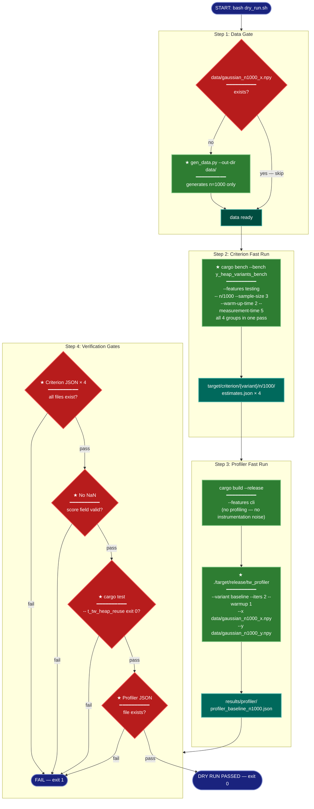

# Implementation Plan: groupC — Benchmark Harness and Execution Scripts

## Summary

Creates all remaining artifacts for the y-heap bottleneck optimization experiment:

1. **`benches/y_heap_variants_bench.rs`** — Criterion 0.5 benchmark that measures all four trustworthiness variants (`baseline`, `heap_reuse`, `flat_partial`, `flat_simd`) across n ∈ {1000, 5000, 10000} with k=15 fixed.
2. **`Cargo.toml` entry** — `[[bench]] y_heap_variants_bench` with `required-features = ["testing"]`.
3. **`scripts/run_criterion.sh`** — Controlled full-run script: W8 guard, thermal gaps, JSON harvesting, Cargo.lock snapshot.
4. **`scripts/run_profiler.sh`** — Profiler build + per-variant run at n=10000.
5. **`scripts/dry_run.sh`** — Ordered pipeline with four verification gates; must exit 0 and print `DRY RUN PASSED` to mark the group complete.
6. **Execute dry run** — Run `dry_run.sh` and fix any failures before declaring done.

All groupB prerequisites are confirmed present: variant functions (`trustworthiness_heap_reuse`, `trustworthiness_flat_partial`, `trustworthiness_flat_simd`) exist in `src/metrics.rs` and are re-exported from `lib.rs` under `#[cfg(feature = "testing")]`; `tw_profiler` already handles `--variant` dispatch; `profiling` feature exists in `Cargo.toml`.

---

## Proposed Architecture



**Lens Used:** Process Flow — the plan's central artifact is `dry_run.sh`, an ordered pipeline with four sequential verification gates. Process Flow best captures the decision branches (data-present check, four pass/fail gates), the sequential execution of Criterion + profiler, and the terminal exit states.

**Color Legend:**
| Color | Category | Description |
|-------|----------|-------------|
| Dark Blue | Terminal | START, PASS, FAIL exit states |
| Red | Detector | Decision/verification gates |
| Green | New Component | New scripts and benchmark file being created |
| Dark Teal | Output | JSON artifacts written to disk |
| Teal | State | Intermediate ready states |

---

## Tests

These should **fail now** (scripts don't exist; bench file doesn't exist) and **pass after implementation**:

### T1 — Bench compiles
```bash
# From repo root
cargo check --features testing --benches
```
Fails now because `benches/y_heap_variants_bench.rs` doesn't exist. Passes once STEP-1 and STEP-2 are complete.

### T2 — Dry run exits 0
```bash
cd research/2026-04-06-y-heap-bottleneck-optimization/
bash scripts/dry_run.sh
# Must print "DRY RUN PASSED" and exit 0
```
Fails now because `scripts/dry_run.sh` doesn't exist. Passes once all steps are complete and the verification gates succeed.

---

## Implementation Steps

### STEP 1 — Create `benches/y_heap_variants_bench.rs`

**File:** `benches/y_heap_variants_bench.rs` at the repo root `benches/` directory.

Follow the pattern from `benches/trustworthiness_bench.rs` exactly. Key differences: four separate benchmark functions (one per group), n sizes are {1000, 5000, 10000} (not {1000, 5000, 50000}), each function calls its specific variant, `measurement_time` is explicitly set.

```rust
use criterion::{criterion_group, criterion_main, BenchmarkId, Criterion, SamplingMode};
use std::hint::black_box;
use std::time::Duration;

fn make_data(
    n: usize,
    d_x: usize,
    d_y: usize,
    seed: u64,
) -> (ndarray::Array2<f64>, ndarray::Array2<f64>) {
    use rand::{Rng, SeedableRng};
    let mut rng = rand::rngs::SmallRng::seed_from_u64(seed);
    let x = ndarray::Array2::from_shape_fn((n, d_x), |_| rng.random::<f64>());
    let y = ndarray::Array2::from_shape_fn((n, d_y), |_| rng.random::<f64>());
    (x, y)
}

fn bench_baseline(c: &mut Criterion) {
    let _ = rayon::current_num_threads();
    let mut group = c.benchmark_group("y_heap_baseline");
    group.sampling_mode(SamplingMode::Flat);
    group.sample_size(10);
    group.warm_up_time(Duration::from_secs(10));
    group.measurement_time(Duration::from_secs(10));
    for &n in &[1_000usize, 5_000, 10_000] {
        let (x, y) = make_data(n, 10, 2, 42);
        group.bench_with_input(BenchmarkId::new("n", n), &n, |b, _| {
            b.iter(|| black_box(spectral_init::trustworthiness(x.view(), y.view(), 15)));
        });
    }
    group.finish();
}

fn bench_heap_reuse(c: &mut Criterion) {
    let _ = rayon::current_num_threads();
    let mut group = c.benchmark_group("y_heap_heap_reuse");
    group.sampling_mode(SamplingMode::Flat);
    group.sample_size(10);
    group.warm_up_time(Duration::from_secs(10));
    group.measurement_time(Duration::from_secs(10));
    for &n in &[1_000usize, 5_000, 10_000] {
        let (x, y) = make_data(n, 10, 2, 42);
        group.bench_with_input(BenchmarkId::new("n", n), &n, |b, _| {
            b.iter(|| black_box(spectral_init::trustworthiness_heap_reuse(x.view(), y.view(), 15)));
        });
    }
    group.finish();
}

fn bench_flat_partial(c: &mut Criterion) {
    let _ = rayon::current_num_threads();
    let mut group = c.benchmark_group("y_heap_flat_partial");
    group.sampling_mode(SamplingMode::Flat);
    group.sample_size(10);
    group.warm_up_time(Duration::from_secs(10));
    group.measurement_time(Duration::from_secs(10));
    for &n in &[1_000usize, 5_000, 10_000] {
        let (x, y) = make_data(n, 10, 2, 42);
        group.bench_with_input(BenchmarkId::new("n", n), &n, |b, _| {
            b.iter(|| black_box(spectral_init::trustworthiness_flat_partial(x.view(), y.view(), 15)));
        });
    }
    group.finish();
}

fn bench_flat_simd(c: &mut Criterion) {
    let _ = rayon::current_num_threads();
    let mut group = c.benchmark_group("y_heap_flat_simd");
    group.sampling_mode(SamplingMode::Flat);
    group.sample_size(10);
    group.warm_up_time(Duration::from_secs(10));
    group.measurement_time(Duration::from_secs(10));
    for &n in &[1_000usize, 5_000, 10_000] {
        let (x, y) = make_data(n, 10, 2, 42);
        group.bench_with_input(BenchmarkId::new("n", n), &n, |b, _| {
            b.iter(|| black_box(spectral_init::trustworthiness_flat_simd(x.view(), y.view(), 15)));
        });
    }
    group.finish();
}

criterion_group!(benches, bench_baseline, bench_heap_reuse, bench_flat_partial, bench_flat_simd);
criterion_main!(benches);
```

**Notes:**
- `make_data` is defined locally — do not import from `trustworthiness_bench.rs` (different compilation unit).
- No `#[cfg(feature = "profiling")]` gates — Criterion must run cleanly without profiling instrumentation.
- `spectral_init::trustworthiness` and the three variant functions are all available under `--features testing` via the `lib.rs` `#[cfg(feature = "testing")]` re-export block.

### STEP 2 — Register bench in `Cargo.toml`

Append after the `[[bench]] trustworthiness_bench` entry at the bottom of `Cargo.toml`:

```toml
[[bench]]
name = "y_heap_variants_bench"
harness = false
required-features = ["testing"]
```

**Verify** immediately: `cargo check --features testing --benches` must compile cleanly (T1 gate).

### STEP 3 — Create `scripts/run_criterion.sh`

**File:** `research/2026-04-06-y-heap-bottleneck-optimization/scripts/run_criterion.sh`

```bash
#!/usr/bin/env bash
set -euo pipefail

SCRIPT_DIR="$(cd "$(dirname "${BASH_SOURCE[0]}")" && pwd)"
REPO_ROOT="$(cd "$SCRIPT_DIR/../.." && pwd)"
RESULTS_DIR="$SCRIPT_DIR/../results/criterion"

# W8 guard: abort if profiling feature is active — would contaminate timing
if [[ -n "${CARGO_FEATURE_PROFILING:-}" ]]; then
    echo "ERROR: CARGO_FEATURE_PROFILING is set. Benchmark must run without profiling instrumentation." >&2
    exit 1
fi

export RAYON_NUM_THREADS
RAYON_NUM_THREADS="$(nproc)"
echo "RAYON_NUM_THREADS=$RAYON_NUM_THREADS"

mkdir -p "$RESULTS_DIR"

run_variant() {
    local variant="$1"
    local group="y_heap_${variant}"

    echo "=== Running variant: $variant ==="
    cargo bench \
        --bench y_heap_variants_bench \
        --features testing \
        --manifest-path "$REPO_ROOT/Cargo.toml" \
        -- "$group"

    # Harvest Criterion JSON for each n
    for n in 1000 5000 10000; do
        local src="$REPO_ROOT/target/criterion/${group}/n/${n}/estimates.json"
        local dst="$RESULTS_DIR/y_heap_${variant}_n${n}.json"
        if [[ -f "$src" ]]; then
            cp "$src" "$dst"
            echo "  copied: $dst"
        else
            echo "  WARNING: expected JSON not found: $src" >&2
        fi
    done
}

run_variant baseline
sleep 60

run_variant heap_reuse
sleep 60

run_variant flat_partial
sleep 60

run_variant flat_simd

# Snapshot Cargo.lock
cp "$REPO_ROOT/Cargo.lock" "$SCRIPT_DIR/../results/Cargo.lock.snapshot"
echo "Cargo.lock snapshot saved."
echo "=== run_criterion.sh complete ==="
```

**Notes:**
- The Criterion filter `"y_heap_${variant}"` matches exactly the benchmark group name, directing Criterion to run only that group.
- `target/criterion/{group}/n/{n}/estimates.json` is the canonical Criterion 0.5 output path for `BenchmarkId::new("n", n)` — the `/` in `n/{n}` is a real filesystem path separator.
- The W8 guard checks the env var `CARGO_FEATURE_PROFILING`; this is the standard var Cargo sets when `--features profiling` is active.

### STEP 4 — Create `scripts/run_profiler.sh`

**File:** `research/2026-04-06-y-heap-bottleneck-optimization/scripts/run_profiler.sh`

```bash
#!/usr/bin/env bash
set -euo pipefail

SCRIPT_DIR="$(cd "$(dirname "${BASH_SOURCE[0]}")" && pwd)"
REPO_ROOT="$(cd "$SCRIPT_DIR/../.." && pwd)"
DATA_DIR="$SCRIPT_DIR/../data"
RESULTS_DIR="$SCRIPT_DIR/../results/profiler"

mkdir -p "$RESULTS_DIR"

# Build profiler binary with profiling instrumentation
echo "=== Building tw_profiler (cli,profiling) ==="
cargo build --release \
    --features cli,profiling \
    --manifest-path "$REPO_ROOT/Cargo.toml"

PROFILER="$REPO_ROOT/target/release/tw_profiler"

run_variant() {
    local variant="$1"
    echo "=== Profiling variant: $variant (n=10000) ==="
    "$PROFILER" \
        --x "$DATA_DIR/gaussian_n10000_x.npy" \
        --y "$DATA_DIR/gaussian_n10000_y.npy" \
        --k 15 \
        --iters 30 \
        --warmup 5 \
        --variant "$variant" \
        --stderr-capture "$RESULTS_DIR/stderr_${variant}.txt" \
        --output "$RESULTS_DIR/profiler_${variant}_n10000.json"
    echo "  wrote: $RESULTS_DIR/profiler_${variant}_n10000.json"
}

run_variant baseline
run_variant heap_reuse
run_variant flat_partial
run_variant flat_simd

echo "=== run_profiler.sh complete ==="
```

### STEP 5 — Create `scripts/dry_run.sh`

**File:** `research/2026-04-06-y-heap-bottleneck-optimization/scripts/dry_run.sh`

```bash
#!/usr/bin/env bash
set -euo pipefail

SCRIPT_DIR="$(cd "$(dirname "${BASH_SOURCE[0]}")" && pwd)"
REPO_ROOT="$(cd "$SCRIPT_DIR/../.." && pwd)"
DATA_DIR="$SCRIPT_DIR/../data"
RESULTS_DIR="$SCRIPT_DIR/../results"

mkdir -p "$RESULTS_DIR/profiler"

echo "=== DRY RUN: y-heap bottleneck optimization ==="

# ── Step 1: Data gate ─────────────────────────────────────────────────────────
if [[ -f "$DATA_DIR/gaussian_n1000_x.npy" ]]; then
    echo "[Step 1] n=1000 data already present, skipping generation."
else
    echo "[Step 1] Generating n=1000 data..."
    python3 "$SCRIPT_DIR/gen_data.py" --out-dir "$DATA_DIR" --sizes 1000
fi

# ── Step 2: Criterion fast run (all 4 variants, n=1000 only) ──────────────────
echo "[Step 2] Running Criterion (n=1000, fast config)..."
cargo bench \
    --bench y_heap_variants_bench \
    --features testing \
    --manifest-path "$REPO_ROOT/Cargo.toml" \
    -- n/1000 --sample-size 3 --warm-up-time 2 --measurement-time 5

# ── Step 3: Build profiler and run baseline at n=1000 ─────────────────────────
echo "[Step 3] Building profiler (features: cli)..."
cargo build --release \
    --features cli \
    --manifest-path "$REPO_ROOT/Cargo.toml"

echo "[Step 3] Running profiler baseline at n=1000..."
"$REPO_ROOT/target/release/tw_profiler" \
    --x "$DATA_DIR/gaussian_n1000_x.npy" \
    --y "$DATA_DIR/gaussian_n1000_y.npy" \
    --k 15 \
    --iters 2 \
    --warmup 1 \
    --variant baseline \
    --output "$RESULTS_DIR/profiler/profiler_baseline_n1000.json"

# ── Step 4: Verification gates ────────────────────────────────────────────────
FAIL=0

echo "[Step 4] Checking Criterion JSON files..."
for variant in baseline heap_reuse flat_partial flat_simd; do
    JSON="$REPO_ROOT/target/criterion/y_heap_${variant}/n/1000/estimates.json"
    if [[ -f "$JSON" ]]; then
        echo "  OK: $JSON"
    else
        echo "  FAIL: missing $JSON" >&2
        FAIL=1
    fi
done

echo "[Step 4] Checking for NaN in profiler output..."
SCORE="$(python3 -c "
import json, math, sys
with open('$RESULTS_DIR/profiler/profiler_baseline_n1000.json') as f:
    d = json.load(f)
score = d.get('score', None)
if score is None or (isinstance(score, float) and math.isnan(score)):
    print('NaN', file=sys.stderr)
    sys.exit(1)
print(score)
")" || { echo "  FAIL: NaN or missing score in profiler output" >&2; FAIL=1; }
[[ "$FAIL" -eq 0 ]] && echo "  OK: score=$SCORE"

echo "[Step 4] Running correctness tests..."
if cargo test \
    --features testing \
    --manifest-path "$REPO_ROOT/Cargo.toml" \
    -- t_tw_heap_reuse 2>&1 | tail -5; then
    echo "  OK: correctness tests passed"
else
    echo "  FAIL: correctness tests failed" >&2
    FAIL=1
fi

echo "[Step 4] Checking profiler JSON output..."
if [[ -f "$RESULTS_DIR/profiler/profiler_baseline_n1000.json" ]]; then
    echo "  OK: profiler JSON present"
else
    echo "  FAIL: profiler JSON missing" >&2
    FAIL=1
fi

# ── Exit gate ─────────────────────────────────────────────────────────────────
if [[ "$FAIL" -ne 0 ]]; then
    echo "DRY RUN FAILED" >&2
    exit 1
fi

echo "DRY RUN PASSED"
```

**Notes on dry_run.sh correctness:**
- Criterion CLI args: filter (`n/1000`) comes before option flags (`--sample-size`, etc.) — Criterion 0.5 parses the first positional arg as the regex filter, named flags anywhere after `--`.
- Step 3 builds with `--features cli` only (no profiling) — the dry run does not test step-timing instrumentation, only wall-clock correctness.
- Verification check #3 uses `t_tw_heap_reuse` as filter; if groupB named its correctness tests differently, adjust the filter to match the actual test names (e.g., `tw_heap_reuse` without prefix `t_`).
- `gen_data.py` does not yet accept `--sizes` flag — if it only generates all sizes by default, omit the flag and note that only n=1000 files are needed (others may also be generated, which is acceptable).

### STEP 6 — Execute dry run and fix failures

```bash
cd research/2026-04-06-y-heap-bottleneck-optimization/
bash scripts/dry_run.sh
```

Must exit 0 and print `DRY RUN PASSED`. Anticipate and fix:

| Failure mode | Fix |
|---|---|
| Criterion filter mismatch | Compare `target/criterion/` directory tree to confirm group name subdirs; adjust filter in `dry_run.sh` and `run_criterion.sh`. |
| `t_tw_heap_reuse` test name not found | Run `cargo test --features testing -- --list` to find the actual name; update the filter in `dry_run.sh`. |
| `make_data` not found | The function is defined locally in the bench file — verify the bench compiled cleanly with `cargo check`. |
| NaN score | Check that `--variant baseline` dispatches correctly in `tw_profiler`; verify `trustworthiness` returns a finite value at n=1000 k=15. |
| `gen_data.py --sizes` not recognized | Run without `--sizes`; all sizes will be generated (acceptable for dry run). |
| `|ΔT| ≥ 1e-6` correctness gate | Escalate to groupB: tie-breaking in partial sort has non-determinism. The dry_run.sh does not compute this directly — it delegates to the cargo test. |

---

## Verification

After STEP 6 completes:

```bash
# T1: bench compiles
cargo check --features testing --benches

# T2: dry run passes
cd research/2026-04-06-y-heap-bottleneck-optimization/
bash scripts/dry_run.sh
# Expected last line: DRY RUN PASSED

# Spot-check Criterion JSON structure
cat target/criterion/y_heap_baseline/n/1000/estimates.json | python3 -m json.tool | head -20

# Spot-check profiler JSON structure
cat results/profiler/profiler_baseline_n1000.json | python3 -m json.tool
```

The group is complete when both T1 and T2 pass. The 2h+ full experiment run (`run_criterion.sh` + `run_profiler.sh`) is not part of this group — those scripts are authored here but executed separately.
