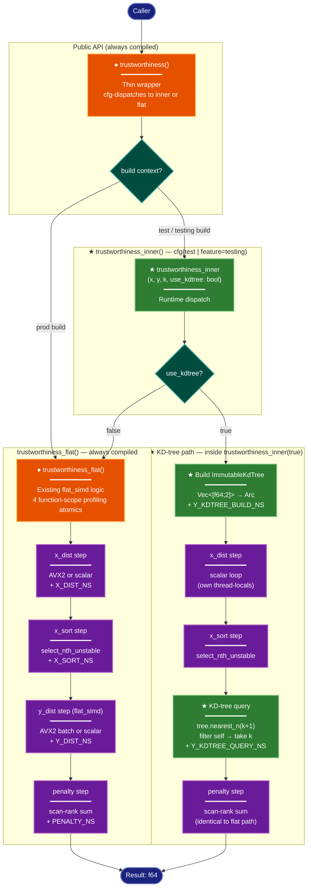

# Implementation Plan: KD-tree Core — groupC KD-tree y-NN Trustworthiness

## Summary

Extend `src/metrics.rs` with a KD-tree code path for `trustworthiness()` experiments.
The production path is preserved with zero behavioral change by factoring the existing
flat_simd body into a private always-compiled `trustworthiness_flat()`. A new
test/bench-gated `trustworthiness_inner(use_kdtree: bool)` dispatches between
`trustworthiness_flat()` (false branch) and a kiddo-powered KD-tree path (true branch).
Two new profiling atomics at module scope track KD-tree build and query time.

**Key constraint:** `kiddo` is a dev-dependency — it cannot appear in code compiled
into the production library binary. `trustworthiness_inner` is gated behind
`#[cfg(any(test, feature = "testing"))]` to match the compilation contexts where
kiddo is available (all benches require `--features testing`; tests use `cfg(test)`).

## Proposed Architecture



**Lens Used:** Process Flow — the plan changes runtime dispatch logic, adding a
decision point (`use_kdtree: bool`) that routes between two y-NN execution paths.

**Color Legend:**
| Color | Category | Description |
|-------|----------|-------------|
| Dark Blue | Terminal | Call site and result |
| Teal | State | Runtime cfg/bool decision points |
| Orange | Handler | Existing functions (modified) |
| Green | New Component | New functions and KD-tree steps |
| Purple | Phase | Processing steps in Rayon loop |

## Tests

Write these tests first — they should fail before implementation and pass after.

### t_tw_11_kdtree_matches_baseline
**File:** `src/metrics.rs`, inside `mod tests`  
**Gate:** `#[test]` (no extra cfg — `trustworthiness_inner` is available inside `#[cfg(test)]`)  
**Condition to fail now:** `trustworthiness_inner` does not exist yet.

```rust
#[test]
fn t_tw_11_kdtree_matches_baseline() {
    use rand::{SeedableRng, Rng};
    let mut rng = rand::rngs::SmallRng::seed_from_u64(123);
    let n = 50;
    let x = ndarray::Array2::from_shape_fn((n, 6), |_| rng.random::<f64>());
    let y = ndarray::Array2::from_shape_fn((n, 2), |_| rng.random::<f64>());

    for k in [3usize, 7] {
        let t_kd = trustworthiness_inner(x.view(), y.view(), k, true);
        let t_ref = trustworthiness_brute_force(x.view(), y.view(), k);
        assert!(t_kd.is_finite(), "T_kdtree(k={k}) must be finite, got {t_kd}");
        assert!(t_kd >= 0.0 && t_kd <= 1.0, "T_kdtree(k={k}) out of [0,1]: {t_kd}");
        assert!(
            (t_kd - t_ref).abs() < 1e-12,
            "T_kdtree(k={k})={t_kd} diverges from brute-force={t_ref} by {}",
            (t_kd - t_ref).abs()
        );
    }
}
```

**Verify fails before implementation:**
```
cargo test t_tw_11 --features testing
# Expected: compile error — `trustworthiness_inner` not found
```

## Implementation Steps

### Step 1 — Add module-scope profiling atomics (PHASE-3a)

In `src/metrics.rs`, add two new module-scope static atomics immediately before or after
the existing `#[cfg(feature = "testing")]` data structures block (around line 676).
These must be at module scope (not inside a function) so that `trustworthiness_flat()`
can read them for printing and `trustworthiness_inner()` can write to them.

```rust
// ─── KD-tree profiling atomics (module scope) ─────────────────────────────────
#[cfg(feature = "profiling")]
static Y_KDTREE_BUILD_NS: std::sync::atomic::AtomicU64 =
    std::sync::atomic::AtomicU64::new(0);
#[cfg(feature = "profiling")]
static Y_KDTREE_QUERY_NS: std::sync::atomic::AtomicU64 =
    std::sync::atomic::AtomicU64::new(0);
```

### Step 2 — Extract flat body to `trustworthiness_flat()` (PHASE-3b/3c prerequisite)

Move the entire body of `trustworthiness()` (lines 479–673 in the current file) into a
new private function with the same signature:

```rust
fn trustworthiness_flat(x: ArrayView2<f64>, y: ArrayView2<f64>, k: usize) -> f64 {
    // ... entire current body of trustworthiness() ...
}
```

Then extend its profiling print block (currently lines 663–670) to also emit the two
new module-scope atomics:

```rust
#[cfg(feature = "profiling")]
{
    use std::sync::atomic::Ordering;
    eprintln!("[timing:x_dist] {}",         X_DIST_NS.load(Ordering::Relaxed));
    eprintln!("[timing:x_sort] {}",         X_SORT_NS.load(Ordering::Relaxed));
    eprintln!("[timing:y_dist] {}",         Y_DIST_NS.load(Ordering::Relaxed));
    eprintln!("[timing:penalty] {}",        PENALTY_NS.load(Ordering::Relaxed));
    eprintln!("[timing:y_kdtree_build] {}", Y_KDTREE_BUILD_NS.load(Ordering::Relaxed));
    eprintln!("[timing:y_kdtree_query] {}", Y_KDTREE_QUERY_NS.load(Ordering::Relaxed));
}
```

Note: In the flat path, `Y_KDTREE_BUILD_NS` and `Y_KDTREE_QUERY_NS` will always
be 0 — this is correct. They are printed for completeness and consistency.

### Step 3 — Refactor `trustworthiness()` to delegate (PHASE-3c)

Replace the now-extracted body with conditional delegation:

```rust
pub fn trustworthiness(x: ArrayView2<f64>, y: ArrayView2<f64>, k: usize) -> f64 {
    #[cfg(any(test, feature = "testing"))]
    return trustworthiness_inner(x, y, k, false);

    #[cfg(not(any(test, feature = "testing")))]
    trustworthiness_flat(x, y, k)
}
```

This ensures:
- **Production builds** (no features): direct call to `trustworthiness_flat()`, identical behavior.
- **Test/bench builds** (test cfg or `--features testing`): delegate to `trustworthiness_inner(false)` → `trustworthiness_flat()`, identical behavior.
- Zero behavioral change on either path.

### Step 4 — Add `trustworthiness_inner()` with KD-tree branch (PHASE-3b + PHASE-3d)

Add the following function immediately after `trustworthiness()`. It must be gated
so kiddo (a dev-dependency) is only imported when available:

```rust
#[cfg(any(test, feature = "testing"))]
fn trustworthiness_inner(
    x: ArrayView2<f64>,
    y: ArrayView2<f64>,
    k: usize,
    use_kdtree: bool,
) -> f64 {
    if !use_kdtree {
        return trustworthiness_flat(x, y, k);
    }

    // ── KD-tree path (assumes d_y == 2) ──────────────────────────────────────
    // d_y == 2 is required by ImmutableKdTree<f64, u32, 2, 32>. The caller is
    // responsible for ensuring this; the assertion below guards misuse.
    debug_assert_eq!(y.ncols(), 2, "trustworthiness_inner: KD-tree path requires d_y == 2");

    use std::cell::RefCell;
    use std::collections::HashSet;
    use std::num::NonZero;
    use std::sync::Arc;
    use kiddo::{ImmutableKdTree, SquaredEuclidean};
    use rayon::prelude::*;

    let n = x.nrows();
    assert_eq!(y.nrows(), n,
        "trustworthiness_inner: x and y must have the same number of rows");
    assert!(k > 0, "trustworthiness_inner: k must be > 0");
    assert!(k < n / 2,
        "trustworthiness_inner: k must be < n/2 (got k={k}, n={n})");

    // ── Build KD-tree (outside Rayon loop) ───────────────────────────────────
    #[cfg(feature = "profiling")]
    let t_build = std::time::Instant::now();

    let points: Vec<[f64; 2]> = (0..n)
        .map(|i| [y[[i, 0]], y[[i, 1]]])
        .collect();
    let tree: Arc<ImmutableKdTree<f64, u32, 2, 32>> =
        Arc::new(ImmutableKdTree::new_from_slice(&points));

    #[cfg(feature = "profiling")]
    Y_KDTREE_BUILD_NS.fetch_add(
        t_build.elapsed().as_nanos() as u64,
        std::sync::atomic::Ordering::Relaxed,
    );

    // Thread-local X buffers (separate from trustworthiness_flat's pools)
    thread_local! {
        static KD_DIST_X:  RefCell<Vec<f64>>   = const { RefCell::new(Vec::new()) };
        static KD_INDICES: RefCell<Vec<usize>> = const { RefCell::new(Vec::new()) };
    }

    // ── Rayon parallel loop ───────────────────────────────────────────────────
    let penalty_sum: f64 = (0..n).into_par_iter().map(|i| {
        let xi = x.row(i);

        KD_DIST_X.with(|dist_x_cell| {
            KD_INDICES.with(|indices_cell| {
                let mut dist_x  = dist_x_cell.borrow_mut();
                let mut indices = indices_cell.borrow_mut();

                // ── x_dist step ──────────────────────────────────────────────
                dist_x.clear();
                dist_x.resize(n, 0.0f64);
                for j in 0..n {
                    let xj = x.row(j);
                    dist_x[j] = xi.iter()
                        .zip(xj.iter())
                        .map(|(&a, &b)| (a - b) * (a - b))
                        .sum();
                }

                // ── x_sort step ──────────────────────────────────────────────
                indices.clear();
                indices.extend(0..n);
                indices.select_nth_unstable_by(k, |&a, &b| {
                    dist_x[a].total_cmp(&dist_x[b]).then(a.cmp(&b))
                });
                let knn_x_set: HashSet<usize> =
                    indices[..=k].iter().filter(|&&m| m != i).copied().collect();

                // ── y_dist step (KD-tree) ─────────────────────────────────────
                #[cfg(feature = "profiling")]
                let t_query = std::time::Instant::now();

                let results = tree.nearest_n::<SquaredEuclidean>(
                    &[y[[i, 0]], y[[i, 1]]],
                    NonZero::new(k + 1).unwrap(),
                );
                let knn_y_indices: Vec<usize> = results
                    .into_iter()
                    .filter(|nb| nb.item as usize != i)
                    .take(k)
                    .map(|nb| nb.item as usize)
                    .collect();

                #[cfg(feature = "profiling")]
                Y_KDTREE_QUERY_NS.fetch_add(
                    t_query.elapsed().as_nanos() as u64,
                    std::sync::atomic::Ordering::Relaxed,
                );

                // ── penalty step (identical to flat path) ─────────────────────
                let mut row_penalty = 0u64;
                for &j in &knn_y_indices {
                    if !knn_x_set.contains(&j) {
                        let dj = dist_x[j];
                        let rank: usize = (0..n)
                            .filter(|&m| dist_x[m] < dj || (dist_x[m] == dj && m < j))
                            .count();
                        row_penalty += (rank - k) as u64;
                    }
                }
                row_penalty as f64
            })
        })
    }).sum();

    #[cfg(feature = "profiling")]
    {
        use std::sync::atomic::Ordering;
        eprintln!("[timing:y_kdtree_build] {}",
            Y_KDTREE_BUILD_NS.load(Ordering::Relaxed));
        eprintln!("[timing:y_kdtree_query] {}",
            Y_KDTREE_QUERY_NS.load(Ordering::Relaxed));
    }

    let denom = n as f64 * k as f64 * (2 * n).saturating_sub(3 * k + 1) as f64;
    1.0 - penalty_sum * 2.0 / denom
}
```

**Implementation notes:**

- **kiddo `Send + Sync`:** `ImmutableKdTree` is `Sync` (immutable after construction).
  `Arc<ImmutableKdTree>` is `Send + Sync`, so the Rayon closure captures `tree` by
  reference (via `Arc` deref). No per-iteration clone needed — Rayon can share a
  `Sync` reference across threads via the captured `Arc`.

- **Self-exclusion:** Query returns `k+1` results. The `.filter(|nb| nb.item as usize != i)`
  removes the self-hit (point `i` is always the nearest neighbor to itself). `.take(k)`
  ensures exactly `k` neighbors are retained.

- **`NonZero::new(k + 1)`:** `k >= 1` is asserted at entry, so `k + 1 >= 2` — the
  `unwrap()` is safe.

- **Thread-local naming:** `KD_DIST_X` / `KD_INDICES` are distinct names from
  `COMB_DIST_X` / `COMB_INDICES` in `trustworthiness_flat()`. In Rust, function-body
  `thread_local!` statics are unique items even if given the same name; using distinct
  names avoids confusion and potential future shadowing issues.

- **No AVX2 dispatch in KD-tree path:** The x_dist step in the KD-tree branch uses
  scalar arithmetic. The experiment is measuring y-NN KD-tree vs flat_simd; mixing
  in SIMD for X would add confounding variance. The flat_simd comparison path is
  isolated to the `use_kdtree = false` branch (via `trustworthiness_flat()`).

### Step 5 — Add test `t_tw_11_kdtree_matches_baseline` (PHASE-3e)

Add the test from the **Tests** section above to `src/metrics.rs` inside `mod tests`,
immediately after `t_tw_10_self_exclusion_never_in_knn`.

No additional imports needed inside `mod tests` — `trustworthiness_inner` is visible
within the test module (same crate, `#[cfg(test)]` applies).

### Step 6 — Verify (PHASE-3e + PHASE-3f)

Run in order:

```bash
# New test
cargo test t_tw_11 --features testing

# Existing regression guard
cargo test t_tw_08 t_tw_10 --features testing
```

All three tests must pass with zero failures.

## Verification

1. **Correctness:** `t_tw_11_kdtree_matches_baseline` asserts `|T_kdtree − T_brute_force| < 1e-12`
   for k ∈ {3, 7} on a 50×6 / 50×2 dataset with seed 123. This catches any off-by-one
   in self-exclusion, incorrect k-NN selection, or wrong penalty formula.

2. **Non-regression:** `t_tw_08` and `t_tw_10` continue to pass. Because `trustworthiness()`
   in a test build now delegates through `trustworthiness_inner(false)` → `trustworthiness_flat()`,
   these tests exercise the full delegation chain.

3. **Production compile check:**
   ```bash
   cargo build --release
   # Must compile without any reference to kiddo — trustworthiness_inner is not compiled
   ```

4. **Profiling compile check:**
   ```bash
   cargo build --features profiling,testing
   # Both Y_KDTREE_BUILD_NS / Y_KDTREE_QUERY_NS and all original atomics must compile
   ```

5. **Symbol visibility sanity:**
   ```bash
   cargo test -- --list 2>&1 | grep t_tw_11
   # Should list the new test
   ```
