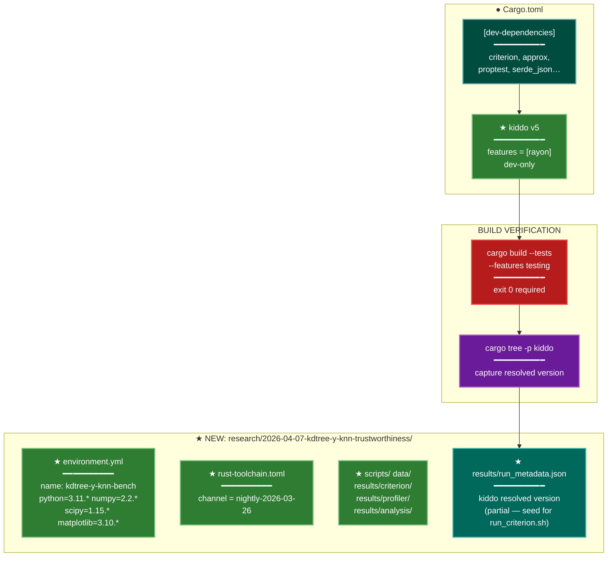

# Implementation Plan: groupA — KD-Tree Experiment Scaffold

## Summary

Create the `research/2026-04-07-kdtree-y-knn-trustworthiness/` directory skeleton with all required
subdirectories and config files, add `kiddo v5` (with `rayon` feature) as a dev-dependency to
`Cargo.toml`, verify the project builds cleanly, and record the resolved `kiddo` version in a
partial `run_metadata.json`. This group produces no functional code — only the scaffolding that
all subsequent experiment groups depend on.

## Proposed Architecture



**Lens Used:** Development — this plan exclusively concerns build infrastructure: dev-dependency
pinning, toolchain configuration, directory scaffolding, and build verification. No runtime
behavior is added.

**Color Legend:**
| Color | Category | Description |
|-------|----------|-------------|
| Teal | Existing | Already-present [dev-dependencies] block |
| Green | New | Components introduced by this plan |
| Dark Teal | Output | Generated artifacts |
| Red | Quality Gate | Build must exit 0 |
| Purple | Phase | Version resolution step |

## Tests

This group adds no functional code; the "test" is the cargo build itself.

**Verification test (runs implicitly via `cargo build --tests`):**

After adding `kiddo` to `[dev-dependencies]`, every integration test binary that `use kiddo`
(added by later groups) must compile. For _this_ group, the sole acceptance criterion is:

```bash
cargo build --tests --features testing
# exit code must be 0
```

Additionally, confirm `kiddo` resolves without version conflicts against existing deps (`faer`,
`ndarray`, `sprs`):

```bash
cargo tree -p kiddo
# Must show kiddo 5.x.x resolved, no dependency conflicts in output
```

No new `#[test]` function is added in this group — future groups will add benchmark and
integration tests that exercise the `kiddo` API.

## Implementation Steps

### Step 1 — Create experiment directory skeleton (PHASE-1.1)

Create the following directories under `research/2026-04-07-kdtree-y-knn-trustworthiness/`:

```
scripts/
data/
results/criterion/
results/profiler/
results/analysis/
```

Use `.gitkeep` files in each empty leaf directory so git tracks them.

### Step 2 — Create `environment.yml` (PHASE-1.2)

Create `research/2026-04-07-kdtree-y-knn-trustworthiness/environment.yml`:

```yaml
name: kdtree-y-knn-bench
channels:
  - conda-forge
dependencies:
  - python=3.11.*
  - numpy=2.2.*
  - scipy=1.15.*
  - matplotlib=3.10.*
```

Pattern matches the existing `y-heap-bench` environment.yml at
`research/2026-04-06-y-heap-bottleneck-optimization/environment.yml`.

### Step 3 — Create `rust-toolchain.toml` (PHASE-1.3)

Create `research/2026-04-07-kdtree-y-knn-trustworthiness/rust-toolchain.toml`:

```toml
# Rust toolchain pinned for kdtree-y-knn-trustworthiness experiment reproducibility.
# Exact nightly used: rustc 1.96.0-nightly (23903d01c 2026-03-26)
[toolchain]
channel = "nightly-2026-03-26"
```

Matches the pin used by the prior research worktrees (see
`research/2026-04-04-tw-perf-scaling/rust-toolchain.toml`).

### Step 4 — Add `kiddo` to `[dev-dependencies]` (PHASE-1.4)

In `Cargo.toml`, append to the existing `[dev-dependencies]` block:

```toml
kiddo = { version = "5", features = ["rayon"] }
```

**Critical:** Do not add to `[dependencies]`. This must remain dev-only to avoid polluting the
library's public dependency surface.

### Step 5 — Verify build and record resolved version (PHASE-1.5)

Run:
```bash
cargo build --tests --features testing
```

Must exit 0. If it fails due to a version conflict, diagnose with `cargo tree` and pin the
conflicting transitive dependency under `[patch.crates-io]` or select a compatible kiddo minor
version — do not downgrade existing dependencies.

Then run:
```bash
cargo tree -p kiddo
```

Parse the first line (e.g. `kiddo v5.2.1`) to extract the resolved version string.

Create `research/2026-04-07-kdtree-y-knn-trustworthiness/results/run_metadata.json` with a
partial record:

```json
{
  "experiment": "kdtree-y-knn-trustworthiness",
  "kiddo_version": "<resolved-version>",
  "rust_channel": "nightly-2026-03-26",
  "note": "partial — full metadata populated by run_criterion.sh"
}
```

## Verification

```bash
# 1. Directory structure present
ls research/2026-04-07-kdtree-y-knn-trustworthiness/
# Expected: scripts/  data/  results/  environment.yml  rust-toolchain.toml

ls research/2026-04-07-kdtree-y-knn-trustworthiness/results/
# Expected: criterion/  profiler/  analysis/  run_metadata.json

# 2. environment.yml has correct name and pins
grep "name:" research/2026-04-07-kdtree-y-knn-trustworthiness/environment.yml
# Expected: name: kdtree-y-knn-bench

# 3. rust-toolchain.toml has correct channel
grep "channel" research/2026-04-07-kdtree-y-knn-trustworthiness/rust-toolchain.toml
# Expected: channel = "nightly-2026-03-26"

# 4. kiddo is in dev-dependencies only
grep -A5 "\[dev-dependencies\]" Cargo.toml | grep kiddo
# Expected: kiddo = { version = "5", features = ["rayon"] }

grep "\[dependencies\]" Cargo.toml | xargs -I{} grep -A30 "{}" Cargo.toml | grep kiddo
# Expected: no output (kiddo must NOT appear in [dependencies])

# 5. Build succeeds
cargo build --tests --features testing
echo "Exit: $?"
# Expected: Exit: 0

# 6. run_metadata.json present and valid JSON with kiddo_version populated
cargo tree -p kiddo | head -1
cat research/2026-04-07-kdtree-y-knn-trustworthiness/results/run_metadata.json
```
