# Implementation Plan: groupF — Execution Scripts & Dry Run

## Summary

Write three orchestration scripts
(`scripts/run_criterion.sh`, `scripts/run_profiler.sh`, `scripts/analyze_results.py`)
and execute the Phase 6 dry run to verify end-to-end correctness at n=1000.
All underlying Rust infrastructure (bench, profiler binary, `trustworthiness_inner`,
`t_tw_11` test, all 24 data files) is already complete. This plan delivers only the
three scripts and the dry-run execution step.

**Critical path details established by codebase exploration:**
- Scripts are invoked from `research/2026-04-07-kdtree-y-knn-trustworthiness/` as CWD;
  all `cargo` commands must `cd` to the project root (two levels up: `RESEARCH_DIR/../..`).
- Criterion estimates path: `target/criterion/<group_name>/<n>/estimates.json`
  (`BenchmarkId::from_parameter(n)` adds a `/<n>/` component — the group spec's
  `<group_name>/estimates.json` is a simplification; use the three-level path).
- Timing values in profiler JSONs are nanoseconds. Step-timing keys: flat_simd emits
  `x_dist`, `x_sort`, `y_dist`, `penalty`; kdtree emits `y_kdtree_build`,
  `y_kdtree_query`.
- tw_profiler `--stderr-capture` handles in-process stderr redirect and populates
  `step_timing` in the output JSON; the shell script does not need to parse stderr
  manually.
- `cargo-criterion v1.1.0` is already installed; use `cargo criterion` (not `cargo bench`).
- Profiling atomics reset to zero at the top of each `trustworthiness_inner` call, so
  `step_timing` arrays contain correct per-iteration values.

---

## Proposed Architecture

```mermaid
%%{init: {'flowchart': {'nodeSpacing': 40, 'rankSpacing': 50, 'curve': 'basis'}}}%%
flowchart TB
    %% CLASS DEFINITIONS %%
    classDef cli fill:#1a237e,stroke:#7986cb,stroke-width:2px,color:#fff;
    classDef stateNode fill:#004d40,stroke:#4db6ac,stroke-width:2px,color:#fff;
    classDef handler fill:#e65100,stroke:#ffb74d,stroke-width:2px,color:#fff;
    classDef phase fill:#6a1b9a,stroke:#ba68c8,stroke-width:2px,color:#fff;
    classDef newComponent fill:#2e7d32,stroke:#81c784,stroke-width:2px,color:#fff;
    classDef output fill:#00695c,stroke:#4db6ac,stroke-width:2px,color:#fff;
    classDef detector fill:#b71c1c,stroke:#ef5350,stroke-width:2px,color:#fff;
    classDef terminal fill:#1a237e,stroke:#7986cb,stroke-width:2px,color:#fff;

    START([START: dry-run or full])

    subgraph CritPhase ["★ run_criterion.sh"]
        DR1{"--dry-run?"}
        CM1["N={1000}, samples=2<br/>warm-up=1s, meas=2s"]
        CM2["N={1K..100K}, reps=3<br/>measurement-time=10s"]
        META["write run_metadata.json<br/>━━━━━━━━━━<br/>RAYON_NUM_THREADS<br/>rust toolchain · timestamp"]
        CLOOP["for variant × dist × n × rep"]
        CCRIT["★ cargo criterion<br/>━━━━━━━━━━<br/>--bench trustworthiness_bench<br/>--features testing<br/>-- {group_name} {extra_flags}"]
        CPEST["copy estimates.json<br/>━━━━━━━━━━<br/>target/criterion/{group}/{n}/<br/>→ results/criterion/{group}_rep{r}.json"]
        CLOG["write results/run_log.json<br/>(criterion section)"]
    end

    subgraph ProfPhase ["★ run_profiler.sh"]
        DR2{"--dry-run?"}
        PM1["N={1000}, iters=3"]
        PM2["N={1K..100K}, iters=30"]
        PLOOP["for variant × dist × n<br/>(fresh process each)"]
        TPROF["★ cargo run --bin tw_profiler<br/>━━━━━━━━━━<br/>--features profiling,cli --release<br/>--n {n} --dist {d} --variant {v}<br/>--iters {I} --warmup 2<br/>--stderr-capture temp/stderr_$$.txt<br/>--output results/profiler/{v}_n{n}_{d}.json"]
        PLOG["append to results/run_log.json<br/>(profiler section)"]
    end

    subgraph AnalPhase ["★ analyze_results.py"]
        RCRIT["read results/criterion/*.json<br/>━━━━━━━━━━<br/>median.point_estimate (ns)<br/>CI bounds"]
        RPROF["read results/profiler/*.json<br/>━━━━━━━━━━<br/>step_timing arrays (ns)"]
        COMPUTEDV["compute DVs<br/>━━━━━━━━━━<br/>total_speedup_50k / 100k<br/>build_fraction per (n,dist)<br/>query_speedup per (n,dist)"]
        FLAGCV{"CV > 10%?"}
        FLAGGED["flag cell; note exclusion"]
        CROSS["interpolate T_cross<br/>━━━━━━━━━━<br/>speedup=1.0 crossing<br/>on uniform log(n) curve"]
        VALID75["validate n=75K<br/>predicted vs actual speedup"]
        EVALH["evaluate H1/H2/H3/H4<br/>+ 5 success criteria"]
        VERDICT{"all 5 met?"}
        SHIP["verdict: SHIP"]
        DNShip["verdict: DO NOT SHIP / INCONCLUSIVE"]
        WRPT["★ write analysis_report.md<br/>★ write crossover_summary.json"]
        DR3{"--dry-run?"}
        WPLOTS["★ write speedup_by_n.png<br/>★ write build_fraction_by_n.png"]
        WLOG2["update results/run_log.json<br/>(analysis section)"]
    end

    DONE([COMPLETE])

    START --> DR1
    DR1 -->|yes| CM1
    DR1 -->|no| CM2
    CM1 --> META
    CM2 --> META
    META --> CLOOP
    CLOOP --> CCRIT
    CCRIT --> CPEST
    CPEST -->|next iteration| CLOOP
    CPEST --> CLOG
    CLOG --> DR2
    DR2 -->|yes| PM1
    DR2 -->|no| PM2
    PM1 --> PLOOP
    PM2 --> PLOOP
    PLOOP --> TPROF
    TPROF -->|next iteration| PLOOP
    TPROF --> PLOG
    PLOG --> RCRIT
    RCRIT --> RPROF
    RPROF --> COMPUTEDV
    COMPUTEDV --> FLAGCV
    FLAGCV -->|yes| FLAGGED
    FLAGCV -->|no| CROSS
    FLAGGED --> CROSS
    CROSS --> VALID75
    VALID75 --> EVALH
    EVALH --> VERDICT
    VERDICT -->|yes| SHIP
    VERDICT -->|no| DNShip
    SHIP --> WRPT
    DNShip --> WRPT
    WRPT --> DR3
    DR3 -->|no| WPLOTS
    DR3 -->|yes| WLOG2
    WPLOTS --> WLOG2
    WLOG2 --> DONE

    class DR1,DR2,DR3,FLAGCV,VERDICT stateNode;
    class CM1,CM2,PM1,PM2 phase;
    class CLOOP,PLOOP,COMPUTEDV,CROSS,VALID75,EVALH handler;
    class CCRIT,TPROF handler;
    class META,CLOG,PLOG,WRPT,WPLOTS,WLOG2 output;
    class FLAGGED detector;
    class SHIP,DNShip detector;
    class START,DONE terminal;
```



**Lens Used:** Process Flow — the plan adds three orchestration scripts that form a
sequential execution pipeline; Process Flow shows the runtime behavior, decision
branches, and per-iteration subprocess dispatch.

**Color Legend:**
| Color | Category | Description |
|-------|----------|-------------|
| Dark Blue | Terminal | Pipeline start and completion |
| Teal | State | Decision/routing nodes (dry-run, CV, verdict) |
| Purple | Phase | Mode-selection sub-paths |
| Orange | Handler | Cargo subprocess invocations and computation steps |
| Dark Teal | Output | Files written: metadata, logs, reports, plots |
| Red | Detector | Validation gates: CV flag, H-evaluation verdict |

---

## Tests

These tests fail before the scripts exist and pass after the dry run completes.

### T1 — run_criterion.sh dry run produces estimates JSON
```bash
cd research/2026-04-07-kdtree-y-knn-trustworthiness
bash scripts/run_criterion.sh --dry-run
python3 -c "
import json, pathlib
p = pathlib.Path('results/criterion/flat_simd_uniform_n1000_rep1.json')
assert p.exists(), f'missing: {p}'
d = json.loads(p.read_text())
assert d['median']['point_estimate'] > 0, 'zero point_estimate'
print('T1 PASS')
"
```

### T2 — run_profiler.sh dry run produces profiler JSON with step_timing
```bash
bash scripts/run_profiler.sh --dry-run
python3 -c "
import json, pathlib
for v,exp_key in [('flat_simd','y_dist'),('kdtree','y_kdtree_build')]:
    p = pathlib.Path(f'results/profiler/{v}_n1000_uniform.json')
    assert p.exists(), f'missing {p}'
    d = json.loads(p.read_text())
    assert exp_key in d.get('step_timing', {}), f'missing {exp_key} in {p}'
print('T2 PASS')
"
```

### T3 — analyze_results.py dry run produces analysis_report.md
```bash
micromamba run -n kdtree-y-knn-bench python scripts/analyze_results.py --dry-run
test -f results/analysis/analysis_report.md && echo "T3 PASS"
```

### T4 — t_tw_11 correctness test passes
```bash
cargo test t_tw_11 --features testing
```

---

## Implementation Steps

### Step 1 — Write `scripts/run_criterion.sh`

File: `research/2026-04-07-kdtree-y-knn-trustworthiness/scripts/run_criterion.sh`

**Structure and behavior:**

```bash
#!/usr/bin/env bash
set -euo pipefail

SCRIPT_DIR="$(cd "$(dirname "${BASH_SOURCE[0]}")" && pwd)"
RESEARCH_DIR="$(dirname "$SCRIPT_DIR")"
PROJECT_ROOT="$(cd "$RESEARCH_DIR/../.." && pwd)"
```

**Flag parsing:** Scan `"$@"` for `--dry-run`; set `DRY_RUN=true/false`.

**Thread count:** `export RAYON_NUM_THREADS=$(nproc)`

**Mode-dependent values (use bash arrays, not word-split strings):**
```bash
if [[ "$DRY_RUN" == "true" ]]; then
    N_VALUES=(1000)
    EXTRA_FLAGS=(--sample-size 2 --warm-up-time 1 --measurement-time 2)
else
    N_VALUES=(1000 5000 10000 50000 75000 100000)
    EXTRA_FLAGS=(--measurement-time 10)
fi
VARIANTS=(flat_simd kdtree)
DISTRIBUTIONS=(uniform gauss)
REPS=3
```

**Write `results/run_metadata.json`** (overwrite):
Fields: `experiment`, `kiddo_version` (5.3.0), `rust_channel` (from
`rustup show active-toolchain | awk '{print $1}'`, run inside `$PROJECT_ROOT`),
`rayon_num_threads`, `timestamp` (ISO-8601 via `date -Iseconds`), `dry_run`.

**Main loop** — accumulate log entries in a bash array:
```bash
for variant in "${VARIANTS[@]}"; do
  for dist in "${DISTRIBUTIONS[@]}"; do
    for n in "${N_VALUES[@]}"; do
      group="${variant}_${dist}_n${n}"
      for rep in $(seq 1 "$REPS"); do
        (cd "$PROJECT_ROOT" && cargo criterion \
            --bench trustworthiness_bench \
            --features testing -- "$group" "${EXTRA_FLAGS[@]}")
        src="$PROJECT_ROOT/target/criterion/$group/$n/estimates.json"
        dst="$RESEARCH_DIR/results/criterion/${group}_rep${rep}.json"
        cp "$src" "$dst"
        # record status in LOG_ENTRIES array
      done
    done
  done
done
```

**Criterion path note:** The path includes the parameter value (`/$n/`) because the bench
uses `BenchmarkId::from_parameter(n)`. If the copy fails due to a missing file, log
`"status": "missing_estimates"` and continue (do not abort).

**Write `results/run_log.json`** at end with structure:
```json
{"criterion": [{"variant": "...", "dist": "...", "n": ..., "rep": ..., "status": "completed|failed|missing_estimates"}]}
```
Construct the JSON by string-building in bash (no `jq` required). The file is
created or overwritten by `run_criterion.sh`; `run_profiler.sh` will add its own key.

---

### Step 2 — Write `scripts/run_profiler.sh`

File: `research/2026-04-07-kdtree-y-knn-trustworthiness/scripts/run_profiler.sh`

**Header/path setup:** Identical to `run_criterion.sh` (SCRIPT_DIR, RESEARCH_DIR, PROJECT_ROOT).

**Flag parsing:** Same `--dry-run` pattern.

**Mode-dependent values:**
```bash
if [[ "$DRY_RUN" == "true" ]]; then
    N_VALUES=(1000)
    ITERS=3
else
    N_VALUES=(1000 5000 10000 50000 75000 100000)
    ITERS=30
fi
VARIANTS=(flat_simd kdtree)
DISTRIBUTIONS=(uniform gauss)
WARMUP=2
```

**`mkdir -p`** both `"$RESEARCH_DIR/results/profiler"` and `"$PROJECT_ROOT/temp"`.

**Main loop — one fresh `cargo run` per combination:**
```bash
for variant in "${VARIANTS[@]}"; do
  for dist in "${DISTRIBUTIONS[@]}"; do
    for n in "${N_VALUES[@]}"; do
      stderr_file="$PROJECT_ROOT/temp/tw_profiler_stderr_$$.txt"
      out="$RESEARCH_DIR/results/profiler/${variant}_n${n}_${dist}.json"
      (cd "$PROJECT_ROOT" && \
          RAYON_NUM_THREADS="$RAYON_NUM_THREADS" \
          cargo run --bin tw_profiler \
              --features profiling,cli --release -- \
              --n "$n" --dist "$dist" --variant "$variant" \
              --iters "$ITERS" --warmup "$WARMUP" \
              --stderr-capture "$stderr_file" \
              --output "$out")
      rm -f "$stderr_file"
      # record status in LOG_ENTRIES array
    done
  done
done
```

Each invocation is a **separate process** (`cargo run` subprocess), which resets all
profiling atomics to zero at process start. `--stderr-capture` uses `dup2` after warmup
so the capture file only contains timed-iteration output; the script deletes the temp
file afterward.

**Append profiler section to `results/run_log.json`:** Use `python3` (system Python,
not micromamba) to load the existing JSON written by `run_criterion.sh`, add a
`"profiler"` key with the collected log entries, and write it back:
```bash
python3 -c "
import json, sys
path='$RESEARCH_DIR/results/run_log.json'
try:
    log = json.loads(open(path).read())
except Exception:
    log = {}
log['profiler'] = json.loads(sys.argv[1])
open(path,'w').write(json.dumps(log, indent=2))
" "$PROFILER_JSON_ARRAY"
```
Where `$PROFILER_JSON_ARRAY` is the JSON-array string built during the loop. If
`run_log.json` doesn't exist yet (profiler run without prior criterion run), write
`{"profiler": [...]}`.

**If system `python3` is unavailable:** fall back to writing a separate
`results/run_log_profiler.json` file that `analyze_results.py` reads independently.

---

### Step 3 — Write `scripts/analyze_results.py`

File: `research/2026-04-07-kdtree-y-knn-trustworthiness/scripts/analyze_results.py`

**Imports:** `argparse`, `json`, `math`, `pathlib`, `sys`. For plots: `matplotlib.pyplot`.
No `scipy` or `sklearn` required.

**Script CWD assumption:** Must be run from the research directory
(`research/2026-04-07-kdtree-y-knn-trustworthiness/`). Use `pathlib.Path("results/...")`
for all file paths.

**Argument parsing:**
```python
parser = argparse.ArgumentParser()
parser.add_argument("--dry-run", action="store_true")
args = parser.parse_args()
```

**Constants:**
```python
VARIANTS     = ["flat_simd", "kdtree"]
DISTRIBUTIONS = ["uniform", "gauss"]
N_VALUES     = [1000, 5000, 10000, 50000, 75000, 100000]
REPS         = 3
CRIT_DIR     = pathlib.Path("results/criterion")
PROF_DIR     = pathlib.Path("results/profiler")
ANALYSIS_DIR = pathlib.Path("results/analysis")
ANALYSIS_DIR.mkdir(parents=True, exist_ok=True)
```

In `--dry-run` mode: `N_VALUES = [1000]`.

#### 3a. Data loading helpers (handle missing files gracefully)

```python
def load_criterion(group: str, rep: int) -> dict | None:
    p = CRIT_DIR / f"{group}_rep{rep}.json"
    return json.loads(p.read_text()) if p.exists() else None

def load_profiler(variant: str, n: int, dist: str) -> dict | None:
    p = PROF_DIR / f"{variant}_n{n}_{dist}.json"
    return json.loads(p.read_text()) if p.exists() else None
```

#### 3b. Criterion metric aggregation

`median_estimate(group, dist, n)` → `(median_ns: float, cv: float, high_cv: bool)`:
- Collect `data["median"]["point_estimate"]` from all available reps.
- `median_ns` = median of the per-rep point estimates.
- `cv` = `std(estimates) / mean(estimates)` across reps; `NaN` if < 2 reps.
- `high_cv = cv > 0.10`.

Values are in nanoseconds; keep them in ns for all internal computation.

#### 3c. DV computations

**`tw_kdtree_total_speedup_{n}k`** (for n ∈ {50000, 100000}):
```python
flat_ns, flat_cv, _ = median_estimate("flat_simd", dist, n)
kd_ns,   kd_cv,   _ = median_estimate("kdtree",    dist, n)
speedup = flat_ns / kd_ns  # > 1 means kdtree is faster
```

**`tw_kdtree_build_fraction`** per `(n, dist)`:
```python
data = load_profiler("kdtree", n, dist)
st = data["step_timing"]
build_mean_ns = mean(st["y_kdtree_build"])
query_mean_ns = mean(st["y_kdtree_query"])
build_fraction = build_mean_ns / (build_mean_ns + query_mean_ns)
```

**`tw_kdtree_query_speedup`** per `(n, dist)`:
```python
flat = load_profiler("flat_simd", n, dist)
kd   = load_profiler("kdtree",    n, dist)
y_dist_ns    = mean(flat["step_timing"]["y_dist"])
kd_query_ns  = mean(kd["step_timing"]["y_kdtree_query"])
query_speedup = y_dist_ns / kd_query_ns
```

#### 3d. Crossover interpolation (H2)

Use **uniform** distribution data. Build sorted list of `(n, speedup_uniform)` for all
available n in `N_VALUES`. Find the adjacent pair `(n_lo, sp_lo), (n_hi, sp_hi)` where
`(sp_lo - 1.0) * (sp_hi - 1.0) < 0`. Interpolate in `log(n)` space:
```python
t = (1.0 - sp_lo) / (sp_hi - sp_lo)
T_cross = math.exp(math.log(n_lo) + t * (math.log(n_hi) - math.log(n_lo)))
```
If no sign flip exists (speedup never crosses 1.0), report `T_cross = None` with a note.

**T_cross variance (W4):** Compute T_cross independently using only rep-1 data, rep-2
data, and rep-3 data (each rep's `point_estimate` as a single-rep estimate). Report
`T_cross_range = max/min` across three rep-based estimates. Flag unstable if ratio > 2×.

**n=75K held-out check (RT8):** Report the actual n=75K speedup separately and compare
to whether it falls on the predicted KD-tree-faster side (speedup > 1.0) of T_cross.

#### 3e. Hypothesis evaluation

```
H1 met: speedup_50k_uniform >= 5.0 AND speedup_100k_uniform >= 10.0
H2 met: T_cross is not None AND T_cross falls within [1K, 50K]
H3 met: t_tw_11 is pre-verified (report "ASSUMED PASS — run cargo test t_tw_11 separately")
H4 met: build_fraction <= 0.10 at both n=50K and n=100K for all distributions
```

**Five success criteria (conjunctive):**
1. `tw_kdtree_total_speedup_50k` ≥ 5.0 on uniform
2. `tw_kdtree_total_speedup_100k` ≥ 10.0 on uniform
3. Correctness (`t_tw_11` / `t_tw_08` / `t_tw_10`): report status; script cannot run
   Rust tests, so document as external prerequisite
4. T_cross variance ≤ 2× across 3 reps
5. `tw_kdtree_build_fraction` ≤ 10% at n=50K and n=100K

**Verdict:**
- All 5 met → SHIP
- Speedup ≤ 2.0 on both distributions at n=50K → DO NOT SHIP
- Otherwise → INCONCLUSIVE

In `--dry-run` mode (only n=1000 data): emit `"DRY RUN — insufficient data for H1/H4
verdict; pipeline integrity verified"` and set verdict to `INCONCLUSIVE`.

#### 3f. Output files

**`results/analysis/analysis_report.md`** — Markdown report with:
- Run scope (thread count from `run_metadata.json`, dry-run flag)
- Table of all DV values per (variant, dist, n): speedup, build_fraction, query_speedup
- CV flags (⚠ HIGH VARIANCE) on cells with CV > 10%
- T_cross estimate with variance range
- n=75K held-out check result
- H1/H2/H3/H4 evaluation (one section per hypothesis)
- Five success criteria table (met/not met)
- Final verdict: `**SHIP**`, `**DO NOT SHIP**`, or `**INCONCLUSIVE**`
- Scope qualifier: "All conclusions scoped to `RAYON_NUM_THREADS={N}` threads on the
  benchmark machine" (RT6)

**`results/analysis/crossover_summary.json`**:
```json
{
  "T_cross_estimate": <float | null>,
  "T_cross_range": {"rep1": <float|null>, "rep2": <float|null>, "rep3": <float|null>},
  "T_cross_stable": <bool>,
  "n75k_speedup_uniform": <float|null>,
  "n75k_on_kdtree_faster_side": <bool|null>
}
```

**Plots (skipped in `--dry-run`):**
- `results/analysis/speedup_by_n.png`: speedup ratio vs log₁₀(n), one line per
  distribution; horizontal dashed line at speedup=1.0; mark T_cross if found.
  Use matplotlib. X-axis: log scale with ticks at n values. Y-axis: linear.
- `results/analysis/build_fraction_by_n.png`: build fraction vs n, one line per
  distribution; horizontal dashed line at 10%.

**`results/run_log.json`**: Load existing log (if present), add or overwrite an
`"analysis"` key with `{"status": "completed"|"error", "timestamp": ..., "dry_run": ...}`.

---

### Step 4 — Execute dry run

Run all commands from `research/2026-04-07-kdtree-y-knn-trustworthiness/`:

```bash
cd research/2026-04-07-kdtree-y-knn-trustworthiness

# Data files already exist (all 24 .npy files verified); run gen_data.py as guard
micromamba run -n kdtree-y-knn-bench python scripts/gen_data.py --n-max 1000

bash scripts/run_criterion.sh --dry-run

bash scripts/run_profiler.sh --dry-run

micromamba run -n kdtree-y-knn-bench python scripts/analyze_results.py --dry-run

cargo test t_tw_11 --features testing
```

After each command, verify the expected outputs exist before proceeding to the next.

---

## Verification

After Step 4, confirm all of the following:

1. **Criterion JSONs present and non-zero:**
   `results/criterion/` contains 12 files for the dry run
   (`flat_simd_{uniform,gauss}_n1000_rep{1,2,3}.json` and
   `kdtree_{uniform,gauss}_n1000_rep{1,2,3}.json`);
   each has `median.point_estimate > 0`.

2. **Profiler JSONs present with correct step_timing keys:**
   `results/profiler/` contains 4 files
   (`flat_simd_n1000_{uniform,gauss}.json` and `kdtree_n1000_{uniform,gauss}.json`);
   flat_simd files have `step_timing.y_dist`; kdtree files have
   `step_timing.y_kdtree_build` and `step_timing.y_kdtree_query`.

3. **Analysis report generated:** `results/analysis/analysis_report.md` exists and
   contains the "DRY RUN" scope note.

4. **t_tw_11 passes:** `cargo test t_tw_11 --features testing` exits 0 with
   `test t_tw_11_kdtree_matches_baseline ... ok`.

5. **run_log.json coherent:** `results/run_log.json` has both `"criterion"` and
   `"profiler"` keys (and optionally `"analysis"`), with all statuses `"completed"`.

6. **run_metadata.json populated:** `results/run_metadata.json` has
   `rayon_num_threads` (integer), `timestamp` (ISO-8601), and `rust_channel` fields.
