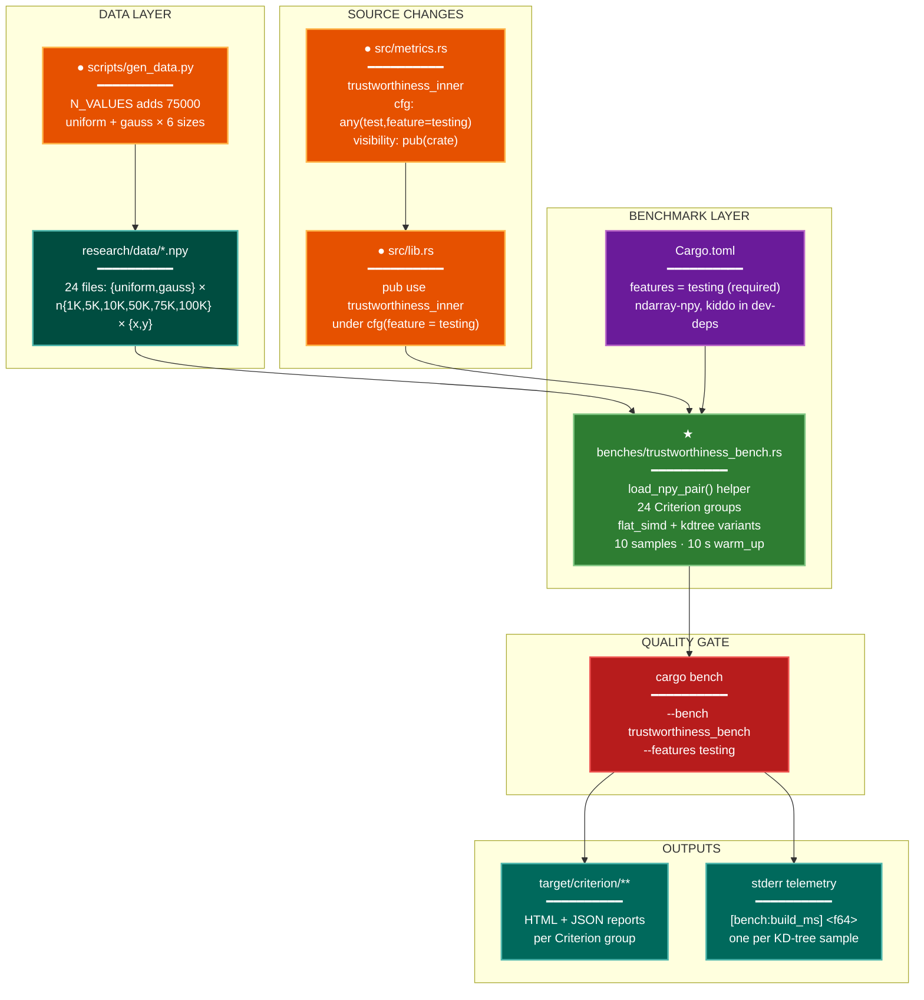

# Implementation Plan: groupD — Benchmark Extension (trustworthiness_bench.rs)

## Summary

Extend the Criterion benchmark suite so that both the flat_simd and KD-tree variants of
`trustworthiness_inner` are benchmarked across all (distribution × n) cells, including the
held-out n=75 K validation point. Key structural changes:

1. **`src/metrics.rs`** — relax `trustworthiness_inner`'s cfg gate from `#[cfg(test)]` to
   `#[cfg(any(test, feature = "testing"))]` and lift visibility to `pub(crate)`, so bench
   binaries compiled with `--features testing` can call it.
2. **`src/lib.rs`** — add `trustworthiness_inner` to the existing
   `#[cfg(feature = "testing")]` re-export block so the bench can reach it as
   `spectral_init::trustworthiness_inner`.
3. **`research/.../scripts/gen_data.py`** — add 75000 to `N_VALUES` so the 75 K `.npy`
   files are generated.
4. **`benches/trustworthiness_bench.rs`** — replace the current single-group benchmark with
   24 Criterion groups (2 distributions × 6 n-values × 2 variants), loading real `.npy`
   data, with per-sample build-time telemetry on the KD-tree variant.

---

## Proposed Architecture



**Lens Used:** Development — the plan restructures benchmark infrastructure (Criterion groups,
data loading, build-time telemetry); the changes live entirely in the build/test quality-gate
layer.

**Color Legend:**
| Color | Category | Description |
|-------|----------|-------------|
| Orange | Handler | Modified source files |
| Dark Teal | State | Generated .npy data files |
| Purple | Phase | Build configuration (Cargo.toml) |
| Green | New Component | New benchmark file |
| Dark Red | Detector | Quality gate (cargo bench invocation) |
| Dark Teal (output) | Output | Criterion reports, stderr telemetry |

---

## Tests

These verification commands should **fail before the plan is implemented** and **pass after**.

### T1 — Bench compilation check
```
cargo build --bench trustworthiness_bench --features testing 2>&1
```
**Fails now:** `trustworthiness_inner` is behind `#[cfg(test)]` only; not visible to bench.
**Passes after:** cfg gate is widened and `pub(crate)` + re-export are in place.

### T2 — Smoke run (PHASE-4.5)
```
cargo bench --bench trustworthiness_bench --features testing \
    -- flat_simd_uniform_n1000 --profile-time 5
```
**Fails now:** bench doesn't compile (same root as T1); also lacks npy files for n=75K.
**Passes after:** all steps complete.

### T3 — KD-tree telemetry present
Run any kdtree group and confirm stderr contains `[bench:build_ms]`:
```
cargo bench --bench trustworthiness_bench --features testing \
    -- kdtree_uniform_n1000 --profile-time 2 2>&1 | grep '\[bench:build_ms\]'
```
**Fails now:** bench doesn't exist in the current form.
**Passes after:** Step 4 is complete.

### T4 — 75K data files exist
```
ls research/2026-04-07-kdtree-y-knn-trustworthiness/data/ | grep n75000
```
**Fails now:** gen_data.py omits n=75000; no files generated.
**Passes after:** Step 3 + data generation are complete.

---

## Implementation Steps

### Step 1 — Widen cfg gate and visibility on `trustworthiness_inner` (`src/metrics.rs`)

At line 686, change:
```rust
#[cfg(test)]
fn trustworthiness_inner(
```
to:
```rust
#[cfg(any(test, feature = "testing"))]
pub(crate) fn trustworthiness_inner(
```

No other changes to `metrics.rs`. The function body stays identical.

**Rationale:** `cargo bench` does not set `cfg(test)`. Benches with `--features testing` need
the function; `pub(crate)` is the minimal visibility that lets `lib.rs` re-export it.

---

### Step 2 — Re-export `trustworthiness_inner` from `src/lib.rs`

In the existing `#[cfg(feature = "testing")]` block (lines 123–147), add
`trustworthiness_inner` to the `pub use crate::metrics::{...}` list:

```rust
#[cfg(feature = "testing")]
#[doc(hidden)]
pub use crate::metrics::{
    // ... existing symbols ...
    trustworthiness,
    trustworthiness_inner,   // ← ADD THIS LINE
    // ... rest unchanged ...
};
```

The bench then calls `spectral_init::trustworthiness_inner(x.view(), y.view(), k, flag)`.

---

### Step 3 — Add n=75000 to `gen_data.py`

File: `research/2026-04-07-kdtree-y-knn-trustworthiness/scripts/gen_data.py`

Change line 23:
```python
N_VALUES = [1000, 5000, 10000, 50000, 100000]
```
to:
```python
N_VALUES = [1000, 5000, 10000, 50000, 75000, 100000]
```

No other changes needed — the script iterates `N_VALUES` uniformly for both distributions.

Then regenerate the data (run from the `research/2026-04-07-kdtree-y-knn-trustworthiness/`
directory):
```sh
python scripts/gen_data.py
```
Verify `data/uniform_n75000_x.npy`, `data/uniform_n75000_y.npy`,
`data/gauss_n75000_x.npy`, `data/gauss_n75000_y.npy` are created with `verified=true`
in `data/manifest.json`.

---

### Step 4 — Rewrite `benches/trustworthiness_bench.rs`

Replace the entire file contents with the following structure:

```rust
use criterion::{BenchmarkId, Criterion, SamplingMode, criterion_group, criterion_main};
use kiddo::{ImmutableKdTree, SquaredEuclidean};
use ndarray::Array2;
use ndarray_npy::read_npy;
use std::hint::black_box;
use std::sync::Arc;
use std::time::{Duration, Instant};

const DATA_DIR: &str =
    "research/2026-04-07-kdtree-y-knn-trustworthiness/data";
const K: usize = 15;
const DISTRIBUTIONS: &[&str] = &["uniform", "gauss"];
const N_VALUES: &[usize] = &[1_000, 5_000, 10_000, 50_000, 75_000, 100_000];

fn load_npy_pair(dist: &str, n: usize) -> (Array2<f64>, Array2<f64>) {
    let x: Array2<f64> =
        read_npy(format!("{DATA_DIR}/{dist}_n{n}_x.npy")).unwrap();
    let y: Array2<f64> =
        read_npy(format!("{DATA_DIR}/{dist}_n{n}_y.npy")).unwrap();
    (x, y)
}

fn bench_variants(c: &mut Criterion) {
    let _ = rayon::current_num_threads(); // warm rayon

    for &dist in DISTRIBUTIONS {
        for &n in N_VALUES {
            let (x, y) = load_npy_pair(dist, n);

            // ── flat_simd group ──────────────────────────────────────────────
            let mut group = c.benchmark_group(
                format!("flat_simd_{dist}_n{n}")
            );
            group.sampling_mode(SamplingMode::Flat);
            group.sample_size(10);
            group.warm_up_time(Duration::from_secs(10));
            group.bench_function(BenchmarkId::from_parameter(n), |b| {
                b.iter(|| {
                    black_box(spectral_init::trustworthiness_inner(
                        x.view(), y.view(), K, false,
                    ))
                });
            });
            group.finish();

            // ── kdtree group ─────────────────────────────────────────────────
            let mut group = c.benchmark_group(
                format!("kdtree_{dist}_n{n}")
            );
            group.sampling_mode(SamplingMode::Flat);
            group.sample_size(10);
            group.warm_up_time(Duration::from_secs(10));
            group.bench_function(BenchmarkId::from_parameter(n), |b| {
                // Capture one build-time measurement per sample,
                // outside the Criterion measurement closure.
                let t_build = Instant::now();
                let points: Vec<[f64; 2]> = (0..n)
                    .map(|i| [y[[i, 0]], y[[i, 1]]])
                    .collect();
                let _tree: Arc<ImmutableKdTree<f64, 2>> =
                    Arc::new(ImmutableKdTree::new_from_slice(&points));
                let build_ms = t_build.elapsed().as_secs_f64() * 1_000.0;
                eprintln!("[bench:build_ms] {build_ms:.6}");

                b.iter(|| {
                    black_box(spectral_init::trustworthiness_inner(
                        x.view(), y.view(), K, true,
                    ))
                });
            });
            group.finish();
        }
    }
}

criterion_group!(benches, bench_variants);
criterion_main!(benches);
```

**Key design decisions:**
- The old `make_data` / `"trustworthiness"` group is removed. All coverage is superseded by
  the new per-(dist, n) groups with real experimental data.
- Criterion groups are named without parameter suffix in `BenchmarkId::from_parameter(n)`:
  Criterion renders them as `flat_simd_uniform_n1000/1000`, but filter matching on
  `flat_simd_uniform_n1000` selects the whole group (all parameter variants within it),
  which is what PHASE-4.5 requires.
- `flat_simd` group comes before `kdtree` group for every (dist, n) pair — conservative
  cache-warming bias against KD-tree (W8, documented in experiment plan).
- Build-time capture builds the tree once outside `b.iter()` for measurement. The full
  `trustworthiness_inner(..., true)` call inside `b.iter()` builds it again internally —
  this is intentional: Criterion's measurement covers the complete computation including
  tree construction, and the separate capture provides the isolated build-time signal.

---

### Step 5 — Verify (PHASE-4.5)

```sh
cargo bench --bench trustworthiness_bench --features testing \
    -- flat_simd_uniform_n1000 --profile-time 5
```

This must exit 0 with Criterion output for the `flat_simd_uniform_n1000` group.

---

## Verification

1. **T1 passes:** `cargo build --bench trustworthiness_bench --features testing` exits 0.
2. **T2 passes:** PHASE-4.5 smoke run exits 0.
3. **T3 passes:** A kdtree bench run emits at least one `[bench:build_ms] <float>` line to
   stderr.
4. **T4 passes:** All four n=75000 `.npy` files exist in the data directory.
5. **Group count:** `cargo bench --bench trustworthiness_bench --features testing -- --list`
   shows 24 distinct benchmark IDs (2 distributions × 6 n-values × 2 variants).
6. **Config:** Each group reports `sample_size = 10` and `warm_up_time = 10s` in Criterion
   output.
