# Implementation Plan: groupE — Profiler Extension (tw_profiler variant dispatch)

## Summary

Extend `src/bin/tw_profiler.rs` to support `--variant flat_simd|kdtree` and `--n`/`--dist`
arguments, dispatch to `trustworthiness_inner()` with the appropriate flag, and emit
per-iteration step timing arrays into the JSON output. Requires widening the cfg gate on
`trustworthiness_inner` and enabling `kiddo` for the `cli` feature, plus fixing atomic
accumulation by resetting profiling atomics at the start of each function call.

---

## Proposed Architecture

```mermaid
%%{init: {'flowchart': {'nodeSpacing': 50, 'rankSpacing': 60, 'curve': 'basis'}}}%%
flowchart TB
    %% CLASS DEFINITIONS %%
    classDef cli fill:#1a237e,stroke:#7986cb,stroke-width:2px,color:#fff;
    classDef stateNode fill:#004d40,stroke:#4db6ac,stroke-width:2px,color:#fff;
    classDef handler fill:#e65100,stroke:#ffb74d,stroke-width:2px,color:#fff;
    classDef phase fill:#6a1b9a,stroke:#ba68c8,stroke-width:2px,color:#fff;
    classDef newComponent fill:#2e7d32,stroke:#81c784,stroke-width:2px,color:#fff;
    classDef output fill:#00695c,stroke:#4db6ac,stroke-width:2px,color:#fff;
    classDef detector fill:#b71c1c,stroke:#ef5350,stroke-width:2px,color:#fff;
    classDef terminal fill:#1a237e,stroke:#7986cb,stroke-width:2px,color:#fff;

    START([START: cargo run --bin tw_profiler])

    subgraph ArgParse ["★ PHASE-5.1/5.2: Argument Parsing"]
        direction TB
        ARGS["★ Parse CLI args<br/>━━━━━━━━━━<br/>--variant flat_simd|kdtree (default: flat_simd)<br/>--n &lt;usize&gt; (optional)<br/>--dist uniform|gauss (default: uniform)<br/>--x / --y (optional, backward compat)<br/>--k --iters --warmup --stderr-capture --output"]
        DATASRC{"Data source?<br/>━━━━━━━━━━<br/>--x/--y provided?"}
    end

    subgraph DataLoad ["★ Data Loading"]
        direction TB
        LOAD_FILE["Load X,Y from files<br/>━━━━━━━━━━<br/>ndarray_npy::read_npy(&x_path)<br/>ndarray_npy::read_npy(&y_path)"]
        GEN_DATA["★ Generate X,Y in memory<br/>━━━━━━━━━━<br/>uniform: rng.random((n,10)), rng.random((n,2))<br/>gauss: rng.random((n,10)) + mixture_y(n)<br/>fixed seed (42=uniform, 99=gauss)"]
        ERR_NO_DATA([ERROR: no data source])
    end

    subgraph WarmupPhase ["Warmup Loop (no capture)"]
        WARMUP["Warmup iterations<br/>━━━━━━━━━━<br/>for _ in 0..warmup<br/>calls trustworthiness_inner(x,y,k,use_kdtree)<br/>stderr goes to real stderr (not captured)"]
    end

    subgraph CaptureSetup ["★ Stderr Capture Setup"]
        SETUP_CAP{"--stderr-capture<br/>provided?"}
        DO_CAP["redirect_stderr(path)<br/>━━━━━━━━━━<br/>dup2 to capture file<br/>(set up AFTER warmup)"]
    end

    subgraph TimedPhase ["★ PHASE-5.1/5.3: Timed Iterations"]
        VARDISP{"variant?"}
        FLAT["trustworthiness_inner(x,y,k,false)<br/>━━━━━━━━━━<br/>● resets X_DIST_NS,X_SORT_NS,<br/>  Y_DIST_NS,PENALTY_NS at start<br/>emits [timing:x_dist],[timing:x_sort],<br/>[timing:y_dist],[timing:penalty]"]
        KD["trustworthiness_inner(x,y,k,true)<br/>━━━━━━━━━━<br/>★ resets Y_KDTREE_BUILD_NS,<br/>  Y_KDTREE_QUERY_NS at start<br/>emits [timing:y_kdtree_build],<br/>[timing:y_kdtree_query]"]
        COLLECT["Collect wall-clock time<br/>━━━━━━━━━━<br/>times.push(elapsed)"]
    end

    subgraph ParseTimings ["Parse Step Timings"]
        PARSE["parse_step_timing(capture_file)<br/>━━━━━━━━━━<br/>HashMap&lt;String, Vec&lt;f64&gt;&gt;<br/>one entry per iter per label<br/>(W5: raw per-iter arrays)"]
    end

    subgraph JSONOut ["★ JSON Output"]
        BUILD_JSON["★ Build JSON<br/>━━━━━━━━━━<br/>n, k, iters (wall-clock array),<br/>mean_s, std_s, warmup, score,<br/>variant (new), dist (new),<br/>step_timing (per-iter arrays)"]
        WRITE{"--output provided?"}
        WRITE_FILE["Write to output file"]
        WRITE_STDOUT["Write to stdout"]
    end

    END([COMPLETE])

    START --> ARGS
    ARGS --> DATASRC
    DATASRC -->|"--x/--y"| LOAD_FILE
    DATASRC -->|"--n"| GEN_DATA
    DATASRC -->|"neither"| ERR_NO_DATA
    LOAD_FILE --> WARMUP
    GEN_DATA --> WARMUP
    WARMUP --> SETUP_CAP
    SETUP_CAP --> DO_CAP
    DO_CAP --> VARDISP
    SETUP_CAP -->|"no"| VARDISP
    VARDISP -->|"flat_simd"| FLAT
    VARDISP -->|"kdtree"| KD
    FLAT --> COLLECT
    KD --> COLLECT
    COLLECT -->|"more iters"| VARDISP
    COLLECT -->|"done"| PARSE
    PARSE --> BUILD_JSON
    BUILD_JSON --> WRITE
    WRITE -->|"yes"| WRITE_FILE
    WRITE -->|"no"| WRITE_STDOUT
    WRITE_FILE --> END
    WRITE_STDOUT --> END

    class START,END,ERR_NO_DATA terminal;
    class ARGS,GEN_DATA newComponent;
    class DATASRC,VARDISP,SETUP_CAP,WRITE stateNode;
    class LOAD_FILE,WARMUP,DO_CAP,COLLECT,PARSE handler;
    class FLAT,KD,BUILD_JSON phase;
```



**Lens Used:** Process Flow — the plan restructures the profiler's runtime execution path: adds a variant dispatch decision node, a new data-source decision branch (files vs in-memory generation), and moves stderr capture setup to after the warmup loop to prevent warmup contamination of per-iteration timing arrays.

**Color Legend:**
| Color | Category | Description |
|-------|----------|-------------|
| Dark Blue | Terminal | START, COMPLETE, ERROR states |
| Green | New Component | New arg parsing / in-memory data generation |
| Teal | State | Decision nodes (data source, variant, output) |
| Orange | Handler | Existing logic: load, warmup, capture, parse |
| Purple | Phase | Core computation and JSON building |

---

## Tests

These tests should **fail before implementation** and **pass after**.

### T1 — Variant `flat_simd` compiles and runs with `--n`
```sh
cargo run --bin tw_profiler --features profiling,cli -- \
  --n 50 --variant flat_simd --k 5 --iters 2 --warmup 1
```
**Fails now:** `trustworthiness_inner` not accessible under `cli` feature; no `--n` arg.  
**Passes after:** all steps complete.

### T2 — Variant `kdtree` runs and exits 0
```sh
cargo run --bin tw_profiler --features profiling,cli -- \
  --n 50 --variant kdtree --k 5 --iters 2 --warmup 1
```
**Fails now:** same as T1; also `kiddo` not in `cli` feature.  
**Passes after:** Steps 1–3 complete.

### T3 — `flat_simd` emits `[timing:y_dist]` lines to stderr (PHASE-5.4)
```sh
TMP=$(mktemp -d)
cargo run --bin tw_profiler --features profiling,cli -- \
  --n 50 --variant flat_simd --k 5 --iters 2 --warmup 1 \
  --output "$TMP/out.json" --stderr-capture "$TMP/stderr.txt"
grep -c '\[timing:y_dist\]' "$TMP/stderr.txt"
```
Expected: count = 2 (one per timed iteration, not warmup).  
**Fails now:** binary doesn't compile with these features + args.  
**Passes after:** Steps 1–5 complete (atomics reset at start of each call).

### T4 — `kdtree` emits `[timing:y_kdtree_build]` and `[timing:y_kdtree_query]` (PHASE-5.4)
```sh
TMP=$(mktemp -d)
cargo run --bin tw_profiler --features profiling,cli -- \
  --n 50 --variant kdtree --k 5 --iters 2 --warmup 1 \
  --output "$TMP/out.json" --stderr-capture "$TMP/stderr.txt"
grep -c '\[timing:y_kdtree_build\]' "$TMP/stderr.txt"
grep -c '\[timing:y_kdtree_query\]'  "$TMP/stderr.txt"
```
Expected: both counts = 2.  
**Fails now:** binary doesn't compile.  
**Passes after:** Steps 1–5 complete.

### T5 — JSON `step_timing` contains per-iter arrays of length == `iters`
```sh
TMP=$(mktemp -d)
cargo run --bin tw_profiler --features profiling,cli -- \
  --n 50 --variant flat_simd --k 5 --iters 3 --warmup 1 \
  --output "$TMP/out.json" --stderr-capture "$TMP/stderr.txt"
python3 -c "
import json
d = json.load(open('$TMP/out.json'))
st = d['step_timing']
assert len(st['y_dist']) == 3, st
print('OK: y_dist has 3 entries')
"
```
**Fails now:** binary doesn't compile.  
**Passes after:** Steps 4–5 (atomic reset + move capture setup after warmup).

### T6 — Backward-compatible `--x`/`--y` interface still works
Run the existing test suite:
```sh
cargo test --test test_tw_profiler --features cli
```
**Fails now:** won't fail (existing tests pass), but must CONTINUE to pass after changes.  
**Passes after:** all steps (no regressions).

### T7 — `kdtree` variant does NOT emit `[timing:y_dist]`
```sh
TMP=$(mktemp -d)
cargo run --bin tw_profiler --features profiling,cli -- \
  --n 50 --variant kdtree --k 5 --iters 2 --warmup 1 \
  --output "$TMP/out.json" --stderr-capture "$TMP/stderr.txt"
! grep '\[timing:y_dist\]' "$TMP/stderr.txt"
```
**Fails now:** binary doesn't compile; also `trustworthiness_flat`'s emit block currently emits kdtree timings regardless of path (bug to fix).  
**Passes after:** Step 3 fixes the emit split.

### T8 — Integration test: `--variant kdtree` produces valid JSON with correct fields
New test function `t_profiler_03_variant_kdtree_valid_json` in `tests/integration/test_tw_profiler.rs`:
- Runs with `--features cli` (no profiling), `--n 50 --variant kdtree --k 5 --iters 2 --warmup 1`
- Checks JSON has `n=50`, `k=5`, `score` in (0,1], `variant="kdtree"`, `iters` array length 2

---

## Implementation Steps

### Step 1 — `Cargo.toml`: Enable `kiddo` for `cli` feature

In `Cargo.toml` line 14, change:
```toml
cli = ["dep:ndarray-npy", "dep:pico-args", "dep:serde_json", "dep:libc"]
```
to:
```toml
cli = ["dep:ndarray-npy", "dep:pico-args", "dep:serde_json", "dep:libc", "dep:kiddo"]
```

**Rationale:** `trustworthiness_inner`'s kdtree path uses `kiddo::ImmutableKdTree`. The profiler
binary compiles with `--features profiling,cli`; `kiddo` must be available under `cli`.

---

### Step 2 — `src/metrics.rs`: Widen cfg gate on `trustworthiness_inner`

At line 686, change:
```rust
#[cfg(any(test, feature = "testing"))]
pub(crate) fn trustworthiness_inner(
```
to:
```rust
#[cfg(any(test, feature = "testing", feature = "cli"))]
pub(crate) fn trustworthiness_inner(
```

No other changes to the function signature or body.

**Rationale:** `cargo run --bin tw_profiler --features profiling,cli` does not set `cfg(test)` or
`feature = "testing"`. Adding `feature = "cli"` to the gate makes the function visible when
the profiler binary is compiled.

---

### Step 3 — `src/metrics.rs`: Fix atomic reset and emit split

This step has three sub-changes:

**3a — Reset flat_simd atomics at start of `trustworthiness_flat`**

At the top of the `trustworthiness_flat` function body (after the `assert!` guards, before
the `thread_local!` blocks), add:
```rust
#[cfg(feature = "profiling")]
{
    use std::sync::atomic::Ordering;
    X_DIST_NS.store(0, Ordering::Relaxed);
    X_SORT_NS.store(0, Ordering::Relaxed);
    Y_DIST_NS.store(0, Ordering::Relaxed);
    PENALTY_NS.store(0, Ordering::Relaxed);
}
```

**Rationale:** Without reset, each successive call accumulates all prior ns-counts into the
statics. The profiler calls the function `iters` times; each call must emit its own isolated
ns-count so `parse_step_timing` produces per-iteration arrays (W5).

**3b — Remove kdtree timing lines from `trustworthiness_flat`'s profiling emit block**

At lines 671–680, the profiling emit block currently reads:
```rust
#[cfg(feature = "profiling")]
{
    use std::sync::atomic::Ordering;
    eprintln!("[timing:x_dist] {}",         X_DIST_NS.load(Ordering::Relaxed));
    eprintln!("[timing:x_sort] {}",         X_SORT_NS.load(Ordering::Relaxed));
    eprintln!("[timing:y_dist] {}",         Y_DIST_NS.load(Ordering::Relaxed));
    eprintln!("[timing:penalty] {}",        PENALTY_NS.load(Ordering::Relaxed));
    eprintln!("[timing:y_kdtree_build] {}", Y_KDTREE_BUILD_NS.load(Ordering::Relaxed));
    eprintln!("[timing:y_kdtree_query] {}", Y_KDTREE_QUERY_NS.load(Ordering::Relaxed));
}
```
Remove the two kdtree lines so it becomes:
```rust
#[cfg(feature = "profiling")]
{
    use std::sync::atomic::Ordering;
    eprintln!("[timing:x_dist] {}",  X_DIST_NS.load(Ordering::Relaxed));
    eprintln!("[timing:x_sort] {}",  X_SORT_NS.load(Ordering::Relaxed));
    eprintln!("[timing:y_dist] {}",  Y_DIST_NS.load(Ordering::Relaxed));
    eprintln!("[timing:penalty] {}", PENALTY_NS.load(Ordering::Relaxed));
}
```

**Rationale:** `trustworthiness_flat` has no kdtree work. The kdtree statics would emit 0 (or
stale values from a prior kdtree call), producing misleading `[timing:y_kdtree_build] 0` lines
when using `--variant flat_simd`. The kdtree timings are exclusively the responsibility of
`trustworthiness_inner`'s kdtree path.

**3c — Reset kdtree atomics at start of `trustworthiness_inner`'s kdtree path**

In `trustworthiness_inner`, the kdtree path begins after the `use_kdtree == true` branch is
taken (line ~715). Add a reset block immediately before the `// ── Build KD-tree` comment:
```rust
#[cfg(feature = "profiling")]
{
    use std::sync::atomic::Ordering;
    Y_KDTREE_BUILD_NS.store(0, Ordering::Relaxed);
    Y_KDTREE_QUERY_NS.store(0, Ordering::Relaxed);
}
```

**Rationale:** Same as 3a — each call must see isolated ns-counts for per-iteration arrays.

---

### Step 4 — `src/lib.rs`: Re-export `trustworthiness_inner` for `cli` feature

After the existing re-export block at line 153–154:
```rust
#[cfg(all(feature = "cli", not(feature = "testing")))]
pub use crate::metrics::trustworthiness;
```

Add:
```rust
#[cfg(all(feature = "cli", not(feature = "testing")))]
pub use crate::metrics::trustworthiness_inner;
```

The `not(feature = "testing")` guard prevents double-export when both features are active
(consistent with the existing pattern for `trustworthiness`).

---

### Step 5 — `src/bin/tw_profiler.rs`: Rewrite with variant dispatch

Replace the entire file with the following implementation. Key design decisions:
- `--output` is optional; if absent, JSON is printed to stdout (enables PHASE-5.4 verification
  commands without specifying an output file)
- `--n` generates data in memory; `--x`/`--y` loads from files; exactly one mode required
- stderr capture is set up **after** the warmup loop so warmup timings don't enter
  `parse_step_timing`'s arrays
- `step_timing` is always present in JSON when `--stderr-capture` is used, even if empty

```rust
//! CLI binary: profiling harness for the trustworthiness metric.
//!
//! Usage (file mode):
//!   tw_profiler --x X.npy --y Y.npy [--variant flat_simd|kdtree] \
//!     [--output results.json] [--k 15] [--iters 5] [--warmup 2]
//!
//! Usage (in-memory mode):
//!   tw_profiler --n 1000 [--dist uniform|gauss] [--variant flat_simd|kdtree] \
//!     [--output results.json] [--k 15] [--iters 5] [--warmup 2]
//!
//! Runs the chosen trustworthiness variant multiple times (after warmup) and
//! writes structured JSON with timing statistics. Per-iteration step timing
//! arrays are captured via --stderr-capture.

fn main() {
    if let Err(e) = run() {
        eprintln!("Error: {e}");
        std::process::exit(1);
    }
}

fn run() -> Result<(), Box<dyn std::error::Error>> {
    let mut pargs = pico_args::Arguments::from_env();

    // ── Data source args ──────────────────────────────────────────────────
    let x_path: Option<std::path::PathBuf> = pargs.opt_value_from_str("--x")?;
    let y_path: Option<std::path::PathBuf> = pargs.opt_value_from_str("--y")?;
    let n_arg:  Option<usize>              = pargs.opt_value_from_str("--n")?;
    let dist:   String = pargs.opt_value_from_str("--dist")?.unwrap_or_else(|| "uniform".to_string());

    // ── Variant + standard args ───────────────────────────────────────────
    let variant: String = pargs.opt_value_from_str("--variant")?.unwrap_or_else(|| "flat_simd".to_string());
    let output_path: Option<std::path::PathBuf> = pargs.opt_value_from_str("--output")?;
    let k: usize = pargs.opt_value_from_str("--k")?.unwrap_or(15);
    let iters: usize = pargs.opt_value_from_str("--iters")?.unwrap_or(5);
    if iters == 0 {
        return Err("--iters must be > 0".into());
    }
    let warmup: usize  = pargs.opt_value_from_str("--warmup")?.unwrap_or(2);
    let stderr_capture: Option<std::path::PathBuf> = pargs.opt_value_from_str("--stderr-capture")?;

    // ── Validate variant ──────────────────────────────────────────────────
    let use_kdtree = match variant.as_str() {
        "flat_simd" => false,
        "kdtree"    => true,
        other       => return Err(format!("unknown --variant '{other}'; expected flat_simd or kdtree").into()),
    };

    // ── Load or generate data ─────────────────────────────────────────────
    let (x, y) = match (x_path, y_path, n_arg) {
        (Some(xp), Some(yp), None) => {
            let x: ndarray::Array2<f64> = ndarray_npy::read_npy(&xp)
                .map_err(|e| format!("failed to load X from {}: {e}", xp.display()))?;
            let y: ndarray::Array2<f64> = ndarray_npy::read_npy(&yp)
                .map_err(|e| format!("failed to load Y from {}: {e}", yp.display()))?;
            (x, y)
        }
        (None, None, Some(n)) => {
            generate_data(n, &dist)?
        }
        (Some(_), Some(_), Some(_)) => {
            return Err("provide --x/--y OR --n, not both".into());
        }
        _ => {
            return Err("provide either --x/--y (file paths) or --n (in-memory generation)".into());
        }
    };

    // ── Warmup (no stderr capture yet) ────────────────────────────────────
    for _ in 0..warmup {
        let _ = std::hint::black_box(
            spectral_init::trustworthiness_inner(x.view(), y.view(), k, use_kdtree)
        );
    }

    // ── Set up stderr capture AFTER warmup ────────────────────────────────
    if let Some(ref capture_path) = stderr_capture {
        redirect_stderr(capture_path)?;
    }

    // ── Timed iterations ──────────────────────────────────────────────────
    let mut times = Vec::with_capacity(iters);
    let mut score = 0.0f64;
    for _ in 0..iters {
        let start = std::time::Instant::now();
        score = std::hint::black_box(
            spectral_init::trustworthiness_inner(x.view(), y.view(), k, use_kdtree)
        );
        times.push(start.elapsed().as_secs_f64());
    }

    let n_rows = x.nrows();
    let mean_s = times.iter().sum::<f64>() / times.len() as f64;
    let std_s = if times.len() > 1 {
        let var = times.iter().map(|&t| (t - mean_s).powi(2)).sum::<f64>()
            / (times.len() - 1) as f64;
        var.sqrt()
    } else {
        0.0
    };

    // ── Parse per-iteration step timings ─────────────────────────────────
    let step_timing = parse_step_timing(&stderr_capture);

    // ── Build JSON output ─────────────────────────────────────────────────
    let mut result = serde_json::Map::new();
    result.insert("n".into(),       serde_json::Value::from(n_rows));
    result.insert("k".into(),       serde_json::Value::from(k));
    result.insert("variant".into(), serde_json::Value::from(variant.clone()));
    result.insert("dist".into(),    serde_json::Value::from(dist.clone()));
    result.insert("iters".into(),   serde_json::json!(times));
    result.insert("mean_s".into(),  serde_json::json!(round_to(mean_s, 6)));
    result.insert("std_s".into(),   serde_json::json!(round_to(std_s, 6)));
    result.insert("warmup".into(),  serde_json::Value::from(warmup));
    result.insert("score".into(),   serde_json::json!(score));
    if !step_timing.is_empty() {
        result.insert("step_timing".into(), serde_json::json!(step_timing));
    }

    let json = serde_json::to_string_pretty(&serde_json::Value::Object(result))?;
    match output_path {
        Some(ref path) => std::fs::write(path, &json)?,
        None           => println!("{json}"),
    }

    Ok(())
}

fn generate_data(
    n: usize,
    dist: &str,
) -> Result<(ndarray::Array2<f64>, ndarray::Array2<f64>), Box<dyn std::error::Error>> {
    use rand::SeedableRng;
    use rand::Rng;

    match dist {
        "uniform" => {
            let mut rng = rand::rngs::SmallRng::seed_from_u64(42);
            let x = ndarray::Array2::from_shape_fn((n, 10), |_| rng.random::<f64>());
            let y = ndarray::Array2::from_shape_fn((n, 2),  |_| rng.random::<f64>());
            Ok((x, y))
        }
        "gauss" => {
            let mut rng = rand::rngs::SmallRng::seed_from_u64(99);
            let x = ndarray::Array2::from_shape_fn((n, 10), |_| rng.random::<f64>());
            let y = gauss_mixture_y(&mut rng, n);
            Ok((x, y))
        }
        other => Err(format!("unknown --dist '{other}'; expected uniform or gauss").into()),
    }
}

fn gauss_mixture_y(rng: &mut impl rand::Rng, n: usize) -> ndarray::Array2<f64> {
    use rand_distr::{Distribution, Normal};
    let centers: [(f64, f64); 8] = [
        (0.0, 0.0), (1.0, 0.0), (2.0, 0.0), (3.0, 0.0),
        (0.0, 3.0), (1.0, 3.0), (2.0, 3.0), (3.0, 3.0),
    ];
    let sigma = 0.3f64;
    let normal = Normal::new(0.0, sigma).expect("valid normal distribution");
    let n_clusters = centers.len();
    let per = n / n_clusters;
    let remainder = n % n_clusters;

    let mut rows: Vec<[f64; 2]> = Vec::with_capacity(n);
    for (i, &(cx, cy)) in centers.iter().enumerate() {
        let count = per + if i < remainder { 1 } else { 0 };
        for _ in 0..count {
            rows.push([cx + normal.sample(rng), cy + normal.sample(rng)]);
        }
    }
    // shuffle
    use rand::seq::SliceRandom;
    rows.shuffle(rng);
    ndarray::Array2::from_shape_fn((n, 2), |(i, j)| rows[i][j])
}

fn round_to(val: f64, decimals: u32) -> f64 {
    let factor = 10f64.powi(decimals as i32);
    (val * factor).round() / factor
}

#[cfg(unix)]
fn redirect_stderr(path: &std::path::Path) -> Result<(), Box<dyn std::error::Error>> {
    use std::os::unix::io::IntoRawFd;
    let file = std::fs::File::create(path)
        .map_err(|e| format!("failed to create stderr capture file {}: {e}", path.display()))?;
    let fd = file.into_raw_fd();
    let ret = unsafe { libc::dup2(fd, 2) };
    if ret == -1 {
        unsafe { libc::close(fd) };
        return Err(format!("dup2 failed: {}", std::io::Error::last_os_error()).into());
    }
    let close_ret = unsafe { libc::close(fd) };
    if close_ret == -1 {
        eprintln!("warning: close(fd) after dup2 failed: {}", std::io::Error::last_os_error());
    }
    Ok(())
}

#[cfg(not(unix))]
fn redirect_stderr(_path: &std::path::Path) -> Result<(), Box<dyn std::error::Error>> {
    Err("--stderr-capture is only supported on Unix platforms".into())
}

fn parse_step_timing(
    stderr_capture: &Option<std::path::PathBuf>,
) -> std::collections::HashMap<String, Vec<f64>> {
    let mut timing: std::collections::HashMap<String, Vec<f64>> = std::collections::HashMap::new();
    let Some(path) = stderr_capture else {
        return timing;
    };
    #[cfg(unix)]
    let _ = unsafe { libc::fsync(2) };
    let Ok(content) = std::fs::read_to_string(path) else {
        return timing;
    };
    for line in content.lines() {
        if let Some(rest) = line.strip_prefix("[timing:")
            && let Some(close) = rest.find(']')
        {
            let step = &rest[..close];
            let val_str = rest[close + 1..].trim();
            if let Ok(val) = val_str.parse::<f64>() {
                timing.entry(step.to_string()).or_default().push(val);
            }
        }
    }
    timing
}
```

---

### Step 6 — `tests/integration/test_tw_profiler.rs`: Add new tests

Add two new test functions to the existing file:

**`t_profiler_03_variant_kdtree_valid_json`** — Tests `--variant kdtree` with `--n` (no
profiling features needed; verifies basic correctness):
```rust
#[test]
fn t_profiler_03_variant_kdtree_valid_json() {
    let tmp = std::env::temp_dir().join(format!("tw_profiler_kd_test_{}", std::process::id()));
    let _ = std::fs::remove_dir_all(&tmp);
    std::fs::create_dir_all(&tmp).expect("create temp dir");
    let output_path = tmp.join("results.json");

    let status = Command::new(env!("CARGO"))
        .args([
            "run", "--features", "cli", "--bin", "tw_profiler", "--",
            "--n", "50",
            "--variant", "kdtree",
            "--k", "5",
            "--iters", "2",
            "--warmup", "1",
            "--output",
        ])
        .arg(&output_path)
        .status()
        .expect("failed to run tw_profiler");

    assert!(status.success(), "tw_profiler (kdtree) exited with {:?}", status);
    let json_str = std::fs::read_to_string(&output_path).expect("read results.json");
    let val: serde_json::Value = serde_json::from_str(&json_str).expect("parse JSON");

    assert_eq!(val["n"], 50);
    assert_eq!(val["k"], 5);
    assert_eq!(val["variant"], "kdtree");
    let iters = val["iters"].as_array().expect("iters array");
    assert_eq!(iters.len(), 2);
    let score = val["score"].as_f64().expect("score");
    assert!(score > 0.0 && score <= 1.0, "score out of (0,1]: {score}");

    let _ = std::fs::remove_dir_all(&tmp);
}
```

**`t_profiler_04_n_dist_generates_data`** — Tests that `--n` + `--dist gauss` also works (no
profiling features):
```rust
#[test]
fn t_profiler_04_n_dist_generates_data() {
    let tmp = std::env::temp_dir().join(format!("tw_profiler_dist_test_{}", std::process::id()));
    let _ = std::fs::remove_dir_all(&tmp);
    std::fs::create_dir_all(&tmp).expect("create temp dir");
    let output_path = tmp.join("results.json");

    let status = Command::new(env!("CARGO"))
        .args([
            "run", "--features", "cli", "--bin", "tw_profiler", "--",
            "--n", "50",
            "--dist", "gauss",
            "--variant", "flat_simd",
            "--k", "5",
            "--iters", "2",
            "--warmup", "1",
            "--output",
        ])
        .arg(&output_path)
        .status()
        .expect("failed to run tw_profiler");

    assert!(status.success(), "tw_profiler (gauss) exited with {:?}", status);
    let json_str = std::fs::read_to_string(&output_path).expect("read results.json");
    let val: serde_json::Value = serde_json::from_str(&json_str).expect("parse JSON");
    assert_eq!(val["dist"], "gauss");
    assert_eq!(val["variant"], "flat_simd");
    let score = val["score"].as_f64().expect("score");
    assert!(score > 0.0 && score <= 1.0, "score: {score}");

    let _ = std::fs::remove_dir_all(&tmp);
}
```

---

## Verification

1. **T6 (regression):** `cargo test --test test_tw_profiler --features cli` — all existing
   tests pass. T1/T2 (existing file-path tests) are unaffected.

2. **T1/T2 (compile + run):** `cargo build --bin tw_profiler --features profiling,cli` exits 0.
   Both `--variant flat_simd` and `--variant kdtree` with `--n 50` run to completion.

3. **T3 (flat_simd timing):** With `--stderr-capture` and `--features profiling,cli`, the
   captured file contains exactly `iters` lines matching `[timing:y_dist]` and no
   `[timing:y_kdtree_build]` lines.

4. **T4 (kdtree timing):** With `--variant kdtree --stderr-capture` and profiling features,
   captured file contains exactly `iters` lines each of `[timing:y_kdtree_build]` and
   `[timing:y_kdtree_query]`, and no `[timing:y_dist]` lines.

5. **T5 (per-iter arrays in JSON):** `step_timing.y_dist` (flat_simd) or
   `step_timing.y_kdtree_build` (kdtree) in the output JSON have exactly `iters` entries,
   each a non-zero nanosecond count.

6. **T7 (no spurious kdtree in flat path):** `step_timing` for `--variant flat_simd` contains
   no `y_kdtree_build` or `y_kdtree_query` keys.

7. **PHASE-5.4 commands from task description both exit 0 and emit expected lines:**
   ```sh
   cargo run --bin tw_profiler --features profiling,cli -- \
     --n 1000 --variant flat_simd --iters 5
   # stderr shows [timing:y_dist] lines

   cargo run --bin tw_profiler --features profiling,cli -- \
     --n 1000 --variant kdtree --iters 5
   # stderr shows [timing:y_kdtree_build] and [timing:y_kdtree_query] lines
   ```
