# Implementation Plan: Profiler and Analysis Pipeline (groupB)

## Summary

Write `scripts/run_profiler.sh` (bash profiler runner) and `scripts/analyze_results.py` (Python analysis), then validate the end-to-end pipeline with a dry run. The profiler script builds `tw_profiler` with `--features cli,profiling`, runs it on Gaussian 10K / MERFISH 10K / MERFISH 50K with step-timing capture, and saves JSON + stderr to `results/profiler/`. The analysis script loads profiler JSONs, extracts per-step timing (keys: `x_dist`, `x_sort`, `y_dist`, `penalty`), computes means/std/CI/fractions, includes the historical `flat_simd` reference (mapping its `y_heap` key to `y_dist`), and produces a side-by-side markdown comparison table. A dry run validates the pipeline before the full sweep.

All work takes place within `research/2026-04-08-tw-merfish-step-timing/`, building on the directory structure and data files created by groupA.

## Proposed Architecture

```mermaid
%%{init: {'flowchart': {'nodeSpacing': 50, 'rankSpacing': 60, 'curve': 'basis'}}}%%
flowchart TB
    classDef terminal fill:#1a237e,stroke:#7986cb,stroke-width:2px,color:#fff;
    classDef handler fill:#e65100,stroke:#ffb74d,stroke-width:2px,color:#fff;
    classDef phase fill:#6a1b9a,stroke:#ba68c8,stroke-width:2px,color:#fff;
    classDef stateNode fill:#004d40,stroke:#4db6ac,stroke-width:2px,color:#fff;
    classDef detector fill:#b71c1c,stroke:#ef5350,stroke-width:2px,color:#fff;
    classDef newComponent fill:#2e7d32,stroke:#81c784,stroke-width:2px,color:#fff;
    classDef output fill:#00695c,stroke:#4db6ac,stroke-width:2px,color:#fff;

    START([START])
    ERROR([ERROR])
    COMPLETE([COMPLETE])

    subgraph PH3 ["Phase 3 - Write Profiler Script"]
        direction TB
        WRITE_PROF["★ Write run_profiler.sh<br/>━━━━━━━━━━<br/>RAYON_NUM_THREADS=16<br/>cargo build --release<br/>--features cli,profiling"]
        PROF_HW["Record hardware_profile.txt<br/>━━━━━━━━━━<br/>uname, lscpu, memory"]
        PROF_RUN["Run tw_profiler sequentially<br/>━━━━━━━━━━<br/>Gaussian 10K, MERFISH 10K,<br/>MERFISH 50K<br/>--k 15 --iters 5 --warmup 2"]
    end

    subgraph PH4 ["Phase 4 - Write Analysis Script"]
        direction TB
        WRITE_ANALYSIS["★ Write analyze_results.py<br/>━━━━━━━━━━<br/>Load profiler JSONs<br/>Keys: x_dist, x_sort, y_dist, penalty"]
        HIST_REF["Load historical reference<br/>━━━━━━━━━━<br/>flat_simd_n10000.json<br/>Map y_heap -> y_dist"]
        COMPUTE["Compute stats<br/>━━━━━━━━━━<br/>mean, std, fraction<br/>x_space_pct, 95% CI"]
        TABLE_OUT["Output comparison_table.md<br/>━━━━━━━━━━<br/>Gauss 10K | MERFISH 10K<br/>MERFISH 50K | Historical"]
    end

    subgraph PH5 ["Phase 5 - Dry Run Validation"]
        direction TB
        DRY_RUN["Dry run profiler<br/>━━━━━━━━━━<br/>--iters 2 --warmup 1<br/>Gaussian 10K only"]
        CHECK_JSON{"step_timing has<br/>all 4 keys?<br/>━━━━━━━━━━<br/>x_dist, x_sort,<br/>y_dist, penalty"}
        DRY_ANALYZE["Run analyze on dry-run<br/>━━━━━━━━━━<br/>Verify table format"]
        CHECK_CV{"CV of step<br/>fractions ≤ 15%?"}
        DECIDE_ITERS["Set iters=5 or iters=10<br/>━━━━━━━━━━<br/>Based on CV threshold"]
        CLEANUP["Delete dry-run outputs<br/>━━━━━━━━━━<br/>results/profiler/dryrun_*<br/>results/analysis/dryrun_*"]
    end

    START --> WRITE_PROF
    WRITE_PROF --> PROF_HW
    PROF_HW --> PROF_RUN
    PROF_RUN --> WRITE_ANALYSIS
    WRITE_ANALYSIS --> HIST_REF
    HIST_REF --> COMPUTE
    COMPUTE --> TABLE_OUT
    TABLE_OUT --> DRY_RUN
    DRY_RUN --> CHECK_JSON
    CHECK_JSON -->|"all 4 present"| DRY_ANALYZE
    CHECK_JSON -->|"missing keys"| ERROR
    DRY_ANALYZE --> CHECK_CV
    CHECK_CV -->|"CV ≤ 15%"| DECIDE_ITERS
    CHECK_CV -->|"CV > 15%"| DECIDE_ITERS
    DECIDE_ITERS --> CLEANUP
    CLEANUP --> COMPLETE

    class START,ERROR,COMPLETE terminal;
    class WRITE_PROF,WRITE_ANALYSIS newComponent;
    class PROF_HW,PROF_RUN,DRY_RUN,DRY_ANALYZE,CLEANUP handler;
    class HIST_REF,COMPUTE phase;
    class TABLE_OUT output;
    class CHECK_JSON,CHECK_CV detector;
    class DECIDE_ITERS stateNode;
```



**Color Legend:**
| Color | Category | Description |
|-------|----------|-------------|
| Dark Blue | Terminal | Start, complete, and error states |
| Green | New Component | New files to create (run_profiler.sh, analyze_results.py) |
| Orange | Handler | Execution steps (build, run, cleanup) |
| Purple | Phase | Computation and data loading |
| Teal | State | Decision outcomes (iter count selection) |
| Red | Detector | Validation gates (JSON keys, CV threshold) |
| Dark Teal | Output | Produced artifacts (comparison table) |

**Lens Used:** Process Flow - this plan is a sequential build-profile-analyze-validate pipeline with decision gates (JSON key validation, CV threshold check).

## Tests

### T1: `run_profiler.sh` exists and is executable
```bash
cd research/2026-04-08-tw-merfish-step-timing
test -x scripts/run_profiler.sh && echo "PASS" || echo "FAIL"
```

### T2: `run_profiler.sh` does NOT contain `--variant`
```bash
cd research/2026-04-08-tw-merfish-step-timing
! grep -q -- '--variant' scripts/run_profiler.sh && echo "PASS" || echo "FAIL"
```

### T3: `run_profiler.sh` sets RAYON_NUM_THREADS=16
```bash
cd research/2026-04-08-tw-merfish-step-timing
grep -q 'RAYON_NUM_THREADS=16' scripts/run_profiler.sh && echo "PASS" || echo "FAIL"
```

### T4: `run_profiler.sh` builds with correct features
```bash
cd research/2026-04-08-tw-merfish-step-timing
grep -q 'cargo build --release --features cli,profiling --bin tw_profiler' scripts/run_profiler.sh && echo "PASS" || echo "FAIL"
```

### T5: `run_profiler.sh` passes `--stderr-capture` for each run
```bash
cd research/2026-04-08-tw-merfish-step-timing
count=$(grep -c -- '--stderr-capture' scripts/run_profiler.sh)
[ "$count" -ge 3 ] && echo "PASS ($count captures)" || echo "FAIL ($count captures)"
```

### T6: `analyze_results.py` exists and is syntactically valid
```bash
cd research/2026-04-08-tw-merfish-step-timing
python3 -c "import ast; ast.parse(open('scripts/analyze_results.py').read())" && echo "PASS" || echo "FAIL"
```

### T7: `analyze_results.py` uses correct step keys (NOT `y_heap`)
```bash
cd research/2026-04-08-tw-merfish-step-timing
python3 -c "
src = open('scripts/analyze_results.py').read()
# Must define STEPS with y_dist, not y_heap
assert '\"y_dist\"' in src, 'y_dist not in STEPS'
# STEPS constant should not contain y_heap
import re
steps_match = re.search(r'STEPS\s*=\s*\[([^\]]+)\]', src)
assert steps_match, 'STEPS not found'
assert '\"y_heap\"' not in steps_match.group(1), 'y_heap in STEPS (should be y_dist)'
print('PASS')
"
```

### T8: `analyze_results.py` includes historical reference with `y_heap` -> `y_dist` mapping
```bash
cd research/2026-04-08-tw-merfish-step-timing
python3 -c "
src = open('scripts/analyze_results.py').read()
assert 'y_heap' in src, 'no y_heap mapping logic found'
assert 'y_dist' in src, 'no y_dist reference found'
assert 'profiler_flat_simd_n10000.json' in src or 'flat_simd' in src, 'no historical ref'
print('PASS')
"
```

### T9: `analyze_results.py` computes x_space_pct
```bash
cd research/2026-04-08-tw-merfish-step-timing
grep -q 'x_space_pct' scripts/analyze_results.py && echo "PASS" || echo "FAIL"
```

### T10: `analyze_results.py` uses scipy.stats.t.interval for CI
```bash
cd research/2026-04-08-tw-merfish-step-timing
grep -q 'stats.t.interval' scripts/analyze_results.py && echo "PASS" || echo "FAIL"
```

### T11: Dry run produces valid JSON with all 4 step_timing keys
```bash
# Run after dry run completes (PH5-1)
cd research/2026-04-08-tw-merfish-step-timing
python3 -c "
import json, sys
with open('results/profiler/dryrun_gaussian_n10k.json') as f:
    d = json.load(f)
st = d.get('step_timing', {})
expected = {'x_dist', 'x_sort', 'y_dist', 'penalty'}
actual = set(st.keys()) & expected
assert actual == expected, f'Missing keys: {expected - actual}'
print('PASS')
"
```

### T12: Dry run analysis produces comparison table
```bash
cd research/2026-04-08-tw-merfish-step-timing
test -f results/analysis/dryrun_comparison_table.md && echo "PASS" || echo "FAIL"
```

## Implementation Steps

### Step 1: Write `scripts/run_profiler.sh`

Create `research/2026-04-08-tw-merfish-step-timing/scripts/run_profiler.sh` as an executable bash script with the following structure:

**Header and configuration:**
```bash
#!/usr/bin/env bash
set -euo pipefail
```

**Constants (at top of script):**
- `SCRIPT_DIR` — resolved via `$(cd "$(dirname "$0")" && pwd)`
- `EXPERIMENT_DIR` — parent of `SCRIPT_DIR`
- `PROJECT_ROOT` — resolved to the git repo root (4 levels up from script: `scripts/ -> experiment/ -> research/ -> project/`)
- `MERFISH_DIR` — absolute path to `research/2026-04-05-tw-perf-rerun-clean/data/merfish`
- `RESULTS_DIR` — `$EXPERIMENT_DIR/results/profiler`
- `K=15`, `ITERS=5`, `WARMUP=2` (overridable via `$1`, `$2`, `$3` positional args or environment variables for dry-run flexibility)
- `RAYON_NUM_THREADS=16` — exported

**Argument handling for dry-run flexibility:**
- Accept optional positional overrides: `./run_profiler.sh [iters] [warmup] [datasets...]`
- Default datasets: `gaussian_10k merfish_10k merfish_50k`
- Default output prefix: empty string (dry run passes `dryrun_` prefix)
- This allows the dry-run step to call: `./run_profiler.sh 2 1 gaussian_10k` with a `PREFIX=dryrun_` env var

Actually, keep it simpler: the script accepts optional env vars for override:
- `PROFILER_ITERS` (default 5)
- `PROFILER_WARMUP` (default 2)
- `PROFILER_DATASETS` (default "gaussian_10k merfish_10k merfish_50k")
- `PROFILER_PREFIX` (default "")

**Step 1 — Build:**
```bash
echo "=== Building tw_profiler ==="
cargo build --release --features cli,profiling --bin tw_profiler
PROFILER="$PROJECT_ROOT/target/release/tw_profiler"
```

**Step 2 — Hardware profile:**
```bash
echo "=== Recording hardware profile ==="
{
    echo "date: $(date -u +%Y-%m-%dT%H:%M:%SZ)"
    echo "hostname: $(hostname)"
    uname -a
    lscpu 2>/dev/null || echo "lscpu not available"
    grep MemTotal /proc/meminfo 2>/dev/null || echo "meminfo not available"
    echo "RAYON_NUM_THREADS=$RAYON_NUM_THREADS"
} > "$EXPERIMENT_DIR/results/hardware_profile.txt"
```

**Step 3 — Define dataset configurations (associative array or function):**

Each dataset entry specifies:
| Dataset | X path | Y path | Output JSON name |
|---------|--------|--------|-----------------|
| `gaussian_10k` | `$EXPERIMENT_DIR/data/gaussian/gaussian_n10k_x.npy` | `$EXPERIMENT_DIR/data/gaussian/gaussian_n10k_y.npy` | `${PREFIX}gaussian_n10k.json` |
| `merfish_10k` | `$MERFISH_DIR/merfish_n10k_x.npy` | `$MERFISH_DIR/merfish_n10k_y.npy` | `${PREFIX}merfish_n10k.json` |
| `merfish_50k` | `$MERFISH_DIR/merfish_n50k_x.npy` | `$MERFISH_DIR/merfish_n50k_y.npy` | `${PREFIX}merfish_n50k.json` |

**Step 4 — Run profiler sequentially for each dataset:**
```bash
for dataset in $PROFILER_DATASETS; do
    # ... resolve X, Y, OUTPUT, STDERR paths based on $dataset ...
    echo "=== Profiling $dataset ==="
    "$PROFILER" \
        --x "$X_PATH" \
        --y "$Y_PATH" \
        --output "$RESULTS_DIR/${PREFIX}${OUTPUT_NAME}.json" \
        --k "$K" \
        --iters "$ITERS" \
        --warmup "$WARMUP" \
        --stderr-capture "$RESULTS_DIR/${PREFIX}stderr_${dataset}.txt"
done
```

**Critical constraints:**
- Do NOT pass `--variant` (PH3-2). The `tw_profiler` binary does not accept it.
- Use `--stderr-capture` for every run so that `[timing:*]` lines are captured and parsed into `step_timing` in the JSON output.
- Run sequentially (not parallel) to avoid interference.

**Satisfies:** T1, T2, T3, T4, T5
**Satisfies requirements:** PH3-1, PH3-2

---

### Step 2: Write `scripts/analyze_results.py`

Create `research/2026-04-08-tw-merfish-step-timing/scripts/analyze_results.py` with the following design:

**Imports:** `json`, `sys`, `argparse`, `pathlib.Path`, `numpy`, `scipy.stats`

**Constants:**
```python
STEPS = ["x_dist", "x_sort", "y_dist", "penalty"]
```

Note: the current codebase emits `y_dist` (not `y_heap`). The old experiment used `y_heap`. This script uses `y_dist` as the canonical key.

**Historical reference path:**
```python
HISTORICAL_REF = Path(__file__).resolve().parent.parent.parent / \
    "2026-04-06-y-heap-bottleneck-optimization" / "results" / "profiler" / \
    "profiler_flat_simd_n10000.json"
```

**Core functions:**

**`load_profiler_json(path: Path) -> dict`**
- Load and return the parsed JSON.
- Validate that `step_timing` key exists; warn if absent.

**`load_historical_reference() -> dict | None`**
- Load `HISTORICAL_REF`.
- If `step_timing` contains `y_heap` but not `y_dist`, rename the key: `timing["y_dist"] = timing.pop("y_heap")`.
- Return the modified dict, or `None` if file not found.

**`compute_step_stats(step_timing: dict, warmup: int = 0) -> dict`**
- For each step in `STEPS`:
  - Extract the array: `arr = np.array(step_timing[step], dtype=float)`
  - If `warmup > 0`, slice off the first `warmup` entries (the profiler's stderr capture accumulates all iterations including warmup; the JSON `iters` array already excludes warmup, but `step_timing` arrays may include warmup entries — use the difference `len(step_timing[step]) - len(json["iters"])` to determine warmup count in step_timing).
  - Compute: `mean`, `std (ddof=1)`, `fraction = mean / total_mean`
  - Compute 95% CI: `scipy.stats.t.interval(0.95, df=len(arr)-1, loc=mean, scale=std/sqrt(n))`
- Compute `x_space_pct = (x_dist_mean + x_sort_mean) / total_mean * 100`
- Return a dict with per-step stats and `x_space_pct` with its CI.

**`compute_x_space_pct_ci(step_timing: dict, warmup_offset: int) -> tuple[float, float, float]`**
- Compute `x_space_pct` per iteration (not just from means) to get a proper CI:
  - For each iteration `i`, compute `x_space_i = (x_dist[i] + x_sort[i]) / (sum of all steps[i]) * 100`
  - Then take mean, std, and 95% CI of the per-iteration `x_space` values using `scipy.stats.t.interval(0.95, df=n-1, loc=mean, scale=se)`
- This gives a CI on the percentage itself, not on individual step means.

**`build_comparison_table(datasets: dict, historical: dict | None) -> str`**
- Build a side-by-side markdown table with columns:
  - `| Step | Gaussian 10K | MERFISH 10K | MERFISH 50K | Historical (flat_simd) |`
- Each cell: `mean_ms ± std_ms (fraction%)`
- Bottom rows: `x_space_pct` with CI, and `Total (ms)`
- The historical column maps from the old `y_heap` key.

**`compute_cv(step_timing: dict, warmup_offset: int) -> float`**
- Compute per-iteration step fractions.
- Return max CV across steps (CV = std/mean of the fraction array for each step).
- Used by the dry-run validation (PH5-4).

**`main()`**
- Accept `--results-dir` (default `results/profiler`), `--output-dir` (default `results/analysis`), `--prefix` (default empty), `--cv-only` flag.
- Glob for `{prefix}*.json` files in results dir.
- For each JSON, compute step stats.
- Load historical reference.
- Build and write comparison table to `{output_dir}/{prefix}comparison_table.md`.
- Print primary verdict: `x_space_pct` with CI for MERFISH 10K.
- If `--cv-only`, just print max CV and exit (for dry-run PH5-4).

**Satisfies:** T6, T7, T8, T9, T10
**Satisfies requirements:** PH4-1, PH4-2, PH4-3

---

### Step 3: Dry run — execute profiler with reduced parameters (PH5-1)

Run the profiler script with reduced iteration count on Gaussian 10K only:

```bash
cd research/2026-04-08-tw-merfish-step-timing
PROFILER_ITERS=2 PROFILER_WARMUP=1 PROFILER_DATASETS="gaussian_10k" PROFILER_PREFIX="dryrun_" \
    bash scripts/run_profiler.sh
```

This produces:
- `results/profiler/dryrun_gaussian_n10k.json`
- `results/profiler/dryrun_stderr_gaussian_10k.txt`

**Satisfies requirement:** PH5-1

---

### Step 4: Verify dry-run JSON output (PH5-2)

Verify the JSON output contains `step_timing` with all four expected keys:

```bash
cd research/2026-04-08-tw-merfish-step-timing
python3 -c "
import json
with open('results/profiler/dryrun_gaussian_n10k.json') as f:
    d = json.load(f)
st = d.get('step_timing', {})
expected = {'x_dist', 'x_sort', 'y_dist', 'penalty'}
actual = set(st.keys()) & expected
missing = expected - actual
if missing:
    print(f'FAIL: missing step_timing keys: {missing}')
    exit(1)
for key in expected:
    vals = st[key]
    print(f'  {key}: {len(vals)} entries, first={vals[0]:.0f} ns')
print('PASS: all 4 step_timing keys present')
"
```

If this fails, the `profiling` feature flag was not enabled during build, or `--stderr-capture` was not passed. Debug by inspecting `results/profiler/dryrun_stderr_gaussian_10k.txt` for `[timing:*]` lines.

**Satisfies:** T11
**Satisfies requirement:** PH5-2

---

### Step 5: Run analysis on dry-run output and verify table (PH5-3)

```bash
cd research/2026-04-08-tw-merfish-step-timing
python3 scripts/analyze_results.py \
    --results-dir results/profiler \
    --output-dir results/analysis \
    --prefix dryrun_
```

Verify the comparison table was produced:
```bash
cat results/analysis/dryrun_comparison_table.md
```

The table should have:
- At least the Gaussian 10K column populated with step breakdown
- The Historical column populated from the flat_simd reference
- Correct formatting with mean ± std and fraction percentages

**Satisfies:** T12
**Satisfies requirement:** PH5-3

---

### Step 6: Check CV and determine iteration count (PH5-4)

```bash
cd research/2026-04-08-tw-merfish-step-timing
python3 scripts/analyze_results.py \
    --results-dir results/profiler \
    --prefix dryrun_ \
    --cv-only
```

This prints the max within-run CV of step fractions. Decision:
- If CV ≤ 15%: proceed with `--iters 5` for the full run (default in `run_profiler.sh`).
- If CV > 15%: the full run should use `PROFILER_ITERS=10` to reduce variance.

Print the recommendation to stdout.

**Satisfies requirement:** PH5-4

---

### Step 7: Clean up dry-run outputs (PH5-5)

```bash
cd research/2026-04-08-tw-merfish-step-timing
rm -f results/profiler/dryrun_*.json results/profiler/dryrun_*.txt
rm -f results/analysis/dryrun_*.md
echo "Dry-run outputs cleaned up"
```

Verify cleanup:
```bash
ls results/profiler/dryrun_* 2>/dev/null && echo "FAIL: leftovers" || echo "PASS: clean"
ls results/analysis/dryrun_* 2>/dev/null && echo "FAIL: leftovers" || echo "PASS: clean"
```

**Satisfies requirement:** PH5-5

## Verification

After all steps are complete, run this full verification sequence:

```bash
cd research/2026-04-08-tw-merfish-step-timing

# 1. Scripts exist and are valid
echo "--- Script checks ---"
test -x scripts/run_profiler.sh && echo "PASS: run_profiler.sh executable" || echo "FAIL"
python3 -c "import ast; ast.parse(open('scripts/analyze_results.py').read())" \
    && echo "PASS: analyze_results.py parses" || echo "FAIL"

# 2. run_profiler.sh constraints
echo "--- Profiler script constraints ---"
! grep -q -- '--variant' scripts/run_profiler.sh \
    && echo "PASS: no --variant flag" || echo "FAIL: contains --variant"
grep -q 'RAYON_NUM_THREADS=16' scripts/run_profiler.sh \
    && echo "PASS: RAYON_NUM_THREADS=16" || echo "FAIL"
grep -q 'cargo build --release --features cli,profiling --bin tw_profiler' scripts/run_profiler.sh \
    && echo "PASS: correct build command" || echo "FAIL"
count=$(grep -c -- '--stderr-capture' scripts/run_profiler.sh)
[ "$count" -ge 3 ] && echo "PASS: $count stderr captures" || echo "FAIL: only $count captures"

# 3. analyze_results.py constraints
echo "--- Analysis script constraints ---"
python3 -c "
src = open('scripts/analyze_results.py').read()
import re
m = re.search(r'STEPS\s*=\s*\[([^\]]+)\]', src)
assert m, 'STEPS not found'
assert '\"y_dist\"' in m.group(1), 'y_dist not in STEPS'
assert '\"y_heap\"' not in m.group(1), 'y_heap in STEPS (wrong)'
print('PASS: STEPS uses y_dist, not y_heap')
"
grep -q 'x_space_pct' scripts/analyze_results.py \
    && echo "PASS: computes x_space_pct" || echo "FAIL"
grep -q 'stats.t.interval' scripts/analyze_results.py \
    && echo "PASS: uses scipy.stats.t.interval" || echo "FAIL"

# 4. Dry-run artifacts cleaned up
echo "--- Cleanup check ---"
ls results/profiler/dryrun_* 2>/dev/null && echo "FAIL: dryrun leftovers" || echo "PASS: no dryrun files"
ls results/analysis/dryrun_* 2>/dev/null && echo "FAIL: dryrun leftovers" || echo "PASS: no dryrun files"

echo "=== Verification complete ==="
```

All lines must print PASS. Any FAIL indicates a defect in the implementation.
