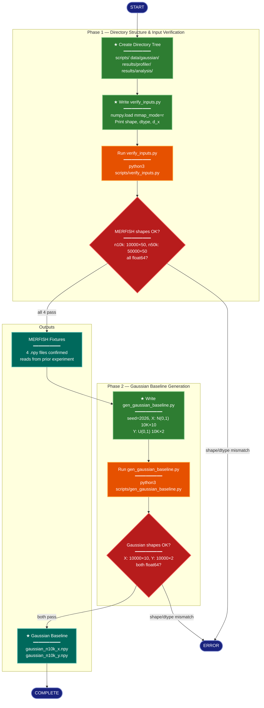

# Implementation Plan: TW-MERFISH Step-Timing — Setup, Verification, and Data Generation

## Summary

Create the experiment directory tree for `research/2026-04-08-tw-merfish-step-timing/`, write and run `verify_inputs.py` to confirm the four pre-existing MERFISH `.npy` fixtures have the expected shapes and dtypes, then write and run `gen_gaussian_baseline.py` to produce the fresh Gaussian baseline data (seed=2026, d_x=10, d_y=2, n=10K). This group produces all input data and directory scaffolding that subsequent profiling and analysis phases depend on.

## Proposed Architecture



**Color Legend:**
| Color | Category | Description |
|-------|----------|-------------|
| Dark Blue | Terminal | Start, complete, and error states |
| Green | New Component | New files/directories to create (★) |
| Orange | Handler | Script execution steps |
| Red | Detector | Validation gates (shape/dtype checks) |
| Dark Teal | Output | Verified data artifacts |

**Lens Used:** Process Flow — this plan is a sequential pipeline of create → verify → generate → verify, with validation gates between phases.

## Tests

These verification checks should fail before implementation and pass after:

### T1: Directory structure exists
```bash
# Should pass after Step 1
test -d research/2026-04-08-tw-merfish-step-timing/scripts && \
test -d research/2026-04-08-tw-merfish-step-timing/data/gaussian && \
test -d research/2026-04-08-tw-merfish-step-timing/results/profiler && \
test -d research/2026-04-08-tw-merfish-step-timing/results/analysis && \
echo "PASS" || echo "FAIL"
```

### T2: verify_inputs.py exists and runs without error
```bash
# Should pass after Step 3
cd research/2026-04-08-tw-merfish-step-timing
python3 scripts/verify_inputs.py
# Exit code 0 = PASS
```

### T3: verify_inputs.py confirms MERFISH fixture shapes
```bash
# Should pass after Step 3 — output must contain all four expected shapes
cd research/2026-04-08-tw-merfish-step-timing
python3 scripts/verify_inputs.py 2>&1 | grep -q "merfish_n10k_x.*10000.*50" && \
python3 scripts/verify_inputs.py 2>&1 | grep -q "merfish_n10k_y.*10000.*2" && \
python3 scripts/verify_inputs.py 2>&1 | grep -q "merfish_n50k_x.*50000.*50" && \
python3 scripts/verify_inputs.py 2>&1 | grep -q "merfish_n50k_y.*50000.*2" && \
echo "PASS" || echo "FAIL"
```

### T4: gen_gaussian_baseline.py exists and runs without error
```bash
# Should pass after Step 5
cd research/2026-04-08-tw-merfish-step-timing
python3 scripts/gen_gaussian_baseline.py
# Exit code 0 = PASS
```

### T5: Generated Gaussian files have correct shapes and dtype
```bash
# Should pass after Step 5 — inline numpy verification
cd research/2026-04-08-tw-merfish-step-timing
python3 -c "
import numpy as np, sys
x = np.load('data/gaussian/gaussian_n10k_x.npy')
y = np.load('data/gaussian/gaussian_n10k_y.npy')
ok = True
if x.shape != (10000, 10): print(f'FAIL x shape: {x.shape}'); ok = False
if y.shape != (10000, 2):  print(f'FAIL y shape: {y.shape}'); ok = False
if x.dtype != np.float64:  print(f'FAIL x dtype: {x.dtype}'); ok = False
if y.dtype != np.float64:  print(f'FAIL y dtype: {y.dtype}'); ok = False
if ok: print('PASS')
sys.exit(0 if ok else 1)
"
```

## Implementation Steps

### Step 1: Create the experiment directory tree

Create the full directory structure. No files yet, just directories.

```bash
mkdir -p research/2026-04-08-tw-merfish-step-timing/{scripts,data/gaussian,results/profiler,results/analysis}
```

**Satisfies:** T1
**Satisfies requirement:** PH1-1

### Step 2: Write `scripts/verify_inputs.py`

Create `research/2026-04-08-tw-merfish-step-timing/scripts/verify_inputs.py` with the following behavior:

- Resolves the MERFISH fixture directory relative to the script's own location: `../../2026-04-05-tw-perf-rerun-clean/data/merfish/`
- Defines the four expected fixtures with their expected shapes:

| File | Expected Shape |
|------|---------------|
| `merfish_n10k_x.npy` | (10000, 50) |
| `merfish_n10k_y.npy` | (10000, 2) |
| `merfish_n50k_x.npy` | (50000, 50) |
| `merfish_n50k_y.npy` | (50000, 2) |

- For each fixture, uses `numpy.load(path, mmap_mode='r')` to read just the header (memory-mapped, no full load)
- Prints: filename, shape, dtype, and confirms d_x value
- Asserts all dtypes are `float64`
- Asserts all shapes match expectations
- Exits with code 0 on success, code 1 on any mismatch
- Prints a summary line confirming d_x=50 for the X arrays

**Key design details:**
- Use `pathlib.Path` for path resolution (script-relative, so it works from any CWD within the experiment dir)
- No argparse needed — the fixture paths are fixed and well-known
- Pattern follows the inline verification from `research/2026-04-05-tw-perf-rerun-clean/scripts/prepare_data.sh` but as a standalone Python script

### Step 3: Run `verify_inputs.py` and confirm output

```bash
cd research/2026-04-08-tw-merfish-step-timing
python3 scripts/verify_inputs.py
```

Expected output — all four files report correct shapes, dtype float64, d_x=50 confirmed for X arrays. Exit code 0.

**Satisfies:** T2, T3
**Satisfies requirements:** PH1-2, PH1-3

### Step 4: Write `scripts/gen_gaussian_baseline.py`

Create `research/2026-04-08-tw-merfish-step-timing/scripts/gen_gaussian_baseline.py` with the following behavior:

- Uses `np.random.default_rng(seed=2026)`
- Generates X: `rng.standard_normal((10000, 10))` — float64 by default from `default_rng`
- Generates Y: `rng.uniform(0.0, 1.0, (10000, 2))` — float64 by default
- Saves X to `data/gaussian/gaussian_n10k_x.npy`
- Saves Y to `data/gaussian/gaussian_n10k_y.npy`
- Prints shapes and dtypes of generated arrays
- Resolves output path relative to the script's parent directory (i.e., `../data/gaussian/`)

**Key design details:**
- The experiment plan specifies `rng.uniform(0.0, 1.0, ...)` for Y, NOT `rng.standard_normal` as in the reference `gen_synthetic.py`. This is deliberate — follow the plan.
- No argparse needed — single fixed configuration (n=10000, d=10, seed=2026)
- No `.astype(np.float64)` cast needed — `default_rng` methods already return float64
- Follow the reference pattern from `gen_synthetic.py` for print formatting: `[gaussian] n=10000: x(10000, 10) y(10000, 2)`

### Step 5: Run `gen_gaussian_baseline.py` and verify output

```bash
cd research/2026-04-08-tw-merfish-step-timing
python3 scripts/gen_gaussian_baseline.py
```

Then verify the generated files:

```bash
python3 -c "
import numpy as np
x = np.load('data/gaussian/gaussian_n10k_x.npy')
y = np.load('data/gaussian/gaussian_n10k_y.npy')
assert x.shape == (10000, 10), f'x shape mismatch: {x.shape}'
assert y.shape == (10000, 2), f'y shape mismatch: {y.shape}'
assert x.dtype == np.float64, f'x dtype mismatch: {x.dtype}'
assert y.dtype == np.float64, f'y dtype mismatch: {y.dtype}'
print(f'OK: x{x.shape} {x.dtype}, y{y.shape} {y.dtype}')
"
```

**Satisfies:** T4, T5
**Satisfies requirements:** PH2-1, PH2-2, PH2-3

## Verification

After all steps are complete, run the full verification sequence from the project root:

```bash
# 1. Directory structure
ls -la research/2026-04-08-tw-merfish-step-timing/
ls -la research/2026-04-08-tw-merfish-step-timing/scripts/
ls -la research/2026-04-08-tw-merfish-step-timing/data/gaussian/
ls -la research/2026-04-08-tw-merfish-step-timing/results/profiler/
ls -la research/2026-04-08-tw-merfish-step-timing/results/analysis/

# 2. MERFISH verification
cd research/2026-04-08-tw-merfish-step-timing
python3 scripts/verify_inputs.py

# 3. Gaussian verification
python3 -c "
import numpy as np
files = {
    'data/gaussian/gaussian_n10k_x.npy': (10000, 10),
    'data/gaussian/gaussian_n10k_y.npy': (10000, 2),
}
for path, expected_shape in files.items():
    arr = np.load(path)
    assert arr.shape == expected_shape, f'{path}: shape {arr.shape} != {expected_shape}'
    assert arr.dtype == np.float64, f'{path}: dtype {arr.dtype} != float64'
    print(f'  OK: {path} {arr.shape} {arr.dtype}')
print('All verification checks passed.')
"
```

All commands must exit with code 0. Any assertion failure indicates an implementation defect.
