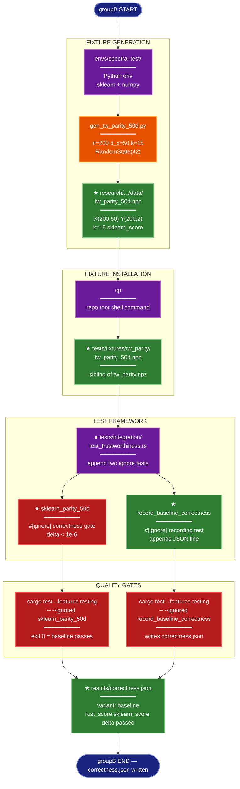

# Implementation Plan: groupB — Correctness Gate (x-dist SIMD)

## Summary

Generate the d_x=50 sklearn parity fixture, place it in the test fixture tree, and add two
`#[ignore]` integration tests to `tests/integration/test_trustworthiness.rs`:

- **`sklearn_parity_50d`** — the correctness gate: asserts `|rust_score - sklearn_score| < 1e-6`.
- **`record_baseline_correctness`** — the recording test: computes rust_score, reads sklearn_score
  from the fixture, and appends one JSON line to
  `research/2026-04-08-x-dist-simd-avx512/results/correctness.json`.

Running these two tests establishes the baseline before any SIMD kernel changes (groupD/groupE).

---

## Proposed Architecture



**Lens Used:** Development — groupB is entirely test infrastructure: fixture generation, fixture
installation, and integration test additions that form a correctness quality gate.

**Color Legend:**
| Color | Category | Description |
|-------|----------|-------------|
| Dark Blue | Terminal | groupB start and end |
| Purple | Modified (●) / Phase | Existing file extended; shell commands |
| Orange | Handler | Python script execution |
| Green | New (★) | New files and test functions |
| Red | Quality Gate | Test execution and correctness assertion |
| Dark Teal | Output | correctness.json result artifact |

---

## Tests

Both tests should fail before implementation (fixture missing → panic on `File::open`) and pass
after implementation.

**Test 1 — correctness gate:**
```bash
cargo test --features testing -- --ignored sklearn_parity_50d
```
Expected: exits 0. The test asserts `|rust_score - sklearn_score| < 1e-6`.  
Fails before: `tests/fixtures/tw_parity/tw_parity_50d.npz` does not exist.

**Test 2 — recording test:**
```bash
cargo test --features testing -- --ignored record_baseline_correctness
```
Expected: exits 0 and appends one JSON line to
`research/2026-04-08-x-dist-simd-avx512/results/correctness.json`.  
Fails before: same fixture missing, and `results/` directory may be empty.

---

## Implementation Steps

### Step 1: Generate the fixture

From the repository root:

```bash
source envs/spectral-test/bin/activate
python research/2026-04-08-x-dist-simd-avx512/scripts/gen_tw_parity_50d.py
```

Expected output (approximate):
```
sklearn trustworthiness(n=200, d=50, k=15) = 0.XXXXXXXXXXXXXXX
Wrote fixture: research/2026-04-08-x-dist-simd-avx512/data/tw_parity_50d.npz
```

Verify the file exists:
```bash
ls -lh research/2026-04-08-x-dist-simd-avx512/data/tw_parity_50d.npz
```

The fixture stores fields `X` (f64, shape 200×50), `Y` (f64, shape 200×2), `k` (int64 scalar),
`sklearn_score` (f64 scalar) — confirmed by reading `gen_tw_parity_50d.py` line 31-37 directly.

---

### Step 2: Copy fixture to the test fixture tree

```bash
cp research/2026-04-08-x-dist-simd-avx512/data/tw_parity_50d.npz \
   tests/fixtures/tw_parity/tw_parity_50d.npz
```

This makes `tw_parity_50d.npz` a sibling of the existing `tw_parity.npz` (the d_x=10 fixture).
No existing files are modified or removed.

---

### Step 3: Add `sklearn_parity_50d` test

Open `tests/integration/test_trustworthiness.rs` and append the following after the closing `}`
of the existing `sklearn_parity_synthetic` test. The loading pattern is identical — only the
fixture path and ignore message differ.

```rust
/// Sklearn parity at d_x=50: correctness gate for the x-dist SIMD experiment.
/// Requires: python research/2026-04-08-x-dist-simd-avx512/scripts/gen_tw_parity_50d.py
/// followed by: cp research/.../data/tw_parity_50d.npz tests/fixtures/tw_parity/tw_parity_50d.npz
#[test]
#[ignore = "requires fixture; run gen_tw_parity_50d.py then copy to tests/fixtures/tw_parity/"]
fn sklearn_parity_50d() {
    use ndarray_npy::NpzReader;
    use std::fs::File;

    let fixture_path = std::path::Path::new(env!("CARGO_MANIFEST_DIR"))
        .join("tests/fixtures/tw_parity/tw_parity_50d.npz");
    let f = File::open(&fixture_path)
        .unwrap_or_else(|e| panic!("could not open fixture {}: {e}", fixture_path.display()));
    let mut npz = NpzReader::new(f).expect("failed to read .npz");

    let x: ndarray::Array2<f64> = npz.by_name("X").expect("missing X in fixture");
    let y: ndarray::Array2<f64> = npz.by_name("Y").expect("missing Y in fixture");
    let k_arr: ndarray::Array0<i64> = npz.by_name("k").expect("missing k in fixture");
    let sklearn_score_arr: ndarray::Array0<f64> = npz
        .by_name("sklearn_score")
        .expect("missing sklearn_score in fixture");

    let k = *k_arr.as_slice_memory_order().unwrap().first().unwrap() as usize;
    let sklearn_score = *sklearn_score_arr
        .as_slice_memory_order()
        .unwrap()
        .first()
        .unwrap();

    assert!(
        sklearn_score > 0.0 && sklearn_score <= 1.0,
        "fixture sklearn_score out of plausible range: {sklearn_score} (possible corrupt fixture)"
    );

    let rust_score = trustworthiness(x.view(), y.view(), k);

    assert!(
        (rust_score - sklearn_score).abs() < 1e-6,
        "sklearn parity failed: rust={rust_score:.10}, sklearn={sklearn_score:.10}, diff={:.2e}",
        (rust_score - sklearn_score).abs()
    );
}
```

---

### Step 4: Add `record_baseline_correctness` test

Append immediately after the closing `}` of `sklearn_parity_50d`. This test loads the same
fixture, computes rust_score, and appends a single JSON line to `correctness.json`. It uses
`OpenOptions::append` so groupD and groupE can append their variant entries without overwriting
the baseline.

```rust
/// Records baseline correctness result to research/.../results/correctness.json.
/// Run after sklearn_parity_50d passes. Appends one newline-delimited JSON entry.
#[test]
#[ignore = "run after sklearn_parity_50d passes; writes to research/.../results/correctness.json"]
fn record_baseline_correctness() {
    use ndarray_npy::NpzReader;
    use std::fs::{File, OpenOptions};
    use std::io::Write;

    let fixture_path = std::path::Path::new(env!("CARGO_MANIFEST_DIR"))
        .join("tests/fixtures/tw_parity/tw_parity_50d.npz");
    let f = File::open(&fixture_path)
        .unwrap_or_else(|e| panic!("could not open fixture {}: {e}", fixture_path.display()));
    let mut npz = NpzReader::new(f).expect("failed to read .npz");

    let x: ndarray::Array2<f64> = npz.by_name("X").expect("missing X in fixture");
    let y: ndarray::Array2<f64> = npz.by_name("Y").expect("missing Y in fixture");
    let k_arr: ndarray::Array0<i64> = npz.by_name("k").expect("missing k in fixture");
    let sklearn_score_arr: ndarray::Array0<f64> = npz
        .by_name("sklearn_score")
        .expect("missing sklearn_score in fixture");

    let k = *k_arr.as_slice_memory_order().unwrap().first().unwrap() as usize;
    let sklearn_score = *sklearn_score_arr
        .as_slice_memory_order()
        .unwrap()
        .first()
        .unwrap();

    let rust_score = trustworthiness(x.view(), y.view(), k);
    let delta = (rust_score - sklearn_score).abs();
    let passed = delta < 1e-6;

    let record = format!(
        r#"{{"variant":"baseline","rust_score":{rust_score:.15},"sklearn_score":{sklearn_score:.15},"delta":{delta:.2e},"passed":{passed}}}"#
    );

    let out_path = std::path::Path::new(env!("CARGO_MANIFEST_DIR"))
        .join("research/2026-04-08-x-dist-simd-avx512/results/correctness.json");
    let mut out = OpenOptions::new()
        .create(true)
        .append(true)
        .open(&out_path)
        .unwrap_or_else(|e| panic!("cannot open {}: {e}", out_path.display()));
    writeln!(out, "{record}").expect("failed to write correctness record");

    println!("Recorded: {record}");
    assert!(passed, "baseline failed correctness gate: delta={delta:.2e}");
}
```

---

### Step 5: Run the correctness gate

```bash
cargo test --features testing -- --ignored sklearn_parity_50d
```

Expected: exits 0. The test output should show `test sklearn_parity_50d ... ok`.

---

### Step 6: Run the recording test

```bash
cargo test --features testing -- --ignored record_baseline_correctness
```

Expected: exits 0 and writes one line to
`research/2026-04-08-x-dist-simd-avx512/results/correctness.json`.

---

## Verification

```bash
# 1. Confirm fixture is in place
ls -lh tests/fixtures/tw_parity/tw_parity_50d.npz

# 2. Correctness gate passes
cargo test --features testing -- --ignored sklearn_parity_50d
# Expected: test sklearn_parity_50d ... ok

# 3. Recording test produces correctness.json
cargo test --features testing -- --ignored record_baseline_correctness
cat research/2026-04-08-x-dist-simd-avx512/results/correctness.json
# Expected: one JSON line, e.g.:
# {"variant":"baseline","rust_score":0.XXX,"sklearn_score":0.XXX,"delta":0.00e0,"passed":true}

# 4. Confirm "passed": true and delta < 1e-6
python3 -c "
import json, pathlib
line = pathlib.Path('research/2026-04-08-x-dist-simd-avx512/results/correctness.json').read_text().strip()
r = json.loads(line)
assert r['variant'] == 'baseline'
assert r['passed'] == True
assert r['delta'] < 1e-6
print('OK:', r)
"
```
