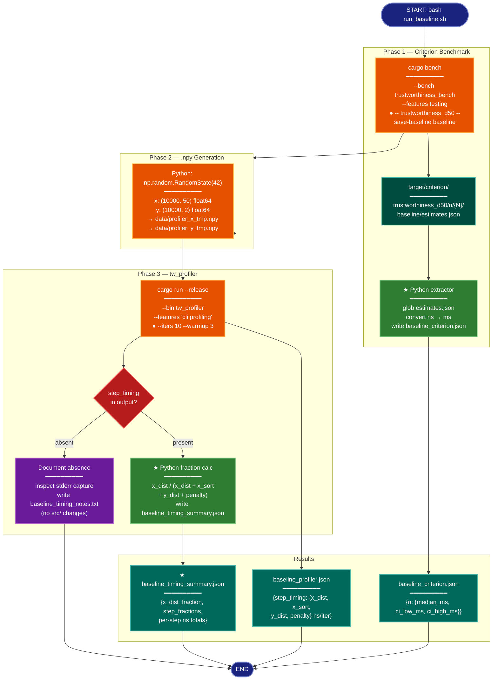

# Implementation Plan: GroupC — Baseline Measurement

## Summary

GroupC captures wall-clock and per-step timing for the unmodified `dist_sq_avx2` kernel at d_x=50. These numbers are the denominator for all speedup ratios in later groups.

The `run_baseline.sh` script from groupA already exists but has two divergences from the REQ spec:
1. It does not add `--save-baseline baseline` to the Criterion command, so no structured JSON estimates are produced.
2. It calls `tw_profiler` with `--iters 5 --warmup 2` instead of the required `--iters 10 --warmup 3`.
3. It produces only a plain-text `baseline_criterion.txt` rather than the required `baseline_criterion.json`.

The plan fixes these divergences (script changes only — `src/` is untouched), executes the script, then extracts the x_dist fraction from the profiler output into a summary JSON.

---

## Proposed Architecture



**Color Legend:**
| Color | Category | Description |
|-------|----------|-------------|
| Dark Blue | Terminal | Start and end points |
| Orange | Handler | Cargo/Python execution steps |
| Teal (dark) | State | Intermediate data on disk |
| Green (bright) | New Component | ★ New logic added in this group |
| Dark Teal | Output | Final result files |
| Red | Detector | Branching decision on step_timing presence |
| Purple | Phase | Diagnostic fallback path |

**Lens Used:** Process Flow — this group is a pure execution pipeline; the plan is entirely about runtime behavior (script → compiler → benchmark → profiler → data extraction) with one decision branch on whether profiling data is present.

---

## Tests

These assertions should fail before implementation (because the files don't exist yet) and pass after. Run them from the repo root after executing `run_baseline.sh`.

### T1 — baseline_criterion.json schema check
```python
# temp/verify_groupC.py — run from repo root after execution
import json, pathlib, sys

p = pathlib.Path("research/2026-04-08-x-dist-simd-avx512/results/baseline_criterion.json")
assert p.exists(), "baseline_criterion.json missing"
data = json.loads(p.read_text())
d50 = data["trustworthiness_d50"]
for n in ["1000", "5000", "10000", "50000"]:
    assert n in d50, f"missing n={n}"
    entry = d50[n]
    assert "median_ms" in entry and entry["median_ms"] > 0, f"n={n}: median_ms invalid"
    assert "ci_low_ms" in entry and "ci_high_ms" in entry, f"n={n}: CI fields missing"
    assert entry["ci_low_ms"] <= entry["median_ms"] <= entry["ci_high_ms"], f"n={n}: CI bounds inverted"
print("T1 PASS: baseline_criterion.json valid")
```

### T2 — baseline_profiler.json step_timing check
```python
p = pathlib.Path("research/2026-04-08-x-dist-simd-avx512/results/baseline_profiler.json")
assert p.exists(), "baseline_profiler.json missing"
data = json.loads(p.read_text())
assert "step_timing" in data and data["step_timing"], "step_timing absent"
for step in ["x_dist", "x_sort", "y_dist", "penalty"]:
    vals = data["step_timing"].get(step, [])
    assert len(vals) > 0, f"step_timing.{step} empty"
    assert all(v > 0 for v in vals), f"step_timing.{step} has non-positive values"
print("T2 PASS: baseline_profiler.json step_timing valid")
```

### T3 — baseline_timing_summary.json fraction check
```python
p = pathlib.Path("research/2026-04-08-x-dist-simd-avx512/results/baseline_timing_summary.json")
assert p.exists(), "baseline_timing_summary.json missing"
data = json.loads(p.read_text())
frac = data["x_dist_fraction"]
assert frac is not None and 0.0 < frac < 1.0, f"x_dist_fraction out of range: {frac}"
print(f"T3 PASS: x_dist fraction = {frac:.3f} ({frac*100:.1f}%)")
```

Run as: `python3 temp/verify_groupC.py` (save the three blocks together in one file).

---

## Implementation Steps

### Step 1 — Update run_baseline.sh (3 targeted edits)

File: `research/2026-04-08-x-dist-simd-avx512/scripts/run_baseline.sh`

**Edit 1:** Add `--save-baseline baseline` to the Criterion bench invocation.

Replace:
```bash
cargo bench --bench trustworthiness_bench --features testing \
  -- trustworthiness_d50 2>&1 | tee "${RESULTS}/baseline_criterion.txt"
```
With:
```bash
cargo bench --bench trustworthiness_bench --features testing \
  -- trustworthiness_d50 --save-baseline baseline 2>&1 | tee "${RESULTS}/baseline_criterion.txt"
```

**Edit 2:** Update profiler iteration counts (`--iters 5 --warmup 2` → `--iters 10 --warmup 3`).

Replace:
```bash
  --k 15 --iters 5 --warmup 2
```
With:
```bash
  --k 15 --iters 10 --warmup 3
```

**Edit 3:** Insert the Python Criterion-JSON extractor block immediately after the `cargo bench` section (before the `.npy` generation section). Add this block:

```bash
# ── 1b. Extract Criterion estimates into baseline_criterion.json ────────────────
echo "[run_baseline] Extracting Criterion baseline JSON..."
python3 - <<'PYEOF'
import json, pathlib, sys

criterion_base = pathlib.Path("target/criterion/trustworthiness_d50")
if not criterion_base.exists():
    print("ERROR: target/criterion/trustworthiness_d50 not found — did --save-baseline work?", file=sys.stderr)
    sys.exit(1)

results = {}
for est_file in sorted(criterion_base.glob("n/*/baseline/estimates.json")):
    n_str = est_file.parent.parent.name
    data = json.loads(est_file.read_text())
    # Criterion stores time in nanoseconds (float)
    median_ns = data["median"]["point_estimate"]
    ci_low_ns  = data["median"]["confidence_interval"]["lower_bound"]
    ci_high_ns = data["median"]["confidence_interval"]["upper_bound"]
    results[n_str] = {
        "median_ms": median_ns / 1e6,
        "ci_low_ms": ci_low_ns  / 1e6,
        "ci_high_ms": ci_high_ns / 1e6,
    }

if not results:
    print("ERROR: no n/*/baseline/estimates.json files found", file=sys.stderr)
    sys.exit(1)

out = pathlib.Path("research/2026-04-08-x-dist-simd-avx512/results/baseline_criterion.json")
out.write_text(json.dumps({"trustworthiness_d50": results}, indent=2))
print(f"[extractor] Wrote {out} ({len(results)} n-values: {sorted(int(k) for k in results)})")
PYEOF
```

**Edit 4:** Add the x_dist fraction computation block at the end of the script (before the final `echo "[run_baseline] Done."`):

```bash
# ── 4. Compute and record x_dist fraction of total profiled runtime ────────────
echo "[run_baseline] Computing x_dist fraction..."
python3 - <<'PYEOF'
import json, pathlib, sys

prof_file = pathlib.Path("research/2026-04-08-x-dist-simd-avx512/results/baseline_profiler.json")
if not prof_file.exists():
    print("ERROR: baseline_profiler.json missing", file=sys.stderr)
    sys.exit(1)

prof = json.loads(prof_file.read_text())
st = prof.get("step_timing", {})

if not st:
    # step_timing absent — profiling feature may not have emitted to stderr
    # Inspect baseline_stderr.txt for [timing:x_dist] lines
    stderr_file = pathlib.Path("research/2026-04-08-x-dist-simd-avx512/results/baseline_stderr.txt")
    if stderr_file.exists():
        content = stderr_file.read_text()
        timing_lines = [l for l in content.splitlines() if l.startswith("[timing:")]
        note = (
            f"step_timing absent from baseline_profiler.json.\n"
            f"Found {len(timing_lines)} [timing:*] lines in baseline_stderr.txt.\n"
            f"First 10:\n" + "\n".join(timing_lines[:10])
        )
    else:
        note = "step_timing absent and baseline_stderr.txt does not exist. --stderr-capture may have failed."
    notes_file = pathlib.Path("research/2026-04-08-x-dist-simd-avx512/results/baseline_timing_notes.txt")
    notes_file.write_text(note)
    print(f"[fraction] WARNING: step_timing absent. Wrote diagnostic to {notes_file}")
    sys.exit(0)

def total(key):
    return sum(st.get(key, [0]))

x_dist  = total("x_dist")
x_sort  = total("x_sort")
y_dist  = total("y_dist")
penalty = total("penalty")
grand   = x_dist + x_sort + y_dist + penalty

def frac(ns):
    return ns / grand if grand > 0 else None

summary = {
    "x_dist_ns_total":  x_dist,
    "x_sort_ns_total":  x_sort,
    "y_dist_ns_total":  y_dist,
    "penalty_ns_total": penalty,
    "x_dist_fraction":  frac(x_dist),
    "step_fractions": {
        "x_dist":  frac(x_dist),
        "x_sort":  frac(x_sort),
        "y_dist":  frac(y_dist),
        "penalty": frac(penalty),
    },
}

out = pathlib.Path("research/2026-04-08-x-dist-simd-avx512/results/baseline_timing_summary.json")
out.write_text(json.dumps(summary, indent=2))
print(f"[fraction] x_dist fraction: {frac(x_dist):.3f} ({frac(x_dist)*100:.1f}%)")
print(f"[fraction] Wrote {out}")
PYEOF
```

### Step 2 — Create verification script

Write `temp/verify_groupC.py` with the three test blocks from the Tests section above (T1, T2, T3 combined into one file). This is a temporary working file for manual verification.

### Step 3 — Execute run_baseline.sh

From repo root:
```bash
bash research/2026-04-08-x-dist-simd-avx512/scripts/run_baseline.sh
```

Expected duration: Criterion at n=50000 d_x=50, sample_size=10 runs ~30–90 min total. The profiler at n=10000, iters=10, warmup=3 adds ~2–5 min.

### Step 4 — Handle step_timing absence (if applicable)

If `step_timing` is absent from `baseline_profiler.json` after the run:
- Read `results/baseline_stderr.txt` for `[timing:x_dist]` lines (the Python block in Step 1 Edit 4 already does this and writes `baseline_timing_notes.txt`)
- Do NOT modify `src/metrics.rs` — that is out of scope for this group
- Verify the profiler was compiled with `--features "cli profiling"` by checking `baseline_stderr.txt` for any output; if the file is empty, the `dup2` stderr capture failed

  If `baseline_stderr.txt` is empty but the profiler ran successfully, the profiling feature gates in `src/metrics.rs` are already confirmed to have the x_dist statics. The most likely cause is that `--stderr-capture` via `dup2` redirected the fd before the Rust process could write. Document this in `baseline_timing_notes.txt` and note that `step_timing` cannot be populated without a working stderr capture.

### Step 5 — Run verification

```bash
python3 temp/verify_groupC.py
```

All three tests (T1, T2, T3) must pass. If T2 or T3 fail due to absent `step_timing`, the fallback path (Step 4) produces `baseline_timing_notes.txt` instead, and T2/T3 are waived with a documented explanation.

---

## Verification

After successful execution, the following files must exist in `research/2026-04-08-x-dist-simd-avx512/results/`:

| File | Required | Content |
|------|----------|---------|
| `baseline_criterion.json` | Yes | `{"trustworthiness_d50": {"1000": {median_ms, ci_low_ms, ci_high_ms}, ...}}` for n ∈ {1000, 5000, 10000, 50000} |
| `baseline_criterion.txt` | Yes | Raw Criterion stdout/stderr (pre-existing tee output) |
| `baseline_profiler.json` | Yes | `{n, k, iters, mean_s, std_s, warmup, score, step_timing}` |
| `baseline_stderr.txt` | Yes | Raw stderr from tw_profiler (captured via dup2) |
| `baseline_timing_summary.json` | Yes (if step_timing present) | `{x_dist_fraction, step_fractions, per-step ns totals}` |
| `baseline_timing_notes.txt` | Yes (if step_timing absent) | Diagnostic text explaining absence |

Run `python3 temp/verify_groupC.py` to assert T1–T3 automatically.

The `x_dist_fraction` value from `baseline_timing_summary.json` is the key metric for this group — it is the denominator denominator for improvement ratios in groupD/E.
