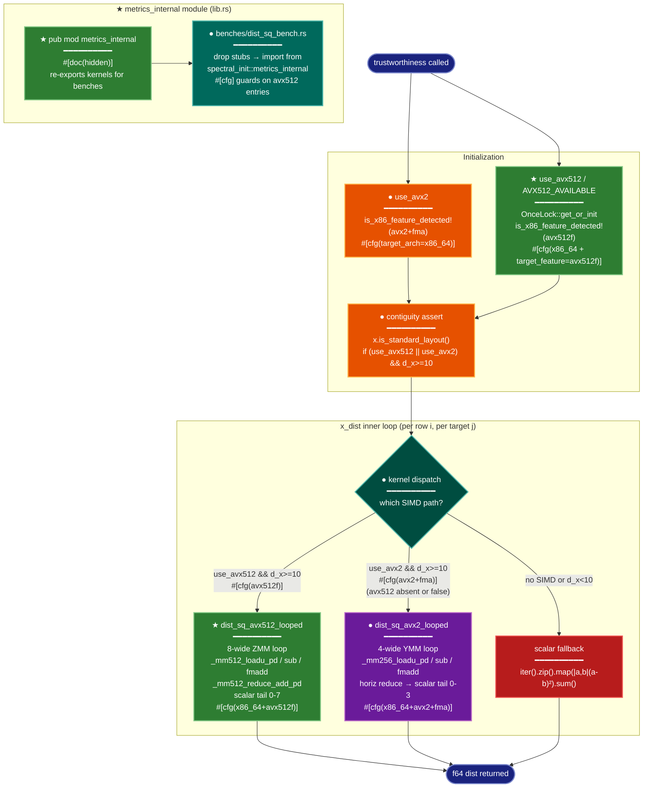

# Implementation Plan: groupD — SIMD Kernel Implementation (AVX2 Looped + AVX-512)

## Summary

Replace the two-fixed-load `dist_sq_avx2` with a properly looped AVX2 kernel (`dist_sq_avx2_looped`)
covering all `d_x` elements, add a full-width AVX-512 kernel (`dist_sq_avx512_looped`), wire both
into a three-level runtime dispatch chain (avx512f → avx2+fma → scalar) inside `trustworthiness`,
expose both kernels publicly through a `metrics_internal` module so `benches/dist_sq_bench.rs` can
import them, update the bench to drop its stubs, and append correctness records for both new variants.

All changes go in `src/metrics.rs`, `src/lib.rs`, `benches/dist_sq_bench.rs`, and
`tests/integration/test_trustworthiness.rs`. No other files change.

---

## Proposed Architecture



**Lens Used:** Process Flow — the dominant concern is the three-way runtime dispatch chain
(avx512f → avx2+fma → scalar) and the control flow through kernel selection on every inner-loop iteration.

**Color Legend:**
| Color | Category | Description |
|-------|----------|-------------|
| Dark Blue | Terminal | Start and end states |
| Orange | Handler | Existing detection and assert logic (modified) |
| Green | New Component | New kernel, OnceLock, and metrics_internal module |
| Teal | State | Dispatch decision diamond |
| Purple | Phase | Existing AVX2 call path (modified name) |
| Red | Detector | Scalar fallback |
| Dark Teal | Output | Updated bench harness |

---

## Tests

Write these tests **before** touching `src/metrics.rs`. They define "done".

### Tests that must pass after Step 2 (AVX2 looped)

**In `src/metrics.rs` (unit tests block):**

```rust
// Replace the existing t_tw_06_avx2_kernel_matches_scalar test body.
// It currently calls super::dist_sq_avx2 — after rename it must call
// super::dist_sq_avx2_looped and cover lengths NOT divisible by 4.
#[cfg(all(target_arch = "x86_64", target_feature = "avx2", target_feature = "fma"))]
#[test]
fn t_tw_06_avx2_looped_matches_scalar() {
    use rand::{Rng, SeedableRng};
    let mut rng = rand::rngs::SmallRng::seed_from_u64(42);
    // Include lengths that hit the scalar tail: 10 (tail=2), 13 (tail=1), 50 (tail=2), 100 (tail=0)
    for len in [10, 13, 16, 50, 100] {
        let a: Vec<f64> = (0..len).map(|_| rng.random::<f64>()).collect();
        let b: Vec<f64> = (0..len).map(|_| rng.random::<f64>()).collect();
        let scalar: f64 = a.iter().zip(b.iter()).map(|(&x, &y)| (x - y) * (x - y)).sum();
        let avx2 = unsafe { super::dist_sq_avx2_looped(&a, &b) };
        assert!(
            (avx2 - scalar).abs() < 1e-10,
            "dist_sq_avx2_looped mismatch at len={len}: avx2={avx2}, scalar={scalar}"
        );
    }
}
```

**In `tests/integration/test_trustworthiness.rs`:**
Add `record_avx2_looped_correctness` after the existing `record_baseline_correctness`:
```rust
#[test]
#[ignore = "run after sklearn_parity_50d passes with avx2_looped kernel; writes correctness.json"]
fn record_avx2_looped_correctness() {
    // Same fixture load as record_baseline_correctness.
    // Writes: {"variant":"avx2_looped", "rust_score":..., "sklearn_score":..., "delta":..., "passed":...}
    // to research/2026-04-08-x-dist-simd-avx512/results/correctness.json
}
```

### Tests that must pass after Step 3 (AVX-512)

**In `src/metrics.rs`:**
```rust
#[cfg(all(target_arch = "x86_64", target_feature = "avx512f"))]
#[test]
fn t_tw_11_avx512_looped_matches_scalar() {
    use rand::{Rng, SeedableRng};
    let mut rng = rand::rngs::SmallRng::seed_from_u64(99);
    // Lengths with varied tails: 10 (tail=2), 16 (tail=0), 50 (tail=2), 100 (tail=4)
    for len in [10, 16, 50, 100] {
        let a: Vec<f64> = (0..len).map(|_| rng.random::<f64>()).collect();
        let b: Vec<f64> = (0..len).map(|_| rng.random::<f64>()).collect();
        let scalar: f64 = a.iter().zip(b.iter()).map(|(&x, &y)| (x - y) * (x - y)).sum();
        let avx512 = unsafe { super::dist_sq_avx512_looped(&a, &b) };
        assert!(
            (avx512 - scalar).abs() < 1e-10,
            "dist_sq_avx512_looped mismatch at len={len}: avx512={avx512}, scalar={scalar}"
        );
    }
}
```

**In `tests/integration/test_trustworthiness.rs`:**
Add `record_avx512_looped_correctness` mirroring `record_avx2_looped_correctness` with `variant: "avx512_looped"`.

### Compile check (Step 4/5)
`cargo bench --bench dist_sq_bench --no-run` must succeed.

---

## Implementation Steps

### Step 0 — Branch setup

If not already on `exp/x-dist-simd-avx512`, create and switch to it:

```bash
git checkout -b exp/x-dist-simd-avx512
```

---

### Step 1 — Write the new tests (before touching `src/metrics.rs`)

Add to the `#[cfg(test)]` block in `src/metrics.rs`:
- Rename the existing `t_tw_06_avx2_kernel_matches_scalar` to `t_tw_06_avx2_looped_matches_scalar`.
  - Update the function call from `super::dist_sq_avx2` to `super::dist_sq_avx2_looped`.
  - Expand the `len` array to `[10, 13, 16, 50, 100]` to cover tail lengths 0, 1, 2.

Add `t_tw_11_avx512_looped_matches_scalar` (shown above) under its cfg guard.

Add `record_avx2_looped_correctness` and `record_avx512_looped_correctness` to
`tests/integration/test_trustworthiness.rs` (copy structure of `record_baseline_correctness`,
changing the `variant` field).

At this point, `cargo test --features testing` will compile-fail because `dist_sq_avx2_looped`
doesn't exist yet. That's expected.

---

### Step 2 — Replace `dist_sq_avx2` with `dist_sq_avx2_looped` in `src/metrics.rs`

**2a. Replace the function body (lines 401–437 approx):**

Remove `dist_sq_avx2` entirely. Add `dist_sq_avx2_looped`:

```rust
// ─── AVX2+FMA squared-distance kernel (fully looped) ─────────────────────────

/// Squared Euclidean distance using AVX2+FMA intrinsics, looped over all elements.
///
/// 4-wide YMM loop with FMA accumulation, horizontal reduce, scalar tail 0-3.
///
/// # Safety
/// Both slices must have the same length (caller ensures `d_x >= 10` at the dispatch site).
#[cfg(all(
    target_arch = "x86_64",
    target_feature = "avx2",
    target_feature = "fma"
))]
#[target_feature(enable = "avx2,fma")]
pub unsafe fn dist_sq_avx2_looped(xi: &[f64], xj: &[f64]) -> f64 {
    use std::arch::x86_64::*;
    let n = xi.len().min(xj.len());
    let mut acc = _mm256_setzero_pd();
    let mut k = 0usize;
    while k + 4 <= n {
        let a = _mm256_loadu_pd(xi.as_ptr().add(k));
        let b = _mm256_loadu_pd(xj.as_ptr().add(k));
        let d = _mm256_sub_pd(a, b);
        acc = _mm256_fmadd_pd(d, d, acc);
        k += 4;
    }
    // Horizontal reduce: sum 4 lanes
    let lo = _mm256_castpd256_pd128(acc);
    let hi = _mm256_extractf128_pd(acc, 1);
    let sum128 = _mm_add_pd(lo, hi);
    let halved = _mm_hadd_pd(sum128, sum128);
    let mut result = _mm_cvtsd_f64(halved);
    // Scalar tail (0–3 remaining elements)
    while k < n {
        let d = xi[k] - xj[k];
        result += d * d;
        k += 1;
    }
    result
}
```

**2b. Update call site in the `x_dist` inner loop (~line 601):**

Change `unsafe { dist_sq_avx2(si, sj) }` → `unsafe { dist_sq_avx2_looped(si, sj) }`.

No other changes to the dispatch logic yet (the cfg guards stay the same for AVX2).

**2c. Run first correctness gate:**
```bash
cargo test --features testing
cargo test --features testing -- --ignored sklearn_parity_50d
```
Both must pass. The AVX2 looped kernel now handles the d_x=50 fixture correctly.

---

### Step 3 — Add `dist_sq_avx512_looped` to `src/metrics.rs`

**3a. Add function** (place it immediately after `dist_sq_avx2_looped`):

```rust
// ─── AVX-512 squared-distance kernel (fully looped) ──────────────────────────

/// Squared Euclidean distance using AVX-512 intrinsics, looped over all elements.
///
/// 8-wide ZMM loop with FMA accumulation, `_mm512_reduce_add_pd`, scalar tail 0-7.
///
/// # Safety
/// Both slices must have the same length.
#[cfg(all(target_arch = "x86_64", target_feature = "avx512f"))]
#[target_feature(enable = "avx512f")]
pub unsafe fn dist_sq_avx512_looped(xi: &[f64], xj: &[f64]) -> f64 {
    use std::arch::x86_64::*;
    let n = xi.len().min(xj.len());
    let mut acc = _mm512_setzero_pd();
    let mut k = 0usize;
    while k + 8 <= n {
        let a = _mm512_loadu_pd(xi.as_ptr().add(k));
        let b = _mm512_loadu_pd(xj.as_ptr().add(k));
        let d = _mm512_sub_pd(a, b);
        acc = _mm512_fmadd_pd(d, d, acc);
        k += 8;
    }
    let mut result = _mm512_reduce_add_pd(acc);
    // Scalar tail (0–7 remaining elements)
    while k < n {
        let d = xi[k] - xj[k];
        result += d * d;
        k += 1;
    }
    result
}
```

**3b. Add `AVX512_AVAILABLE` static** (place near the top of `metrics.rs`, after the `use` block):

```rust
#[cfg(all(target_arch = "x86_64", target_feature = "avx512f"))]
static AVX512_AVAILABLE: std::sync::OnceLock<bool> = std::sync::OnceLock::new();
```

**3c. Add `use_avx512` detection in `trustworthiness`** (after the existing `use_avx2` detection):

```rust
#[cfg(all(target_arch = "x86_64", target_feature = "avx512f"))]
let use_avx512 = *AVX512_AVAILABLE.get_or_init(|| is_x86_feature_detected!("avx512f"));
#[cfg(not(all(target_arch = "x86_64", target_feature = "avx512f")))]
let use_avx512 = false;
```

**3d. Update the contiguity assert** to cover the AVX-512 path as well:

```rust
#[cfg(any(
    all(target_arch = "x86_64", target_feature = "avx2", target_feature = "fma"),
    all(target_arch = "x86_64", target_feature = "avx512f"),
))]
if (use_avx2 || use_avx512) && d_x >= 10 {
    assert!(
        x.is_standard_layout(),
        "trustworthiness: x must be in C-contiguous (standard) layout for SIMD dispatch"
    );
}
```

**3e. Restructure the `x_dist` dispatch block** as a closure capturing `use_avx512`, `use_avx2`, and `d_x`:

Replace the current block-expression dispatch (lines ~593–624) with an `#[inline(always)]` closure:

```rust
let compute_x_dist = |xi: ndarray::ArrayView1<f64>, xj: ndarray::ArrayView1<f64>| -> f64 {
    #[cfg(all(target_arch = "x86_64", target_feature = "avx512f"))]
    if use_avx512 && d_x >= 10 {
        let si = xi.as_slice().expect("x row must be contiguous");
        let sj = xj.as_slice().expect("x row must be contiguous");
        // SAFETY: runtime check (use_avx512) + d_x>=10 guard + contiguity assert above.
        return unsafe { dist_sq_avx512_looped(si, sj) };
    }
    #[cfg(all(target_arch = "x86_64", target_feature = "avx2", target_feature = "fma"))]
    if use_avx2 && d_x >= 10 {
        let si = xi.as_slice().expect("x row must be contiguous");
        let sj = xj.as_slice().expect("x row must be contiguous");
        // SAFETY: runtime check (use_avx2) + d_x>=10 guard + contiguity assert above.
        return unsafe { dist_sq_avx2_looped(si, sj) };
    }
    xi.iter().zip(xj.iter()).map(|(&a, &b)| (a - b) * (a - b)).sum()
};
```

Then in the `for j in 0..n` loop, replace the `dist_x[j] = { ... }` block with:
```rust
dist_x[j] = compute_x_dist(xi, x.row(j));
```

This eliminates the nested cfg blocks while preserving all compile-time and runtime guards.

---

### Step 4 — Expose kernels through `metrics_internal` in `src/lib.rs`

Add the following after the existing `pub mod metrics;` declaration:

```rust
/// Internal kernel exports for microbenchmarks. Not part of the stable public API.
#[doc(hidden)]
pub mod metrics_internal {
    #[cfg(all(
        target_arch = "x86_64",
        target_feature = "avx2",
        target_feature = "fma"
    ))]
    pub use crate::metrics::dist_sq_avx2_looped;

    #[cfg(all(target_arch = "x86_64", target_feature = "avx512f"))]
    pub use crate::metrics::dist_sq_avx512_looped;
}
```

---

### Step 5 — Update `benches/dist_sq_bench.rs` to use real kernels

Replace the stub section with real imports:

```rust
// ─── Kernel imports (groupD: real kernels, not stubs) ─────────────────────────

#[cfg(all(target_arch = "x86_64", target_feature = "avx2", target_feature = "fma"))]
use spectral_init::metrics_internal::dist_sq_avx2_looped;

#[cfg(all(target_arch = "x86_64", target_feature = "avx512f"))]
use spectral_init::metrics_internal::dist_sq_avx512_looped;
```

Remove the `dist_sq_avx2_looped_stub` and `dist_sq_avx512_looped_stub` functions.

Update the benchmark group to use real kernels with cfg guards:

```rust
fn bench_dist_sq_kernels(c: &mut Criterion) {
    let mut group = c.benchmark_group("dist_sq_kernels");

    for &d in &[10_usize, 50] {
        let (xi, xj) = make_vectors(d, 42);

        #[cfg(all(target_arch = "x86_64", target_feature = "avx2", target_feature = "fma"))]
        group.bench_with_input(
            BenchmarkId::new("avx2_looped", d),
            &d,
            |b, _| b.iter(|| unsafe {
                dist_sq_avx2_looped(black_box(&xi), black_box(&xj))
            }),
        );

        #[cfg(all(target_arch = "x86_64", target_feature = "avx512f"))]
        group.bench_with_input(
            BenchmarkId::new("avx512_looped", d),
            &d,
            |b, _| b.iter(|| unsafe {
                dist_sq_avx512_looped(black_box(&xi), black_box(&xj))
            }),
        );

        // Scalar baseline for comparison
        group.bench_with_input(
            BenchmarkId::new("scalar", d),
            &d,
            |b, _| b.iter(|| {
                black_box(&xi).iter().zip(black_box(&xj).iter())
                    .map(|(a, b)| (a - b) * (a - b)).sum::<f64>()
            }),
        );
    }

    group.finish();
}
```

> **Note:** On hosts without AVX-512 compile-time support (`target_feature = "avx512f"` absent),
> the `avx512_looped` bench entry simply doesn't compile in — the group runs only `avx2_looped`
> and `scalar`. This is correct per REQ-AVX512-003's `#[cfg]` guard requirement.

---

### Step 6 — Record correctness entries

**6a. AVX2 looped (REQ-AVX2-004):**
```bash
cargo test --features testing -- --ignored sklearn_parity_50d
cargo test --features testing -- --ignored record_avx2_looped_correctness
```

This appends `{"variant":"avx2_looped",...}` to `research/2026-04-08-x-dist-simd-avx512/results/correctness.json`.

**6b. AVX-512 looped (REQ-AVX512-004):**
```bash
cargo test --features testing -- --ignored sklearn_parity_50d
cargo test --features testing -- --ignored record_avx512_looped_correctness
```

This appends `{"variant":"avx512_looped",...}` to `correctness.json`. Only meaningful on a host
with `avx512f` compile support. If the host does not have it, skip this step — the cfg guard
makes the dispatch branch unreachable at compile time.

---

## Verification

Run in order:

```bash
# 1. All unit tests pass (includes updated t_tw_06 and new t_tw_11)
cargo test --features testing

# 2. AVX2 parity gate (d_x=50 fixture, sklearn comparison)
cargo test --features testing -- --ignored sklearn_parity_50d

# 3. Record avx2_looped correctness entry
cargo test --features testing -- --ignored record_avx2_looped_correctness

# 4. Microbench compile check (do NOT run the full bench — groupE)
cargo bench --bench dist_sq_bench --no-run

# 5. (If avx512f compile support available) AVX-512 correctness
cargo test --features testing -- --ignored record_avx512_looped_correctness
```

**Expected `correctness.json` after groupD:**
```jsonl
{"variant":"baseline","rust_score":0.515224105461394,"sklearn_score":0.515224105461394,"delta":0.00e0,"passed":true}
{"variant":"avx2_looped","rust_score":<same>,"sklearn_score":<same>,"delta":0.00e0,"passed":true}
{"variant":"avx512_looped","rust_score":<same>,"sklearn_score":<same>,"delta":0.00e0,"passed":true}
```

**Implementation notes:**
- `_mm512_fmadd_pd` is available in stable Rust via `std::arch::x86_64` when compiling with
  `target_feature = "avx512f"`. No new crate dependencies.
- MSRV is 1.85 — `std::sync::OnceLock` has been stable since 1.70.
- `use_avx512 = false` on non-avx512f builds is a dead variable, but it's used inside a `#[cfg]`
  closure branch so the compiler will not warn about it. If a lint fires, suppress with
  `let _use_avx512 = false;` only if needed.
- The `compute_x_dist` closure captures `use_avx2`, `use_avx512`, and `d_x` by copy (all `bool`/`usize`).
  Rayon's `into_par_iter` requires the closure to be `Send`; copying primitives is fine.
