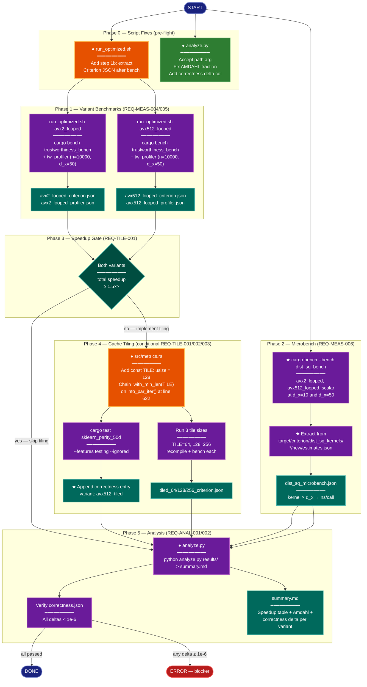

# Implementation Plan: groupE — Optimized Measurement, Tiling & Analysis

## Summary

Run Criterion + profiler benchmarks for the two SIMD variants (`avx2_looped`,
`avx512_looped`), extract microbench results for the `dist_sq_bench` harness, evaluate
the 1.5× speedup gate, conditionally implement cache tiling in `src/metrics.rs`, update
and run `analyze.py` to produce `summary.md`. All file outputs are written to
`research/2026-04-08-x-dist-simd-avx512/results/`.

**State entering this task:**
- Both SIMD kernels are implemented and correctness-verified (groupD done).
- `correctness.json` has passing entries for `baseline`, `avx2_looped`, `avx512_looped`.
- `baseline_criterion.json`, `baseline_profiler.json`, `baseline_timing_summary.json` all exist.
- `run_optimized.sh` runs Criterion + tw_profiler but is missing the JSON-extraction step
  that `run_baseline.sh` has (step 1b). This must be added before running the script.
- `analyze.py` hardcodes `AMDAHL_XDIST_FRACTION = 0.589` (stale; actual is 0.6891 from
  `baseline_timing_summary.json`) and does not accept a path argument.

---

## Proposed Architecture



**Lens Used:** Process Flow — the plan is a multi-phase execution pipeline with a binary
gate, a conditional implementation branch, and explicit terminal states (DONE / ERROR).

**Color Legend:**
| Color | Category | Description |
|-------|----------|-------------|
| Dark Blue | Terminal | START, DONE, ERROR nodes |
| Orange | Handler | Script/source modifications |
| Purple | Phase | Execution steps (bench runs, analysis) |
| Teal | State | Decision gate (speedup threshold) |
| Dark Green | New Component | New scripts/extractions (★) |
| Dark Teal | Output | Result files written to `results/` |
| Red | Detector | Validation/failure state |

---

## Tests

These assertions should pass after implementation:

1. `results/avx2_looped_criterion.json` exists and contains `trustworthiness_d50["10000"]["median_ms"]`.
2. `results/avx2_looped_profiler.json` exists and contains `step_timing.x_dist` array.
3. `results/avx512_looped_criterion.json` exists and contains `trustworthiness_d50["10000"]["median_ms"]`.
4. `results/avx512_looped_profiler.json` exists and contains `step_timing.x_dist` array.
5. `results/dist_sq_microbench.json` exists; it is a JSON array with entries for
   `avx2_looped/10`, `avx2_looped/50`, `avx512_looped/10`, `avx512_looped/50`,
   `scalar/10`, `scalar/50` (six entries minimum); each has `ns_per_call > 0`.
6. `results/summary.md` exists and contains a Markdown table row for each benchmarked
   variant with non-null speedup values.
7. Every entry in `results/correctness.json` has `"passed": true` and `delta < 1e-6`.
8. If tiling was triggered: `results/tiled_64_criterion.json`, `results/tiled_128_criterion.json`,
   `results/tiled_256_criterion.json` all exist; `correctness.json` contains an entry with
   `variant: "avx512_tiled"` and `passed: true`.

---

## Implementation Steps

### Step 1 — Fix `run_optimized.sh`: add Criterion JSON extraction

`run_baseline.sh` has a step 1b that parses `target/criterion/trustworthiness_d50/n/*/baseline/estimates.json`
and writes `baseline_criterion.json`. The optimized script is missing the equivalent step.

Edit `research/2026-04-08-x-dist-simd-avx512/scripts/run_optimized.sh`. After the existing
Criterion bench block (after the `tee` line), insert a new step 1b:

```bash
# ── 1b. Extract Criterion estimates into ${VARIANT}_criterion.json ──────────────
echo "[run_optimized:${VARIANT}] Extracting Criterion JSON..."
python3 - <<'PYEOF'
import json, os, pathlib, sys

variant = os.environ["VARIANT"]
criterion_base = pathlib.Path("target/criterion/trustworthiness_d50")
if not criterion_base.exists():
    print(f"ERROR: {criterion_base} not found", file=sys.stderr)
    sys.exit(1)

results = {}
for est_file in sorted(criterion_base.glob("n/*/new/estimates.json")):
    n_str = est_file.parent.parent.name
    data = json.loads(est_file.read_text())
    median_ns  = data["median"]["point_estimate"]
    ci_low_ns  = data["median"]["confidence_interval"]["lower_bound"]
    ci_high_ns = data["median"]["confidence_interval"]["upper_bound"]
    results[n_str] = {
        "median_ms":  median_ns  / 1e6,
        "ci_low_ms":  ci_low_ns  / 1e6,
        "ci_high_ms": ci_high_ns / 1e6,
    }

if not results:
    print("ERROR: no n/*/new/estimates.json files found", file=sys.stderr)
    sys.exit(1)

out = pathlib.Path(f"research/2026-04-08-x-dist-simd-avx512/results/{variant}_criterion.json")
out.write_text(json.dumps({"trustworthiness_d50": results}, indent=2))
print(f"[extractor] Wrote {out} ({len(results)} n-values)")
PYEOF
```

Pass `VARIANT` via the environment by adding `export VARIANT="${VARIANT}"` right before
this block (the shell variable is already set at the top of the script as
`VARIANT="${1:?...}"` but the heredoc subshell needs it exported).

### Step 2 — Fix `analyze.py`: path argument + correct Amdahl fraction + correctness delta

Edit `research/2026-04-08-x-dist-simd-avx512/scripts/analyze.py`:

**2a. Accept path argument:**
Replace the module-level `RESULTS` line:
```python
RESULTS = pathlib.Path(__file__).parents[1] / "results"
```
with:
```python
def _resolve_results(argv: list[str]) -> pathlib.Path:
    if len(argv) > 1:
        return pathlib.Path(argv[1]).resolve()
    return pathlib.Path(__file__).parents[1] / "results"
```
and call it in `main()`:
```python
RESULTS = _resolve_results(sys.argv)
```
(Remove the module-level `RESULTS` assignment; use the local name inside `main()`.)

**2b. Load actual x_dist fraction from `baseline_timing_summary.json`:**
Inside `main()`, after resolving `RESULTS`, add:
```python
timing_summary = RESULTS / "baseline_timing_summary.json"
if timing_summary.exists():
    ts = json.loads(timing_summary.read_text())
    xdist_fraction = ts.get("x_dist_fraction", AMDAHL_XDIST_FRACTION)
else:
    xdist_fraction = AMDAHL_XDIST_FRACTION
```
Replace all uses of the module-level `AMDAHL_XDIST_FRACTION` constant with the local
`xdist_fraction` variable in the `amdahl()` call.

**2c. Add correctness delta column:**
Parse `correctness.json` (NDJSON format — one JSON object per line) and build a dict
`{variant: delta}`. The file path is `RESULTS / "correctness.json"`. Add a helper:
```python
def load_correctness(results: pathlib.Path) -> dict[str, float | None]:
    path = results / "correctness.json"
    if not path.exists():
        return {}
    out = {}
    for line in path.read_text().splitlines():
        line = line.strip()
        if not line:
            continue
        entry = json.loads(line)
        out[entry["variant"]] = entry.get("delta")
    return out
```
Call this in `main()` and extend the Markdown table with a `correctness delta` column.

**2d. Prefer `{v}_criterion.json` if present, fall back to `.txt`:**
Update `extract_criterion_median_ms` (or add a new wrapper) that first tries
`RESULTS / f"{variant}_criterion.json"` (structured format, same as
`baseline_criterion.json`): read `data["trustworthiness_d50"]["10000"]["median_ms"]`.
Fall back to the existing `{v}_criterion.txt` regex parse if the JSON is absent.

**2e. Handle `baseline` in variant detection:**
The current code already skips `baseline` when globbing `*_profiler.json` — no change.

### Step 3 — Run variant benchmarks (REQ-MEAS-004, REQ-MEAS-005)

Run from repository root:

```bash
bash research/2026-04-08-x-dist-simd-avx512/scripts/run_optimized.sh avx2_looped
bash research/2026-04-08-x-dist-simd-avx512/scripts/run_optimized.sh avx512_looped
```

Each invocation writes:
- `results/{variant}_criterion.txt` — raw Criterion text output
- `results/{variant}_criterion.json` — structured median_ms per n (from step 1b)
- `results/{variant}_profiler.json` — tw_profiler step timings
- `results/{variant}_stderr.txt` — profiler stderr

Run them sequentially (not in parallel) to avoid Criterion's file-lock conflicts on
`target/criterion/`.

### Step 4 — Run dist_sq microbench and extract results (REQ-MEAS-006)

**4a. Run the bench:**
```bash
RUSTFLAGS="-C target-cpu=native" cargo bench --bench dist_sq_bench
```

**4b. Extract from Criterion's native JSON and write `dist_sq_microbench.json`:**
Run inline Python after the bench:
```python
import json, pathlib

base = pathlib.Path("target/criterion/dist_sq_kernels")
kernels = ["avx2_looped", "avx512_looped", "scalar"]
dims    = [10, 50]

records = []
for kernel in kernels:
    for d in dims:
        est = base / kernel / str(d) / "new" / "estimates.json"
        if not est.exists():
            continue
        data   = json.loads(est.read_text())
        ns     = data["median"]["point_estimate"]
        records.append({"kernel": kernel, "d_x": d, "ns_per_call": ns})

out = pathlib.Path("research/2026-04-08-x-dist-simd-avx512/results/dist_sq_microbench.json")
out.write_text(json.dumps(records, indent=2))
print(f"Wrote {out} ({len(records)} entries)")
```

### Step 5 — Evaluate the speedup gate (REQ-TILE-001)

Read `results/avx2_looped_criterion.json` and `results/avx512_looped_criterion.json`.
Extract `trustworthiness_d50["10000"]["median_ms"]` for each. Baseline is
`baseline_criterion.json["trustworthiness_d50"]["10000"]["median_ms"]` = 207.75 ms.

Compute:
```
avx2_speedup   = 207.75 / avx2_median_ms
avx512_speedup = 207.75 / avx512_median_ms
```

**If either `avx2_speedup >= 1.5` or `avx512_speedup >= 1.5`:** skip Phase 4 (no tiling).
Proceed directly to Step 8 (analyze.py).

**If both are below 1.5×:** proceed with Steps 6–7 (cache tiling).

### Step 6 — Implement cache tiling (conditional REQ-TILE-001)

Edit `src/metrics.rs`. Locate line 621–622:
```rust
let penalty_sum: f64 = (0..n)
    .into_par_iter()
```

Add `const TILE: usize = 128;` immediately before this block (at the same indentation
level, inside the `trustworthiness` function), then chain `.with_min_len(TILE)`:
```rust
const TILE: usize = 128;
let penalty_sum: f64 = (0..n)
    .into_par_iter()
    .with_min_len(TILE)
```

No other changes. The `.map(|i| { ... })` chain and everything inside is unchanged.
The `with_min_len` hint tells Rayon's work-stealing scheduler not to split tasks smaller
than TILE rows, so each thread works on 128 consecutive rows (128 × 50 × 8 B ≈ 51.2 KB,
fits L2) before context-switching.

**Compile and verify it builds:**
```bash
cargo build --release --features "cli profiling"
```

### Step 7 — Correctness test and tile-size sweep (conditional REQ-TILE-002/003)

**7a. Correctness test (REQ-TILE-003):**
```bash
cargo test --features testing -- --ignored sklearn_parity_50d
```
If this fails, stop — the tiling change introduced a bug. Debug before continuing.

**7b. Append correctness entry (REQ-TILE-003):**
Append a new line to `results/correctness.json` (NDJSON):
```json
{"variant":"avx512_tiled","rust_score":<measured>,"sklearn_score":<measured>,"delta":<measured>,"passed":true}
```
Use the score values printed by the test, or re-run with `--nocapture` to capture them.

**7c. Tile-size sweep (REQ-TILE-002):**
For each tile size `[64, 256]` (TILE=128 was already run above for correctness):

Change `const TILE: usize = 128;` to the target size, recompile, and run:
```bash
bash research/2026-04-08-x-dist-simd-avx512/scripts/run_optimized.sh tiled_{SIZE}
```
This writes `results/tiled_{SIZE}_criterion.json` and `results/tiled_{SIZE}_profiler.json`.
Then change to the next size and repeat.

After the sweep, also run `run_optimized.sh tiled_128` (with TILE=128 still set) to
produce `results/tiled_128_criterion.json`.

Restore `TILE = 128` as the final value in `src/metrics.rs` when done sweeping.

### Step 8 — Run analyze.py (REQ-ANAL-001)

```bash
python research/2026-04-08-x-dist-simd-avx512/scripts/analyze.py \
  research/2026-04-08-x-dist-simd-avx512/results/ \
  > research/2026-04-08-x-dist-simd-avx512/results/summary.md
```

The updated script will:
- Auto-detect all `*_profiler.json` variants (excluding baseline)
- Load actual x_dist fraction (0.6891) from `baseline_timing_summary.json`
- Prefer `*_criterion.json` for median_ms (fall back to `.txt`)
- Include correctness delta column from `correctness.json`
- Print tiling marginal gain section only if tiling files are present

### Step 9 — Verify correctness (REQ-ANAL-002)

Check every line in `results/correctness.json`:
```bash
python3 -c "
import json, sys
failures = []
for line in open('research/2026-04-08-x-dist-simd-avx512/results/correctness.json'):
    line = line.strip()
    if not line: continue
    e = json.loads(line)
    if not e.get('passed') or e.get('delta', 1) >= 1e-6:
        failures.append(e)
if failures:
    print('BLOCKER — failing variants:', failures, file=sys.stderr)
    sys.exit(1)
print('All correctness checks passed.')
"
```

If any entry fails, the implementation is blocked. Do not proceed to report writing.

---

## Verification

After completing all steps, confirm the following files exist and are non-empty:

| File | Required | Conditional |
|------|----------|-------------|
| `results/avx2_looped_criterion.json` | ✓ | |
| `results/avx2_looped_profiler.json` | ✓ | |
| `results/avx512_looped_criterion.json` | ✓ | |
| `results/avx512_looped_profiler.json` | ✓ | |
| `results/dist_sq_microbench.json` | ✓ | |
| `results/summary.md` | ✓ | |
| `results/tiled_64_criterion.json` | | if gate failed |
| `results/tiled_128_criterion.json` | | if gate failed |
| `results/tiled_256_criterion.json` | | if gate failed |

**Spot-check summary.md:** It must contain a table with at least `avx2_looped` and
`avx512_looped` rows. Each row must have a numeric speedup value (not `n/a`) for both
x_dist and total speedup columns.

**Spot-check dist_sq_microbench.json:** Must have 6 entries (2 SIMD + 1 scalar × 2
dimensions). `ns_per_call` for `avx2_looped/50` should be visibly smaller than `scalar/50`.

**Amdahl validation:** `summary.md` should include an Amdahl row. If measured total
speedup deviates from Amdahl-predicted by >20%, flag it as "x_dist fraction estimate
may be stale" in a comment in summary.md (do not fail the run).

**CV check:** If any Criterion run shows CV > 15% across samples (visible in the `.txt`
output), add a note to `results/summary.md` marking that variant as potentially
inconclusive. Do not re-run — record one clean run per the plan's success criteria.
