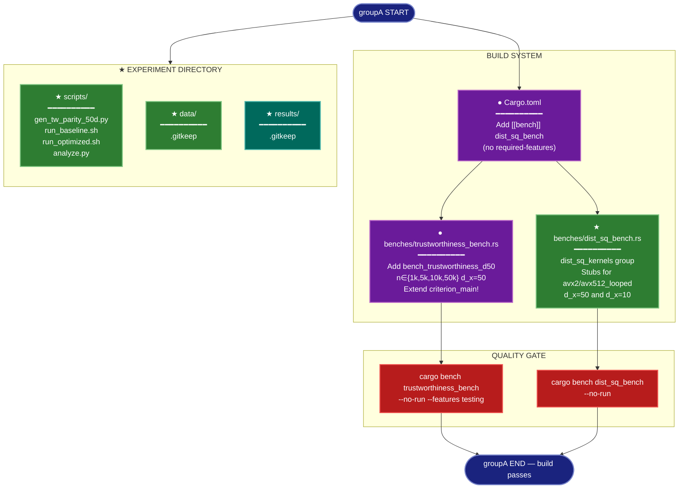

# Implementation Plan: groupA — Experiment Scaffolding (x-dist SIMD/Tiling)

## Summary

Create the full experiment directory tree under `research/2026-04-08-x-dist-simd-avx512/`, four scripts
(Python fixture generator, two shell benchmark drivers, Python analyzer), extend
`benches/trustworthiness_bench.rs` with a `trustworthiness_d50` group (d_x=50, n ∈ {1k,5k,10k,50k}),
and create `benches/dist_sq_bench.rs` as a stub Criterion microbenchmark harness registered in
`Cargo.toml`. No source-code changes to `src/` are made in this group — all kernel stubs live in the
bench file itself until groupD adds `pub(crate)` visibility to the real kernels.

---

## Proposed Architecture



**Lens Used:** Development — groupA is entirely build infrastructure (new Cargo bench registration,
extended bench harness, experiment directory scaffolding with scripts).

**Color Legend:**
| Color | Category | Description |
|-------|----------|-------------|
| Dark Blue | Terminal | groupA start and end |
| Purple | Modified (●) | Existing files extended |
| Green | New (★) | New files and directories |
| Red | Quality Gate | Compilation verification |
| Dark Teal | Output | results/ artifacts |

---

## Tests

The two build-verification commands are the tests for this group. They should fail before the
implementation (because `trustworthiness_d50` group doesn't exist and `dist_sq_bench` isn't
registered), and pass after.

**Test 1 — trustworthiness_bench compiles with d50 group:**
```bash
cargo bench --bench trustworthiness_bench --no-run --features testing
```
Expected: exits 0, output includes compiling `trustworthiness_bench`.

**Test 2 — dist_sq_bench compiles without any feature flags:**
```bash
cargo bench --bench dist_sq_bench --no-run
```
Expected: exits 0. This validates that the bench file is registered in Cargo.toml and uses no
feature-gated imports that would break compilation.

---

## Implementation Steps

### Step 1: Create experiment directory tree

Create the following directories and `.gitkeep` files (consistent with other research dirs):

```
research/2026-04-08-x-dist-simd-avx512/
research/2026-04-08-x-dist-simd-avx512/scripts/
research/2026-04-08-x-dist-simd-avx512/data/
research/2026-04-08-x-dist-simd-avx512/data/.gitkeep
research/2026-04-08-x-dist-simd-avx512/results/
research/2026-04-08-x-dist-simd-avx512/results/.gitkeep
```

`scripts/` does not need `.gitkeep` because scripts will be created in Step 2.

---

### Step 2: Create `scripts/gen_tw_parity_50d.py`

Mirror `tests/visual_eval/generate_tw_fixture.py` exactly, changing only n (200→200, unchanged),
d_x (10→50), and the output path.

File: `research/2026-04-08-x-dist-simd-avx512/scripts/gen_tw_parity_50d.py`

```python
#!/usr/bin/env python3
"""Generate trustworthiness parity fixture at d_x=50 for the x-dist SIMD experiment.

Output: research/2026-04-08-x-dist-simd-avx512/data/tw_parity_50d.npz
  - X: (200, 50) float64 — synthetic high-dimensional data
  - Y: (200, 2) float64 — synthetic 2D embedding
  - k: int64 — number of neighbors (15)
  - sklearn_score: float64 — trustworthiness computed by sklearn

Run from the repository root with the spectral-test env active:
  source envs/spectral-test/bin/activate
  python research/2026-04-08-x-dist-simd-avx512/scripts/gen_tw_parity_50d.py
"""

import pathlib
import numpy as np
from sklearn.manifold import trustworthiness

FIXTURE_DIR = pathlib.Path(__file__).parents[3] / "research" / "2026-04-08-x-dist-simd-avx512" / "data"

def main() -> None:
    rng = np.random.RandomState(42)
    X = rng.randn(200, 50)
    Y = rng.randn(200, 2)
    k = 15

    sklearn_score = trustworthiness(X, Y, n_neighbors=k)
    print(f"sklearn trustworthiness(n=200, d=50, k={k}) = {sklearn_score:.15f}")

    FIXTURE_DIR.mkdir(parents=True, exist_ok=True)
    out_path = FIXTURE_DIR / "tw_parity_50d.npz"
    np.savez_compressed(
        out_path,
        X=X.astype(np.float64),
        Y=Y.astype(np.float64),
        k=np.int64(k),
        sklearn_score=np.float64(sklearn_score),
    )
    print(f"Wrote fixture: {out_path}")

if __name__ == "__main__":
    main()
```

**Note on path computation:** `pathlib.Path(__file__).parents[3]` navigates three levels up from
`scripts/gen_tw_parity_50d.py` → `scripts/` → `2026-04-08-x-dist-simd-avx512/` → `research/` →
repo root. This is one more parent than `generate_tw_fixture.py` uses (`parents[2]` from
`tests/visual_eval/`).

---

### Step 3: Create `scripts/run_baseline.sh`

File: `research/2026-04-08-x-dist-simd-avx512/scripts/run_baseline.sh`

```bash
#!/usr/bin/env bash
# Run baseline benchmarks (current dist_sq_avx2 kernel at d_x=50).
# Must be run from repository root.
set -euo pipefail

SCRIPT_DIR="$(cd "$(dirname "${BASH_SOURCE[0]}")" && pwd)"
REPO_ROOT="$(cd "${SCRIPT_DIR}/../../.." && pwd)"
RESULTS="${SCRIPT_DIR}/../results"

cd "${REPO_ROOT}"

# ── 1. Criterion benchmark (trustworthiness_d50 group) ─────────────────────────
echo "[run_baseline] Running Criterion trustworthiness_d50..."
cargo bench --bench trustworthiness_bench --features testing \
  -- trustworthiness_d50 2>&1 | tee "${RESULTS}/baseline_criterion.txt"

# ── 2. Generate temporary .npy inputs for tw_profiler (n=10000, d_x=50) ────────
echo "[run_baseline] Generating profiler .npy inputs..."
python3 - <<'PYEOF'
import numpy as np, pathlib
rng = np.random.RandomState(42)
x = rng.randn(10000, 50).astype(np.float64)
y = rng.randn(10000, 2).astype(np.float64)
tmp = pathlib.Path("research/2026-04-08-x-dist-simd-avx512/data")
tmp.mkdir(parents=True, exist_ok=True)
np.save(str(tmp / "profiler_x_tmp.npy"), x)
np.save(str(tmp / "profiler_y_tmp.npy"), y)
print(f"Wrote {tmp}/profiler_x_tmp.npy and profiler_y_tmp.npy")
PYEOF

# ── 3. Build and run tw_profiler ────────────────────────────────────────────────
echo "[run_baseline] Running tw_profiler (n=10000, d_x=50)..."
cargo run --release --bin tw_profiler --features "cli profiling" -- \
  --x  "research/2026-04-08-x-dist-simd-avx512/data/profiler_x_tmp.npy" \
  --y  "research/2026-04-08-x-dist-simd-avx512/data/profiler_y_tmp.npy" \
  --output "${RESULTS}/baseline_profiler.json" \
  --stderr-capture "${RESULTS}/baseline_stderr.txt" \
  --k 15 --iters 5 --warmup 2

echo "[run_baseline] Done. Results in ${RESULTS}/"
```

Make it executable: the plan instructs `chmod +x` as part of file creation.

---

### Step 4: Create `scripts/run_optimized.sh`

File: `research/2026-04-08-x-dist-simd-avx512/scripts/run_optimized.sh`

Parameterised by `$1` (variant name, e.g. `avx2_looped`, `avx512_looped`, `tiled`).

```bash
#!/usr/bin/env bash
# Run benchmarks for a named kernel variant.
# Usage: ./run_optimized.sh <variant_name>
# Example: ./run_optimized.sh avx2_looped
# Must be run from repository root.
set -euo pipefail

VARIANT="${1:?Usage: run_optimized.sh <variant_name>}"

SCRIPT_DIR="$(cd "$(dirname "${BASH_SOURCE[0]}")" && pwd)"
REPO_ROOT="$(cd "${SCRIPT_DIR}/../../.." && pwd)"
RESULTS="${SCRIPT_DIR}/../results"

cd "${REPO_ROOT}"

# ── 1. Criterion benchmark ───────────────────────────────────────────────────────
echo "[run_optimized:${VARIANT}] Running Criterion trustworthiness_d50..."
cargo bench --bench trustworthiness_bench --features testing \
  -- trustworthiness_d50 2>&1 | tee "${RESULTS}/${VARIANT}_criterion.txt"

# ── 2. Generate temporary .npy inputs if not already present ────────────────────
if [[ ! -f "research/2026-04-08-x-dist-simd-avx512/data/profiler_x_tmp.npy" ]]; then
  echo "[run_optimized:${VARIANT}] Generating profiler .npy inputs..."
  python3 - <<'PYEOF'
import numpy as np, pathlib
rng = np.random.RandomState(42)
x = rng.randn(10000, 50).astype(np.float64)
y = rng.randn(10000, 2).astype(np.float64)
tmp = pathlib.Path("research/2026-04-08-x-dist-simd-avx512/data")
tmp.mkdir(parents=True, exist_ok=True)
np.save(str(tmp / "profiler_x_tmp.npy"), x)
np.save(str(tmp / "profiler_y_tmp.npy"), y)
PYEOF
fi

# ── 3. Run tw_profiler ───────────────────────────────────────────────────────────
echo "[run_optimized:${VARIANT}] Running tw_profiler (n=10000, d_x=50)..."
cargo run --release --bin tw_profiler --features "cli profiling" -- \
  --x  "research/2026-04-08-x-dist-simd-avx512/data/profiler_x_tmp.npy" \
  --y  "research/2026-04-08-x-dist-simd-avx512/data/profiler_y_tmp.npy" \
  --output "${RESULTS}/${VARIANT}_profiler.json" \
  --stderr-capture "${RESULTS}/${VARIANT}_stderr.txt" \
  --k 15 --iters 5 --warmup 2

echo "[run_optimized:${VARIANT}] Done. Results in ${RESULTS}/"
```

Make executable.

---

### Step 5: Create `scripts/analyze.py`

File: `research/2026-04-08-x-dist-simd-avx512/scripts/analyze.py`

Reads all `*_profiler.json` files (structured JSON from `tw_profiler`), extracts `mean_s` and
`step_timing.x_dist` (list of ns timings), parses `*_criterion.txt` for median wall-clock time,
and prints a Markdown table.

```python
#!/usr/bin/env python3
"""Analyze x-dist SIMD experiment results.

Reads results/*.json and results/*_criterion.txt, computes:
  - x_dist step speedup per variant
  - total wall-clock speedup per variant
  - Amdahl projection vs measured
  - AVX-512 marginal gain over looped AVX2
  - Tiling marginal gain (if present)

Usage (from repo root):
  python research/2026-04-08-x-dist-simd-avx512/scripts/analyze.py
"""

import json
import pathlib
import re
import sys

RESULTS = pathlib.Path(__file__).parents[1] / "results"

# X_DIST_FRACTION from step-timing baseline (0.589 per experiment plan motivation).
# Will be updated from actual baseline profiler data once available.
AMDAHL_XDIST_FRACTION = 0.589


def load_profiler(path: pathlib.Path) -> dict:
    with open(path) as f:
        return json.load(f)


def extract_criterion_median_ms(txt_path: pathlib.Path) -> float | None:
    """Parse Criterion text output for the n=10000 median time in ms."""
    if not txt_path.exists():
        return None
    text = txt_path.read_text()
    # Criterion line format: "trustworthiness_d50/n:10000  time   [X.XXX ms X.XXX ms X.XXX ms]"
    pattern = r"trustworthiness_d50/n:10000\s+time\s+\[[\d.]+ \w+\s+([\d.]+) (\w+)"
    m = re.search(pattern, text)
    if not m:
        return None
    value, unit = float(m.group(1)), m.group(2)
    if unit == "ms":
        return value
    if unit == "µs" or unit == "us":
        return value / 1000.0
    if unit == "s":
        return value * 1000.0
    return value


def xdist_mean_ns(profiler: dict) -> float | None:
    st = profiler.get("step_timing", {})
    vals = st.get("x_dist", [])
    if not vals:
        return None
    return sum(vals) / len(vals)


def amdahl(xdist_fraction: float, xdist_speedup: float) -> float:
    other = 1.0 - xdist_fraction
    return 1.0 / (other + xdist_fraction / xdist_speedup)


def main() -> None:
    baseline_json = RESULTS / "baseline_profiler.json"
    if not baseline_json.exists():
        print(f"ERROR: baseline profiler not found at {baseline_json}", file=sys.stderr)
        sys.exit(1)

    baseline = load_profiler(baseline_json)
    baseline_total_ms = extract_criterion_median_ms(RESULTS / "baseline_criterion.txt")
    baseline_xdist_ns = xdist_mean_ns(baseline)

    variants = []
    for p in sorted(RESULTS.glob("*_profiler.json")):
        stem = p.stem.replace("_profiler", "")
        if stem == "baseline":
            continue
        variants.append(stem)

    rows = []
    for v in variants:
        prof = load_profiler(RESULTS / f"{v}_profiler.json")
        total_ms = extract_criterion_median_ms(RESULTS / f"{v}_criterion.txt")
        xdist_ns = xdist_mean_ns(prof)

        xdist_speedup = (baseline_xdist_ns / xdist_ns) if (baseline_xdist_ns and xdist_ns) else None
        total_speedup = (baseline_total_ms / total_ms) if (baseline_total_ms and total_ms) else None
        amdahl_pred = amdahl(AMDAHL_XDIST_FRACTION, xdist_speedup) if xdist_speedup else None

        rows.append({
            "variant": v,
            "xdist_speedup": xdist_speedup,
            "total_speedup": total_speedup,
            "amdahl_pred": amdahl_pred,
        })

    # Markdown table
    print("## Speedup Results\n")
    print("| Variant | x_dist speedup | Total speedup | Amdahl predicted | H1 pass (≥1.5×) |")
    print("|---------|---------------|--------------|-----------------|-----------------|")
    for r in rows:
        xs = f"{r['xdist_speedup']:.2f}×" if r['xdist_speedup'] else "n/a"
        ts = f"{r['total_speedup']:.2f}×" if r['total_speedup'] else "n/a"
        ap = f"{r['amdahl_pred']:.2f}×" if r['amdahl_pred'] else "n/a"
        h1 = "✓" if (r['total_speedup'] and r['total_speedup'] >= 1.5) else "✗"
        print(f"| {r['variant']} | {xs} | {ts} | {ap} | {h1} |")

    # AVX-512 marginal gain
    avx2_row = next((r for r in rows if "avx2" in r["variant"]), None)
    avx512_row = next((r for r in rows if "avx512" in r["variant"]), None)
    if avx2_row and avx512_row and avx2_row["total_speedup"] and avx512_row["total_speedup"]:
        marginal = avx512_row["total_speedup"] / avx2_row["total_speedup"]
        print(f"\n**AVX-512 marginal gain over looped AVX2:** {marginal:.2f}× "
              f"({'≥1.2× — ship AVX-512' if marginal >= 1.2 else '<1.2× — ship AVX2 only'})")

    # Tiling marginal
    tiled_row = next((r for r in rows if "tiled" in r["variant"]), None)
    if avx512_row and tiled_row and avx512_row["total_speedup"] and tiled_row["total_speedup"]:
        tiling_marginal = tiled_row["total_speedup"] / avx512_row["total_speedup"]
        print(f"**Tiling marginal gain:** {tiling_marginal:.2f}× "
              f"({'V-Cache confirms low benefit' if tiling_marginal < 1.05 else '— tiling worthwhile'})")


if __name__ == "__main__":
    main()
```

---

### Step 6: Extend `benches/trustworthiness_bench.rs`

Two changes: (a) add `bench_trustworthiness_d50` function, (b) extend `criterion_main!`.

**Add after the closing `}` of `bench_trustworthiness`:**

```rust
fn bench_trustworthiness_d50(c: &mut Criterion) {
    let _ = rayon::current_num_threads();

    let mut group = c.benchmark_group("trustworthiness_d50");
    group.sampling_mode(SamplingMode::Flat);
    group.sample_size(10);
    group.warm_up_time(Duration::from_secs(10));
    for &n in &[1_000, 5_000, 10_000, 50_000] {
        let (x, y) = make_data(n, 50, 2, 42);
        group.bench_with_input(BenchmarkId::new("n", n), &n, |b, _| {
            b.iter(|| black_box(spectral_init::trustworthiness(x.view(), y.view(), 15)));
        });
    }
    group.finish();
}

criterion_group!(benches_d50, bench_trustworthiness_d50);
```

**Replace the existing `criterion_main!` line:**

```rust
// Before:
criterion_main!(benches);

// After:
criterion_main!(benches, benches_d50);
```

The existing `criterion_group!(benches, bench_trustworthiness)` line is left unchanged.

---

### Step 7: Create `benches/dist_sq_bench.rs`

File: `benches/dist_sq_bench.rs`

The real kernels (`dist_sq_avx2_looped`, `dist_sq_avx512_looped`) will be made `pub(crate)` in
groupD. Until then, the bench defines local scalar stubs that compile cleanly and exercise the
Criterion harness infrastructure. Comments mark exactly what changes in groupD.

```rust
//! Criterion microbenchmark harness for `dist_sq_*` kernel variants.
//!
//! Benchmarks the squared-Euclidean-distance kernels at d_x=50 and d_x=10.
//!
//! # groupD integration note
//! When groupD makes the SIMD kernels `pub(crate)` in `src/metrics.rs`, replace
//! the stub functions below with:
//!
//!     use spectral_init::metrics_internal::{dist_sq_avx2_looped, dist_sq_avx512_looped};
//!
//! and remove the stub definitions.
//!
//! Run with: cargo bench --bench dist_sq_bench

use criterion::{BenchmarkId, Criterion, criterion_group, criterion_main};
use std::hint::black_box;

// ─── Stubs (replaced by pub(crate) imports after groupD) ─────────────────────

/// Scalar fallback — mirrors the loop structure that avx2_looped will use.
/// Benchmarks this until the real looped AVX2 kernel is exposed.
fn dist_sq_avx2_looped_stub(xi: &[f64], xj: &[f64]) -> f64 {
    xi.iter().zip(xj.iter()).map(|(a, b)| (a - b) * (a - b)).sum()
}

/// Scalar fallback — mirrors the loop structure that avx512_looped will use.
/// Benchmarks this until the real looped AVX-512 kernel is exposed.
fn dist_sq_avx512_looped_stub(xi: &[f64], xj: &[f64]) -> f64 {
    xi.iter().zip(xj.iter()).map(|(a, b)| (a - b) * (a - b)).sum()
}

// ─── Data setup ───────────────────────────────────────────────────────────────

fn make_vectors(d: usize, seed: u64) -> (Vec<f64>, Vec<f64>) {
    use std::collections::hash_map::DefaultHasher;
    use std::hash::{Hash, Hasher};
    let mut xi = Vec::with_capacity(d);
    let mut xj = Vec::with_capacity(d);
    for i in 0..d {
        let mut h = DefaultHasher::new();
        (seed, i as u64).hash(&mut h);
        let bits = h.finish();
        // Map to [-1, 1] deterministically
        xi.push((bits as f64) / (u64::MAX as f64) * 2.0 - 1.0);
        (seed.wrapping_add(1), i as u64).hash(&mut h);
        let bits2 = h.finish();
        xj.push((bits2 as f64) / (u64::MAX as f64) * 2.0 - 1.0);
    }
    (xi, xj)
}

// ─── Benchmark group ──────────────────────────────────────────────────────────

fn bench_dist_sq_kernels(c: &mut Criterion) {
    let mut group = c.benchmark_group("dist_sq_kernels");

    for &d in &[10_usize, 50] {
        let (xi, xj) = make_vectors(d, 42);

        group.bench_with_input(
            BenchmarkId::new("avx2_looped", d),
            &d,
            |b, _| b.iter(|| dist_sq_avx2_looped_stub(black_box(&xi), black_box(&xj))),
        );

        group.bench_with_input(
            BenchmarkId::new("avx512_looped", d),
            &d,
            |b, _| b.iter(|| dist_sq_avx512_looped_stub(black_box(&xi), black_box(&xj))),
        );
    }

    group.finish();
}

criterion_group!(benches, bench_dist_sq_kernels);
criterion_main!(benches);
```

---

### Step 8: Register `dist_sq_bench` in `Cargo.toml`

Add after the last `[[bench]]` block (currently `trustworthiness_bench` at line 209):

```toml
[[bench]]
name = "dist_sq_bench"
harness = false
```

No `required-features` — the bench uses only public crate APIs and local stub functions, so it
must compile without any feature flags (per the verification requirement).

---

## Verification

```bash
# Test 1: trustworthiness_bench d50 group compiles
cargo bench --bench trustworthiness_bench --no-run --features testing
# Expected: "Compiling spectral-init ..." followed by exit 0

# Test 2: dist_sq_bench compiles without features
cargo bench --bench dist_sq_bench --no-run
# Expected: "Compiling spectral-init ..." followed by exit 0

# Optional smoke: verify d50 group runs (takes ~minutes at n=50k)
cargo bench --bench trustworthiness_bench --features testing \
  -- trustworthiness_d50/n:1000 --sample-size 3
# Expected: one benchmark result printed, exit 0
```
