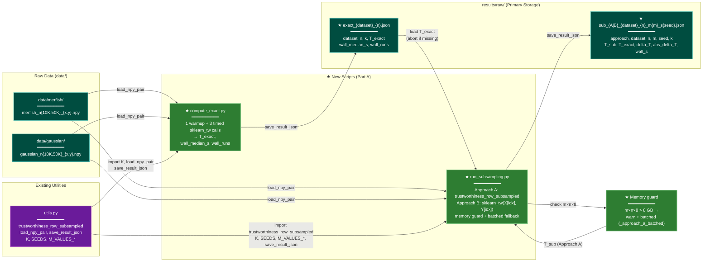

# Implementation Plan: groupC — Experiment Driver Scripts — PART A ONLY

> **PART A ONLY. Do not implement any other part. Other parts are separate tasks requiring explicit authorization.**

## Summary

Create `scripts/compute_exact.py` (REQ-P3-001) and `scripts/run_subsampling.py` (REQ-P3-002)
inside `research/2026-04-09-subsampled-tw-tradeoff/`. Both scripts import from the existing
`scripts/utils.py` via `sys.path`. After this part the experiment pipeline can produce all raw
result JSONs (`results/raw/exact_*.json` and `results/raw/sub_*.json`). Part B covers
`analyze_results.py` and the full verification — implement as a separate task.

All work is inside `research/2026-04-09-subsampled-tw-tradeoff/`. No Rust code is touched.

## Proposed Architecture



**Color Legend:**
| Color | Category | Description |
|-------|----------|-------------|
| Teal | Storage | `.npy` fixtures and JSON result files (source of truth) |
| Purple | Shared | Existing `utils.py` (imported, not modified) |
| Green | New Component | New scripts and memory guard logic created in this plan |

**Lens Used:** Data Lineage — the plan traces `.npy` arrays → trustworthiness scalars → JSON files.

## Tests

Run from `research/2026-04-09-subsampled-tw-tradeoff/` with the conda env activated.
All tests should **fail** before implementation and **pass** after.

```bash
EXPROOT="$(pwd)"  # run from research/2026-04-09-subsampled-tw-tradeoff/

# T1: Script files exist
test -f "$EXPROOT/scripts/compute_exact.py"   || echo "FAIL T1a: compute_exact.py missing"
test -f "$EXPROOT/scripts/run_subsampling.py" || echo "FAIL T1b: run_subsampling.py missing"

# T2: Syntax check
micromamba run -n subsampled-tw-tradeoff python -m py_compile scripts/compute_exact.py \
  && echo "T2a PASS" || echo "T2a FAIL"
micromamba run -n subsampled-tw-tradeoff python -m py_compile scripts/run_subsampling.py \
  && echo "T2b PASS" || echo "T2b FAIL"

# T3: compute_exact.py produces correct JSON for Gaussian n=10K
micromamba run -n subsampled-tw-tradeoff python scripts/compute_exact.py
micromamba run -n subsampled-tw-tradeoff python -c "
import json; from pathlib import Path
p = Path('results/raw/exact_gaussian_10000.json')
assert p.exists(), 'exact_gaussian_10000.json missing'
d = json.loads(p.read_text())
assert set(d) >= {'dataset','n','k','T_exact','wall_median_s','wall_runs'}, f'missing keys: {d.keys()}'
assert d['dataset'] == 'gaussian'
assert d['n'] == 10000
assert d['k'] == 15
assert 0 < d['T_exact'] <= 1, f'T_exact out of range: {d[\"T_exact\"]}'
assert len(d['wall_runs']) == 3, f'expected 3 timings, got {len(d[\"wall_runs\"])}'
print('T3 PASS  T_exact=', round(d[\"T_exact\"], 6))
"

# T4: run_subsampling.py --dry-run produces 2 JSON files (Approach A and B, MERFISH n=10K)
# Note: only runs if data/merfish/ files are present; otherwise skips gracefully
micromamba run -n subsampled-tw-tradeoff python scripts/run_subsampling.py --dry-run
micromamba run -n subsampled-tw-tradeoff python -c "
import json; from pathlib import Path
for approach in ['A', 'B']:
    p = Path(f'results/raw/sub_{approach}_merfish_10000_m2000_s0.json')
    if not p.exists():
        print(f'SKIP: MERFISH data not present, {p.name} not generated')
        continue
    d = json.loads(p.read_text())
    required = {'approach','dataset','n','m','seed','k','T_sub','T_exact','delta_T','abs_delta_T','wall_s'}
    missing = required - set(d)
    assert not missing, f'missing fields: {missing}'
    assert d['approach'] == approach
    assert d['m'] == 2000 and d['seed'] == 0
    print(f'T4 PASS approach={approach}  T_sub={d[\"T_sub\"]:.4f}  delta_T={d[\"delta_T\"]:.4f}')
"

# T5: dry-run with Gaussian: manually verify compute_exact + 1-trial run
micromamba run -n subsampled-tw-tradeoff python -c "
import sys, json, numpy as np
sys.path.insert(0, 'scripts')
from utils import K, M_VALUES_10K, load_npy_pair, trustworthiness_row_subsampled
from sklearn.manifold import trustworthiness as sklearn_tw
X, Y = load_npy_pair('data/gaussian', 'gaussian', 10000)
rng = np.random.RandomState(0)
idx = rng.choice(10000, size=2000, replace=False)
T_sub = trustworthiness_row_subsampled(X, Y, K, idx)
T_B   = sklearn_tw(X[idx], Y[idx], n_neighbors=K)
print(f'T5 PASS  T_A={T_sub:.4f}  T_B={T_B:.4f}')
"
```

## Implementation Steps

### Step 1 — Create `scripts/compute_exact.py` (REQ-P3-001)

Create `research/2026-04-09-subsampled-tw-tradeoff/scripts/compute_exact.py`:

```python
"""Compute exact trustworthiness baselines for all (dataset, n) combinations.

Saves results/raw/exact_{dataset}_{n}.json with fields:
  dataset, n, k, T_exact, wall_median_s, wall_runs

Run from experiment root:
    micromamba run -n subsampled-tw-tradeoff python scripts/compute_exact.py
"""
import sys
import time
from pathlib import Path

import numpy as np
from sklearn.manifold import trustworthiness as sklearn_tw

sys.path.insert(0, str(Path(__file__).parent))
from utils import K, load_npy_pair, save_result_json

EXPROOT = Path(__file__).parent.parent

DATASETS = [
    ("merfish",  10_000, EXPROOT / "data" / "merfish"),
    ("merfish",  50_000, EXPROOT / "data" / "merfish"),
    ("gaussian", 10_000, EXPROOT / "data" / "gaussian"),
    ("gaussian", 50_000, EXPROOT / "data" / "gaussian"),
]


def main() -> None:
    for dataset, n, data_dir in DATASETS:
        try:
            X, Y = load_npy_pair(data_dir, dataset, n)
        except FileNotFoundError as e:
            print(f"WARNING: {e} — skipping {dataset} n={n}", file=sys.stderr)
            continue

        # 1 warmup run
        sklearn_tw(X, Y, n_neighbors=K)

        # 3 timed runs; record median
        wall_runs = []
        for _ in range(3):
            t0 = time.perf_counter()
            T_exact = sklearn_tw(X, Y, n_neighbors=K)
            wall_runs.append(time.perf_counter() - t0)

        result = {
            "dataset": dataset,
            "n": n,
            "k": K,
            "T_exact": float(T_exact),
            "wall_median_s": float(np.median(wall_runs)),
            "wall_runs": [float(w) for w in wall_runs],
        }
        out_path = EXPROOT / "results" / "raw" / f"exact_{dataset}_{n}.json"
        save_result_json(out_path, result)
        print(
            f"[exact] {dataset} n={n}: T_exact={T_exact:.6f} "
            f"wall_median={np.median(wall_runs):.3f}s"
        )


if __name__ == "__main__":
    main()
```

Key design points:
- Iterates over all four (dataset, n) combinations; skips any with missing `.npy` files.
- Warmup run not timed; 3 timed runs, records all three in `wall_runs`, saves median as `wall_median_s`.
- `T_exact` is the result of the last timed run (all three are identical; float conversion avoids numpy scalar serialization errors).

### Step 2 — Create `scripts/run_subsampling.py` (REQ-P3-002)

Create `research/2026-04-09-subsampled-tw-tradeoff/scripts/run_subsampling.py`:

```python
"""Run subsampling experiment: Approach A and B for all (dataset, n, m, seed).

Full run: 2 approaches × 14 m-values × 10 seeds × 2 datasets = 560 trials.
Dry run (--dry-run): seed=0, m=2000, both approaches, MERFISH n=10K only.

Run from experiment root:
    micromamba run -n subsampled-tw-tradeoff python scripts/run_subsampling.py
    micromamba run -n subsampled-tw-tradeoff python scripts/run_subsampling.py --dry-run
"""
import argparse
import json
import sys
import time
from pathlib import Path

import numpy as np
from sklearn.manifold import trustworthiness as sklearn_tw
from sklearn.metrics import pairwise_distances
from sklearn.neighbors import NearestNeighbors

sys.path.insert(0, str(Path(__file__).parent))
from utils import (
    K, SEEDS, M_VALUES_10K, M_VALUES_50K,
    load_npy_pair, save_result_json, trustworthiness_row_subsampled,
)

EXPROOT = Path(__file__).parent.parent
BATCH_SIZE = 5000
_MEM_LIMIT = 8 * 1024 ** 3  # 8 GB

DATASETS = [
    ("merfish",  10_000, EXPROOT / "data" / "merfish"),
    ("merfish",  50_000, EXPROOT / "data" / "merfish"),
    ("gaussian", 10_000, EXPROOT / "data" / "gaussian"),
    ("gaussian", 50_000, EXPROOT / "data" / "gaussian"),
]


def _m_values(n: int) -> list:
    return M_VALUES_10K if n == 10_000 else M_VALUES_50K


def _approach_a_batched(X, Y, k, query_idx):
    """Memory-safe batch variant of Approach A.

    Processes query_idx in chunks of BATCH_SIZE to avoid materialising
    the full (m, n) float64 distance matrix when m*n*8 > MEM_LIMIT.
    """
    n_full = X.shape[0]
    m = len(query_idx)
    nn = NearestNeighbors(n_neighbors=k + 1, metric='euclidean').fit(Y)
    y_knn_all = nn.kneighbors(Y[query_idx], return_distance=False)  # (m, k+1)
    penalty = 0.0
    for b0 in range(0, m, BATCH_SIZE):
        b1 = min(b0 + BATCH_SIZE, m)
        bq = query_idx[b0:b1]
        dist_b = pairwise_distances(X[bq], X)           # (b_len, n_full)
        for li, gi in enumerate(bq):
            dist_b[li, gi] = np.inf                     # exclude self
        ranks_b = np.argsort(np.argsort(dist_b, axis=1), axis=1) + 1
        mask_b = ranks_b <= k
        for li in range(len(bq)):
            gi = bq[li]
            y_knn = [j for j in y_knn_all[b0 + li] if j != gi][:k]
            for j_col in y_knn:
                if not mask_b[li, j_col]:
                    penalty += ranks_b[li, j_col] - k
    return 1.0 - 2.0 * penalty / (m * k * (2 * n_full - 3 * k - 1))


def _load_exact_T(dataset: str, n: int) -> float:
    path = EXPROOT / "results" / "raw" / f"exact_{dataset}_{n}.json"
    if not path.exists():
        sys.exit(
            f"ERROR: exact baseline not found: {path}\n"
            "Run compute_exact.py first."
        )
    with open(path) as f:
        return json.load(f)["T_exact"]


def _run_trial(X, Y, n, approach, m, seed, T_exact, dataset):
    rng = np.random.RandomState(seed)
    idx = rng.choice(n, size=m, replace=False)

    if approach == "A":
        mem_bytes = m * n * 8
        if mem_bytes > _MEM_LIMIT:
            print(
                f"WARNING: Approach A ({m}×{n}) ≈ {mem_bytes/1e9:.1f} GB > 8 GB. "
                f"Using batched computation (BATCH_SIZE={BATCH_SIZE}).",
                file=sys.stderr,
            )
            t0 = time.perf_counter()
            T_sub = _approach_a_batched(X, Y, K, idx)
        else:
            t0 = time.perf_counter()
            T_sub = trustworthiness_row_subsampled(X, Y, K, idx)
        wall_s = time.perf_counter() - t0
    else:  # approach == "B"
        t0 = time.perf_counter()
        T_sub = sklearn_tw(X[idx], Y[idx], n_neighbors=K)
        wall_s = time.perf_counter() - t0

    T_sub = float(T_sub)
    delta_T = T_sub - float(T_exact)
    print(
        f"[approach {approach}] dataset={dataset} n={n} m={m} seed={seed} "
        f"→ T_sub={T_sub:.4f}",
        file=sys.stderr,
    )
    return {
        "approach": approach, "dataset": dataset, "n": n, "m": m,
        "seed": seed, "k": K,
        "T_sub": T_sub, "T_exact": float(T_exact),
        "delta_T": delta_T, "abs_delta_T": abs(delta_T), "wall_s": wall_s,
    }


def main() -> None:
    parser = argparse.ArgumentParser()
    parser.add_argument("--dry-run", action="store_true",
                        help="Minimal run: seed=0, m=2000, both approaches, MERFISH n=10K.")
    args = parser.parse_args()

    # Load datasets (skip missing with warning)
    loaded = {}
    for dataset, n, data_dir in DATASETS:
        try:
            loaded[(dataset, n)] = load_npy_pair(data_dir, dataset, n)
        except FileNotFoundError as e:
            print(f"WARNING: {e} — skipping {dataset} n={n}", file=sys.stderr)

    # Load exact baselines for every successfully-loaded dataset (abort on missing)
    exact_cache = {
        (ds, n): _load_exact_T(ds, n)
        for ds, n, _ in DATASETS if (ds, n) in loaded
    }

    if args.dry_run:
        trials = [
            ("merfish", 10_000, "A", 2000, 0),
            ("merfish", 10_000, "B", 2000, 0),
        ]
    else:
        trials = [
            (ds, n, approach, m, seed)
            for ds, n, _ in DATASETS if (ds, n) in loaded
            for approach in ["A", "B"]
            for m in _m_values(n)
            for seed in SEEDS
        ]

    for ds, n, approach, m, seed in trials:
        if (ds, n) not in loaded:
            continue
        X, Y = loaded[(ds, n)]
        result = _run_trial(X, Y, n, approach, m, seed, exact_cache[(ds, n)], ds)
        out = EXPROOT / "results" / "raw" / f"sub_{approach}_{ds}_{n}_m{m}_s{seed}.json"
        save_result_json(out, result)


if __name__ == "__main__":
    main()
```

Key design points:
- `_approach_a_batched` mirrors `trustworthiness_row_subsampled` logic (same denominator, same
  k+1 / self-filter for Y k-NN) but processes query rows in BATCH_SIZE chunks.
- Memory guard applied per trial before calling either Approach A variant.
- `--dry-run` generates exactly 2 trials; the full run generates 560.
- `_load_exact_T` aborts with `sys.exit` if the exact baseline JSON is not present — matching the
  requirement that compute_exact.py must be run first.
- Timing covers only the trustworthiness computation call, not data loading.

### Step 3 — Syntax verification for Part A scripts (partial REQ-P3-004)

```bash
cd research/2026-04-09-subsampled-tw-tradeoff
micromamba run -n subsampled-tw-tradeoff python -m py_compile scripts/compute_exact.py   && echo "compute_exact.py OK"
micromamba run -n subsampled-tw-tradeoff python -m py_compile scripts/run_subsampling.py && echo "run_subsampling.py OK"
```

Both must exit 0. Fix any syntax errors before proceeding.

## Verification

Run the full Test suite above in order (T1 → T5). All must produce PASS or SKIP output.

Final checklist:
- [ ] `scripts/compute_exact.py` exists; iterates over 4 (dataset, n) pairs; skips missing files
- [ ] `results/raw/exact_gaussian_10000.json` created with correct keys and 3-element `wall_runs`
- [ ] `scripts/run_subsampling.py` exists; `--dry-run` flag works; full trial list = 560 entries
- [ ] Memory guard warns and calls `_approach_a_batched` when `m * n * 8 > 8 GB`
- [ ] `_approach_a_batched` uses identical denominator `m * k * (2*n - 3*k - 1)` as `utils.py`
- [ ] Y k-NN uses `k+1` neighbors and filters self, matching `utils.py` semantics
- [ ] Output JSON fields match spec: approach, dataset, n, m, seed, k, T_sub, T_exact, delta_T, abs_delta_T, wall_s
- [ ] `wall_s` covers only the trustworthiness call, not data loading
- [ ] py_compile passes for both scripts
