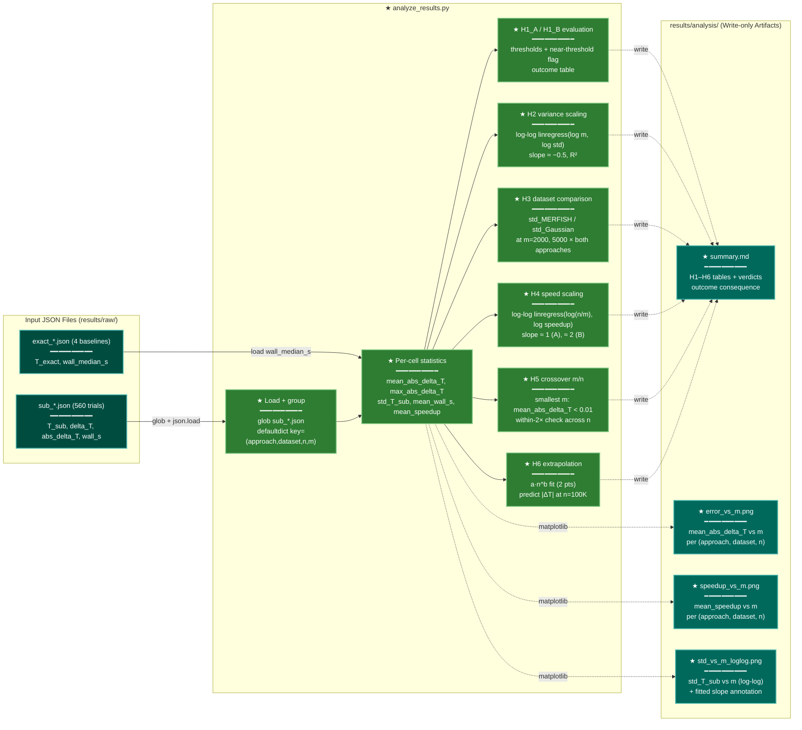

# Implementation Plan: groupC — Experiment Driver Scripts — PART B ONLY

> **PART B ONLY. Do not implement any other part. Other parts are separate tasks requiring explicit authorization.**

## Summary

Create `scripts/analyze_results.py` (REQ-P3-003) inside
`research/2026-04-09-subsampled-tw-tradeoff/`. This script globs all
`results/raw/sub_*.json` files, computes per-cell statistics across seeds, evaluates
hypotheses H1–H6, writes `results/analysis/summary.md`, and generates three plots.
After this part the complete groupC pipeline is finished and REQ-P3-004 (py_compile for
all three scripts) can be verified. Part A (compute_exact.py + run_subsampling.py) is
a prerequisite and must already be implemented.

## Proposed Architecture



**Color Legend:**
| Color | Category | Description |
|-------|----------|-------------|
| Teal | Storage | Input JSON files (read-only source) |
| Green | New Component | New analysis logic created in this plan |
| Dark Teal | Artifacts | Write-only outputs (summary + plots) |

**Lens Used:** Data Lineage — traces result JSONs through aggregation and statistical analysis into report artifacts.

## Tests

Run from `research/2026-04-09-subsampled-tw-tradeoff/`. Requires Part A scripts already
implemented and at least a dry-run or partial result set in `results/raw/`.

```bash
EXPROOT="$(pwd)"  # run from research/2026-04-09-subsampled-tw-tradeoff/

# T1: Script exists
test -f "$EXPROOT/scripts/analyze_results.py" || echo "FAIL T1: analyze_results.py missing"

# T2: Syntax check (all three scripts)
for s in compute_exact run_subsampling analyze_results; do
    micromamba run -n subsampled-tw-tradeoff python -m py_compile scripts/${s}.py \
      && echo "T2 PASS: ${s}.py" || echo "T2 FAIL: ${s}.py"
done

# T3: analyze_results.py runs without crash on partial data
# (assumes at least some sub_*.json files exist from dry-run or partial run_subsampling)
micromamba run -n subsampled-tw-tradeoff python scripts/analyze_results.py \
  && echo "T3 PASS: no crash" || echo "T3 FAIL: crashed"

# T4: summary.md and all three plots were created
micromamba run -n subsampled-tw-tradeoff python -c "
from pathlib import Path
base = Path('results/analysis')
files = ['summary.md', 'error_vs_m.png', 'speedup_vs_m.png', 'std_vs_m_loglog.png']
for f in files:
    p = base / f
    if p.exists() and p.stat().st_size > 0:
        print(f'T4 PASS: {f}  ({p.stat().st_size} bytes)')
    else:
        print(f'T4 FAIL: {f} missing or empty')
"

# T5: summary.md contains required hypothesis section headers
micromamba run -n subsampled-tw-tradeoff python -c "
text = open('results/analysis/summary.md').read()
for marker in ['H1', 'H2', 'H3', 'H4', 'H5', 'H6', 'extrapolation']:
    status = 'PASS' if marker in text else 'FAIL'
    print(f'T5 {status}: \"{marker}\" in summary.md')
"
```

## Implementation Steps

### Step 1 — Create `scripts/analyze_results.py` (REQ-P3-003)

Create `research/2026-04-09-subsampled-tw-tradeoff/scripts/analyze_results.py`:

```python
"""Analyze subsampling experiment results and generate summary report.

Globs results/raw/sub_*.json (handles partial sets gracefully).
Writes results/analysis/summary.md and three plots.

Run from experiment root:
    micromamba run -n subsampled-tw-tradeoff python scripts/analyze_results.py
"""
import json
import sys
from collections import defaultdict
from pathlib import Path

import matplotlib
matplotlib.use('Agg')
import matplotlib.pyplot as plt
import numpy as np
from scipy.stats import linregress

EXPROOT = Path(__file__).parent.parent
RAW_DIR = EXPROOT / "results" / "raw"
OUT_DIR = EXPROOT / "results" / "analysis"
OUT_DIR.mkdir(parents=True, exist_ok=True)

# ---------------------------------------------------------------------------
# Load trial data
# ---------------------------------------------------------------------------

cells = defaultdict(list)   # (approach, dataset, n, m) → [trial_dict, ...]
for p in sorted(RAW_DIR.glob("sub_*.json")):
    with open(p) as f:
        d = json.load(f)
    cells[(d["approach"], d["dataset"], d["n"], d["m"])].append(d)

exact_wall = {}
for p in RAW_DIR.glob("exact_*.json"):
    with open(p) as f:
        d = json.load(f)
    exact_wall[(d["dataset"], d["n"])] = d["wall_median_s"]

if not cells:
    print("WARNING: no sub_*.json files found in results/raw/. "
          "Run run_subsampling.py first.", file=sys.stderr)

# ---------------------------------------------------------------------------
# Per-cell statistics
# ---------------------------------------------------------------------------

stats = {}
for key, trials in cells.items():
    approach, dataset, n, m = key
    t_subs    = np.array([t["T_sub"]       for t in trials])
    abs_delts = np.array([t["abs_delta_T"] for t in trials])
    walls     = np.array([t["wall_s"]      for t in trials])
    w_exact   = exact_wall.get((dataset, n), np.nan)
    std_val   = float(np.std(t_subs, ddof=1)) if len(t_subs) > 1 else np.nan
    speedup   = float(w_exact / np.mean(walls)) if not np.isnan(w_exact) else np.nan
    stats[key] = {
        "mean_abs_delta_T": float(np.mean(abs_delts)),
        "max_abs_delta_T":  float(np.max(abs_delts)),
        "std_T_sub":        std_val,
        "mean_wall_s":      float(np.mean(walls)),
        "mean_speedup":     speedup,
        "n_seeds":          len(trials),
    }

# ---------------------------------------------------------------------------
# H1: accuracy thresholds
# ---------------------------------------------------------------------------

def _h1_verdict(approach, dataset, n, m):
    key = (approach, dataset, n, m)
    if key not in stats:
        return "N/A (no data)"
    s = stats[key]
    mean_d, max_d, std = s["mean_abs_delta_T"], s["max_abs_delta_T"], s["std_T_sub"]
    near  = 0.008 <= mean_d <= 0.012
    std_ok = np.isnan(std) or std < 0.005
    passed = mean_d < 0.01 and max_d < 0.02 and std_ok
    tag = " (near threshold)" if near else ""
    return ("PASS" if passed else "FAIL") + tag

h1a = _h1_verdict("A", "merfish", 10_000, 2000)
h1b = _h1_verdict("B", "merfish", 10_000, 5000)

_OUTCOME_TABLE = {
    ("PASS", "PASS"): "Use Approach A (m=2000) as default; Approach B acceptable at m=5000.",
    ("PASS", "FAIL"): "Approach A preferred at m=2000; Approach B requires larger m.",
    ("FAIL", "PASS"): "Approach B preferred at m=5000; Approach A requires larger m.",
    ("FAIL", "FAIL"): "Both approaches need larger m to reach 1% accuracy.",
}
h1a_base = "PASS" if h1a.startswith("PASS") else ("FAIL" if h1a.startswith("FAIL") else "N/A")
h1b_base = "PASS" if h1b.startswith("PASS") else ("FAIL" if h1b.startswith("FAIL") else "N/A")
consequence = _OUTCOME_TABLE.get((h1a_base, h1b_base), "Inconclusive (missing data).")

# ---------------------------------------------------------------------------
# H2: variance scaling — log-log regression of std_T_sub vs. m
# ---------------------------------------------------------------------------

h2_results = {}
for approach in ["A", "B"]:
    pts = [(np.log(m), np.log(s["std_T_sub"]))
           for (ap, _, _, m), s in stats.items()
           if ap == approach and not np.isnan(s["std_T_sub"]) and s["std_T_sub"] > 0]
    if len(pts) >= 2:
        slope, _, r, _, _ = linregress(*zip(*pts))
        h2_results[approach] = {"slope": round(slope, 4), "r2": round(r ** 2, 4)}

# ---------------------------------------------------------------------------
# H3: std_MERFISH / std_Gaussian at m=2000 and m=5000 (both approaches)
# ---------------------------------------------------------------------------

h3_rows = []
for approach in ["A", "B"]:
    for n in [10_000, 50_000]:
        for m in [2000, 5000]:
            s_m = stats.get((approach, "merfish",  n, m), {}).get("std_T_sub", np.nan)
            s_g = stats.get((approach, "gaussian", n, m), {}).get("std_T_sub", np.nan)
            ratio = (s_m / s_g
                     if (not np.isnan(s_m) and not np.isnan(s_g) and s_g > 0)
                     else np.nan)
            h3_rows.append((approach, n, m, s_m, s_g, ratio))

# ---------------------------------------------------------------------------
# H4: speed scaling — log-log regression of speedup vs. n/m
# ---------------------------------------------------------------------------

h4_results = {}
for approach in ["A", "B"]:
    pts = [(np.log(n / m), np.log(s["mean_speedup"]))
           for (ap, _, n, m), s in stats.items()
           if ap == approach and not np.isnan(s["mean_speedup"]) and s["mean_speedup"] > 0]
    if len(pts) >= 2:
        slope, _, r, _, _ = linregress(*zip(*pts))
        h4_results[approach] = {"slope": round(slope, 4), "r2": round(r ** 2, 4)}

# ---------------------------------------------------------------------------
# H5: crossover m/n ratio (smallest m where mean_abs_delta_T < 0.01)
# ---------------------------------------------------------------------------

_M_VALS = {10_000: [250, 500, 1000, 2000, 5000, 7500],
           50_000: [250, 500, 1000, 2000, 5000, 7500, 10_000, 25_000]}

h5_rows = []
for approach in ["A", "B"]:
    for n in [10_000, 50_000]:
        crossover_m = None
        for m in _M_VALS[n]:
            key = (approach, "merfish", n, m)
            if key in stats and stats[key]["mean_abs_delta_T"] < 0.01:
                crossover_m = m
                break
        ratio = crossover_m / n if crossover_m is not None else np.nan
        h5_rows.append((approach, n, crossover_m, ratio))

h5_within2x = {}
for approach in ["A", "B"]:
    ratios = [r for (ap, n, m, r) in h5_rows if ap == approach and not np.isnan(r)]
    if len(ratios) == 2:
        h5_within2x[approach] = (max(ratios) / min(ratios)) <= 2.0

# ---------------------------------------------------------------------------
# H6: extrapolation to n=100K
# Fit power law error = a*n^b using Approach A, m=2000, MERFISH
# (out-of-distribution projection — 2 data points only)
# ---------------------------------------------------------------------------

h6_result = {}
_REF_APPROACH, _REF_M = "A", 2000
_pts = []
for n in [10_000, 50_000]:
    key = (_REF_APPROACH, "merfish", n, _REF_M)
    if key in stats:
        _pts.append((n, stats[key]["mean_abs_delta_T"]))

if len(_pts) == 2:
    (n1, e1), (n2, e2) = _pts
    b_exp = (np.log(e2) - np.log(e1)) / (np.log(n2) - np.log(n1))
    a_exp = np.exp(np.log(e1) - b_exp * np.log(n1))
    pred_100k = float(a_exp * (100_000 ** b_exp))
    h6_result = {
        "a": round(float(a_exp), 6), "b": round(float(b_exp), 4),
        "pred_100k": round(pred_100k, 6),
        "ref_approach": _REF_APPROACH, "ref_m": _REF_M,
    }

# ---------------------------------------------------------------------------
# Generate summary.md
# ---------------------------------------------------------------------------

lines = [
    "# Subsampled Trustworthiness Tradeoff — Results Summary",
    "",
    "## H1: Accuracy at Pre-specified Operating Points",
    "",
    "| Hypothesis | Config | H1 Verdict |",
    "|-----------|--------|-----------|",
    f"| H1_A | Approach A, MERFISH n=10K, m=2000 | {h1a} |",
    f"| H1_B | Approach B, MERFISH n=10K, m=5000 | {h1b} |",
    "",
    f"**Operational consequence:** {consequence}",
    "",
    "## H2: Variance Scaling (std_T_sub vs. m)",
    "",
    "Expected slope ≈ −0.5 (std ∝ m^{-0.5}).",
    "",
    "| Approach | Slope | R² |",
    "|---------|-------|----|",
]
for approach in ["A", "B"]:
    r = h2_results.get(approach, {})
    lines.append(f"| {approach} | {r.get('slope','N/A')} | {r.get('r2','N/A')} |")

lines += [
    "",
    "## H3: Dataset Variability Ratio (std_MERFISH / std_Gaussian)",
    "",
    "| Approach | n | m | std_MERFISH | std_Gaussian | Ratio |",
    "|---------|---|---|-------------|--------------|-------|",
]
for (approach, n, m, s_m, s_g, ratio) in h3_rows:
    lines.append(
        f"| {approach} | {n} | {m} "
        f"| {s_m:.5f} | {s_g:.5f} "
        f"| {ratio:.3f} |"
        if not np.isnan(s_m) and not np.isnan(s_g) and not np.isnan(ratio)
        else f"| {approach} | {n} | {m} | N/A | N/A | N/A |"
    )

lines += [
    "",
    "## H4: Speed Scaling (speedup vs. n/m)",
    "",
    "Expected slope ≈ 1 for Approach A (O(mn) complexity), ≈ 2 for Approach B (O(m²)).",
    "",
    "| Approach | Slope | R² |",
    "|---------|-------|----|",
]
for approach in ["A", "B"]:
    r = h4_results.get(approach, {})
    lines.append(f"| {approach} | {r.get('slope','N/A')} | {r.get('r2','N/A')} |")

lines += [
    "",
    "## H5: Crossover m/n Ratio",
    "",
    "Smallest m such that mean_abs_delta_T < 0.01 on MERFISH (Approach A/B reference).",
    "",
    "| Approach | n | Crossover m | m/n ratio |",
    "|---------|---|-------------|-----------|",
]
for (approach, n, m, ratio) in h5_rows:
    m_str    = str(m) if m is not None else "not reached"
    r_str    = f"{ratio:.4f}" if not np.isnan(ratio) else "N/A"
    lines.append(f"| {approach} | {n} | {m_str} | {r_str} |")

for approach in ["A", "B"]:
    w2x = h5_within2x.get(approach)
    if w2x is not None:
        lines.append(f"  Approach {approach}: crossover ratios within 2×? {'YES' if w2x else 'NO'}")

lines += [""]

if h6_result:
    lines += [
        "## H6: Extrapolation to n=100K ⚠️ OUT-OF-DISTRIBUTION PROJECTION",
        "",
        f"Fit: |ΔT| = {h6_result['a']:.6f} × n^{h6_result['b']:.4f}  "
        f"(Approach {h6_result['ref_approach']}, m={h6_result['ref_m']}, MERFISH, 2 data points)",
        "",
        f"**Predicted |ΔT| at n=100K: {h6_result['pred_100k']:.6f}**",
        "",
        "> This is an extrapolation (out-of-distribution). "
        "Treat as an order-of-magnitude estimate only.",
        "",
    ]
else:
    lines += [
        "## H6: Extrapolation to n=100K",
        "",
        "Insufficient data for power-law fit (need both n=10K and n=50K MERFISH results).",
        "",
    ]

(OUT_DIR / "summary.md").write_text("\n".join(lines))
print("Wrote results/analysis/summary.md")

# ---------------------------------------------------------------------------
# Plots
# ---------------------------------------------------------------------------

_APPROACHES = ["A", "B"]
_DATASETS   = ["merfish", "gaussian"]
_NS         = [10_000, 50_000]


def _series(approach, dataset, n, metric):
    """Return (m_vals, metric_vals) for a given (approach, dataset, n) group."""
    ms, vs = [], []
    for (ap, ds, nn, m), s in sorted(stats.items(), key=lambda kv: kv[0][3]):
        if ap == approach and ds == dataset and nn == n:
            v = s.get(metric, np.nan)
            if not np.isnan(v):
                ms.append(m)
                vs.append(v)
    return ms, vs


def _plot_metric(metric, ylabel, filename, loglog=False):
    fig, axes = plt.subplots(1, 2, figsize=(12, 5), sharey=False)
    for ax, approach in zip(axes, _APPROACHES):
        for dataset in _DATASETS:
            for n in _NS:
                ms, vs = _series(approach, dataset, n, metric)
                if ms:
                    label = f"{dataset} n={n//1000}K"
                    ax.plot(ms, vs, marker='o', label=label)
        if loglog:
            ax.set_xscale('log'); ax.set_yscale('log')
        ax.set_xlabel("m (subsample size)")
        ax.set_ylabel(ylabel)
        ax.set_title(f"Approach {approach}")
        ax.legend(fontsize=8)
        ax.grid(True, which='both', alpha=0.3)
    fig.tight_layout()
    fig.savefig(OUT_DIR / filename, dpi=150)
    plt.close(fig)
    print(f"Wrote results/analysis/{filename}")


_plot_metric("mean_abs_delta_T", "|ΔT| (mean absolute error)", "error_vs_m.png")
_plot_metric("mean_speedup",     "Speedup vs exact",           "speedup_vs_m.png")
_plot_metric("std_T_sub",        "std(T_sub)",                 "std_vs_m_loglog.png", loglog=True)
```

Key design points:
- `cells` and `stats` are built from whatever JSONs exist — no crash on partial data.
- H1 evaluates specific (approach, dataset, n, m) cells; returns `"N/A (no data)"` if absent.
- H2/H4 log-log regressions require `len(xs) >= 2`; skip silently if insufficient data.
- H3 ratios per (approach, n, m) pair; N/A if either dataset's std is missing.
- H5 iterates m values in ascending order; takes first m meeting mean_abs_delta_T < 0.01.
- H6 uses 2-point power-law fit; labelled "out-of-distribution" in summary.md.
- Three plots share `_plot_metric`; `std_vs_m_loglog.png` uses `loglog=True`.
- `matplotlib.use('Agg')` ensures headless rendering.

### Step 2 — Full py_compile verification (REQ-P3-004)

```bash
cd research/2026-04-09-subsampled-tw-tradeoff
for s in compute_exact run_subsampling analyze_results; do
    micromamba run -n subsampled-tw-tradeoff python -m py_compile scripts/${s}.py \
      && echo "PASS: ${s}.py" || echo "FAIL: ${s}.py"
done
```

All three must exit 0.

## Verification

Run the full Test suite (T1 → T5) from the Tests section above. All must produce PASS or SKIP.

Final checklist:
- [ ] `scripts/analyze_results.py` exists and imports cleanly
- [ ] Script handles empty `results/raw/` (no crash, prints warning)
- [ ] Per-cell stats computed correctly: mean_abs_delta_T, max_abs_delta_T, std_T_sub (ddof=1), mean_wall_s, mean_speedup
- [ ] `mean_speedup = wall_exact_median / mean_wall_sub` (exact wall from exact JSON)
- [ ] H1_A evaluated at (Approach A, MERFISH, n=10K, m=2000); near-threshold [0.008, 0.012] flagged
- [ ] H1_B evaluated at (Approach B, MERFISH, n=10K, m=5000); near-threshold flagged
- [ ] Outcome table maps (H1_A_base, H1_B_base) → operational consequence string
- [ ] H2: separate log-log regression per approach; reports slope + R²
- [ ] H3: 8 rows (2 approaches × 2 n-values × 2 m-values); N/A for missing data
- [ ] H4: separate log-log regression per approach on speedup vs. n/m
- [ ] H5: crossover m detected per (approach, n); within-2× criterion reported
- [ ] H6: "out-of-distribution projection" label in summary.md; 2-point power-law fit
- [ ] `results/analysis/summary.md` written with sections H1–H6
- [ ] `results/analysis/error_vs_m.png`, `speedup_vs_m.png`, `std_vs_m_loglog.png` written
- [ ] py_compile passes for all three scripts (REQ-P3-004 satisfied)
