# Implementation Plan: groupD — Dry Run & End-to-End Validation

## Summary

GroupD validates the full pipeline from data loading through analysis and plots using a
minimal dry-run configuration (MERFISH n=10K, m=2000, seed=0 only). Two blocking bugs
must be fixed before any execution can succeed:

1. **MERFISH symlink naming mismatch** — the four symlinks in `data/merfish/` use `n10k`/`n50k`
   suffixes (e.g. `merfish_n10k_x.npy`) but `load_npy_pair` constructs `n10000`/`n50000`
   paths. All MERFISH data silently fails with `FileNotFoundError`. Fix: add four
   correctly-named symlinks pointing to the same absolute targets.

2. **`compute_exact.py` has no `--dry-run` flag** — without it, running for the dry run
   would also process Gaussian n=50K (which has correct naming), making the dry run
   much slower than necessary. Fix: add `argparse` with `--dry-run` that limits
   `DATASETS` to `[("merfish", 10_000, ...)]`.

A normalization verification script (`scripts/verify_normalization.py`) is also created
per REQ-P4-004 to guard against the denominator bug that invalidated the prior H5 results.
This script calls `trustworthiness_row_subsampled` with `m = n` (all rows as query) and
asserts the result matches `T_exact` to within 1e-10.

After the three code changes, the dry-run execution sequence runs in dependency order:
`compute_exact.py --dry-run` → `run_subsampling.py --dry-run` → `analyze_results.py` →
`verify_normalization.py`. Each step is verified before proceeding.

---

## Proposed Architecture

```mermaid
%%{init: {'flowchart': {'nodeSpacing': 42, 'rankSpacing': 58, 'curve': 'basis'}}}%%
flowchart TB
    %% CLASS DEFINITIONS %%
    classDef cli fill:#1a237e,stroke:#7986cb,stroke-width:2px,color:#fff;
    classDef stateNode fill:#004d40,stroke:#4db6ac,stroke-width:2px,color:#fff;
    classDef handler fill:#e65100,stroke:#ffb74d,stroke-width:2px,color:#fff;
    classDef phase fill:#6a1b9a,stroke:#ba68c8,stroke-width:2px,color:#fff;
    classDef newComponent fill:#2e7d32,stroke:#81c784,stroke-width:2px,color:#fff;
    classDef output fill:#00695c,stroke:#4db6ac,stroke-width:2px,color:#fff;
    classDef detector fill:#b71c1c,stroke:#ef5350,stroke-width:2px,color:#fff;
    classDef terminal fill:#1a237e,stroke:#7986cb,stroke-width:2px,color:#fff;

    %% TERMINALS %%
    START([START])
    DONE([ALL REQ-P4-* PASS])

    subgraph Phase1 ["Phase 1 — Code Fixes (parallel)"]
        direction LR
        SYM["★ MERFISH symlinks<br/>━━━━━━━━━━<br/>Add n10000/n50000 aliases<br/>for all four n10k/n50k files"]
        FLAG["● compute_exact.py<br/>━━━━━━━━━━<br/>Add --dry-run flag<br/>Restricts to merfish n=10K"]
        VNS["★ verify_normalization.py<br/>━━━━━━━━━━<br/>Script creation only<br/>(executed in Phase 5)"]
    end

    subgraph Phase2 ["Phase 2 — REQ-P4-001"]
        direction TB
        CE["● compute_exact.py --dry-run<br/>━━━━━━━━━━<br/>1 warmup + 3 timed sklearn runs<br/>MERFISH n=10K only"]
        EJ["exact_merfish_10000.json<br/>━━━━━━━━━━<br/>dataset, n, k, T_exact<br/>wall_median_s, wall_runs[3]"]
        V1{"fields present?<br/>T_exact in (0,1)?<br/>wall_median_s > 0?"}
    end

    subgraph Phase3 ["Phase 3 — REQ-P4-002"]
        direction TB
        RS["run_subsampling.py --dry-run<br/>━━━━━━━━━━<br/>2 trials: A+B, m=2000, seed=0<br/>loads exact_merfish_10000.json"]
        SJ["sub_A_merfish_10000_m2000_s0.json<br/>sub_B_merfish_10000_m2000_s0.json<br/>━━━━━━━━━━<br/>11 fields each; abs_delta_T in [0,1]"]
        V2{"exactly 2 sub_*.json?<br/>all 11 fields?<br/>abs_delta_T valid?"}
    end

    subgraph Phase4 ["Phase 4 — REQ-P4-003"]
        direction TB
        AR["analyze_results.py<br/>━━━━━━━━━━<br/>Globs sub_*.json<br/>Computes per-cell stats"]
        AO["summary.md<br/>error_vs_m.png<br/>speedup_vs_m.png<br/>std_vs_m_loglog.png"]
        V3{"H1_A + H1_B rows in md?<br/>3 plot files exist?<br/>exit code 0?"}
    end

    subgraph Phase5 ["Phase 5 — REQ-P4-004"]
        direction TB
        VN["★ verify_normalization.py<br/>━━━━━━━━━━<br/>query_idx = arange(n=10000)<br/>trustworthiness_row_subsampled(m=n)"]
        VC{"| T_A(m=n) - T_exact |<br/>< 1e-10?"}
    end

    %% FLOW %%
    START --> SYM
    START --> FLAG
    START --> VNS
    SYM --> CE
    FLAG --> CE
    VNS --> CE
    CE --> EJ
    EJ --> V1
    V1 -->|"PASS"| RS
    V1 -->|"FAIL → fix"| CE
    RS --> SJ
    SJ --> V2
    V2 -->|"PASS"| AR
    V2 -->|"FAIL → fix"| RS
    AR --> AO
    AO --> V3
    V3 -->|"PASS"| VN
    V3 -->|"FAIL → fix"| AR
    VN --> VC
    VC -->|"PASS"| DONE
    VC -->|"FAIL → fix denominator"| VN

    %% CLASS ASSIGNMENTS %%
    class START,DONE terminal;
    class SYM,VNS,VN newComponent;
    class FLAG,CE,RS,AR handler;
    class EJ,SJ,AO output;
    class V1,V2,V3,VC detector;
```



**Color Legend:**
| Color | Category | Description |
|-------|----------|-------------|
| Dark Blue | Terminal | Start and completion states |
| Orange | Handler | Script execution nodes |
| Green (bright) | New Component | New files created by this plan |
| Dark Teal | Output | Generated JSON/plot/markdown artifacts |
| Red | Detector | Verification gates (PASS/FAIL decision) |

**Lens Used:** Process Flow — this plan is a sequential execution pipeline with conditional
verification gates at each step; Process Flow best captures the run order, inter-script
data dependencies, and PASS/FAIL routing logic.

---

## Tests

These checks must pass after implementation. They correspond directly to REQ-P4-001 through REQ-P4-004.

### T1 — REQ-P4-001: exact baseline JSON
Run from `research/2026-04-09-subsampled-tw-tradeoff/`:
```
micromamba run -n subsampled-tw-tradeoff python scripts/compute_exact.py --dry-run
```
Verify:
- `results/raw/exact_merfish_10000.json` exists
- Contains keys: `dataset`, `n`, `k`, `T_exact`, `wall_median_s`, `wall_runs`
- `dataset == "merfish"`, `n == 10000`, `k == 15`
- `0.0 < T_exact < 1.0`
- `wall_median_s > 0.0`
- `wall_runs` is a list of exactly 3 positive floats
- No `exact_gaussian_*.json` or `exact_merfish_50000.json` created (dry run only)

### T2 — REQ-P4-002: subsampling dry-run JSONs
```
micromamba run -n subsampled-tw-tradeoff python scripts/run_subsampling.py --dry-run
```
Verify:
- `results/raw/sub_A_merfish_10000_m2000_s0.json` exists
- `results/raw/sub_B_merfish_10000_m2000_s0.json` exists
- Exactly 2 files match `results/raw/sub_*.json`
- Both contain all 11 fields: `approach`, `dataset`, `n`, `m`, `seed`, `k`, `T_sub`, `T_exact`, `delta_T`, `abs_delta_T`, `wall_s`
- `abs_delta_T` is a finite float in `[0.0, 1.0]` for both
- `T_sub` is finite (not NaN) for both

### T3 — REQ-P4-003: analysis outputs
```
micromamba run -n subsampled-tw-tradeoff python scripts/analyze_results.py
```
Verify:
- Script exits with code 0
- `results/analysis/summary.md` exists and contains the strings `"H1_A"` and `"H1_B"`
- `results/analysis/error_vs_m.png` exists
- `results/analysis/speedup_vs_m.png` exists
- `results/analysis/std_vs_m_loglog.png` exists

### T4 — REQ-P4-004: normalization correctness
```
micromamba run -n subsampled-tw-tradeoff python scripts/verify_normalization.py
```
Verify:
- Script prints `PASS` and exits with code 0
- `abs_delta_T` from the dry-run Approach A result (`sub_A_merfish_10000_m2000_s0.json`) is finite, non-negative, and ≤ 1.0
- `|T_A(m=n) - T_exact| < 1e-10`

---

## Implementation Steps

### Step 1 — Fix MERFISH data symlinks

`load_npy_pair` constructs `{prefix}_n{n}_x.npy` (e.g. `merfish_n10000_x.npy`) but the
four existing symlinks use `n10k`/`n50k` suffixes. Create four new symlinks with the
correct naming pointing to the same absolute targets:

```bash
cd research/2026-04-09-subsampled-tw-tradeoff/data/merfish
ln -s /home/talon/projects/spectral-init/research/2026-04-05-tw-perf-rerun-clean/data/merfish/merfish_n10k_x.npy merfish_n10000_x.npy
ln -s /home/talon/projects/spectral-init/research/2026-04-05-tw-perf-rerun-clean/data/merfish/merfish_n10k_y.npy merfish_n10000_y.npy
ln -s /home/talon/projects/spectral-init/research/2026-04-05-tw-perf-rerun-clean/data/merfish/merfish_n50k_x.npy merfish_n50000_x.npy
ln -s /home/talon/projects/spectral-init/research/2026-04-05-tw-perf-rerun-clean/data/merfish/merfish_n50k_y.npy merfish_n50000_y.npy
```

Create all four (not just n=10K) because the full experiment run (groupE) will need
n=50K data loadable as well.

After this step: `np.load("data/merfish/merfish_n10000_x.npy")` succeeds without error.

### Step 2 — Add `--dry-run` flag to `compute_exact.py`

`compute_exact.py` currently has no CLI argument parsing. Add `argparse` with a
`--dry-run` flag. When set, replace the `DATASETS` list used by `main()` with a
single-entry list containing only `("merfish", 10_000, ...)`.

The change to `scripts/compute_exact.py`:

```python
# At top of file, add:
import argparse

# Replace main() body preamble:
def main() -> None:
    parser = argparse.ArgumentParser()
    parser.add_argument("--dry-run", action="store_true",
                        help="Only process MERFISH n=10K (skip all other datasets).")
    args = parser.parse_args()

    datasets = (
        [("merfish", 10_000, EXPROOT / "data" / "merfish")]
        if args.dry_run
        else DATASETS
    )

    for dataset, n, data_dir in datasets:
        # ... rest of loop unchanged
```

After this step: `python scripts/compute_exact.py --dry-run` produces only
`results/raw/exact_merfish_10000.json`.

### Step 3 — Create `scripts/verify_normalization.py`

Create a standalone normalization verification script. It loads MERFISH n=10K data,
calls `trustworthiness_row_subsampled` with all n rows as queries (m=n), loads
`T_exact` from the exact baseline JSON, and asserts the two values agree to within
1e-10. This guards against any regression in the denominator formula
(`m * k * (2n - 3k - 1)` must use the full population size `n`, not `m`).

```python
"""Normalization sanity check: trustworthiness_row_subsampled(m=n) must equal T_exact.

Guards against the denominator bug that invalidated prior H5 results:
  denom = m * k * (2 * n - 3 * k - 1)   ← n is FULL population size, not m

Run from experiment root:
    micromamba run -n subsampled-tw-tradeoff python scripts/verify_normalization.py
"""
import json
import sys
from pathlib import Path

import numpy as np

sys.path.insert(0, str(Path(__file__).parent))
from utils import K, load_npy_pair, trustworthiness_row_subsampled

EXPROOT = Path(__file__).parent.parent
EXACT_PATH = EXPROOT / "results" / "raw" / "exact_merfish_10000.json"


def main() -> None:
    if not EXACT_PATH.exists():
        sys.exit(
            f"ERROR: {EXACT_PATH} not found. Run compute_exact.py --dry-run first."
        )

    X, Y = load_npy_pair(EXPROOT / "data" / "merfish", "merfish", 10_000)
    n = X.shape[0]  # 10000

    with open(EXACT_PATH) as f:
        T_exact = json.load(f)["T_exact"]

    # m = n: use all rows as queries — must reproduce T_exact exactly
    query_idx = np.arange(n)
    T_full = trustworthiness_row_subsampled(X, Y, K, query_idx)

    diff = abs(T_full - T_exact)
    threshold = 1e-10

    print(f"T_exact (sklearn)     = {T_exact:.12f}")
    print(f"T_A(m=n) (ours)       = {T_full:.12f}")
    print(f"|difference|           = {diff:.3e}")
    print(f"threshold              = {threshold:.3e}")

    if diff < threshold:
        print("PASS: normalization is correct.")
    else:
        print(
            f"FAIL: |T_A(m=n) - T_exact| = {diff:.3e} >= {threshold:.3e}\n"
            "Check the denom in trustworthiness_row_subsampled: "
            "n must be X.shape[0] (full population), not len(query_idx).",
            file=sys.stderr,
        )
        sys.exit(1)


if __name__ == "__main__":
    main()
```

Note: with n=10K, the (10000 × 10000) float64 distance matrix is ~800 MB — well within
the 8 GB memory guard. Computation time is similar to one exact sklearn run (~same as
the warmup run in compute_exact.py).

### Step 4 — Execute: `compute_exact.py --dry-run` (REQ-P4-001)

From `research/2026-04-09-subsampled-tw-tradeoff/`:
```bash
micromamba run -n subsampled-tw-tradeoff python scripts/compute_exact.py --dry-run
```

Verify T1 assertions:
- File `results/raw/exact_merfish_10000.json` exists
- All six expected fields present with valid values
- Exactly one file created (`exact_merfish_10000.json`; no `exact_gaussian_*`)

If the script fails with `FileNotFoundError` for MERFISH data, Step 1 was not applied.
If it fails with `unrecognized argument: --dry-run`, Step 2 was not applied.

### Step 5 — Execute: `run_subsampling.py --dry-run` (REQ-P4-002)

```bash
micromamba run -n subsampled-tw-tradeoff python scripts/run_subsampling.py --dry-run
```

This script will `_load_exact_T("merfish", 10_000)` — it requires `exact_merfish_10000.json`
from Step 4 to exist. If missing, `run_subsampling.py` calls `sys.exit()` with an
instructive error message.

Verify T2 assertions:
- `sub_A_merfish_10000_m2000_s0.json` and `sub_B_merfish_10000_m2000_s0.json` exist
- Exactly 2 `sub_*.json` files in `results/raw/`
- Both have `abs_delta_T` as a finite float in `[0.0, 1.0]`

### Step 6 — Execute: `analyze_results.py` (REQ-P4-003)

```bash
micromamba run -n subsampled-tw-tradeoff python scripts/analyze_results.py
```

Verify T3 assertions:
- Exit code 0
- `results/analysis/summary.md` exists and contains `"H1_A"` and `"H1_B"`
- Three plot files exist in `results/analysis/`

Expected behavior with dry-run outputs: `summary.md` will show H1_A verdict (PASS or FAIL
based on the one data point at m=2000) and H1_B as `"N/A (no data)"` (dry run provides
Approach B at m=2000, but H1_B checks m=5000). H2/H3/H4 regressions will be absent
(insufficient data). H5 crossover will be `"not reached"` or N/A. This is correct and
expected partial-data behavior.

### Step 7 — Execute: `verify_normalization.py` (REQ-P4-004)

```bash
micromamba run -n subsampled-tw-tradeoff python scripts/verify_normalization.py
```

Verify T4 assertions:
- Script prints `PASS` and exits with code 0
- `|T_A(m=n) - T_exact| < 1e-10`

If the threshold is met at `< 1e-6` but not `< 1e-10` (floating-point order-of-operations
differences between our loop accumulation and sklearn's vectorized path), investigate
whether the denominator formula is correct (`n = X.shape[0]`, not `len(query_idx)`).
A difference at `< 1e-6` but `>= 1e-10` is likely FP precision, not a bug — in that
case, relax the threshold in the script to `1e-6` and add a comment explaining the
acceptable numerical tolerance.

### Step 8 — Fix any bugs found

If any step fails:
- Diagnose the root cause from the error output
- Fix the offending script
- Re-run from the failing step (do not restart from Step 4 if only Step 6 failed)
- All four REQ-P4-* must pass before marking groupD complete

---

## Verification

Run all four steps in order and confirm:

```bash
cd research/2026-04-09-subsampled-tw-tradeoff

# REQ-P4-001
micromamba run -n subsampled-tw-tradeoff python scripts/compute_exact.py --dry-run
python3 -c "
import json; d=json.load(open('results/raw/exact_merfish_10000.json'))
assert d['dataset']=='merfish' and d['n']==10000 and d['k']==15
assert 0 < d['T_exact'] < 1 and d['wall_median_s'] > 0 and len(d['wall_runs'])==3
print('REQ-P4-001 PASS')
"

# REQ-P4-002
micromamba run -n subsampled-tw-tradeoff python scripts/run_subsampling.py --dry-run
python3 -c "
import json, glob
fs = glob.glob('results/raw/sub_*.json')
assert len(fs)==2, f'expected 2, got {len(fs)}'
for f in fs:
    d=json.load(open(f))
    for field in ['approach','dataset','n','m','seed','k','T_sub','T_exact','delta_T','abs_delta_T','wall_s']:
        assert field in d, f'missing {field} in {f}'
    assert 0 <= d['abs_delta_T'] <= 1 and not (d['abs_delta_T']!=d['abs_delta_T'])
print('REQ-P4-002 PASS')
"

# REQ-P4-003
micromamba run -n subsampled-tw-tradeoff python scripts/analyze_results.py
python3 -c "
import os
md=open('results/analysis/summary.md').read()
assert 'H1_A' in md and 'H1_B' in md
for f in ['error_vs_m.png','speedup_vs_m.png','std_vs_m_loglog.png']:
    assert os.path.exists(f'results/analysis/{f}'), f'missing {f}'
print('REQ-P4-003 PASS')
"

# REQ-P4-004
micromamba run -n subsampled-tw-tradeoff python scripts/verify_normalization.py
```

All four checks printing PASS confirms groupD is complete and the experiment pipeline is
end-to-end validated and ready for full execution.
