# Implementation Plan: groupB — Core Utilities and Data Generation

## Summary

Implement `scripts/utils.py` (shared constants, Approach A trustworthiness estimator, I/O helpers) and `scripts/gen_data.py` (Gaussian fixture generator) inside `research/2026-04-09-subsampled-tw-tradeoff/`, then run the generator to produce `data/gaussian/gaussian_n10000_x.npy`, `gaussian_n10000_y.npy`, `gaussian_n50000_x.npy`, and `gaussian_n50000_y.npy` with d=50. After this group, `utils.py` is importable by all downstream scripts, the Gaussian fixtures match MERFISH's d=50 dimensionality, and the groupD sanity check precondition (T_A(m=n) ≈ T_exact) is testable.

All work is in `research/2026-04-09-subsampled-tw-tradeoff/`. No Rust code is touched.

## Proposed Architecture

```mermaid
%%{init: {'flowchart': {'nodeSpacing': 50, 'rankSpacing': 60, 'curve': 'basis'}}}%%
flowchart LR
    classDef cli fill:#1a237e,stroke:#7986cb,stroke-width:2px,color:#fff;
    classDef stateNode fill:#004d40,stroke:#4db6ac,stroke-width:2px,color:#fff;
    classDef handler fill:#e65100,stroke:#ffb74d,stroke-width:2px,color:#fff;
    classDef phase fill:#6a1b9a,stroke:#ba68c8,stroke-width:2px,color:#fff;
    classDef newComponent fill:#2e7d32,stroke:#81c784,stroke-width:2px,color:#fff;
    classDef output fill:#00695c,stroke:#4db6ac,stroke-width:2px,color:#fff;
    classDef detector fill:#b71c1c,stroke:#ef5350,stroke-width:2px,color:#fff;
    classDef terminal fill:#1a237e,stroke:#7986cb,stroke-width:2px,color:#fff;

    subgraph Origins ["Data Origins"]
        SEED["RandomState(42)<br/>━━━━━━━━━━<br/>seed=42 for<br/>reproducibility"]
        SIZES["★ --sizes CLI arg<br/>━━━━━━━━━━<br/>default: 10000 50000"]
        MERFISH["data/merfish/<br/>━━━━━━━━━━<br/>4 symlinked .npy files<br/>(from groupA)"]
    end

    subgraph GenStage ["★ gen_data.py"]
        GEN["★ gen_data.py<br/>━━━━━━━━━━<br/>rng.randn(n, 50) → X f64<br/>rng.randn(n, 2)  → Y f64"]
    end

    subgraph GaussianStore ["data/gaussian/ (Primary Storage)"]
        GX["★ gaussian_n{n}_x.npy<br/>━━━━━━━━━━<br/>shape (n, 50) f64<br/>n ∈ {10000, 50000}"]
        GY["★ gaussian_n{n}_y.npy<br/>━━━━━━━━━━<br/>shape (n, 2) f64<br/>n ∈ {10000, 50000}"]
    end

    subgraph Utils ["★ utils.py (Shared Module)"]
        direction TB
        CONSTS["★ Constants<br/>━━━━━━━━━━<br/>K=15, SEEDS=range(10)<br/>M_VALUES_10K, M_VALUES_50K"]
        LOAD["★ load_npy_pair()<br/>━━━━━━━━━━<br/>{dir}/{prefix}_n{n}_x.npy<br/>returns (X, Y)"]
        TW["★ trustworthiness_row_subsampled()<br/>━━━━━━━━━━<br/>X[query_idx], pairwise_distances<br/>→ penalty / denom → T ∈ [0,1]"]
        SAVE["★ save_result_json()<br/>━━━━━━━━━━<br/>mkdir -p + json.dump<br/>→ results/raw/*.json"]
    end

    subgraph DownstreamConsumers ["Downstream (groupC/D/E)"]
        SCRIPTS["groupC–E scripts<br/>━━━━━━━━━━<br/>import utils<br/>use constants + helpers"]
    end

    SEED --> GEN
    SIZES --> GEN
    GEN -->|"np.save"| GX
    GEN -->|"np.save"| GY
    GX -->|"load_npy_pair"| LOAD
    GY -->|"load_npy_pair"| LOAD
    MERFISH -->|"load_npy_pair"| LOAD
    LOAD -->|"(X, Y)"| TW
    TW -->|"T scalar"| SAVE
    CONSTS -->|"import"| SCRIPTS
    LOAD -->|"import"| SCRIPTS
    TW -->|"import"| SCRIPTS
    SAVE -->|"import"| SCRIPTS

    class SEED,SIZES cli;
    class MERFISH stateNode;
    class GEN handler;
    class GX,GY stateNode;
    class CONSTS,LOAD,TW,SAVE newComponent;
    class SCRIPTS phase;
```



**Color Legend:**
| Color | Category | Description |
|-------|----------|-------------|
| Dark Blue | Input | Data origins: seed, CLI args |
| Teal | Storage | Primary .npy storage (Gaussian + MERFISH) |
| Orange | Transform | gen_data.py data generator |
| Green | New Component | New utils.py symbols and gen_data.py |
| Purple | Consumer | Downstream scripts (groupC–E) |

**Lens Used:** Data Lineage — the plan is primarily about creating a data generation pipeline and shared utilities that channel RNG state and stored `.npy` fixtures into trustworthiness scalar outputs. Tracing the flow from `RandomState(42)` → `.npy` files → loaded arrays → T value is the correct framing.

## Tests

These checks should all fail before implementation and pass after. Run from `research/2026-04-09-subsampled-tw-tradeoff/` with the activated environment.

```bash
EXPROOT="/home/talon/projects/spectral-init/research/2026-04-09-subsampled-tw-tradeoff"

# T1: Both script files exist
test -f "$EXPROOT/scripts/utils.py"    || echo "FAIL: utils.py missing"
test -f "$EXPROOT/scripts/gen_data.py" || echo "FAIL: gen_data.py missing"

# T2: utils.py imports cleanly and exposes all required names
micromamba run -n subsampled-tw-tradeoff python -c "
import sys; sys.path.insert(0, '$EXPROOT/scripts')
from utils import (K, SEEDS, M_VALUES_10K, M_VALUES_50K,
                   trustworthiness_row_subsampled, load_npy_pair, save_result_json)
assert K == 15, f'K wrong: {K}'
assert SEEDS == list(range(10)), f'SEEDS wrong: {SEEDS}'
assert M_VALUES_10K == [250,500,1000,2000,5000,7500], f'M_VALUES_10K wrong'
assert M_VALUES_50K == [250,500,1000,2000,5000,7500,10000,25000], f'M_VALUES_50K wrong'
print('T2 OK')
"

# T3: trustworthiness_row_subsampled at m=n matches sklearn trustworthiness exactly
micromamba run -n subsampled-tw-tradeoff python -c "
import sys, numpy as np
sys.path.insert(0, '$EXPROOT/scripts')
from utils import trustworthiness_row_subsampled
from sklearn.manifold import trustworthiness as sklearn_tw

rng = np.random.RandomState(0)
n, d = 200, 5
X = rng.randn(n, d)
Y = rng.randn(n, 2)
k = 10
query_idx = list(range(n))
T_approx = trustworthiness_row_subsampled(X, Y, k, query_idx)
T_exact   = sklearn_tw(X, Y, n_neighbors=k)
diff = abs(T_approx - T_exact)
assert diff < 1e-10, f'|T_A - T_exact| = {diff:.2e} >= 1e-10'
print(f'T3 OK  T_approx={T_approx:.8f}  T_exact={T_exact:.8f}  diff={diff:.2e}')
"

# T4: Generated Gaussian fixtures have correct shapes
micromamba run -n subsampled-tw-tradeoff python -c "
import numpy as np
root = '$EXPROOT'
for n in [10000, 50000]:
    x = np.load(f'{root}/data/gaussian/gaussian_n{n}_x.npy')
    y = np.load(f'{root}/data/gaussian/gaussian_n{n}_y.npy')
    assert x.shape == (n, 50), f'x shape {x.shape}'
    assert y.shape == (n, 2),  f'y shape {y.shape}'
    assert x.dtype == np.float64, f'x dtype {x.dtype}'
    assert y.dtype == np.float64, f'y dtype {y.dtype}'
    print(f'T4 OK  n={n}: x={x.shape} y={y.shape}')
"

# T5: load_npy_pair and save_result_json function correctly
micromamba run -n subsampled-tw-tradeoff python -c "
import sys, json, tempfile
from pathlib import Path
sys.path.insert(0, '$EXPROOT/scripts')
from utils import load_npy_pair, save_result_json
X, Y = load_npy_pair('$EXPROOT/data/gaussian', 'gaussian', 10000)
assert X.shape == (10000, 50)
assert Y.shape == (10000, 2)
with tempfile.TemporaryDirectory() as td:
    p = Path(td) / 'sub' / 'result.json'
    save_result_json(p, {'t': 0.95, 'n': 10000})
    data = json.loads(p.read_text())
    assert data == {'t': 0.95, 'n': 10000}
print('T5 OK')
"
```

## Implementation Steps

### Step 1 — Create `scripts/utils.py`

Create `research/2026-04-09-subsampled-tw-tradeoff/scripts/utils.py` with:

```python
import json
import os
from pathlib import Path

import numpy as np
from sklearn.metrics import pairwise_distances
from sklearn.neighbors import NearestNeighbors

# ---------------------------------------------------------------------------
# Experiment-wide constants
# ---------------------------------------------------------------------------

K = 15
SEEDS = list(range(10))
M_VALUES_10K = [250, 500, 1000, 2000, 5000, 7500]
M_VALUES_50K = [250, 500, 1000, 2000, 5000, 7500, 10000, 25000]

# ---------------------------------------------------------------------------
# Approach A: row-subsampled trustworthiness estimator
# ---------------------------------------------------------------------------

def trustworthiness_row_subsampled(X, Y, k, query_idx):
    """Approach A: m query rows, distances to ALL n points.

    Unbiased estimator of full-n trustworthiness.
    Denominator m * k * (2n - 3k - 1) matches the full-n formula when m == n.
    """
    n = X.shape[0]
    m = len(query_idx)
    dist_X = pairwise_distances(X[query_idx], X)
    for i, gi in enumerate(query_idx):
        dist_X[i, gi] = np.inf  # exclude self
    ranks_X = np.argsort(np.argsort(dist_X, axis=1), axis=1) + 1
    x_knn_mask = ranks_X <= k  # (m, n) boolean
    nn = NearestNeighbors(n_neighbors=k, metric='euclidean').fit(Y)
    y_knn_idx = nn.kneighbors(Y[query_idx], return_distance=False)  # (m, k)
    penalty = 0.0
    for i in range(m):
        for j_col in y_knn_idx[i]:
            if not x_knn_mask[i, j_col]:
                penalty += ranks_X[i, j_col] - k
    denom = m * k * (2 * n - 3 * k - 1)
    return 1.0 - 2.0 * penalty / denom

# ---------------------------------------------------------------------------
# I/O helpers
# ---------------------------------------------------------------------------

def load_npy_pair(data_dir, prefix, n):
    """Load {data_dir}/{prefix}_n{n}_x.npy and {prefix}_n{n}_y.npy.

    Returns (X, Y) as numpy arrays.
    """
    data_dir = Path(data_dir)
    X = np.load(data_dir / f"{prefix}_n{n}_x.npy")
    Y = np.load(data_dir / f"{prefix}_n{n}_y.npy")
    return X, Y


def save_result_json(path, result_dict):
    """Write result_dict to path as JSON, creating parent directories if needed."""
    path = Path(path)
    path.parent.mkdir(parents=True, exist_ok=True)
    with open(path, 'w') as f:
        json.dump(result_dict, f)
```

This satisfies REQ-P2-001, REQ-P2-002, and REQ-P2-003.

### Step 2 — Create `scripts/gen_data.py`

Create `research/2026-04-09-subsampled-tw-tradeoff/scripts/gen_data.py` with:

```python
"""Generate Gaussian d=50 datasets for the subsampled-tw-tradeoff experiment.

Usage (from experiment directory):
    micromamba run -n subsampled-tw-tradeoff python scripts/gen_data.py
    micromamba run -n subsampled-tw-tradeoff python scripts/gen_data.py --sizes 10000 50000
"""
import argparse
from pathlib import Path

import numpy as np


def main() -> None:
    parser = argparse.ArgumentParser(description="Generate Gaussian benchmark data (d=50)")
    parser.add_argument("--sizes", type=int, nargs="+", default=[10000, 50000])
    args = parser.parse_args()

    script_dir = Path(__file__).parent
    output_dir = script_dir.parent / "data" / "gaussian"
    output_dir.mkdir(parents=True, exist_ok=True)

    rng = np.random.RandomState(42)

    for n in args.sizes:
        x = rng.randn(n, 50).astype(np.float64)
        y = rng.randn(n, 2).astype(np.float64)
        np.save(output_dir / f"gaussian_n{n}_x.npy", x)
        np.save(output_dir / f"gaussian_n{n}_y.npy", y)
        print(f"  [gaussian] n={n}: x{x.shape} y{y.shape}")

    print("Done.")


if __name__ == "__main__":
    main()
```

Key differences from the prior `gen_synthetic.py`:
- Uses `np.random.RandomState(42)` (not `np.random.default_rng`) — required for consistency with other experiment generators in this project.
- Fixes d=50 as a constant (no `--d` flag) — MERFISH is d=50; Gaussian must match.
- Output dir resolved relative to `__file__` so the script is runnable from any working directory.
- Default sizes are `[10000, 50000]` only (the two sizes required by the experiment plan).

This satisfies REQ-P2-004.

### Step 3 — Run `gen_data.py` to populate `data/gaussian/`

From the repo root or any directory:

```bash
cd /home/talon/projects/spectral-init/research/2026-04-09-subsampled-tw-tradeoff
micromamba run -n subsampled-tw-tradeoff python scripts/gen_data.py
```

Expected output:
```
  [gaussian] n=10000: x(10000, 50) y(10000, 2)
  [gaussian] n=50000: x(50000, 50) y(50000, 2)
Done.
```

This satisfies REQ-P2-005.

### Step 4 — Verify output shapes

```bash
micromamba run -n subsampled-tw-tradeoff python -c "
import numpy as np
root = 'research/2026-04-09-subsampled-tw-tradeoff'
for n in [10000, 50000]:
    x = np.load(f'{root}/data/gaussian/gaussian_n{n}_x.npy')
    y = np.load(f'{root}/data/gaussian/gaussian_n{n}_y.npy')
    assert x.shape == (n, 50), f'x shape wrong: {x.shape}'
    assert y.shape == (n, 2),  f'y shape wrong: {y.shape}'
    print(f'n={n}: x={x.shape} dtype={x.dtype}  y={y.shape} dtype={y.dtype}')
"
```

## Verification

Run all tests from the Tests section. All must pass with no FAIL output.

Final checklist:
- [ ] `scripts/utils.py` exists with all imports, K, SEEDS, M_VALUES_10K, M_VALUES_50K
- [ ] `trustworthiness_row_subsampled` uses the exact body from REQ-P2-002; denominator is `m * k * (2 * n - 3 * k - 1)`
- [ ] `load_npy_pair` resolves paths using `{prefix}_n{n}_x.npy` convention
- [ ] `save_result_json` creates parent directories before writing
- [ ] `scripts/gen_data.py` uses `np.random.RandomState(42)`, produces d=50 X and d=2 Y
- [ ] `data/gaussian/gaussian_n10000_x.npy` shape is (10000, 50) f64
- [ ] `data/gaussian/gaussian_n50000_x.npy` shape is (50000, 50) f64
- [ ] T3 test passes: `|trustworthiness_row_subsampled(X, Y, k, range(n)) - sklearn_tw(X, Y, k)| < 1e-10`
