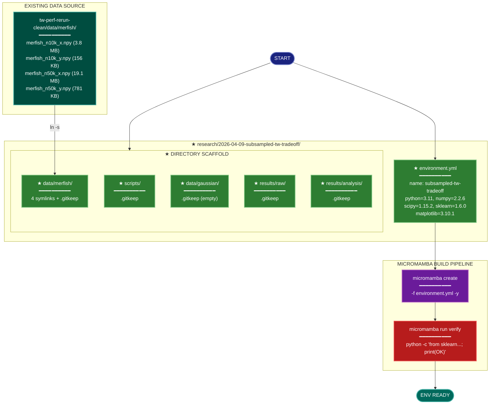

# Implementation Plan: subsampled-tw-tradeoff Foundation (groupA)

## Summary

Create the experiment directory skeleton at `research/2026-04-09-subsampled-tw-tradeoff/`, write the `environment.yml`, symlink the four MERFISH fixture files from the prior experiment, build the micromamba environment, and verify it. This produces the runnable Python environment and populated `data/` tree that all subsequent experiment groups depend on.

All work is in the repo root `/home/talon/projects/spectral-init/`. No Rust code is touched.

## Proposed Architecture



**Color Legend:**
| Color | Category | Description |
|-------|----------|-------------|
| Dark Blue | Terminal | Start point |
| Teal | Existing Data | Source MERFISH fixture files |
| Green | New Component | New directories and config files |
| Purple | Build | micromamba create step |
| Red | Quality Gate | Environment verification |
| Dark Teal | Output | Ready environment |

**Lens Used:** Development — this plan is entirely about creating project structure, writing an environment spec, and running the build/verification pipeline. No runtime logic, data transformations, or concurrency patterns are involved.

## Tests

The "tests" for this foundation group are shell-executable verification assertions. They should all fail before implementation and pass after.

```bash
# T1: Experiment root and all required subdirectories exist
EXPROOT="/home/talon/projects/spectral-init/research/2026-04-09-subsampled-tw-tradeoff"
test -d "$EXPROOT/scripts"           || echo "FAIL: scripts/ missing"
test -d "$EXPROOT/data/merfish"      || echo "FAIL: data/merfish/ missing"
test -d "$EXPROOT/data/gaussian"     || echo "FAIL: data/gaussian/ missing"
test -d "$EXPROOT/results/raw"       || echo "FAIL: results/raw/ missing"
test -d "$EXPROOT/results/analysis"  || echo "FAIL: results/analysis/ missing"

# T2: .gitkeep files exist in every leaf directory
for d in scripts data/merfish data/gaussian results/raw results/analysis; do
    test -f "$EXPROOT/$d/.gitkeep" || echo "FAIL: $d/.gitkeep missing"
done

# T3: environment.yml exists with correct content
test -f "$EXPROOT/environment.yml" || echo "FAIL: environment.yml missing"
grep -q "name: subsampled-tw-tradeoff" "$EXPROOT/environment.yml" || echo "FAIL: wrong env name"
grep -q "python=3.11"              "$EXPROOT/environment.yml" || echo "FAIL: python version"
grep -q "numpy=2.2.6"              "$EXPROOT/environment.yml" || echo "FAIL: numpy version"
grep -q "scipy=1.15.2"             "$EXPROOT/environment.yml" || echo "FAIL: scipy version"
grep -q "scikit-learn=1.6.0"       "$EXPROOT/environment.yml" || echo "FAIL: sklearn version"
grep -q "matplotlib=3.10.1"        "$EXPROOT/environment.yml" || echo "FAIL: matplotlib version"

# T4: MERFISH symlinks resolve to valid files
SRC="/home/talon/projects/spectral-init/research/2026-04-05-tw-perf-rerun-clean/data/merfish"
for f in merfish_n10k_x.npy merfish_n10k_y.npy merfish_n50k_x.npy merfish_n50k_y.npy; do
    test -f "$EXPROOT/data/merfish/$f" || echo "FAIL: $f not accessible"
done

# T5: Environment builds and sklearn imports correctly (REQ-P1-005)
micromamba run -n subsampled-tw-tradeoff \
    python -c "from sklearn.manifold import trustworthiness; print('OK')" \
    | grep -q "OK" || echo "FAIL: sklearn import check failed"
```

## Implementation Steps

### Step 1 — Create directory scaffold

From `/home/talon/projects/spectral-init/`:

```bash
EXPROOT="research/2026-04-09-subsampled-tw-tradeoff"
mkdir -p \
    "$EXPROOT/scripts" \
    "$EXPROOT/data/merfish" \
    "$EXPROOT/data/gaussian" \
    "$EXPROOT/results/raw" \
    "$EXPROOT/results/analysis"
```

This satisfies REQ-P1-001.

### Step 2 — Add .gitkeep files to all leaf directories

```bash
EXPROOT="research/2026-04-09-subsampled-tw-tradeoff"
touch \
    "$EXPROOT/scripts/.gitkeep" \
    "$EXPROOT/data/merfish/.gitkeep" \
    "$EXPROOT/data/gaussian/.gitkeep" \
    "$EXPROOT/results/raw/.gitkeep" \
    "$EXPROOT/results/analysis/.gitkeep"
```

Follows the project convention confirmed in every existing experiment directory.

### Step 3 — Write environment.yml

Create `research/2026-04-09-subsampled-tw-tradeoff/environment.yml` with the exact content required by REQ-P1-002:

```yaml
name: subsampled-tw-tradeoff
channels:
  - conda-forge
dependencies:
  - python=3.11
  - numpy=2.2.6
  - scipy=1.15.2
  - scikit-learn=1.6.0
  - matplotlib=3.10.1
```

No `pip` subsection, no `statsmodels`, no Rust toolchain comment (this experiment is Python-only). This satisfies REQ-P1-002.

### Step 4 — Symlink MERFISH fixture files

```bash
EXPROOT="/home/talon/projects/spectral-init/research/2026-04-09-subsampled-tw-tradeoff"
SRC="/home/talon/projects/spectral-init/research/2026-04-05-tw-perf-rerun-clean/data/merfish"

for f in merfish_n10k_x.npy merfish_n10k_y.npy merfish_n50k_x.npy merfish_n50k_y.npy; do
    ln -s "$SRC/$f" "$EXPROOT/data/merfish/$f"
done
```

Use absolute paths for symlinks so they resolve correctly regardless of working directory. If `ln -s` fails for any file (e.g., filesystem restriction), fall back to `cp "$SRC/$f" "$EXPROOT/data/merfish/$f"` for that file. This satisfies REQ-P1-003.

### Step 5 — Build the micromamba environment

```bash
cd /home/talon/projects/spectral-init/research/2026-04-09-subsampled-tw-tradeoff
micromamba create -f environment.yml -y
```

This satisfies REQ-P1-004.

### Step 6 — Verify the environment

```bash
micromamba run -n subsampled-tw-tradeoff \
    python -c "from sklearn.manifold import trustworthiness; print('OK')"
```

Expected output: `OK`. This satisfies REQ-P1-005.

## Verification

Run all tests from the Tests section above. All assertions must pass with no FAIL lines printed.

Final checklist:
- [ ] `research/2026-04-09-subsampled-tw-tradeoff/` and all 5 subdirectories exist
- [ ] `.gitkeep` in every leaf directory (5 files)
- [ ] `environment.yml` present with exact package versions from REQ-P1-002
- [ ] 4 MERFISH files accessible under `data/merfish/` (symlinks or copies)
- [ ] `micromamba run -n subsampled-tw-tradeoff python -c "from sklearn.manifold import trustworthiness; print('OK')"` prints `OK`
- [ ] `data/gaussian/` is present and empty (only `.gitkeep`) — it will be populated by groupB
