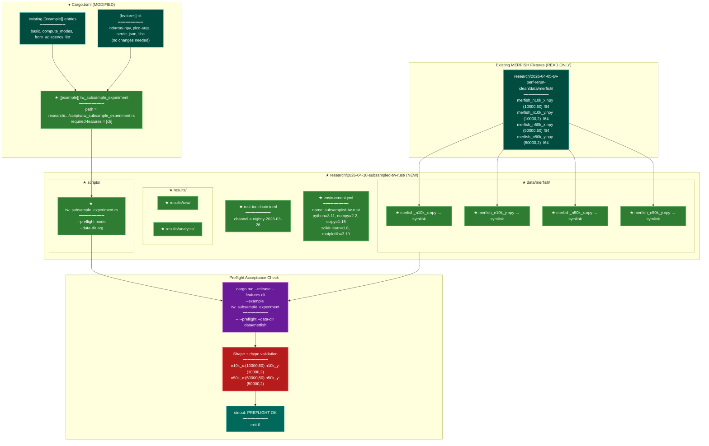

# Implementation Plan: Experiment Scaffold — subsampled-tw-rust (groupA)

## Summary

Create the full experiment scaffold for `research/2026-04-10-subsampled-tw-rust/`: directory
tree with `.gitkeep` sentinels, `rust-toolchain.toml` pinned to `nightly-2026-03-26`,
`environment.yml` for the `subsampled-tw-rust` conda env, four symlinks pointing at the
pre-existing MERFISH fixtures, a `[[example]]` entry in `Cargo.toml`, and the
`tw_subsample_experiment.rs` binary stub implementing `--preflight` mode.

No new Cargo dependencies are required — everything needed (`ndarray-npy`, `pico-args`,
`serde_json`, `libc`) is already gated behind the existing `cli` feature.

## Proposed Architecture



**Color Legend:**
| Color | Category | Description |
|-------|----------|-------------|
| Teal | Existing | Unchanged existing project elements |
| Green | New | New files and components added by this plan |
| Purple | Phase | Build/run command invocation |
| Red | Detector | Shape/dtype validation logic |
| Dark Teal | Output | Acceptance result (PREFLIGHT OK) |

**Lens Used:** Development — the plan is entirely about project structure, build configuration (Cargo.toml), toolchain pinning, and a new binary entry point with no runtime algorithm changes.

## Tests

These are manual acceptance tests (no new `#[test]` harness needed for a scaffold task):

1. **Compilation test** — binary compiles cleanly:
   ```
   cargo build --release --features cli --example tw_subsample_experiment
   ```
   Expected: exits 0, no errors.

2. **Preflight acceptance** — the stated acceptance criterion:
   ```
   cargo run --release --features cli --example tw_subsample_experiment \
     -- --preflight --data-dir research/2026-04-10-subsampled-tw-rust/data/merfish
   ```
   Expected stdout: `PREFLIGHT OK`, exit 0.

3. **Preflight failure path** — pass a nonexistent dir:
   ```
   cargo run --release --features cli --example tw_subsample_experiment \
     -- --preflight --data-dir /nonexistent
   ```
   Expected stdout: `PREFLIGHT FAILED: ...`, exit 1.

4. **Symlinks resolve** — each symlink points to a real file:
   ```
   ls -la research/2026-04-10-subsampled-tw-rust/data/merfish/
   ```
   Expected: all four `.npy` entries show as symlinks resolving to the source dir.

## Implementation Steps

### Step 1 — Create the directory tree

Create the following directories (with `.gitkeep` sentinel files in leaf dirs, matching
the pattern used by `2026-04-05-tw-perf-rerun-clean`):

```
research/2026-04-10-subsampled-tw-rust/
research/2026-04-10-subsampled-tw-rust/scripts/
research/2026-04-10-subsampled-tw-rust/data/merfish/
research/2026-04-10-subsampled-tw-rust/results/raw/
research/2026-04-10-subsampled-tw-rust/results/analysis/
```

Place a `.gitkeep` in `scripts/`, `data/merfish/`, `results/raw/`, and
`results/analysis/`.

### Step 2 — Create `rust-toolchain.toml`

Create `research/2026-04-10-subsampled-tw-rust/rust-toolchain.toml`:

```toml
# Rust toolchain pinned for subsampled-tw-rust experiment reproducibility.
# Exact nightly used: rustc 1.96.0-nightly (23903d01c 2026-03-26)
[toolchain]
channel = "nightly-2026-03-26"
```

### Step 3 — Create `environment.yml`

Create `research/2026-04-10-subsampled-tw-rust/environment.yml`:

```yaml
name: subsampled-tw-rust
# Rust toolchain: nightly-2026-03-26 (see rust-toolchain.toml)
# Install via: rustup toolchain install nightly-2026-03-26
channels:
  - conda-forge
dependencies:
  - python=3.11
  - numpy=2.2
  - scipy=1.15
  - scikit-learn=1.6
  - matplotlib=3.10
  - pip
```

### Step 4 — Create symlinks for MERFISH fixtures

Source path (confirmed to contain all four files):
`research/2026-04-05-tw-perf-rerun-clean/data/merfish/`

Create relative symlinks inside `research/2026-04-10-subsampled-tw-rust/data/merfish/`
pointing back to the source dir using relative paths (so the repo is portable):

```
merfish_n10k_x.npy -> ../../../2026-04-05-tw-perf-rerun-clean/data/merfish/merfish_n10k_x.npy
merfish_n10k_y.npy -> ../../../2026-04-05-tw-perf-rerun-clean/data/merfish/merfish_n10k_y.npy
merfish_n50k_x.npy -> ../../../2026-04-05-tw-perf-rerun-clean/data/merfish/merfish_n50k_x.npy
merfish_n50k_y.npy -> ../../../2026-04-05-tw-perf-rerun-clean/data/merfish/merfish_n50k_y.npy
```

Use `ln -s` with relative targets so the links work from any clone location.

### Step 5 — Add `[[example]]` entry to `Cargo.toml`

Append after the last existing `[[example]]` block (line 227, after `from_adjacency_list`):

```toml
[[example]]
name = "tw_subsample_experiment"
path = "research/2026-04-10-subsampled-tw-rust/scripts/tw_subsample_experiment.rs"
required-features = ["cli"]
```

### Step 6 — Write the experiment binary stub

Create `research/2026-04-10-subsampled-tw-rust/scripts/tw_subsample_experiment.rs`.

The binary must:
- Parse `--preflight` flag (boolean) and `--data-dir <path>` argument via `pico_args`
- In preflight mode:
  1. For each of the four fixture filenames, check the file exists
  2. Load each file as `ndarray::Array2<f64>` via `ndarray_npy::read_npy`
  3. Validate shape: `n10k_x` → `[10000, 50]`, `n10k_y` → `[10000, 2]`,
     `n50k_x` → `[50000, 50]`, `n50k_y` → `[50000, 2]`
  4. Print `PREFLIGHT OK` and exit 0 on success; print `PREFLIGHT FAILED: {reason}` and
     exit 1 on any failure
- When `--preflight` is not passed: print a placeholder message and exit 0 (full
  implementation is groupB)

```rust
//! Experiment binary: subsampled trustworthiness / Rust vs Python tradeoff study.
//!
//! Usage:
//!   tw_subsample_experiment --preflight --data-dir <path>
//!   tw_subsample_experiment [other flags to be added in groupB]
//!
//! --preflight: verify fixture files exist with correct shapes and dtype, then exit.

fn main() {
    if let Err(e) = run() {
        eprintln!("Error: {e}");
        std::process::exit(1);
    }
}

fn run() -> Result<(), Box<dyn std::error::Error>> {
    let mut pargs = pico_args::Arguments::from_env();

    let preflight: bool = pargs.contains("--preflight");
    let data_dir: Option<std::path::PathBuf> = pargs.opt_value_from_str("--data-dir")?;

    if preflight {
        let dir = data_dir.ok_or("--preflight requires --data-dir")?;
        run_preflight(&dir)?;
        return Ok(());
    }

    // GroupB will implement the full experiment here.
    println!("tw_subsample_experiment: use --preflight to verify fixtures. Full experiment TBD.");
    Ok(())
}

/// Verify all four MERFISH fixture files exist, load as f64, and check shapes.
fn run_preflight(data_dir: &std::path::Path) -> Result<(), Box<dyn std::error::Error>> {
    let fixtures: &[(&str, [usize; 2])] = &[
        ("merfish_n10k_x.npy", [10000, 50]),
        ("merfish_n10k_y.npy", [10000, 2]),
        ("merfish_n50k_x.npy", [50000, 50]),
        ("merfish_n50k_y.npy", [50000, 2]),
    ];

    for (filename, expected_shape) in fixtures {
        let path = data_dir.join(filename);
        if !path.exists() {
            println!("PREFLIGHT FAILED: missing fixture: {}", path.display());
            std::process::exit(1);
        }
        let arr: ndarray::Array2<f64> = ndarray_npy::read_npy(&path).map_err(|e| {
            format!(
                "PREFLIGHT FAILED: cannot load {} as f64 array: {e}",
                path.display()
            )
        })?;
        let shape = arr.shape();
        if shape[0] != expected_shape[0] || shape[1] != expected_shape[1] {
            println!(
                "PREFLIGHT FAILED: {} has shape {:?}, expected {:?}",
                filename, shape, expected_shape
            );
            std::process::exit(1);
        }
    }

    println!("PREFLIGHT OK");
    Ok(())
}
```

> **Note on error handling:** The `run_preflight` function maps `read_npy` errors through
> `?` but also uses `println!` + `exit(1)` for shape mismatches, matching the spec's
> requirement that failure prints to stdout (not stderr). The `run()` function's `Err`
> path prints to stderr via `eprintln!` (for unexpected I/O errors like a bad path type),
> which is fine — those aren't expected preflight outcomes.

## Verification

1. **Directory tree exists:**
   ```
   ls research/2026-04-10-subsampled-tw-rust/
   # → scripts/  data/  results/  rust-toolchain.toml  environment.yml
   ls research/2026-04-10-subsampled-tw-rust/results/
   # → raw/  analysis/
   ```

2. **Symlinks resolve correctly:**
   ```
   ls -la research/2026-04-10-subsampled-tw-rust/data/merfish/
   # Each .npy entry shows -> ../../../2026-04-05-tw-perf-rerun-clean/data/merfish/...
   file research/2026-04-10-subsampled-tw-rust/data/merfish/merfish_n10k_x.npy
   # → NPY data file (confirming the symlink resolves to a real .npy)
   ```

3. **Cargo registration is valid:**
   ```
   cargo metadata --no-deps --format-version 1 | python3 -c \
     "import json,sys; m=json.load(sys.stdin); \
      print([t for t in m['packages'][0]['targets'] if t['name']=='tw_subsample_experiment'])"
   # → Shows the target with kind ["example"]
   ```

4. **Compilation:**
   ```
   cargo build --release --features cli --example tw_subsample_experiment
   # exits 0
   ```

5. **Preflight OK (acceptance criterion):**
   ```
   cargo run --release --features cli --example tw_subsample_experiment \
     -- --preflight --data-dir research/2026-04-10-subsampled-tw-rust/data/merfish
   # stdout: PREFLIGHT OK
   # exit: 0
   ```

6. **Preflight FAILED path:**
   ```
   cargo run --release --features cli --example tw_subsample_experiment \
     -- --preflight --data-dir /nonexistent
   # stdout: PREFLIGHT FAILED: missing fixture: /nonexistent/merfish_n10k_x.npy
   # exit: 1
   ```
