# Implementation Plan: Experiment Binary — tw_subsample_experiment (groupB)

## Summary

Implement the full `tw_subsample_experiment.rs` example binary with four modes (`exact`, `subsample`, `sanity`, `preflight`), extending the groupA stub. This is the core measurement engine for the subsampled trustworthiness tradeoff study. The binary runs trustworthiness trials, records wall-clock timings, and emits per-trial JSON consumed by groupC's orchestration scripts.

The single required library change is making `dist_sq_2d_avx2_batch` public so the example binary can inline the per-row trustworthiness pipeline with a subsampled outer iterator.

## Proposed Architecture

```mermaid
%%{init: {'flowchart': {'nodeSpacing': 50, 'rankSpacing': 60, 'curve': 'basis'}}}%%
flowchart TB
    classDef cli fill:#1a237e,stroke:#7986cb,stroke-width:2px,color:#fff;
    classDef stateNode fill:#004d40,stroke:#4db6ac,stroke-width:2px,color:#fff;
    classDef handler fill:#e65100,stroke:#ffb74d,stroke-width:2px,color:#fff;
    classDef phase fill:#6a1b9a,stroke:#ba68c8,stroke-width:2px,color:#fff;
    classDef newComponent fill:#2e7d32,stroke:#81c784,stroke-width:2px,color:#fff;
    classDef output fill:#00695c,stroke:#4db6ac,stroke-width:2px,color:#fff;
    classDef detector fill:#b71c1c,stroke:#ef5350,stroke-width:2px,color:#fff;
    classDef terminal fill:#1a237e,stroke:#7986cb,stroke-width:2px,color:#fff;

    START([START])
    ERROR([ERROR — exit 1])

    subgraph CLI ["★ CLI Parsing"]
        direction TB
        ARGS["★ parse_args<br/>━━━━━━━━━━<br/>--mode, --x, --y, --k,<br/>--m, --seed, --reps,<br/>--warmup, --output,<br/>--data-dir"]
        MODE{"★ Mode?"}
    end

    subgraph Preflight ["Preflight Mode"]
        direction TB
        PF["run_preflight<br/>━━━━━━━━━━<br/>Validate 4 .npy fixtures"]
        PFOK([PREFLIGHT OK])
    end

    subgraph Gate ["★ Determinism Gate"]
        direction TB
        DET["★ determinism_gate<br/>━━━━━━━━━━<br/>2x trustworthiness call<br/>abort if delta > 1e-6"]
    end

    subgraph LoadData ["★ Data Loading"]
        direction TB
        LOAD["★ load .npy files<br/>━━━━━━━━━━<br/>x: Array2 f64<br/>y: Array2 f64"]
    end

    subgraph ExactMode ["★ Exact Mode"]
        direction TB
        EW["★ Warmup loop<br/>━━━━━━━━━━<br/>warmup untimed iters"]
        ET["★ Timed loop<br/>━━━━━━━━━━<br/>reps timed iters<br/>record wall_exact_ms"]
    end

    subgraph SubMode ["★ Subsample Mode"]
        direction TB
        SAMPLE["★ Sample indices<br/>━━━━━━━━━━<br/>rand::seq::index::sample<br/>StdRng seed"]
        SW["★ Warmup both<br/>━━━━━━━━━━<br/>exact + subsample warmup"]
        ST["★ Timed both<br/>━━━━━━━━━━<br/>exact: library call<br/>sub: inline pipeline"]
        INLINE["★ trustworthiness_subsample<br/>━━━━━━━━━━<br/>Inline per-row pipeline<br/>query_idx.into_par_iter<br/>denom: m*k*(2n-3k-1)"]
    end

    subgraph SanityMode ["★ Sanity Mode"]
        direction TB
        SALL["★ All indices<br/>━━━━━━━━━━<br/>query_idx = 0..n<br/>m = n, no RNG"]
        SRUN["★ Run exact + subsample<br/>━━━━━━━━━━<br/>Compare T values"]
        SCHECK{"★ abs_delta_t<br/>< 1e-10?"}
    end

    subgraph Output ["★ JSON Output"]
        direction TB
        META["★ Collect metadata<br/>━━━━━━━━━━<br/>cpu_model, core_count<br/>rust_version, git_commit"]
        JSON["★ Write JSON<br/>━━━━━━━━━━<br/>serde_json to --output"]
    end

    DONE([COMPLETE])

    START --> ARGS
    ARGS --> MODE
    MODE -->|"preflight"| PF
    PF --> PFOK
    MODE -->|"exact / subsample / sanity"| LOAD
    LOAD --> DET
    DET -->|"delta > 1e-6"| ERROR
    DET -->|"OK"| MODE2

    MODE2{"★ Dispatch<br/>by mode"}

    MODE2 -->|"exact"| EW
    EW --> ET
    ET --> META

    MODE2 -->|"subsample"| SAMPLE
    SAMPLE --> SW
    SW --> ST
    ST --> INLINE
    INLINE --> META

    MODE2 -->|"sanity"| SALL
    SALL --> SRUN
    SRUN --> SCHECK
    SCHECK -->|"yes"| META
    SCHECK -->|"no — warn"| META

    META --> JSON
    JSON --> DONE

    class START,PFOK,ERROR,DONE terminal;
    class ARGS,MODE cli;
    class PF handler;
    class DET,SCHECK detector;
    class LOAD,SAMPLE,SALL stateNode;
    class EW,ET,SW,ST,SRUN newComponent;
    class INLINE newComponent;
    class MODE2 cli;
    class META,JSON output;
```



**Color Legend:**
| Color | Category | Description |
|-------|----------|-------------|
| Dark Blue | Terminal/CLI | Entry/exit points and CLI parsing |
| Teal | State | Data loading, index generation |
| Green | New Component | All new implementation (modes, pipeline, warmup/timed loops) |
| Red | Detector | Validation gates (determinism, sanity check) |
| Dark Teal | Output | Metadata collection and JSON serialization |

**Lens Used:** Process Flow — the binary is a sequential pipeline with mode-based branching, a determinism gate, warmup/timed iteration loops, and JSON output.

## Tests

All tests are validation steps run against the compiled binary. They should fail before implementation and pass after.

### T1: Compilation
```bash
cargo build --release --features cli --example tw_subsample_experiment
```
**Currently:** Compiles (stub). **After:** Still compiles with full implementation.

### T2: Preflight Regression
```bash
cargo run --release --features cli --example tw_subsample_experiment -- \
  --mode preflight --data-dir research/2026-04-10-subsampled-tw-rust/data/merfish
```
**Expected:** Prints `PREFLIGHT OK` and exits 0. Must not regress from groupA.

### T3: Exact Mode JSON
```bash
cargo run --release --features cli --example tw_subsample_experiment -- \
  --mode exact --x data/merfish/merfish_n10k_x.npy --y data/merfish/merfish_n10k_y.npy \
  --k 15 --reps 2 --warmup 1 --output /tmp/exact_test.json
```
**Expected:** JSON with `mode: "exact"`, `t_exact` in `(0, 1)`, `wall_exact_ms` array of length 2, `t_sub: null`, `wall_sub_ms: null`. All metadata fields present.

### T4: Subsample Mode JSON
```bash
cargo run --release --features cli --example tw_subsample_experiment -- \
  --mode subsample --x data/merfish/merfish_n10k_x.npy --y data/merfish/merfish_n10k_y.npy \
  --k 15 --m 2000 --seed 0 --reps 2 --warmup 1 --output /tmp/sub_test.json
```
**Expected:** JSON with `mode: "subsample"`, both `t_exact` and `t_sub` in `(0, 1)`, `abs_delta_t >= 0`, `wall_exact_ms` and `wall_sub_ms` arrays of length 2.

### T5: Sanity Acceptance (P2-ACCEPT)
```bash
cargo run --release --features cli --example tw_subsample_experiment -- \
  --mode sanity --x data/merfish/merfish_n10k_x.npy --y data/merfish/merfish_n10k_y.npy \
  --k 15 --m 10000 --output /tmp/sanity_test.json
```
**Expected:** JSON with `abs_delta_t < 1e-10`. This validates the normalization identity: when `m == n`, the subsampled formula `m*k*(2n-3k-1)` equals the exact formula `n*k*(2n-3k-1)`, and every row is included, so `T_sub == T_exact`.

### T6: Determinism Gate
```bash
# Implicit: the determinism gate runs before warmup in all non-preflight modes.
# T3, T4, T5 all exercise it. If Rayon is non-deterministic, they will fail with
# a clear error message and non-zero exit.
```

## Implementation Steps

### Step 1: Make `dist_sq_2d_avx2_batch` public

**File:** `src/metrics.rs`, line 463

Change:
```rust
unsafe fn dist_sq_2d_avx2_batch(yi: &[f64], y_flat: &[f64], n: usize, out: &mut [f64]) {
```
To:
```rust
#[doc(hidden)]
pub unsafe fn dist_sq_2d_avx2_batch(yi: &[f64], y_flat: &[f64], n: usize, out: &mut [f64]) {
```

Also add a re-export in `src/lib.rs` under the `cli` feature gate (alongside the existing `trustworthiness` re-export at line 213-214):
```rust
#[cfg(all(feature = "cli", not(feature = "testing")))]
pub use crate::metrics::trustworthiness;

#[cfg(all(feature = "cli", not(feature = "testing")))]
#[cfg(target_arch = "x86_64")]
#[doc(hidden)]
pub use crate::metrics::dist_sq_2d_avx2_batch;
```

And in the `testing` re-export block (line 199-208), add `dist_sq_2d_avx2_batch` to the `use` list (gated by `target_arch = "x86_64"`):
```rust
#[cfg(feature = "testing")]
#[cfg(target_arch = "x86_64")]
#[doc(hidden)]
pub use crate::metrics::dist_sq_2d_avx2_batch;
```

Also re-export `dist_sq_avx2_looped` under the same gates so the example binary can use `spectral_init::dist_sq_avx2_looped` directly (it's already `pub` in `metrics` but not re-exported at the crate root under `cli`):
```rust
#[cfg(all(feature = "cli", not(feature = "testing")))]
#[cfg(all(target_arch = "x86_64", target_feature = "avx2", target_feature = "fma"))]
#[doc(hidden)]
pub use crate::metrics::dist_sq_avx2_looped;

#[cfg(feature = "testing")]
#[cfg(all(target_arch = "x86_64", target_feature = "avx2", target_feature = "fma"))]
#[doc(hidden)]
pub use crate::metrics::dist_sq_avx2_looped;
```

**Rationale:** The SIMD kernels are implementation details, not public API. `#[doc(hidden)]` keeps them out of docs while making them accessible to the experiment binary. The `cli`/`testing` gating matches the existing pattern for `trustworthiness`. Alternatively, the binary can access them via `spectral_init::metrics::dist_sq_avx2_looped` and `spectral_init::metrics::dist_sq_2d_avx2_batch` since `metrics` is `pub mod` — in which case the re-exports are convenience only. Either path works; choose whichever is simpler.

**Validates:** T1 (compilation).

### Step 2: Rewrite CLI argument parsing

**File:** `research/2026-04-10-subsampled-tw-rust/scripts/tw_subsample_experiment.rs`

Replace the entire stub with a structured binary. The top-level structure:

```rust
use std::path::PathBuf;

fn main() {
    if let Err(e) = run() {
        eprintln!("Error: {e}");
        std::process::exit(1);
    }
}

fn run() -> Result<(), Box<dyn std::error::Error>> {
    let mut pargs = pico_args::Arguments::from_env();

    let mode: String = pargs.value_from_str("--mode")?;

    match mode.as_str() {
        "preflight" => {
            let data_dir: PathBuf = pargs.value_from_str("--data-dir")?;
            run_preflight(&data_dir)?;
        }
        "exact" | "subsample" | "sanity" => {
            let x_path: PathBuf = pargs.value_from_str("--x")?;
            let y_path: PathBuf = pargs.value_from_str("--y")?;
            let k: usize = pargs.opt_value_from_str("--k")?.unwrap_or(15);
            let m: Option<usize> = pargs.opt_value_from_str("--m")?;
            let seed: Option<u64> = pargs.opt_value_from_str("--seed")?;
            let reps: usize = pargs.opt_value_from_str("--reps")?.unwrap_or(5);
            let warmup: usize = pargs.opt_value_from_str("--warmup")?.unwrap_or(1);
            let output: PathBuf = pargs.value_from_str("--output")?;

            run_experiment(&mode, &x_path, &y_path, k, m, seed, reps, warmup, &output)?;
        }
        other => return Err(format!("unknown mode: {other}").into()),
    }
    Ok(())
}
```

Keep `run_preflight()` unchanged from the groupA stub, except switch its invocation from `--preflight` boolean to `--mode preflight`.

**Validates:** T1 (compilation), T2 (preflight regression — `--mode preflight --data-dir ...` must still print `PREFLIGHT OK`).

### Step 3: Implement `run_experiment` dispatcher with data loading and determinism gate

```rust
fn run_experiment(
    mode: &str,
    x_path: &Path, y_path: &Path,
    k: usize, m: Option<usize>, seed: Option<u64>,
    reps: usize, warmup: usize, output: &Path,
) -> Result<(), Box<dyn std::error::Error>> {
    // Load data
    let x: ndarray::Array2<f64> = ndarray_npy::read_npy(x_path)?;
    let y: ndarray::Array2<f64> = ndarray_npy::read_npy(y_path)?;
    let n = x.nrows();

    // Determinism gate (P2-DETERMINISM)
    determinism_gate(x.view(), y.view(), k)?;

    // Dispatch by mode
    match mode {
        "exact" => run_exact(x.view(), y.view(), n, k, reps, warmup, output)?,
        "subsample" => {
            let m = m.ok_or("--m required for subsample mode")?;
            let seed = seed.ok_or("--seed required for subsample mode")?;
            run_subsample(x.view(), y.view(), n, k, m, seed, reps, warmup, output)?;
        }
        "sanity" => {
            let m = m.ok_or("--m required for sanity mode")?;
            run_sanity(x.view(), y.view(), n, k, m, output)?;
        }
        _ => unreachable!(),
    }
    Ok(())
}

fn determinism_gate(
    x: ndarray::ArrayView2<f64>,
    y: ndarray::ArrayView2<f64>,
    k: usize,
) -> Result<(), Box<dyn std::error::Error>> {
    let t1 = spectral_init::trustworthiness(x, y, k);
    let t2 = spectral_init::trustworthiness(x, y, k);
    let delta = (t1 - t2).abs();
    if delta > 1e-6 {
        eprintln!(
            "FATAL: Rayon non-determinism detected: T1={t1}, T2={t2}, |delta|={delta}"
        );
        std::process::exit(1);
    }
    Ok(())
}
```

**Validates:** T6 (determinism gate).

### Step 4: Implement `run_exact`

```rust
fn run_exact(
    x: ArrayView2<f64>, y: ArrayView2<f64>,
    n: usize, k: usize, reps: usize, warmup: usize,
    output: &Path,
) -> Result<(), Box<dyn std::error::Error>> {
    // Warmup
    let warmup_start = std::time::Instant::now();
    let mut t_exact = 0.0;
    for _ in 0..warmup {
        t_exact = spectral_init::trustworthiness(x, y, k);
    }
    let warmup_exact_ms = warmup_start.elapsed().as_secs_f64() * 1000.0;

    // Timed reps
    let mut wall_exact_ms = Vec::with_capacity(reps);
    for _ in 0..reps {
        let start = std::time::Instant::now();
        t_exact = spectral_init::trustworthiness(x, y, k);
        wall_exact_ms.push(start.elapsed().as_secs_f64() * 1000.0);
    }

    write_json(output, &TrialResult {
        n, m: None, k, seed: None, mode: "exact".into(),
        t_exact: Some(t_exact), t_sub: None, abs_delta_t: None,
        wall_exact_ms: Some(wall_exact_ms), wall_sub_ms: None,
        warmup_exact_ms: Some(warmup_exact_ms), warmup_sub_ms: None,
        ..collect_metadata()
    })
}
```

**Validates:** T3 (exact mode JSON).

### Step 5: Implement `trustworthiness_subsample` — inline per-row pipeline

This is the critical function. It must be an exact copy of `src/metrics.rs:trustworthiness()` (line 518) with two changes:

1. The outer iterator is `query_idx.into_par_iter()` instead of `(0..n).into_par_iter()`
2. The normalization denominator is `m * k * (2*n - 3*k - 1)` instead of `n * k * (2*n - 3*k - 1)`

The inner per-row pipeline (X distances, X partial sort, Y distances, Y partial sort, rank-counting penalty) must be **identical** to the library's implementation:

```rust
fn trustworthiness_subsample(
    x: ndarray::ArrayView2<f64>,
    y: ndarray::ArrayView2<f64>,
    k: usize,
    query_idx: &[usize],
) -> f64 {
    use rayon::prelude::*;
    use std::cell::RefCell;
    use std::collections::HashSet;

    let n = x.nrows();
    let m = query_idx.len();
    let d_x = x.ncols();
    let d_y = y.ncols();

    assert!(k > 0 && k < n / 2, "k must be in (0, n/2)");

    // Runtime SIMD detection — identical to library
    #[cfg(target_arch = "x86_64")]
    let use_avx2 = is_x86_feature_detected!("avx2") && is_x86_feature_detected!("fma");
    #[cfg(not(target_arch = "x86_64"))]
    let use_avx2 = false;

    #[cfg(target_arch = "x86_64")]
    let use_avx2_y = d_y == 2 && y.is_standard_layout() && is_x86_feature_detected!("avx2");
    #[cfg(not(target_arch = "x86_64"))]
    let use_avx2_y = false;

    // Pre-compute y_flat for batch SIMD (same as library)
    let y_flat: Option<&[f64]> = if use_avx2_y { y.as_slice() } else { None };

    // Thread-local scratch buffers — same pattern as library
    thread_local! {
        static SUB_DIST_X:    RefCell<Vec<f64>>   = const { RefCell::new(Vec::new()) };
        static SUB_INDICES:   RefCell<Vec<usize>> = const { RefCell::new(Vec::new()) };
        static SUB_DIST_Y:    RefCell<Vec<f64>>   = const { RefCell::new(Vec::new()) };
        static SUB_INDICES_Y: RefCell<Vec<usize>> = const { RefCell::new(Vec::new()) };
    }

    // THE KEY CHANGE: iterate over query_idx, not 0..n
    let penalty_sum: f64 = query_idx.into_par_iter().map(|&i| {
        SUB_DIST_X.with(|dx_cell| {
            SUB_INDICES.with(|ix_cell| {
                let mut dist_x = dx_cell.borrow_mut();
                let mut indices = ix_cell.borrow_mut();

                // Phase A: X distances (identical to library)
                dist_x.clear();
                dist_x.resize(n, 0.0);
                let xi = x.row(i);
                if use_avx2 && d_x >= 10 && x.is_standard_layout() {
                    let si = xi.as_slice().unwrap();
                    for j in 0..n {
                        let sj = x.row(j).as_slice().unwrap();
                        dist_x[j] = unsafe {
                            spectral_init::metrics::dist_sq_avx2_looped(si, sj)
                        };
                    }
                } else {
                    for j in 0..n {
                        dist_x[j] = xi.iter().zip(x.row(j).iter())
                            .map(|(a, b)| (a - b) * (a - b)).sum();
                    }
                }

                // Phase B: X partial sort + kNN set (identical to library)
                indices.clear();
                indices.extend(0..n);
                indices.select_nth_unstable_by(k, |&a, &b| {
                    dist_x[a].total_cmp(&dist_x[b]).then(a.cmp(&b))
                });
                let knn_x_set: HashSet<usize> = indices[..=k].iter()
                    .filter(|&&m_idx| m_idx != i).copied().collect();

                SUB_DIST_Y.with(|dy_cell| {
                    SUB_INDICES_Y.with(|iy_cell| {
                        let mut dist_y = dy_cell.borrow_mut();
                        let mut indices_y = iy_cell.borrow_mut();

                        // Phase C: Y distances (identical to library)
                        dist_y.clear();
                        dist_y.resize(n, 0.0);
                        if let Some(yf) = y_flat {
                            let yi_slice = &yf[i * 2..(i + 1) * 2];
                            unsafe {
                                spectral_init::metrics::dist_sq_2d_avx2_batch(
                                    yi_slice, yf, n, &mut dist_y,
                                );
                            }
                        } else {
                            let yi = y.row(i);
                            for j in 0..n {
                                dist_y[j] = yi.iter().zip(y.row(j).iter())
                                    .map(|(a, b)| (a - b) * (a - b)).sum();
                            }
                        }
                        dist_y[i] = f64::INFINITY; // self-exclusion

                        // Phase C': Y partial sort (identical to library)
                        indices_y.clear();
                        indices_y.extend(0..n);
                        indices_y.select_nth_unstable_by(k, |&a, &b| {
                            dist_y[a].total_cmp(&dist_y[b]).then(a.cmp(&b))
                        });

                        // Phase D: Penalty (identical to library)
                        let mut row_penalty = 0u64;
                        for &j in &indices_y[..k] {
                            if !knn_x_set.contains(&j) {
                                let dj = dist_x[j];
                                let rank: usize = (0..n)
                                    .filter(|&m_idx| {
                                        dist_x[m_idx] < dj
                                            || (dist_x[m_idx] == dj && m_idx < j)
                                    })
                                    .count();
                                row_penalty += (rank - k) as u64;
                            }
                        }
                        row_penalty as f64
                    })
                })
            })
        })
    }).sum();

    // THE KEY CHANGE: denominator uses m, not n
    let denom = m as f64 * k as f64 * (2 * n).saturating_sub(3 * k + 1) as f64;
    1.0 - penalty_sum * 2.0 / denom
}
```

**Critical correctness notes:**
- The inner pipeline computes distances against ALL `n` points (not just `m`) — only the outer iterator is subsampled.
- The `knn_x_set` uses `indices[..=k]` (inclusive) then filters out self — identical to library.
- The Y self-exclusion `dist_y[i] = f64::INFINITY` is explicit — identical to library.
- The rank counting scans all `n` points — identical to library.
- Thread-local names differ from library (`SUB_DIST_X` vs `COMB_DIST_X`) to avoid collisions if the library function is also called in the same process.

**Validates:** T4 (subsample mode JSON), T5 (sanity acceptance, since sanity calls this with m=n).

### Step 6: Implement `run_subsample`

```rust
fn run_subsample(
    x: ArrayView2<f64>, y: ArrayView2<f64>,
    n: usize, k: usize, m: usize, seed: u64,
    reps: usize, warmup: usize, output: &Path,
) -> Result<(), Box<dyn std::error::Error>> {
    use rand::SeedableRng;

    // Generate subsampled indices
    let mut rng = rand::rngs::StdRng::seed_from_u64(seed);
    let query_idx: Vec<usize> = rand::seq::index::sample(&mut rng, n, m).into_vec();

    // Warmup exact
    let warmup_start = std::time::Instant::now();
    let mut t_exact = 0.0;
    for _ in 0..warmup {
        t_exact = spectral_init::trustworthiness(x, y, k);
    }
    let warmup_exact_ms = warmup_start.elapsed().as_secs_f64() * 1000.0;

    // Warmup subsample
    let warmup_start = std::time::Instant::now();
    let mut t_sub = 0.0;
    for _ in 0..warmup {
        t_sub = trustworthiness_subsample(x, y, k, &query_idx);
    }
    let warmup_sub_ms = warmup_start.elapsed().as_secs_f64() * 1000.0;

    // Timed exact reps
    let mut wall_exact_ms = Vec::with_capacity(reps);
    for _ in 0..reps {
        let start = std::time::Instant::now();
        t_exact = spectral_init::trustworthiness(x, y, k);
        wall_exact_ms.push(start.elapsed().as_secs_f64() * 1000.0);
    }

    // Timed subsample reps
    let mut wall_sub_ms = Vec::with_capacity(reps);
    for _ in 0..reps {
        let start = std::time::Instant::now();
        t_sub = trustworthiness_subsample(x, y, k, &query_idx);
        wall_sub_ms.push(start.elapsed().as_secs_f64() * 1000.0);
    }

    let abs_delta_t = (t_exact - t_sub).abs();

    write_json(output, &TrialResult {
        n, m: Some(m), k, seed: Some(seed), mode: "subsample".into(),
        t_exact: Some(t_exact), t_sub: Some(t_sub), abs_delta_t: Some(abs_delta_t),
        wall_exact_ms: Some(wall_exact_ms), wall_sub_ms: Some(wall_sub_ms),
        warmup_exact_ms: Some(warmup_exact_ms), warmup_sub_ms: Some(warmup_sub_ms),
        ..collect_metadata()
    })
}
```

**Validates:** T4 (subsample mode JSON).

### Step 7: Implement `run_sanity`

```rust
fn run_sanity(
    x: ArrayView2<f64>, y: ArrayView2<f64>,
    n: usize, k: usize, m: usize, output: &Path,
) -> Result<(), Box<dyn std::error::Error>> {
    // All indices, deterministic — no RNG
    let query_idx: Vec<usize> = (0..n).collect();

    // Single run of each (no warmup/reps for sanity — just one measurement)
    let t_exact = spectral_init::trustworthiness(x, y, k);
    let t_sub = trustworthiness_subsample(x, y, k, &query_idx);
    let abs_delta_t = (t_exact - t_sub).abs();

    if abs_delta_t >= 1e-10 {
        eprintln!(
            "WARNING: sanity check failed: abs_delta_t = {abs_delta_t:.2e} >= 1e-10"
        );
    }

    write_json(output, &TrialResult {
        n, m: Some(m), k, seed: None, mode: "sanity".into(),
        t_exact: Some(t_exact), t_sub: Some(t_sub), abs_delta_t: Some(abs_delta_t),
        wall_exact_ms: None, wall_sub_ms: None,
        warmup_exact_ms: None, warmup_sub_ms: None,
        ..collect_metadata()
    })
}
```

**Validates:** T5 (sanity acceptance — `abs_delta_t < 1e-10`).

### Step 8: Implement JSON output and system metadata

Define a `TrialResult` struct with `serde::Serialize`:

```rust
#[derive(serde::Serialize)]
struct TrialResult {
    n: usize,
    m: Option<usize>,
    k: usize,
    seed: Option<u64>,
    mode: String,
    t_exact: Option<f64>,
    t_sub: Option<f64>,
    abs_delta_t: Option<f64>,
    wall_exact_ms: Option<Vec<f64>>,
    wall_sub_ms: Option<Vec<f64>>,
    warmup_exact_ms: Option<f64>,
    warmup_sub_ms: Option<f64>,
    cpu_model: String,
    core_count: usize,
    rust_version: String,
    git_commit: String,
}
```

Metadata collection:

```rust
fn collect_metadata() -> TrialResult { ... }

fn cpu_model() -> String {
    // Read /proc/cpuinfo, find "model name" line
    std::fs::read_to_string("/proc/cpuinfo")
        .ok()
        .and_then(|s| {
            s.lines()
                .find(|l| l.starts_with("model name"))
                .map(|l| l.splitn(2, ':').nth(1).unwrap_or("").trim().to_string())
        })
        .unwrap_or_else(|| "unknown".to_string())
}

fn core_count() -> usize {
    std::thread::available_parallelism()
        .map(|p| p.get())
        .unwrap_or(1)
}

fn rust_version() -> String {
    std::process::Command::new("rustc")
        .arg("--version")
        .output()
        .ok()
        .and_then(|o| String::from_utf8(o.stdout).ok())
        .map(|s| s.trim().to_string())
        .unwrap_or_else(|| "unknown".to_string())
}

fn git_commit() -> String {
    std::process::Command::new("git")
        .args(["rev-parse", "HEAD"])
        .output()
        .ok()
        .and_then(|o| String::from_utf8(o.stdout).ok())
        .map(|s| s.trim().to_string())
        .unwrap_or_else(|| "unknown".to_string())
}

fn write_json(path: &Path, result: &TrialResult) -> Result<(), Box<dyn std::error::Error>> {
    let json = serde_json::to_string_pretty(result)?;
    std::fs::write(path, json)?;
    Ok(())
}
```

`Option<T>` fields serialize as JSON `null` when `None` — this is serde_json's default behavior, matching the P2-JSON requirement.

**Validates:** T3, T4 (correct JSON schema with proper null handling).

### Step 9: Add `serde` derive support for the example binary

The `TrialResult` struct uses `#[derive(serde::Serialize)]`. The `serde` crate is already available as an optional dependency (for the `testing` feature), but example binaries need it under the `cli` feature too. Two options:

**Option A (preferred):** Use `serde_json::json!()` macro instead of derive, avoiding any need for `serde` as a dependency:
```rust
let json = serde_json::json!({
    "n": n,
    "m": m,
    "k": k,
    // ... etc
});
std::fs::write(output, serde_json::to_string_pretty(&json)?)?;
```

**Option B:** Add `"dep:serde"` to the `cli` feature list in `Cargo.toml`:
```toml
cli = ["dep:ndarray-npy", "dep:pico-args", "dep:serde_json", "dep:libc", "dep:serde"]
```

Option A is simpler — it requires no Cargo.toml changes and avoids the derive macro compilation overhead. Use `serde_json::json!()` for the `TrialResult` serialization instead of a derive struct.

**Validates:** T1 (compilation).

## Verification

### Build Verification
```bash
cargo build --release --features cli --example tw_subsample_experiment
```

### Functional Verification (with merfish fixtures)
```bash
DATA_DIR=research/2026-04-10-subsampled-tw-rust/data/merfish

# T2: Preflight regression
cargo run --release --features cli --example tw_subsample_experiment -- \
  --mode preflight --data-dir $DATA_DIR

# T3: Exact mode
cargo run --release --features cli --example tw_subsample_experiment -- \
  --mode exact \
  --x $DATA_DIR/merfish_n10k_x.npy --y $DATA_DIR/merfish_n10k_y.npy \
  --k 15 --reps 2 --warmup 1 --output /tmp/tw_exact.json
cat /tmp/tw_exact.json  # verify JSON schema

# T4: Subsample mode
cargo run --release --features cli --example tw_subsample_experiment -- \
  --mode subsample \
  --x $DATA_DIR/merfish_n10k_x.npy --y $DATA_DIR/merfish_n10k_y.npy \
  --k 15 --m 2000 --seed 0 --reps 2 --warmup 1 --output /tmp/tw_sub.json
cat /tmp/tw_sub.json  # verify JSON schema, t_sub present

# T5: Sanity acceptance (P2-ACCEPT)
cargo run --release --features cli --example tw_subsample_experiment -- \
  --mode sanity \
  --x $DATA_DIR/merfish_n10k_x.npy --y $DATA_DIR/merfish_n10k_y.npy \
  --k 15 --m 10000 --output /tmp/tw_sanity.json
# Verify: abs_delta_t < 1e-10
python3 -c "import json; d=json.load(open('/tmp/tw_sanity.json')); assert d['abs_delta_t'] < 1e-10, f'FAIL: {d[\"abs_delta_t\"]}'; print('SANITY PASS')"
```

### Final Check
```bash
cargo test
```
Ensure no existing tests are broken by the `dist_sq_2d_avx2_batch` visibility change.
