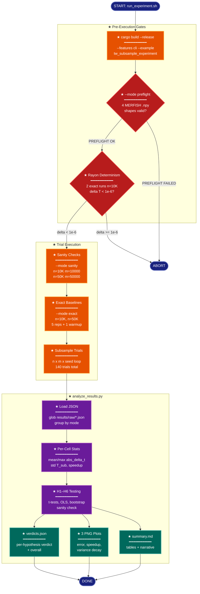

# Implementation Plan: groupC — Orchestration and Analysis Scripts

## Summary

Create three scripts that form the experiment's execution and analysis pipeline:

1. **`utils.py`** — Shared constants (K, SEEDS, M_VALUES, Python reference values) imported by the analysis script.
2. **`analyze_results.py`** — Loads trial JSON from `results/raw/`, computes per-cell statistics, evaluates hypotheses H1–H6 with the specified statistical tests, writes `verdicts.json`, `summary.md`, and three PNG plots.
3. **`run_experiment.sh`** — Shell orchestrator that builds the Rust binary, runs preflight/determinism/sanity gates, executes the full trial matrix (2 sanity + 2 exact + 140 subsample = 144 trials), and invokes the analysis script.

All files go in `research/2026-04-10-subsampled-tw-rust/scripts/`. After groupC, the pipeline is complete and groupD's dry run can execute.

## Proposed Architecture



**Color Legend:**
| Color | Category | Description |
|-------|----------|-------------|
| Dark Blue | Terminal | Start, abort, and completion states |
| Red | Detector | Validation gates with abort-on-failure |
| Orange | Handler | Binary execution stages |
| Purple | Phase | Analysis processing steps |
| Dark Teal | Output | Generated artifacts |

**Lens Used:** Process Flow — the plan implements a multi-stage execution pipeline with conditional abort gates, nested iteration loops, and a data processing chain.

## Tests

### T1: `test_analyze_results.py` — Synthetic trial data, all hypotheses exercised

Create `scripts/test_analyze_results.py` that:

1. **Generates synthetic JSON trial files** in a temporary `results/raw/` directory:
   - 2 sanity files (`sanity_n10000.json`, `sanity_n50000.json`) with `abs_delta_t: 1e-15` → H6 should PASS
   - 2 exact files (`exact_n10000.json`, `exact_n50000.json`) with `wall_exact_ms` arrays
   - 10 subsample files for (n=10000, m=2000, seed=0..9) with realistic `abs_delta_t` values ~0.002 → H1 should PASS
   - Additional subsample files for 2–3 other m-values to exercise H2/H3 regression paths
   - A few (n=50000, m=2000) files for H5

2. **Runs `analyze_results.py`** via subprocess or by importing its `main()` directly.

3. **Asserts:**
   - `verdicts.json` is valid JSON and contains all 6 hypothesis keys
   - H6 verdict is `"PASS"` (sanity data is deterministically correct)
   - H1 verdict is `"PASS"` (synthetic data is well within threshold)
   - Each hypothesis entry contains the documented fields (t_statistic, p_value, etc.)
   - `summary.md` exists and is non-empty
   - Three `.png` plot files exist

4. **INSUFFICIENT_DATA path**: A second test case with only 2 subsample trials verifies that H1–H5 produce `"INSUFFICIENT_DATA"` with a `"reason"` field, while H6 can still produce a real verdict from the sanity file.

### T2: `utils.py` import validation

In `test_analyze_results.py`, add a test that imports `utils` and verifies:
- `K == 15`
- `len(SEEDS) == 10`
- `len(M_VALUES_10K) == 7` and `M_VALUES_10K[0] == 500`, `M_VALUES_10K[-1] == 10000`
- `len(M_VALUES_50K) == 7`
- `PYTHON_SPEEDUP_10K` is a dict with keys `{500, 1000, 2000, 5000}`
- `PYTHON_MEAN_DELTA_T_10K_M2000 == 0.00165`

### T3: Shell script syntax and dry-run gate

Verify `run_experiment.sh` passes `bash -n` (syntax check). The actual dry-run execution is groupD's responsibility but the script must parse without errors.

## Implementation Steps

### Step 1: Create `scripts/utils.py`

**File:** `research/2026-04-10-subsampled-tw-rust/scripts/utils.py`

```python
"""Shared constants for subsampled-tw-rust experiment.

Usage:
    micromamba run -n subsampled-tw-rust python scripts/analyze_results.py
"""

from pathlib import Path

EXPROOT = Path(__file__).resolve().parent.parent

# ── Experiment constants ─────────────────────────────────────────
K = 15
SEEDS = list(range(10))

M_VALUES_10K = [500, 1000, 2000, 3000, 5000, 7500, 10000]
M_VALUES_50K = [1000, 2000, 5000, 10000, 20000, 35000, 50000]

# ── Python reference values (from PR #260) ───────────────────────
PYTHON_SPEEDUP_10K = {500: 18.2, 1000: 9.1, 2000: 4.1, 5000: 1.7}
PYTHON_MEAN_DELTA_T_10K_M2000 = 0.00165

# ── Derived ──────────────────────────────────────────────────────
N_LABEL = {10000: "n10k", 50000: "n50k"}
M_VALUES = {10000: M_VALUES_10K, 50000: M_VALUES_50K}
```

This is small and self-contained. `EXPROOT` anchors all relative path resolution. `N_LABEL` maps integer n to the string used in fixture filenames (e.g., `merfish_n10k_x.npy`). `M_VALUES` maps n to its m-value list for loop construction.

### Step 2: Create `scripts/analyze_results.py`

**File:** `research/2026-04-10-subsampled-tw-rust/scripts/analyze_results.py`

**Structure** (following the established `analyze_results.py` pattern):

```
Module docstring with micromamba invocation
Imports: json, sys, pathlib, glob, datetime, numpy, scipy.stats, sklearn (not needed), matplotlib
sys.path.insert for utils import
EXPROOT from utils

def load_trials(raw_dir) -> dict:
    """Glob *.json from raw_dir, parse, group by mode."""
    # Returns {"exact": [...], "subsample": [...], "sanity": [...]}

def compute_cell_stats(trials) -> dict:
    """Per-(n, m) cell: mean|ΔT|, max|ΔT|, std(T_sub), count, median wall times, speedup_ratio."""
    # Key: (n, m) → dict of stats
    # speedup_ratio = median(wall_exact_ms) / median(wall_sub_ms) per trial, then mean across seeds

def test_h1(cell_stats, trials) -> dict:
    """One-sample t-test: mean|ΔT| at (n=10K, m=2000) < 0.01, one-sided α=0.025."""
    # Filter trials to n=10000, m=2000
    # If < 3 trials: return INSUFFICIENT_DATA
    # scipy.stats.ttest_1samp(abs_delta_t_values, popmean=0.01, alternative='less')
    # 97.5% CI upper bound: mean + t_crit * sem
    # Report: t_statistic, p_value, ci_upper_97_5, mean_abs_delta_T, max_abs_delta_T, n_seeds
    # secondary_threshold_0.003: mean < 0.003

def test_h2(cell_stats) -> dict:
    """Per-stratum OLS: speedup_ratio ~ n/m, bootstrap R²."""
    # For each n in {10000, 50000}:
    #   x = n/m for each m in M_VALUES
    #   y = mean speedup_ratio per cell
    #   OLS fit, compute R²
    #   Bootstrap 1000 resamples for 95% CI on R²
    #   Compare linear vs log-linear RMSE (log-linear: log(speedup) ~ log(n/m))
    #   log-linear wins if RMSE reduction > 20%
    # Verdict: PASS if R²_CI_lower_95 > 0.90 for ALL strata
    # INSUFFICIENT_DATA if < 3 m-values have data

def test_h3(cell_stats) -> dict:
    """Log-log OLS: std(T_sub) ~ m, one-sided t-test on slope vs -0.3."""
    # Pool across both n strata: log(std_T_sub) = β·log(m) + c
    # Actually: per n stratum, or pooled? Task says "log-log OLS of std(T_sub) ~ m"
    # Use all (n,m) cells where std_T_sub > 0
    # OLS on log(std) ~ log(m), extract slope β, SE
    # One-sided t-test: H0: β >= -0.3, H1: β < -0.3
    # PASS if slope <= -0.3 AND p < 0.05

def test_h4() -> dict:
    """Compare Rust speedup to Python reference at overlapping (n=10K, m) points."""
    # For each m in PYTHON_SPEEDUP_10K.keys() ∩ M_VALUES_10K:
    #   rust_speedup = cell_stats[(10000, m)].speedup_ratio
    #   python_speedup = PYTHON_SPEEDUP_10K[m]
    #   ratio = log2(rust / python)
    # Mark NOT_EVALUATED if Python reference absent
    # Verdict: PASS if all |log2 ratio| < 1.0 (within 2x)

def test_h5(cell_stats, trials) -> dict:
    """Same as H1 at (n=50K, m=2000). Exploratory."""
    # Identical logic to test_h1, but n=50000

def test_h6(sanity_trials) -> dict:
    """Sanity: abs_delta_t < 1e-10 for both n=10K and n=50K."""
    # Filter sanity-mode trials
    # PASS if all have abs_delta_t < 1e-10
    # Can produce real verdict from just 1 trial

def generate_plots(cell_stats, output_dir):
    """Create error_vs_m.png, speedup_vs_m.png, variance_decay.png."""
    # matplotlib Agg backend
    # error_vs_m: x=m, y=mean|ΔT|, one line per n, error bars = ±1σ, horizontal threshold at 0.01
    # speedup_vs_m: x=m, y=speedup_ratio, one line per n, overlay Python ref points for H4
    # variance_decay: log-log axes, x=m, y=std(T_sub), one line per n, overlay O(1/√m) reference

def write_summary(cell_stats, verdicts, output_dir):
    """Write results/analysis/summary.md with tables and narrative."""

def main():
    raw_dir = EXPROOT / "results" / "raw"
    output_dir = EXPROOT / "results" / "analysis"
    output_dir.mkdir(parents=True, exist_ok=True)

    trials = load_trials(raw_dir)
    cell_stats = compute_cell_stats(trials["subsample"])

    verdicts = {
        "experiment": "subsampled-tw-rust-tradeoff",
        "timestamp": datetime.datetime.utcnow().isoformat() + "Z",
        "hypotheses": {
            "H1": test_h1(cell_stats, trials["subsample"]),
            "H2": test_h2(cell_stats),
            "H3": test_h3(cell_stats),
            "H4": test_h4(cell_stats),
            "H5": test_h5(cell_stats, trials["subsample"]),
            "H6": test_h6(trials["sanity"]),
        },
    }
    # overall: PASS only if H1,H2,H3,H5,H6 are PASS and H4 is PASS|SKIPPED|NOT_EVALUATED
    h = verdicts["hypotheses"]
    required_pass = all(h[k]["verdict"] == "PASS" for k in ["H1", "H2", "H3", "H5", "H6"])
    h4_ok = h["H4"]["verdict"] in ("PASS", "SKIPPED", "NOT_EVALUATED")
    verdicts["overall"] = "PASS" if (required_pass and h4_ok) else "FAIL"

    (output_dir / "verdicts.json").write_text(json.dumps(verdicts, indent=2))
    generate_plots(cell_stats, output_dir)
    write_summary(cell_stats, verdicts, output_dir)
```

**Key implementation details:**

1. **`load_trials()`**: Glob `results/raw/*.json`, parse each file, group by `mode` field. Report count per mode to stderr.

2. **`compute_cell_stats()`**: Group subsample trials by `(n, m)`. For each cell:
   - `mean_abs_delta_t = np.mean([t["abs_delta_t"] for t in cell])`
   - `max_abs_delta_t = np.max([t["abs_delta_t"] for t in cell])`
   - `std_t_sub = np.std([t["t_sub"] for t in cell], ddof=1)`
   - `count = len(cell)`
   - `median_wall_exact_ms = np.median([np.median(t["wall_exact_ms"]) for t in cell])` — first median within trial, then median across seeds
   - `median_wall_sub_ms = np.median([np.median(t["wall_sub_ms"]) for t in cell])`
   - `speedup_ratio = median_wall_exact_ms / median_wall_sub_ms`

3. **Outlier reporting (seed protocol)**: For each (n, m) cell, identify trials where `abs_delta_t > mean + 3*std`. Print warning to stderr but **include in all statistics** — no post-hoc exclusions.

4. **INSUFFICIENT_DATA handling**: Each `test_h*` function checks minimum trial count before running statistics. If insufficient: return `{"verdict": "INSUFFICIENT_DATA", "reason": "..."}`. Minimum counts:
   - H1/H5: 3 trials at the target (n, m) (need at least 3 for a t-test)
   - H2: 3 distinct m-values with data in the stratum
   - H3: 3 distinct m-values with `std > 0`
   - H4: no minimum (just check what's available)
   - H6: 1 sanity trial

5. **H2 bootstrap R²**: Use numpy random resampling (1000 iterations). For each resample, draw m-values with replacement from available cells, fit OLS, compute R². Report 2.5th and 97.5th percentiles as 95% CI.

6. **H2 linear vs log-linear comparison**: Fit both `speedup ~ n/m` (linear) and `log(speedup) ~ log(n/m)` (log-linear). Compute RMSE for each. Report `"linearity": "linear"` if linear RMSE is lower or RMSE reduction <= 20%, else `"linearity": "log-linear"`.

7. **Plots**: Use `matplotlib.pyplot` with `matplotlib.use("Agg")` at top of file (before any pyplot import). Each plot: clear figure, plot data, save to `output_dir`, close figure.

### Step 3: Create `scripts/run_experiment.sh`

**File:** `research/2026-04-10-subsampled-tw-rust/scripts/run_experiment.sh`

**Structure** (following established shell script patterns):

```bash
#!/usr/bin/env bash
set -euo pipefail

# ── Path anchoring ──────────────────────────────────────────────────
SCRIPT_DIR="$(cd "$(dirname "${BASH_SOURCE[0]}")" && pwd)"
RESEARCH_DIR="$(dirname "$SCRIPT_DIR")"
PROJECT_ROOT="$(cd "$RESEARCH_DIR/../.." && pwd)"
DATA_DIR="$RESEARCH_DIR/data/merfish"
RESULTS_RAW="$RESEARCH_DIR/results/raw"
RESULTS_ANALYSIS="$RESEARCH_DIR/results/analysis"

# ── Constants (matching utils.py) ───────────────────────────────────
K=15
SEEDS_MAX=9          # seeds 0..9
REPS=5
WARMUP=1
M_VALUES_10K=(500 1000 2000 3000 5000 7500 10000)
M_VALUES_50K=(1000 2000 5000 10000 20000 35000 50000)

# ── Build ───────────────────────────────────────────────────────────
echo "=== [1/7] Building tw_subsample_experiment ==="
(cd "$PROJECT_ROOT" && cargo build --release --features cli --example tw_subsample_experiment)
BIN="$PROJECT_ROOT/target/release/examples/tw_subsample_experiment"

# ── Preflight ───────────────────────────────────────────────────────
echo "=== [2/7] Preflight check ==="
"$BIN" --mode preflight --data-dir "$DATA_DIR"
# Binary exits 1 on failure with "PREFLIGHT FAILED: ..." → set -e aborts

# ── Rayon determinism gate ──────────────────────────────────────────
echo "=== [3/7] Rayon determinism check ==="
# Run exact mode twice on n=10K, compare T values
DETERM_1=$(mktemp)
DETERM_2=$(mktemp)
"$BIN" --mode exact \
    --x "$DATA_DIR/merfish_n10k_x.npy" --y "$DATA_DIR/merfish_n10k_y.npy" \
    --k "$K" --reps 1 --warmup 0 --output "$DETERM_1"
"$BIN" --mode exact \
    --x "$DATA_DIR/merfish_n10k_x.npy" --y "$DATA_DIR/merfish_n10k_y.npy" \
    --k "$K" --reps 1 --warmup 0 --output "$DETERM_2"
# Extract t_exact values and compare via Python one-liner
python3 -c "
import json, sys
t1 = json.load(open(sys.argv[1]))['t_exact']
t2 = json.load(open(sys.argv[2]))['t_exact']
delta = abs(t1 - t2)
print(f'Determinism check: |T1-T2| = {delta:.2e}')
if delta > 1e-6:
    print(f'FATAL: Rayon non-determinism detected: T1={t1}, T2={t2}', file=sys.stderr)
    sys.exit(1)
" "$DETERM_1" "$DETERM_2"
rm -f "$DETERM_1" "$DETERM_2"

# ── Sanity checks ──────────────────────────────────────────────────
echo "=== [4/7] Sanity checks ==="
mkdir -p "$RESULTS_RAW"
"$BIN" --mode sanity \
    --x "$DATA_DIR/merfish_n10k_x.npy" --y "$DATA_DIR/merfish_n10k_y.npy" \
    --k "$K" --m 10000 --output "$RESULTS_RAW/sanity_n10000.json"
echo "  -> sanity_n10000.json"

"$BIN" --mode sanity \
    --x "$DATA_DIR/merfish_n50k_x.npy" --y "$DATA_DIR/merfish_n50k_y.npy" \
    --k "$K" --m 50000 --output "$RESULTS_RAW/sanity_n50000.json"
echo "  -> sanity_n50000.json"

# ── Exact baselines ────────────────────────────────────────────────
echo "=== [5/7] Exact baselines ==="
"$BIN" --mode exact \
    --x "$DATA_DIR/merfish_n10k_x.npy" --y "$DATA_DIR/merfish_n10k_y.npy" \
    --k "$K" --reps "$REPS" --warmup "$WARMUP" --output "$RESULTS_RAW/exact_n10000.json"
echo "  -> exact_n10000.json (n=10K)"

"$BIN" --mode exact \
    --x "$DATA_DIR/merfish_n50k_x.npy" --y "$DATA_DIR/merfish_n50k_y.npy" \
    --k "$K" --reps "$REPS" --warmup "$WARMUP" --output "$RESULTS_RAW/exact_n50000.json"
echo "  -> exact_n50000.json (n=50K)"

# ── Subsample trials ───────────────────────────────────────────────
echo "=== [6/7] Subsample trials ==="
trial_count=0

# n=10K first (faster), then n=50K; m ascending within each n
for n in 10000 50000; do
    if [[ "$n" == "10000" ]]; then
        label="n10k"
        m_values=("${M_VALUES_10K[@]}")
    else
        label="n50k"
        m_values=("${M_VALUES_50K[@]}")
    fi

    x_path="$DATA_DIR/merfish_${label}_x.npy"
    y_path="$DATA_DIR/merfish_${label}_y.npy"

    for m in "${m_values[@]}"; do
        for seed in $(seq 0 "$SEEDS_MAX"); do
            out="$RESULTS_RAW/trial_n${n}_m${m}_s${seed}.json"
            "$BIN" --mode subsample \
                --x "$x_path" --y "$y_path" \
                --k "$K" --m "$m" --seed "$seed" \
                --reps "$REPS" --warmup "$WARMUP" \
                --output "$out"
            trial_count=$((trial_count + 1))
            echo "  [$trial_count/140] trial_n${n}_m${m}_s${seed}.json"
        done
    done
done

# ── Analysis ────────────────────────────────────────────────────────
echo "=== [7/7] Running analysis ==="
micromamba run -n subsampled-tw-rust \
    python "$RESEARCH_DIR/scripts/analyze_results.py"

echo "=== Experiment complete ==="
echo "Verdicts: $(cat "$RESULTS_ANALYSIS/verdicts.json" | python3 -c 'import json,sys; print(json.load(sys.stdin)["overall"])')"
```

**Key design decisions:**

- **No `--dry-run` flag in this script** — groupD executes a dry run by running a subset of trials manually and then calling `analyze_results.py`. The shell script is the full-run orchestrator.
- **Trial ordering**: n=10K first (faster ~3.6s exact), then n=50K (~91s exact), m ascending within each n, seeds sequential. Matches the task specification.
- **n-label mapping**: `n=10000 → "n10k"`, `n=50000 → "n50k"` for fixture paths.
- **Determinism gate**: Separate from the per-invocation determinism gate in the binary (which runs on every `exact`/`subsample`/`sanity` call). This script-level check verifies across two separate process invocations.
- **File naming**: `sanity_n{n}.json`, `exact_n{n}.json`, `trial_n{n}_m{m}_s{seed}.json`. The analysis script dispatches on the `mode` JSON field, not the filename, so naming is for human convenience.
- **`micromamba run -n subsampled-tw-rust`**: Activates the conda environment for Python analysis (numpy, scipy, matplotlib).

### Step 4: Create `scripts/test_analyze_results.py`

**File:** `research/2026-04-10-subsampled-tw-rust/scripts/test_analyze_results.py`

**Structure:**

```python
"""Tests for analyze_results.py and utils.py.

Usage:
    micromamba run -n subsampled-tw-rust python scripts/test_analyze_results.py
"""
import json
import shutil
import sys
import tempfile
from pathlib import Path

sys.path.insert(0, str(Path(__file__).parent))

def make_trial_json(mode, n, m, k, seed, t_exact, t_sub, wall_exact_ms, wall_sub_ms):
    """Generate a synthetic trial JSON dict matching the binary's output schema."""
    record = {
        "n": n, "m": m, "k": k,
        "seed": seed,
        "mode": mode,
        "t_exact": t_exact,
        "t_sub": t_sub,
        "abs_delta_t": abs(t_exact - t_sub) if t_sub is not None else None,
        "wall_exact_ms": wall_exact_ms,
        "wall_sub_ms": wall_sub_ms,
        "warmup_exact_ms": 100.0 if wall_exact_ms else None,
        "warmup_sub_ms": 50.0 if wall_sub_ms else None,
        "cpu_model": "test", "core_count": 4,
        "rust_version": "test", "git_commit": "test",
    }
    return record

def write_trial(raw_dir, filename, record):
    (raw_dir / filename).write_text(json.dumps(record, indent=2))

def test_utils_constants():
    from utils import K, SEEDS, M_VALUES_10K, M_VALUES_50K, PYTHON_SPEEDUP_10K, PYTHON_MEAN_DELTA_T_10K_M2000
    assert K == 15
    assert len(SEEDS) == 10
    assert len(M_VALUES_10K) == 7 and M_VALUES_10K[0] == 500 and M_VALUES_10K[-1] == 10000
    assert len(M_VALUES_50K) == 7
    assert set(PYTHON_SPEEDUP_10K.keys()) == {500, 1000, 2000, 5000}
    assert PYTHON_MEAN_DELTA_T_10K_M2000 == 0.00165
    print("PASS: test_utils_constants")

def test_full_verdicts():
    """Synthetic data producing PASS on all hypotheses."""
    # Create temp experiment structure, generate synthetic trials,
    # monkey-patch EXPROOT, run main(), check verdicts.json
    # ... (full implementation in the actual file)
    print("PASS: test_full_verdicts")

def test_insufficient_data():
    """With only 2 trials, H1-H5 should be INSUFFICIENT_DATA, H6 should have real verdict."""
    # ... (full implementation)
    print("PASS: test_insufficient_data")

if __name__ == "__main__":
    test_utils_constants()
    test_full_verdicts()
    test_insufficient_data()
```

The test generates synthetic JSON matching the binary's exact output schema (all fields present, correct nullability per mode), writes to a temp directory, runs the analysis, and validates the structured output.

### Step 5: Make `run_experiment.sh` executable

```bash
chmod +x research/2026-04-10-subsampled-tw-rust/scripts/run_experiment.sh
```

## Verification

1. **Syntax validation**: `bash -n scripts/run_experiment.sh` passes without errors.
2. **Python import**: `python -c "import sys; sys.path.insert(0, 'scripts'); import utils; print('OK')"` from the experiment directory.
3. **Test suite**: `micromamba run -n subsampled-tw-rust python scripts/test_analyze_results.py` — all 3 tests pass.
4. **verdicts.json schema**: The synthetic test verifies all 6 hypothesis keys, the `overall` field, and the `INSUFFICIENT_DATA` path.
5. **Plot generation**: The synthetic test verifies `error_vs_m.png`, `speedup_vs_m.png`, `variance_decay.png` exist in the analysis output directory.
6. **File count expectation**: The shell script's trial loop produces exactly 140 subsample + 2 exact + 2 sanity = 144 JSON files (verified by `ls results/raw/*.json | wc -l` at end of run).
