# Implementation Plan: groupD Dry Run Validation

## Summary

Execute a minimal 3-trial subset of the subsampled-tw-rust experiment to validate end-to-end pipeline correctness before committing to the full 144-trial run. This group produces no new code. It compiles the binary, runs 3 carefully chosen trials, invokes the analysis pipeline, and verifies 4 acceptance criteria that confirm the binary, orchestration, and analysis scripts interoperate correctly.

**Critical finding from analysis:** The groupD task description refers to trial (2) as "subsample mode with m=n." However, the analysis script's H6 hypothesis test filters strictly for `mode == "sanity"` (see `analyze_results.py:567` — `test_h6(trials["sanity"])`). If trial (2) uses `--mode subsample`, its JSON will have `"mode": "subsample"`, H6 will see zero sanity trials, and will return `INSUFFICIENT_DATA` instead of a real verdict. **Trial (2) must use `--mode sanity`** to satisfy both acceptance criterion (2) (abs_delta_t < 1e-10) and criterion (3) (H6 evaluable).

## Proposed Architecture

```mermaid
%%{init: {'flowchart': {'nodeSpacing': 50, 'rankSpacing': 60, 'curve': 'basis'}}}%%
flowchart TB
    classDef terminal fill:#1a237e,stroke:#7986cb,stroke-width:2px,color:#fff;
    classDef stateNode fill:#004d40,stroke:#4db6ac,stroke-width:2px,color:#fff;
    classDef handler fill:#e65100,stroke:#ffb74d,stroke-width:2px,color:#fff;
    classDef phase fill:#6a1b9a,stroke:#ba68c8,stroke-width:2px,color:#fff;
    classDef detector fill:#b71c1c,stroke:#ef5350,stroke-width:2px,color:#fff;
    classDef output fill:#00695c,stroke:#4db6ac,stroke-width:2px,color:#fff;

    START(["START<br/>━━━━━━━━━━<br/>groupD dry run"])

    subgraph Build ["Phase 1: Build & Preflight"]
        direction TB
        B1["cargo build --release<br/>━━━━━━━━━━<br/>--example tw_subsample_experiment<br/>--features cli"]
        B2["Preflight Check<br/>━━━━━━━━━━<br/>--mode preflight<br/>Verify 4 .npy fixtures"]
        BG1{"Preflight<br/>OK?"}
    end

    subgraph Trials ["Phase 2: Execute 3 Trials"]
        direction TB
        T1["Trial 1: subsample<br/>━━━━━━━━━━<br/>n=10K, m=2000, seed=0<br/>reps=5, warmup=1"]
        T2["Trial 2: sanity<br/>━━━━━━━━━━<br/>n=10K, m=10000<br/>mode=sanity for H6"]
        T3["Trial 3: subsample<br/>━━━━━━━━━━<br/>n=50K, m=2000, seed=0<br/>reps=5, warmup=1"]
    end

    subgraph Accept1 ["Phase 3: JSON Validation"]
        direction TB
        V1["Check 3 JSONs exist<br/>━━━━━━━━━━<br/>All 17 fields present"]
        V2{"abs_delta_t<br/>< 1e-10?<br/>sanity trial"}
    end

    subgraph Analyze ["Phase 4: Analysis Pipeline"]
        direction TB
        A1["analyze_results.py<br/>━━━━━━━━━━<br/>micromamba run -n<br/>subsampled-tw-rust"]
        A2{"verdicts.json<br/>has H1-H6?"}
        A3{"3 plots +<br/>summary.md<br/>exist?"}
    end

    subgraph Verdict ["Phase 5: Verdict Verification"]
        direction TB
        VD1["Verify H6 = PASS<br/>━━━━━━━━━━<br/>abs_delta_t < 1e-10"]
        VD2["Verify H1,H2,H3,H5<br/>━━━━━━━━━━<br/>= INSUFFICIENT_DATA"]
        VD3["Verify H4<br/>━━━━━━━━━━<br/>evaluable or<br/>INSUFFICIENT_DATA"]
    end

    PASS(["ALL 4 CRITERIA PASS<br/>━━━━━━━━━━<br/>Ready for full run"])
    FAIL(["FAIL<br/>━━━━━━━━━━<br/>Diagnose & fix"])

    START --> B1 --> B2 --> BG1
    BG1 -->|"PREFLIGHT OK"| T1
    BG1 -->|"PREFLIGHT FAILED"| FAIL
    T1 --> T2 --> T3
    T3 --> V1 --> V2
    V2 -->|"yes"| A1
    V2 -->|"no"| FAIL
    A1 --> A2
    A2 -->|"all 6 keys"| A3
    A2 -->|"missing keys"| FAIL
    A3 -->|"all exist"| VD1
    A3 -->|"missing"| FAIL
    VD1 --> VD2 --> VD3 --> PASS

    class START,PASS terminal;
    class FAIL detector;
    class B1,T1,T2,T3,A1 handler;
    class BG1,V2,A2,A3 stateNode;
    class V1,VD1,VD2,VD3 phase;
    class B2 phase;
```



**Color Legend:**

| Color | Category | Description |
|-------|----------|-------------|
| Dark Blue | Terminal | Start and success endpoints |
| Purple | Phase | Control flow, validation checks |
| Orange | Handler | Execution nodes (build, trials, analysis) |
| Teal | State | Decision gates (pass/fail branching) |
| Red | Detector | Failure terminal |

**Lens Used:** Process Flow - This is a sequential execution pipeline with decision gates (build, preflight, trials, acceptance checks), making runtime behavior the primary concern.

## Tests

Since groupD produces no new code, the "tests" are the 4 acceptance criteria themselves. Each is a concrete, verifiable check that must pass.

### AC-1: JSON Field Completeness

All 3 trial JSONs exist in `results/raw/` with all expected fields present. The required fields are:

| Field | Type | Present in subsample | Present in sanity |
|-------|------|---------------------|-------------------|
| `n` | int | yes | yes |
| `m` | int/null | yes (int) | yes (int) |
| `k` | int | yes | yes |
| `seed` | int/null | yes (int) | null |
| `mode` | string | `"subsample"` | `"sanity"` |
| `t_exact` | float | yes | yes |
| `t_sub` | float/null | yes (float) | yes (float) |
| `abs_delta_t` | float/null | yes (float) | yes (float) |
| `wall_exact_ms` | array/null | yes (array) | null |
| `wall_sub_ms` | array/null | yes (array) | null |
| `warmup_exact_ms` | float/null | yes (float) | null |
| `warmup_sub_ms` | float/null | yes (float) | null |
| `cpu_model` | string | yes | yes |
| `core_count` | int | yes | yes |
| `rust_version` | string | yes | yes |
| `git_commit` | string | yes | yes |

Verification: `python -c "import json, sys; [json.load(open(f)) for f in sys.argv[1:]]"` on all 3 files + check each has exactly the 17 keys listed above.

### AC-2: Sanity Trial Precision

The sanity trial (`sanity_n10000.json`) must have `abs_delta_t < 1e-10`. This confirms the m=n sanity path produces bit-identical results to the exact path.

### AC-3: Analysis Pipeline Produces verdicts.json with H1-H6

`analyze_results.py` runs without error and writes `results/analysis/verdicts.json` containing all 6 hypothesis keys (H1 through H6).

Expected verdicts with 3 dry-run trials:
- **H1**: `INSUFFICIENT_DATA` (only 1 trial at (n=10K, m=2000); needs >= 3)
- **H2**: `INSUFFICIENT_DATA` (only 2 m-values per stratum; needs >= 3)
- **H3**: `INSUFFICIENT_DATA` (only 1 seed per cell; std undefined)
- **H4**: evaluable or `INSUFFICIENT_DATA` (1 data point at n=10K m=2000; PYTHON_SPEEDUP_10K has m=2000)
- **H5**: `INSUFFICIENT_DATA` (only 1 trial at (n=50K, m=2000); needs >= 3)
- **H6**: `PASS` (sanity trial with abs_delta_t < 1e-10)

### AC-4: Plots and Summary Exist

The 3 plots and summary markdown are written to `results/analysis/`:
- `error_vs_m.png`
- `speedup_vs_m.png`
- `variance_decay.png`
- `summary.md`

Content may be sparse (few data points), but files must exist and be non-empty.

## Implementation Steps

All commands run from the project root (the git repository root).

Path constants used throughout:
```bash
PROJECT_ROOT=$(git rev-parse --show-toplevel)
DATA=$PROJECT_ROOT/research/2026-04-10-subsampled-tw-rust/data/merfish
RAW=$PROJECT_ROOT/research/2026-04-10-subsampled-tw-rust/results/raw
BIN=$PROJECT_ROOT/target/release/examples/tw_subsample_experiment
RESEARCH=$PROJECT_ROOT/research/2026-04-10-subsampled-tw-rust
```

### Step 1: Build the Binary

```bash
cd $PROJECT_ROOT
cargo build --release --example tw_subsample_experiment --features cli
```

**Exit criterion:** Exit code 0. Binary exists at `$BIN`.

### Step 2: Run Preflight Check

```bash
$BIN --mode preflight --data-dir $DATA
```

**Exit criterion:** Stdout contains `PREFLIGHT OK`. This confirms all 4 MERFISH `.npy` symlinks resolve correctly with expected shapes (10000x50, 10000x2, 50000x50, 50000x2) and f64 dtype.

**If preflight fails:** Check that symlinks in `data/merfish/` resolve. The targets are in `research/2026-04-05-tw-perf-rerun-clean/data/merfish/`. Verify that the prior research experiment's data files exist.

### Step 3: Execute Trial 1 — Subsample (n=10K, m=2000, seed=0)

```bash
$BIN --mode subsample \
  --x $DATA/merfish_n10k_x.npy \
  --y $DATA/merfish_n10k_y.npy \
  --k 15 --m 2000 --seed 0 --reps 5 --warmup 1 \
  --output $RAW/trial_n10000_m2000_s0.json
```

**Exit criterion:** Exit code 0. File `$RAW/trial_n10000_m2000_s0.json` written.

**Note:** The binary's internal determinism gate runs first (two identical `trustworthiness()` calls; aborts if `|T1 - T2| > 1e-6`). If this fails, it indicates non-deterministic Rayon behavior — check `RAYON_NUM_THREADS=1` as a diagnostic.

**Expected runtime:** ~30-60 seconds (10K points, k=15, 5 reps + 1 warmup for both exact and subsample paths).

### Step 4: Execute Trial 2 — Sanity (n=10K, m=10000)

```bash
$BIN --mode sanity \
  --x $DATA/merfish_n10k_x.npy \
  --y $DATA/merfish_n10k_y.npy \
  --k 15 --m 10000 \
  --output $RAW/sanity_n10000.json
```

**Exit criterion:** Exit code 0. File `$RAW/sanity_n10000.json` written. The binary itself checks `abs_delta_t < 1e-10` internally and aborts if violated.

**Critical:** This MUST be `--mode sanity`, not `--mode subsample`. Sanity mode:
- Uses `(0..n).collect()` as query indices (same order as exact), guaranteeing bit-identical results
- Writes `"mode": "sanity"` in JSON, which `analyze_results.py` routes to `test_h6()`
- Does not perform timing (wall_*_ms fields are null) — this is expected

If `--mode subsample` were used instead: (a) RNG-sampled index permutation could cause floating-point summation order differences, making `abs_delta_t > 1e-10` possible; (b) the JSON would have `"mode": "subsample"`, so H6 would see zero sanity trials and return `INSUFFICIENT_DATA`.

### Step 5: Execute Trial 3 — Subsample (n=50K, m=2000, seed=0)

```bash
$BIN --mode subsample \
  --x $DATA/merfish_n50k_x.npy \
  --y $DATA/merfish_n50k_y.npy \
  --k 15 --m 2000 --seed 0 --reps 5 --warmup 1 \
  --output $RAW/trial_n50000_m2000_s0.json
```

**Exit criterion:** Exit code 0. File `$RAW/trial_n50000_m2000_s0.json` written.

**Expected runtime:** ~5-10 minutes (50K points, k=15, 5 reps + 1 warmup for both exact and subsample paths). The exact path on 50K points is the expensive one.

### Step 6: Verify AC-1 — JSON Field Completeness

For each of the 3 JSON files, verify:
1. File exists and is valid JSON
2. Contains all 17 expected keys: `n`, `m`, `k`, `seed`, `mode`, `t_exact`, `t_sub`, `abs_delta_t`, `wall_exact_ms`, `wall_sub_ms`, `warmup_exact_ms`, `warmup_sub_ms`, `cpu_model`, `core_count`, `rust_version`, `git_commit`
3. Non-null fields match expected types per mode (see AC-1 table above)

```bash
python3 -c "
import json, sys
REQUIRED = {'n','m','k','seed','mode','t_exact','t_sub','abs_delta_t',
            'wall_exact_ms','wall_sub_ms','warmup_exact_ms','warmup_sub_ms',
            'cpu_model','core_count','rust_version','git_commit'}
for path in sys.argv[1:]:
    with open(path) as f:
        d = json.load(f)
    missing = REQUIRED - set(d.keys())
    assert not missing, f'{path}: missing keys {missing}'
    print(f'OK: {path} ({d[\"mode\"]}, n={d[\"n\"]}, m={d[\"m\"]})')
" $RAW/trial_n10000_m2000_s0.json $RAW/sanity_n10000.json $RAW/trial_n50000_m2000_s0.json
```

**If this fails:** A missing field indicates a bug in the binary's JSON serialization (groupB). Inspect the JSON file manually with `cat` and compare against the schema in `tw_subsample_experiment.rs`.

### Step 7: Verify AC-2 — Sanity Precision

```bash
python3 -c "
import json
d = json.load(open('$RAW/sanity_n10000.json'))
adt = d['abs_delta_t']
print(f'abs_delta_t = {adt:.2e}')
assert adt < 1e-10, f'FAIL: abs_delta_t={adt} >= 1e-10'
print('AC-2 PASS')
"
```

**If this fails:** The sanity mode is not producing identical results to exact mode. This would indicate a bug in `run_sanity()` in the binary — possibly the query index construction or denominator calculation differs from the exact path.

### Step 8: Run Analysis Pipeline

```bash
cd $PROJECT_ROOT
micromamba run -n subsampled-tw-rust \
  python $RESEARCH/scripts/analyze_results.py
```

**Exit criterion:** Exit code 0. Files written to `$RESEARCH/results/analysis/`.

**If micromamba env not found:** Create it first with `micromamba create -f $RESEARCH/environment.yml -y`.

**If analysis script errors:** Common issues:
- Division by zero if a cell has only 1 trial (std with ddof=1) — should be handled by INSUFFICIENT_DATA guards
- Missing numpy/scipy/matplotlib — verify conda env has all deps from `environment.yml`

### Step 9: Verify AC-3 — verdicts.json Structure

```bash
python3 -c "
import json
v = json.load(open('$RESEARCH/results/analysis/verdicts.json'))
hyps = v['hypotheses']
expected = {'H1','H2','H3','H4','H5','H6'}
actual = set(hyps.keys())
missing = expected - actual
assert not missing, f'Missing hypothesis keys: {missing}'
for k in sorted(expected):
    print(f'{k}: {hyps[k][\"verdict\"]}')
print('AC-3 PASS')
"
```

**Expected output:**
```
H1: INSUFFICIENT_DATA
H2: INSUFFICIENT_DATA
H3: INSUFFICIENT_DATA
H4: <evaluable or INSUFFICIENT_DATA>
H5: INSUFFICIENT_DATA
H6: PASS
```

### Step 10: Verify AC-4 — Plots and Summary Exist

```bash
ANALYSIS=$RESEARCH/results/analysis
for f in error_vs_m.png speedup_vs_m.png variance_decay.png summary.md; do
  if [ -s "$ANALYSIS/$f" ]; then
    echo "OK: $f ($(wc -c < "$ANALYSIS/$f") bytes)"
  else
    echo "FAIL: $f missing or empty" && exit 1
  fi
done
echo "AC-4 PASS"
```

### Step 11: Final Acceptance Summary

Print a consolidated acceptance summary:

```bash
echo "=== groupD Dry Run Validation Summary ==="
echo "AC-1 (JSON completeness): <result>"
echo "AC-2 (sanity precision):  <result>"
echo "AC-3 (verdicts.json H1-H6): <result>"
echo "AC-4 (plots + summary.md):  <result>"
echo ""
echo "If all 4 PASS: ready for full 144-trial run via run_experiment.sh"
echo "If any FAIL: diagnose root cause before proceeding"
```

### Diagnostic: If Any Trial Fails to Run

If a trial exits non-zero, check these in order:

1. **Determinism gate failure** (`|T1 - T2| > 1e-6`): Try `RAYON_NUM_THREADS=1` to isolate parallelism issues. If this fixes it, the issue is non-deterministic Rayon iteration order.
2. **Data file not found**: Re-verify symlinks with `ls -la $DATA/`. Symlinks must resolve to actual `.npy` files.
3. **Shape mismatch**: The binary validates that X has shape (n, d) and Y has shape (n, 2). If the fixture shapes differ from expectations, preflight would have caught it.
4. **OOM on n=50K**: The 50K dataset requires ~400MB for distance matrices. Ensure sufficient RAM.

## Verification

After all steps complete successfully:

1. **3 JSON files exist** in `results/raw/`:
   - `trial_n10000_m2000_s0.json` (mode=subsample)
   - `sanity_n10000.json` (mode=sanity)
   - `trial_n50000_m2000_s0.json` (mode=subsample)

2. **verdicts.json** in `results/analysis/` has all 6 hypothesis keys with expected verdict states

3. **4 output files** in `results/analysis/`:
   - `error_vs_m.png`, `speedup_vs_m.png`, `variance_decay.png` (may be sparse)
   - `summary.md` (contains overall verdict and hypothesis table)

4. **H6 = PASS** confirms the sanity path is correct

5. **No code changes** — this group validates existing code from groupA-C

The full 144-trial run via `run_experiment.sh` is out of scope for groupD and should be executed by the user only after all 4 acceptance criteria pass.
